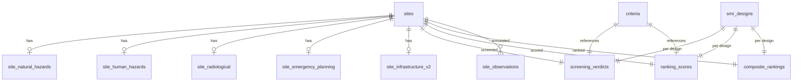

# Database Schema Overhaul — Comprehensive Plan

> **Status:** Completed  
> **Date:** 2026-04-11  
> **Migration:** `alembic/versions/006_schema_overhaul.py`

## 1. Problem Statement

The current schema uses an Entity-Attribute-Value pattern (`site_attributes` with `criterion_id` + `value_json` JSONB) for all siting data. This:

- Makes data invisible in DBeaver without parsing JSON
- Cannot represent per-SMR-design verdicts (required: "top 30 per SMR")
- Lacks structured confidence/quality fields on measurements and verdicts
- Has no place for observations/comments per criterion
- Does not support the score uncertainty ranges needed for Monte Carlo sensitivity analysis (Section 8.4 of requirements)

## 2. New Schema Design

### 2.1 Tables ADDED (11 new tables)

**Reference table:**

- **`smr_designs`** — One row per SMR type (8 designs from `config/default.yml` screening.smr_types). Columns: `smr_key` (PK), `name`, `capacity_mwe`, `thermal_output_mwt`, `land_requirement_ha`, `epz_radius_km`, `module_weight_t`, `cooling_type`, `design_life_yr`, `regulatory_status`.

**Domain measurement tables (one row per site, explicit typed columns):**

- **`site_natural_hazards`** — NH-01 through NH-14 metrics. Every field has a defined unit. Includes `*_quality` (VARCHAR(20)) and `*_comment` (TEXT) per criterion group.
- **`site_human_hazards`** — HI-01 through HI-08 metrics. Same pattern.
- **`site_radiological`** — RI-01 through RI-06 metrics.
- **`site_emergency_planning`** — EP-01 through EP-05 metrics.
- **`site_infrastructure_v2`** — NS-01 through NS-13 metrics (replaces current `site_infrastructure`). Includes cooling, grid, transport, topography, land, ecology, socioeconomic.

**Decision tables (now with SMR dimension + confidence):**

- **`screening_verdicts`** — Replaces `screening_results`. Adds `smr_key` FK, `confidence` column, `data_sources` array.
- **`ranking_scores`** — Replaces `site_scores`. Adds `smr_key` FK, `score_low`/`score_high` uncertainty range, `confidence`.
- **`composite_rankings`** — Replaces `ranking_results`. Adds `smr_key` FK, `passed_exclusionary`, `passed_avoidance`, `sensitivity_stable`, `avg_confidence`.

**Observations table:**

- **`site_observations`** — Structured comments/annotations per site per criterion. Columns: `observation_id`, `site_id`, `criterion_id`, `smr_key` (nullable), `source_type` (api/llm/expert/manual), `observation` (TEXT), `impact` (positive/negative/neutral/blocking), `confidence`, `author`, `run_id`, `created_at`.

### 2.2 Tables DROPPED (after data migration)

- **`site_attributes`** — Replaced by the 5 domain tables
- **`site_infrastructure`** — Replaced by `site_infrastructure_v2`
- **`site_scores`** — Replaced by `ranking_scores`
- **`screening_results`** — Replaced by `screening_verdicts`
- **`ranking_results`** — Replaced by `composite_rankings`
- **`data_quality_flags`** — Quality is now inline `*_quality` columns on domain tables + `confidence` on verdicts/scores

### 2.3 Tables KEPT unchanged

- **`sites`** — No structural changes (already has `grid_capacity_mw`, `site_area_ha`, `elevation_m`)
- **`site_ownership`** / **`_staging_unmatched_ownership`** — Unchanged
- **`countries`** — Unchanged
- **`criteria`** — Unchanged (reference table)
- **`data_sources`** — Unchanged (provenance tracking)
- **`audit_log`** — Unchanged (QA requirement)
- **`alembic_version`** — Managed by Alembic

### 2.4 Column-level detail for domain tables

Each domain table follows the pattern:
- Explicit metric columns with SQL types matching the unit (NUMERIC for measurements, VARCHAR for classifications, BOOLEAN for binary)
- `<criterion_group>_quality VARCHAR(20)` — high/medium/low/insufficient
- `<criterion_group>_comment TEXT` — summary observation
- `fetched_at TIMESTAMPTZ` and `run_id VARCHAR(40)` for provenance

Full column definitions for all 5 domain tables are codified in the Alembic migration `006_schema_overhaul.py`.

## 3. Implementation Strategy

### 3.1 Alembic Migration

Created migration **`006_schema_overhaul.py`** that:

1. Creates `smr_designs` and seeds it with 8 SMR designs
2. Creates the 5 domain tables, `screening_verdicts`, `ranking_scores`, `composite_rankings`, `site_observations`
3. Drops old tables: `site_attributes`, `site_infrastructure`, `site_scores`, `screening_results`, `ranking_results`, `data_quality_flags`

All dropped tables had 0 rows — clean swap with no data loss.

### 3.2 ORM Model Updates

File: `src/atoms_vs_ashes/db/models.py`

- Removed: `SiteAttribute`, `SiteInfrastructure`, `SiteScore`, `ScreeningResult`, `RankingResult`, `DataQualityFlag`
- Added: `SmrDesign`, `SiteNaturalHazards`, `SiteHumanHazards`, `SiteRadiological`, `SiteEmergencyPlanning`, `SiteInfrastructureV2`, `ScreeningVerdict`, `RankingScore`, `CompositeRanking`, `SiteObservation`
- Updated `Site` relationships accordingly

### 3.3 Analysis Module Updates

Every module in `src/atoms_vs_ashes/analysis/` that wrote `SiteAttribute` was updated to write to the correct domain table column.

| Module | Previous target | New target |
|--------|----------------|------------|
| `analysis/aviation_hazard.py` | `SiteAttribute(criterion_id='HI-01')` | `SiteHumanHazards.nearest_airport_km`, etc. |
| `analysis/military_proximity.py` | `SiteAttribute(criterion_id='HI-06')` | `SiteHumanHazards.nearest_military_km`, etc. |
| `analysis/transmitter_proximity.py` | `SiteAttribute(criterion_id='HI-07')` | `SiteHumanHazards.nearest_transmitter_km`, etc. |
| `analysis/grid_proximity.py` | `SiteAttribute(criterion_id='NS-02')` | `SiteInfrastructureV2.nearest_substation_km`, etc. |
| `analysis/land_availability.py` | `SiteAttribute(criterion_id='NS-05')` | `SiteInfrastructureV2.buildable_area_ha`, etc. |
| `analysis/site_topography.py` | `SiteAttribute(criterion_id='NS-04')` | `SiteInfrastructureV2.dominant_land_class`, etc. |
| `analysis/ecological_sensitivity.py` | `SiteAttribute(criterion_id='NS-08')` | `SiteInfrastructureV2.ecological_natural_pct`, etc. |
| `analysis/wildfire_context.py` | `SiteAttribute(criterion_id='NH-13')` | `SiteNaturalHazards.wildfire_combustible_pct`, etc. |
| `analysis/laydown_area.py` | `SiteAttribute(criterion_id='NS-13')` | `SiteInfrastructureV2.laydown_suitable_ha`, etc. |
| `analysis/emergency_plan.py` | `SiteAttribute` + `ScreeningResult` | `SiteEmergencyPlanning` + `ScreeningVerdict` |
| `analysis/epz_population.py` | `SiteAttribute` + `ScreeningResult` | `SiteRadiological` + `ScreeningVerdict` |
| `analysis/population_projection.py` | `SiteAttribute(criterion_id='RI-06')` | `SiteRadiological.pop_growth_rate_pct`, etc. |
| `analysis/coal_site_analysis.py` | `SiteAttribute(criterion_id='NS-05')` | `SiteInfrastructureV2` fields |
| `analysis/proximity_land.py` | `SiteAttribute(criterion_id='NS-05')` | `SiteInfrastructureV2` fields |

The shared helper `analysis/_provenance.py` was updated: `write_quality_flag` replaced by `write_observation` writing to `site_observations`.

### 3.4 Screening Module Updates

| Module | Change |
|--------|--------|
| `screening/grid_capacity.py` | Writes `ScreeningVerdict` with `smr_key` loop — one verdict per SMR design |
| `screening/land_area.py` | Same: `ScreeningVerdict` per SMR design |
| `screening/base.py` | `ScreeningCheck.run()` merges `ScreeningVerdict` instead of `ScreeningResult` |

### 3.5 Connector Batch Persistence Updates

| Module | Change |
|--------|--------|
| `connectors/seismic_hazard/batch.py` | `_persist_result` writes to `SiteNaturalHazards` columns |
| `connectors/egdi_geology/batch.py` | Writes to `SiteNaturalHazards` + `SiteRadiological` columns |
| All connector `models.py` files | `CRITERION_IDS` constants removed (no longer needed) |
| All connector `__init__.py` files | `CRITERION_IDS` removed from re-exports |

### 3.6 Pipeline and CLI Updates

| Module | Change |
|--------|--------|
| `pipeline/runner.py` | Added `caution` count to screening summary |
| `pipeline/quality_report.py` | Removed `DataQualityFlag` writes; quality warnings now in report dict |
| `ingest/osm_area.py` | `DataQualityFlag` writes replaced with `SiteObservation` |
| `ingest/models.py` | `CRITERION_IDS` constant removed |

### 3.7 Test Updates

| Test file | Change |
|-----------|--------|
| `tests/test_models.py` | New ORM class imports, updated table names, added domain table FK tests |
| `tests/test_connector_db_compatibility.py` | Removed `CRITERION_IDS` scanning; live DB tests verify domain table columns |
| `tests/test_integration_full_cycle.py` | Removed `CRITERION_IDS` imports/assertions, updated provenance tests |

### 3.8 Architecture Documentation Updates

| File | Change |
|------|--------|
| `architecture/specs/01_system_overview.md` | Updated interface table |
| `architecture/specs/02_data_model_postgres.md` | Schema overview updated to new tables |
| `architecture/specs/04_connector_framework.md` | Updated quality/caching references |
| `architecture/specs/05_screening_scoring_engine.md` | Updated to `screening_verdicts`, per-SMR, `composite_rankings` |
| `architecture/agregated_architecture.md` | All sections synced with individual specs |
| `gpt/softwareArchitect.md` | C4 table, persistence patterns, checklists, SMR section |
| `gpt/seniorSoftwareEngineer.md` | Model references, persistence example, checklist |
| `gpt/auditor.md` | Provenance, anti-patterns, seed audit sections |
| `gpt/expert_system_data_sources_and_integrations.md` | Data model reference, output expectations |

## 4. Execution Order (as implemented)

1. ORM models — Defined all new classes, removed old ones
2. Alembic migration — Created + dropped tables in one migration
3. Shared helpers — Updated `_provenance.py`
4. Screening base — Updated `screening/base.py`
5. Screening checks — Updated BF-01, BF-02 (added SMR loop)
6. Analysis modules — Updated all 14 modules
7. Connector batch modules — Updated seismic_hazard, egdi_geology
8. Connector/ingest models — Removed `CRITERION_IDS` constants
9. Pipeline + CLI — Updated runner, quality_report, cli, osm_area
10. Tests — Updated 3 affected test files
11. Architecture docs — Updated all specs and GPT prompts

## 5. Risk Mitigation

- **All affected tables had 0 rows** — no production data loss
- The `sites`, `site_ownership`, `countries`, `criteria`, and `audit_log` tables are untouched
- The migration includes both `upgrade()` and `downgrade()` functions
- A `pg_dump` backup should be taken before running the migration regardless
