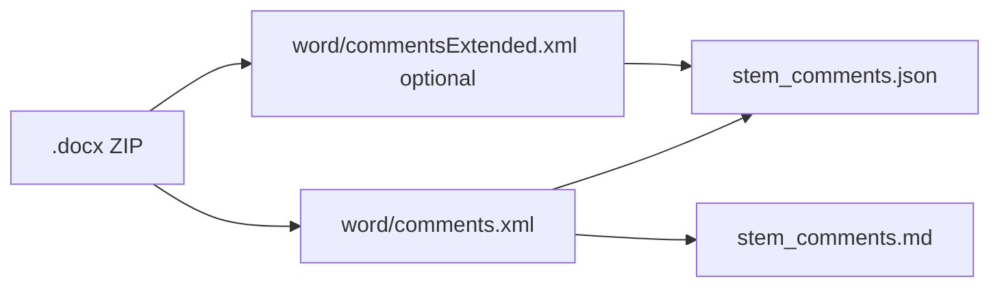

<!-- man_hours: 0.2 -->
# Plan: Extract Word comments to `report/output/feedback/`

**Status:** Completed — implemented in [`src/scripts/extract_docx_comments.py`](../../src/scripts/extract_docx_comments.py); first run produced [`report/output/feedback/atoms_vs_ashes_report_feedback_comments.json`](../../report/output/feedback/atoms_vs_ashes_report_feedback_comments.json) and `_comments.md` (45 comments, ~24 KB total versus the 35 MB source `.docx`).

## Goal

Turn reviewer comments in [`report/output/feedback/atoms_vs_ashes_report_feedback.docx`](../../report/output/feedback/atoms_vs_ashes_report_feedback.docx) into **small, token-efficient artifacts** (structured JSON + readable Markdown) for triage and iteration — without parsing the 750-page `word/document.xml`.

## Approach

- **Mechanism:** A `.docx` is a ZIP. Comments live primarily in `word/comments.xml` (kilobytes). Optionally merge threading metadata from `word/commentsExtended.xml` when present (modern Word reply chains).
- **Parsing:** `zipfile` + `xml.etree.ElementTree` with the WordprocessingML namespace `http://schemas.openxmlformats.org/wordprocessingml/2006/main` (`w`). Walk each `w:comment` node; attributes `w:id`, `w:author`, `w:date`, `w:initials`; concatenate text from descendant `w:t` nodes for the comment body.
- **Deliberately out of scope for v1:** Resolving each comment to **anchored paragraph text** in `word/document.xml` (large file). If needed later, add a separate `--anchors` mode that scans `document.xml` for `commentRangeStart`/`commentReference` by `w:id`.

## Deliverables

| Artifact | Purpose |
| --- | --- |
| New script [`src/scripts/extract_docx_comments.py`](../../src/scripts/extract_docx_comments.py) | `argparse` CLI: `--input` (default: repo path to the feedback docx), `--output-dir` (default: same folder as the input), optional `--no-markdown` / `--no-json` / `--indent`. |
| Generated files next to input | **`{docx_stem}_comments.json`** (machine-readable list of comments) and **`{docx_stem}_comments.md`** (numbered human/agent-readable digest). Example stem: `atoms_vs_ashes_report_feedback`. |

**JSON shape:** `{ extracted_at, count, comments: [{ id, author, initials, date, text, para_ids[], done?, parent_para_id? }] }`. Threading fields are emitted only when `commentsExtended.xml` is present.

**Markdown:** numbered sections per comment with id, author, date, optional `done` flag and `reply-to #N` link, then the body as a blockquote.

## Conventions followed

- **Repo root:** `Path(__file__).resolve().parents[2]` (same as [`src/scripts/list_large_files.py`](../../src/scripts/list_large_files.py)).
- **Line budget:** New Python at 275 lines, under the 300-line limit in [`.cursor/rules/file-size-limits.mdc`](../../.cursor/rules/file-size-limits.mdc).
- **Man-hours:** First-line `# man_hours: 2.0` on the new script and a matching entry under `files:` in [`audit/man_hours_registry.yml`](../../audit/man_hours_registry.yml); summary regenerated via [`src/scripts/man_hours_report.py`](../../src/scripts/man_hours_report.py).
- **Docs:** One-line addition to [`AGENTS.md`](../../AGENTS.md) "Common Commands".
- **Plans mirror:** Canonical plan kept under `/Users/terbolence/.cursor/plans/`; full text mirrored into [`architecture/plans/`](.) and [`audit/plans/`](../../audit/plans/) per [`.cursor/rules/audit-trail.mdc`](../../.cursor/rules/audit-trail.mdc).

## Dependencies

- **Stdlib only.** No new packages in `pyproject.toml`. (`python-docx` is unnecessary for reading `comments.xml`.)

## Verification

- Ran the script against the real feedback docx; JSON `count` is **45**, matching the number of `<w:comment>` nodes in `word/comments.xml`.
- Generated `.md` is 8 KB, `.json` 16 KB — both safely loadable into prompts compared with the 35 MB source.
- Missing-`comments.xml` path raises a clear `SystemExit` with the list of comment-related ZIP entries to aid debugging.

## Risks / notes

- Very old `.docx` files may lack `commentsExtended.xml`; threading fields are then simply omitted.
- The 35 MB feedback `.docx` is the original deliverable; the small JSON/MD pair is the portable carrier the system iterates against.
