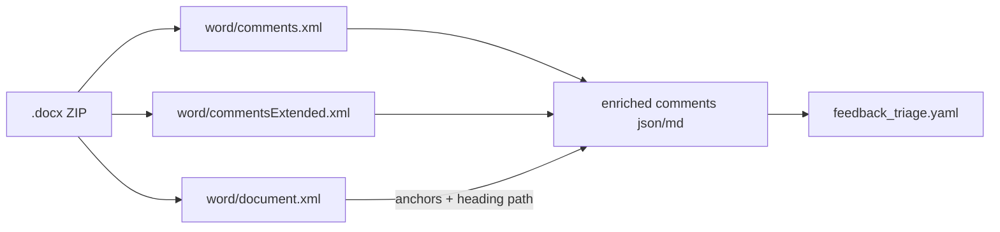

# Plan: Enrich `report/output/feedback/` with anchor context and a triage scaffold

**Status:** Completed — extractor v2 lives in [`src/scripts/extract_docx_comments.py`](../../src/scripts/extract_docx_comments.py) (orchestrator) plus three private helpers under `src/scripts/_docx_comment_*.py`. First run anchors **45 / 45** comments and emits the triage YAML at [`report/output/feedback/atoms_vs_ashes_report_feedback_triage.yaml`](../../report/output/feedback/atoms_vs_ashes_report_feedback_triage.yaml).

## Why this exists

The previous artifacts in `report/output/feedback/` carried **what** each reviewer said but not **where** in the report it was said. Without anchor context, downstream routing into subsystems (scoring vs report wording vs data) required manual lookup in Word. This plan adds anchors automatically and produces a structured triage scaffold so the next plan (analysis + per-system routing) can be authored against complete data.

## Out of scope (deferred to follow-up plan)

- Authoring the master change plan and per-system sub-plans.
- Any code/report changes to the actual scoring/report pipelines.
- Page numbers (require rendering; not in `document.xml`).

## Pipeline



## Implementation

The orchestrator was split into four files to stay under the 300-line Python budget in [`.cursor/rules/file-size-limits.mdc`](../../.cursor/rules/file-size-limits.mdc):

- [`src/scripts/extract_docx_comments.py`](../../src/scripts/extract_docx_comments.py) — CLI + ZIP I/O + comments.xml parser + orchestrator (277 lines).
- [`src/scripts/_docx_comment_anchors.py`](../../src/scripts/_docx_comment_anchors.py) — streaming `word/document.xml` parser using `xml.etree.ElementTree.iterparse` with per-paragraph `clear()` for bounded memory (188 lines).
- [`src/scripts/_docx_comment_triage.py`](../../src/scripts/_docx_comment_triage.py) — heuristic pre-fills + idempotent YAML/JSON merge (219 lines).
- [`src/scripts/_docx_comment_writers.py`](../../src/scripts/_docx_comment_writers.py) — JSON + Markdown writers including the `Where:` / `Anchor:` lines (116 lines).

### Anchor extraction algorithm

`iterparse(events=("start","end"))` with:

- A heading stack `[(level, text)]`, updated at end-of-paragraph from `w:pPr/w:pStyle`. `Title` is treated as level 0 and excluded from the emitted heading path; `Heading1..9` map to levels 1..9.
- A paragraph counter for stable in-document ordering.
- Per-id range buffers opened on `w:commentRangeStart` and finalized on `w:commentRangeEnd`.
- Pending point-comment buffers for `w:commentReference` markers without an open range; resolved at end-of-paragraph using the paragraph's full text.
- Anchor text truncated to `--max-anchor-chars` (default 400); the full character count is preserved as `anchor_chars`.
- Element `clear()` after each paragraph end so `document.xml` size never matters.

### Schema additions to `<stem>_comments.json`

Each comment object now has (when an anchor was found):

```
"anchor_text": "...",
"anchor_chars": 1234,
"heading_path": ["3. Stage 2: Site Selection", "3.2 Evaluation Framework and Criterion Families"],
"chapter": "3. Stage 2: Site Selection",
"paragraph_index": 347
```

### Markdown digest changes

Each comment block now starts with:

- `**Where:** Chapter X > Section Y > Subsection Z`
- `_Anchor:_ "<= 200 chars of anchor text>"`

then the original blockquote of the comment body.

### CLI

New flags:

- `--no-anchors` — preserves v1 behaviour (skips `document.xml`).
- `--no-triage` — skips the triage scaffold.
- `--max-anchor-chars` — adjustable truncation length (default 400).

## Triage scaffold (`<stem>_triage.yaml`)

One entry per comment id, refreshed idempotently:

```yaml
items:
- id: '8'
  auto:
    author: Ovidiu  Lucian Coman
    date: '2026-05-07T14:02:00Z'
    chapter: 1. Introduction
    heading_path: [1. Introduction, 1.1 Purpose of the Report]
    anchor_excerpt: ...
    text_excerpt: OK
    reply_to: null
    done: false
    heuristic_category: ack
    heuristic_subsystem: report-text
  category: ''
  subsystem: ''
  action: ''
  depends_on: []
  notes: ''
```

### Heuristic pre-fill rules

Cheap, deterministic, no LLM:

- `^(ok|ok\.|da)\.?$` (case-insensitive) -> `heuristic_category=ack`, `heuristic_subsystem=report-text`.
- `\bscor|scoring|weight|swing|pondere|ranking\b` -> `heuristic_subsystem=scoring-engine`.
- `\bexclus|exclusionary|safety\b` -> `heuristic_category=exclusionary`, `heuristic_subsystem=methodology-doc`.
- `\btabel|titlu|heading|wording|clarif|table|title\b` -> `heuristic_category=wording`, `heuristic_subsystem=report-text`.
- `\bsensitivity|sensibilitate\b` -> `heuristic_subsystem=sensitivity`.
- `\bconnector|api|enrich|sursa|sursă|date\b` -> `heuristic_subsystem=data-connector`.
- Otherwise both heuristic fields stay empty.

These are suggestions; the user-editable `category` / `subsystem` fields stay blank for the next plan to confirm.

### Idempotent merge

On re-run, the extractor:

1. Loads the existing YAML (or JSON fallback).
2. Refreshes `auto.*` from the latest `.docx`.
3. Preserves user-edited fields (`category`, `subsystem`, `action`, `depends_on`, `notes`).
4. Adds new ids; keeps removed ids and tags them `auto.removed: true`.

PyYAML is preferred. If `import yaml` fails, the extractor falls back to `<stem>_triage.json` automatically.

## Feedback folder README

[`report/output/feedback/README.md`](../../report/output/feedback/README.md) documents the artifacts, the triage taxonomy (10 categories x 7 subsystems), regeneration commands, and the idempotent-merge contract.

## Verification (executed)

- `python src/scripts/extract_docx_comments.py` produced **45 comments, 45 anchored**, and the YAML scaffold.
- Spot-checked five comment ids (`#8`, `#12`, `#32`, `#33`, `#47`) — `Where:` paths and anchor excerpts correctly resolve to the right chapter/section pair (`1. Introduction > 1.1 ...`, `3. Stage 2: Site Selection > 3.2 ...`, `4. Results and Findings > 4.1 ...`, etc.).
- Idempotent merge tested: edited user fields on `id: '8'`, re-ran, edits survived; reverted before finishing.

## Audit / book-keeping (executed)

- `man_hours` for the four script files added/updated in [`audit/man_hours_registry.yml`](../../audit/man_hours_registry.yml) (4.0 / 3.0 / 2.5 / 1.5 hours).
- Summary regenerated via [`src/scripts/man_hours_report.py`](../../src/scripts/man_hours_report.py); now 290 files, 1410.1 hours.
- Plan mirrored to [`architecture/plans/feedback-context-enrichment.md`](.) and [`audit/plans/feedback-context-enrichment.md`](../../audit/plans/feedback-context-enrichment.md) per [`.cursor/rules/audit-trail.mdc`](../../.cursor/rules/audit-trail.mdc).
- The README in `report/output/feedback/` is unmarked because no other file under `report/output/` carries `man_hours` (project convention: that subtree is exempt as report deliverables / writing controls).

## Risks / notes

- `document.xml` was streamed with per-paragraph `elem.clear()` — memory stays bounded regardless of report size.
- Tables, footnotes and SDT (Table of Contents block) contain nested `w:p`; the heading stack only updates when a paragraph's direct `w:pStyle` matches a heading style. TOC entries use `TOC1..N`, not `Heading1..N`, so the stack is unaffected.
- Comments anchored inside table cells inherit the surrounding section's `heading_path` (desired behaviour).
- Romanian + English mixed text — kept as `utf-8` end-to-end; no normalization.
- PyYAML does not preserve free-form YAML comments — encourage `notes:` for any reviewer-side commentary.

## What this unblocks (for the follow-up plan)

The next plan can:

1. Read `<stem>_triage.yaml` to classify all 45 comments by `subsystem` and `category` deterministically.
2. Group ids -> propose **subsystems to improve** (scoring engine, sensitivity, data/connectors, report wording, methodology) with comment-id citations and heading-path evidence.
3. Emit a master plan + per-subsystem sub-plans, each owning a subset of ids end-to-end (change -> rerun -> rebuild report).
