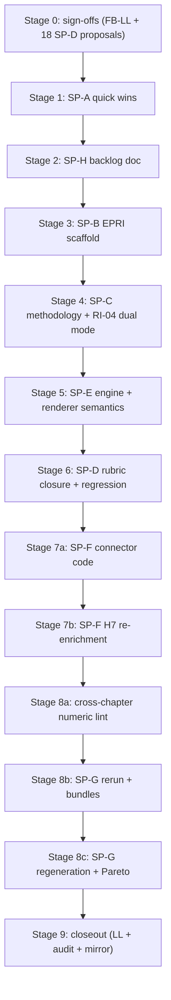

# Feedback rework execution plan -- gated, sub-plan by sub-plan

## How this plan runs

The agent walks through the **stages below in order**. **At the boundary of every stage** (and at every batch step inside SP-F enrichment) the agent **stops and asks for explicit user permission** to proceed to the next stage. No stage starts until the previous stage's "Definition of done" is met **and** the user has answered the gate question.

For each stage the entry contains:

- **Sub-plan link** -- the canonical co-located plan file you can re-read.
- **Inputs** -- what must already be true before starting.
- **Actions** -- concrete edits / commands.
- **Definition of done** -- objective check (file diffs, pytest output, etc.).
- **Gate question** -- the exact question the agent will ask before moving on.

Two operating rules apply throughout:

- **Sign-off authority = user.** The agent flips `sign_off: yes` on FB-LL and on the 18 SP-D band proposals as a mechanical first stage; if you want to revoke, do so before stage 6.
- **Live-API consent = pre-granted for SP-F + SP-G**, but per `experts/connectors/api_enrichment_operations.md` Sec.C every batch step still gets its own card (API, calls, duration, cost, rate limits, batch size) and its own gate.

---

## Stage 0 -- Sign-offs (mechanical)

- **Sub-plan link:** [`feedback_lessons_learnt.md`](report/output/feedback/plans/feedback_lessons_learnt.md), [`SP-D_band_proposals/`](report/output/feedback/plans/SP-D_band_proposals/).
- **Inputs:** none.
- **Actions:**
  - Flip frontmatter `sign_off: yes`, `sign_off_by: user`, `sign_off_at: 2026-05-09` on `feedback_lessons_learnt.md`.
  - Same flip on each of: `EP-01.md, HI-01.md, HI-02.md, HI-04.md, HI-05.md, HI-06.md, HI-08.md, NH-03.md, NH-04.md, NH-05.md, NH-07.md, NH-08.md, NH-09.md, NH-11.md, NH-12.md, NH-13.md, NH-14.md, RI-04.md` under `SP-D_band_proposals/`.
  - Update `00_master.plan.md` "Current status" footnote so the dependency graph shows Phase 0.4 + 0.6 closed.
- **Definition of done:** `rg "sign_off: no" report/output/feedback/plans/feedback_lessons_learnt.md report/output/feedback/plans/SP-D_band_proposals/` returns no matches.
- **Gate question:** _"Stage 0 complete (FB-LL + 18 SP-D proposals signed off, master plan updated). Proceed to Stage 1 (SP-A quick wins)?"_

---

## Stage 1 -- SP-A quick wins

- **Sub-plan link:** [`SP-A_quick_wins.plan.md`](report/output/feedback/plans/SP-A_quick_wins.plan.md).
- **Inputs:** none.
- **Actions:**
  - Replace the "12-module future expansion (924 MWe ...)" wording in `report/output/chapters/05_country_and_site_profiles/sites/RO_braila_power_station.md` with the corrected **462 MWe / VOYGR-6** narrative (#119).
  - Confirm/strengthen captions on Tables 4.1.1, 4.1.2, 4.2.1 in `report/output/chapters/04_results_and_findings.md` (#47, #49).
  - **Table layout (readability):** adapt Chapter 4 tables so column widths follow content — avoid over-wide single rows (e.g. split Table 4.2.1 into per-country two-column blocks; keep Table 4.1.1 interpretation column concise with long text in a follow-on list where needed; tighten §4.3–4.5 tables similarly). See [`SP-A_quick_wins.plan.md`](report/output/feedback/plans/SP-A_quick_wins.plan.md) §Table layout.
  - Reconcile Romania full-pass count (#568) across Ch.4 narrative + per-country profile.
  - Drop ack comments (#8, #12) from reviewer-facing artefacts.
  - If reviewer intent for #574 is unconfirmed, queue a TODO row for Stage 2.
- **Definition of done:** `rg "924" report/output/chapters/` returns no spurious VOYGR-6 hit; captions present; Romania count is single-valued; Chapter 4 tables use content-fitting layouts (per SP-A table-layout checklist); man-hours updated.
- **Gate question:** _"Stage 1 complete (SP-A edits landed, ripgrep clean). Proceed to Stage 2 (SP-H backlog)?"_

---

## Stage 2 -- SP-H backlog

- **Sub-plan link:** [`SP-H_backlog.plan.md`](report/output/feedback/plans/SP-H_backlog.plan.md).
- **Inputs:** Stage 1 done.
- **Actions:**
  - Park #72 (post-SP-G rebalancing).
  - Add backlog rows: cross-chapter numeric lint (built in Stage 8a), `triage.action` enum, anchor-vs-content heuristic, optional Pareto-per-country.
  - Add #15 / #574 reviewer follow-up rows if still unresolved.
- **Definition of done:** SP-H file has explicit rows for each item with owner = "deferred" and target window.
- **Gate question:** _"Stage 2 complete (SP-H backlog updated). Proceed to Stage 3 (SP-B EPRI scaffold)?"_

---

## Stage 3 -- SP-B EPRI weight scaffold (mechanism only)

- **Sub-plan link:** [`SP-B_epri_weights.plan.md`](report/output/feedback/plans/SP-B_epri_weights.plan.md).
- **Inputs:** Stage 0 (FB-LL signed).
- **Actions:**
  - In [`src/atoms_vs_ashes/scoring/rubric.py`](src/atoms_vs_ashes/scoring/rubric.py) confirm `weight_normalisation(bundle, profile=..., basis=...)`; add `weight_basis_source` on `Criterion` if missing.
  - In [`src/atoms_vs_ashes/scoring/engine.py`](src/atoms_vs_ashes/scoring/engine.py) confirm `weight_profile` is wired through `ScoringEngine`; verify `CompositeRanking.weight_profile` column exists; add an Alembic migration if not.
  - Add `--profile <name>` recognition for `epri` and `s_and_l` to the CLI; raise `NotImplementedError("EPRI source not provided")` so accidental use is loud.
  - Update `report/sites_evaluation/02_master_weights.md` to spell out the swap protocol and explicitly state numerical values are pending.
- **Definition of done:** `pytest tests/scoring/ -q` green; `atoms-vs-ashes enrich --help` shows `--profile`; `--profile epri` raises a loud error.
- **Gate question:** _"Stage 3 complete (EPRI mechanism in place; numerical values still scaffold-only). Proceed to Stage 4 (SP-C methodology)?"_

---

## Stage 4 -- SP-C methodology + RI-04 dual mode

- **Sub-plan link:** [`SP-C_methodology.plan.md`](report/output/feedback/plans/SP-C_methodology.plan.md).
- **Inputs:** Stage 0 (FB-LL signed).
- **Actions:**
  - Rewrite `report/output/chapters/03_stage_2_site_selection.md` -- Stage 1 vs Stage 2 boundary (#32, #35); reference `config/ssr1_clause_map.yaml`.
  - Document RI-04 dual mode (avoidance/ranking vs exclusion) in narrative (#33, #564) and add a `notes:` block on the RI-04 rubric entry; cross-link to the offline `E_RI04` `fail_condition` already landed.
- **Definition of done:** Ch.3 has explicit Stage 1 / Stage 2 boundary section; RI-04 rubric YAML has `notes:`; methodology narrative references both.
- **Gate question:** _"Stage 4 complete (Ch.3 boundary + RI-04 dual mode documented). Proceed to Stage 5 (SP-E engine semantics)?"_

---

## Stage 5 -- SP-E engine + renderer semantics

- **Sub-plan link:** [`SP-E_engine_semantics.plan.md`](report/output/feedback/plans/SP-E_engine_semantics.plan.md).
- **Inputs:** Stage 0 (FB-LL signed). Independent of SP-D.
- **Actions:**
  - In [`src/atoms_vs_ashes/scoring/bands.py`](src/atoms_vs_ashes/scoring/bands.py) (`evaluate_bands` ~L109, `BandResult` ~L87) implement the three-way split: pass-mid match, no-band -> `score=None`, favorable 8-10.
  - In [`src/atoms_vs_ashes/scoring/composite.py`](src/atoms_vs_ashes/scoring/composite.py) (`compute_composite_for_site_smr` ~L100): skip `None`, renormalise weights only over evaluated criteria, record skipped criterion ids in `CompositeResult`.
  - In [`src/scripts/_site_profile_markdown.py`](src/scripts/_site_profile_markdown.py) (`_family_section` ~L338-357) emit distinct strings for _unscored_ / _favorable-by-default_ / _passed-mid_; update [`tests/scripts/test_site_profile_unscored_rendering.py`](tests/scripts/test_site_profile_unscored_rendering.py).
- **Definition of done:** `pytest tests/scoring/ tests/scripts/test_site_profile_unscored_rendering.py -q` green.
- **Gate question:** _"Stage 5 complete (engine three-way split + renderer + tests green). Proceed to Stage 6 (SP-D rubric closure)?"_

---

## Stage 6 -- SP-D rubric closure + 18-anchor regression

- **Sub-plan link:** [`SP-D_rubric_bands.plan.md`](report/output/feedback/plans/SP-D_rubric_bands.plan.md).
- **Inputs:** Stages 0 (proposals signed), 3 (weights mechanism), 4 (RI-04 narrative), 5 (engine semantics).
- **Actions:**
  - For each criterion: diff its signed `SP-D_band_proposals/<id>.md` "Proposed YAML" block against the current `config/scoring_rubrics/<family>.yaml` and the matching `config/scoring_specs/<family>.yaml`. Resolve drift criterion-by-criterion -- **never bulk-copy specs** (preserves `band_recipe`).
  - Recompute the 18-anchor regression matrix offline (DB read; no live calls). Record as a markdown table appended to each proposal under "Verification".
- **Definition of done:** `pytest tests/scoring/ -q` still 89/89 green; every signed proposal file has a "Verification" table; `git diff` shows criterion-scoped YAML changes only.
- **Gate question:** _"Stage 6 complete (SP-D YAML closed, regression matrix recorded). Proceed to Stage 7a (SP-F connector code)?"_

---

## Stage 7a -- SP-F connector code

- **Sub-plan link:** [`SP-F_connector_refinements.plan.md`](report/output/feedback/plans/SP-F_connector_refinements.plan.md).
- **Inputs:** Stage 6 done.
- **Actions:**
  - Airports: extend [`src/atoms_vs_ashes/connectors/ourairports/`](src/atoms_vs_ashes/connectors/ourairports/) (`models.py`, `parsers.py`, `batch.py`, `client.py`) with airport class (large/medium/small/heliport), runway length, scheduled service flag, traffic tier.
  - Military: extend [`src/atoms_vs_ashes/connectors/osm/client.py`](src/atoms_vs_ashes/connectors/osm/client.py) `fetch_military_areas` to classify (airfield/depot/training area/other) and compute high-consequence distance separately; tag `"military"` in `osm/batch.py`.
  - Alembic migration for any new DB columns.
  - Update connector reports under `docs/connector_reports/` per `connector-checklist.mdc`.
  - If HI-01/HI-06 need null-targeted reruns, add `--requery-nulls` to the relevant `enrich` subcommands (currently exists only on `soilgrids` and `bedrock`).
- **Definition of done:** new fields persisted on a sample fetch; tests + connector report updated; no live batch yet.
- **Gate question:** _"Stage 7a complete (connector code + migration + reports). Proceed to Stage 7b (live re-enrichment, with per-batch consent cards)?"_

---

## Stage 7b -- SP-F H7 re-enrichment (live API; per-batch gate)

- **Sub-plan link:** [`SP-F_connector_refinements.plan.md`](report/output/feedback/plans/SP-F_connector_refinements.plan.md), [`experts/connectors/api_enrichment_operations.md`](../../experts/connectors/api_enrichment_operations.md) Sec.C + Sec.H7.
- **Inputs:** Stage 7a done; live-API consent pre-granted but per-batch card still required.
- **Actions** (per connector touched -- at minimum `ourairports` and `osm`-military):
  1. **Dry run**: `atoms-vs-ashes enrich <slug> --dry-run`. _No gate._
  2. **Smoke (3 sites)**. Verify log + DB rows. _Gate before next batch._
  3. **Small batch (20 sites)**. Watch for rate-limit errors; if any -> halt, lower rate, retry; do not advance. _Gate before next batch._
  4. **Country batch (~24 sites)**. Present `api_enrichment_operations.md` Sec.C card. _Gate before next batch._
  5. **Full batch (363 sites)**. Present `api_enrichment_operations.md` Sec.C card. _Gate before exit._
  6. After every batch: `PYTHONPATH=src python src/scripts/verify_raw_response_coverage.py --run-id <run_id>`.
- **Definition of done:** `>=95%` population coverage per LL-017 / LL-022 / LL-024 / LL-026; raw-response coverage report green for the chosen `run_id`.
- **Gate question:** _"Stage 7b complete (re-enrichment landed, coverage `>=95%`). Proceed to Stage 8a (build cross-chapter numeric lint)?"_

---

## Stage 8a -- Cross-chapter numeric lint

- **Sub-plan link:** [`SP-G_rerun_regenerate.plan.md`](report/output/feedback/plans/SP-G_rerun_regenerate.plan.md) step 6; FB-LL-06.
- **Inputs:** Stage 5 done (renderer semantics) ideally; can be built earlier but used here.
- **Actions:**
  - Build `src/scripts/cross_chapter_numeric_lint.py`: scan `report/output/chapters/`, extract numeric facts (capacity, full-pass count, weights, distances) keyed by canonical name, fail on mismatches.
  - Wire as a `slow`-marked pytest case under `tests/`.
- **Definition of done:** lint passes against current report (or fails with a clear, actionable list to address before Stage 8c).
- **Gate question:** _"Stage 8a complete (lint green or failures triaged). Proceed to Stage 8b (scoring rerun + bundles)?"_

---

## Stage 8b -- SP-G scoring rerun + bundle exports

- **Sub-plan link:** [`SP-G_rerun_regenerate.plan.md`](report/output/feedback/plans/SP-G_rerun_regenerate.plan.md).
- **Inputs:** Stages 6, 7b, 8a done.
- **Actions:**
  - Choose `run_id` (e.g. `feedback_rerun_20260509`); record in plan + audit log.
  - Scoring rerun across all 363 sites with **baseline** profile (EPRI scaffold-only); writes new `composite_rankings`. Keep prior `run_id` for diff.
  - Bundle exports:
    - `for cc in $(ALL_23_COUNTRIES); do PYTHONPATH=src python -m scripts.export_country_bundle --country-code $cc; done`
    - `for sid in $(18_ANCHOR_UUIDS); do PYTHONPATH=src python -m scripts.export_site_bundle --site-id $sid; done`
- **Definition of done:** `composite_rankings` rows for all 363 sites under the new `run_id`; bundle JSON written for 23 countries + 18 anchor sites.
- **Gate question:** _"Stage 8b complete (scoring rerun + bundles). Proceed to Stage 8c (profile regeneration + Pareto decision)?"_

---

## Stage 8c -- SP-G profile regeneration + Pareto

- **Sub-plan link:** [`SP-G_rerun_regenerate.plan.md`](report/output/feedback/plans/SP-G_rerun_regenerate.plan.md), `report/output/writing plan/prompts/`.
- **Inputs:** Stage 8b done.
- **Actions:**
  - Regenerate country + site markdowns via the writing-plan generators with the `country_profile_author.md`, `site_profile_author.md`, `siting_expert.md` system prompts (per `report-writing-workflow` skill).
  - Pareto decision (FB-LL-07): default = add the "illustrative" caption to Austria's chart (cheap). If you say "generalise", run Pareto for all 23 countries.
- **Definition of done:**
  - 18 anchor sites' rendered scores match Phase 0.6 predictions in the proposal Verification tables.
  - Every criterion bullet shows `weight X.XXXX (basis: <source>)` (FB-LL-09).
  - No bullet says "values not in measurement tables" (FB-LL-02).
  - Cross-chapter numeric lint stays green.
- **Gate question:** _"Stage 8c complete (report regenerated + Pareto handled). Proceed to Stage 9 (closeout)?"_

---

## Stage 9 -- Closeout

- **Actions:**
  - Append `LL-XXX` entries to [`experts/quality/lessons_learned.md`](../../experts/quality/lessons_learned.md) for any new institutional lesson; flip matching FB-LL rows to `Promotion: yes` in `feedback_lessons_learnt.md`.
  - Write `audit/conversations/2026-05-09_feedback-rework-execution.md` summarising run id, files changed, and any deferred items (e.g. EPRI source still pending).
  - Mirror this plan to `architecture/plans/feedback-rework-execution.md` and `audit/plans/feedback-rework-execution.md` per `audit-trail.mdc`.
  - Refresh `audit/man_hours_summary.md` via `python src/scripts/man_hours_report.py`.
- **Definition of done:** audit log present; mirrors present; `man_hours_summary.md` regenerated.
- **Gate question (final):** _"Stage 9 complete. End execution and hand back?"_

---

## Hard rules across all stages

- **Never advance** past a gate without an explicit user "yes" in chat.
- **Never invent** EPRI numerical values; SP-G runs on `baseline` until you supply the source doc, at which point Stage 8b can be replayed with `--profile epri`.
- **Never bulk-copy** `config/scoring_rubrics/` -> `config/scoring_specs/` (lost prior session to this; preserves `band_recipe`).
- **Every live-API batch** still presents the `experts/connectors/api_enrichment_operations.md` Sec.C card (API, calls, duration, cost, rate-limit, batch size) before running -- the pre-grant only authorises the _kind_ of work, not unattended execution.
- **Every edited file** carries first-line `man_hours: X.X`, an entry in `audit/man_hours_registry.yml`, and is reflected in `audit/man_hours_summary.md` at closeout.
- **Reviewer clarifications #15 / #574**: if still unanswered when reached, the agent puts them in `SP-H_backlog.plan.md` and proceeds.
