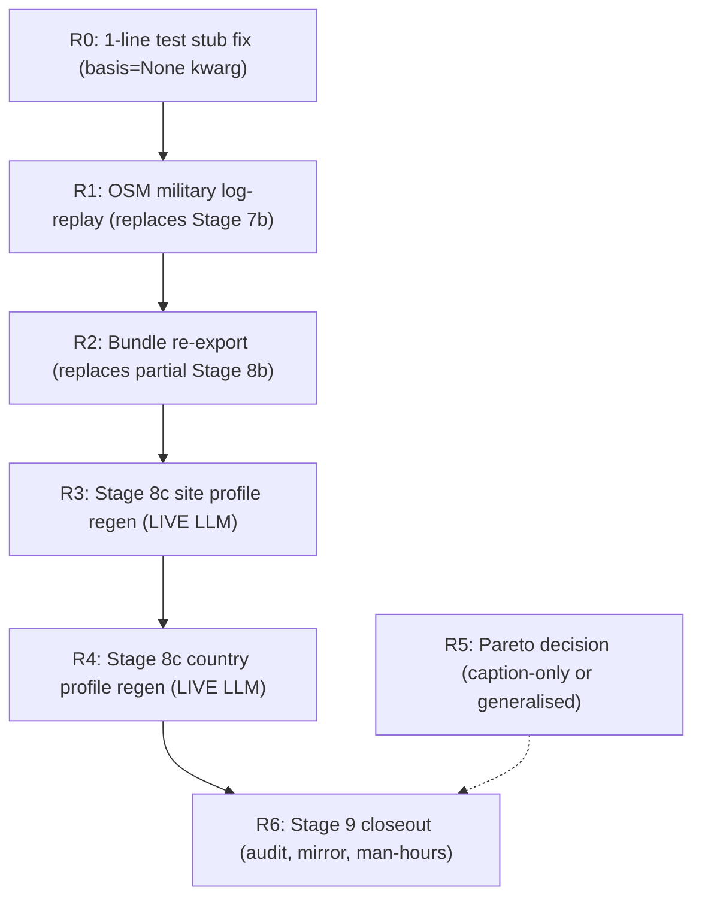
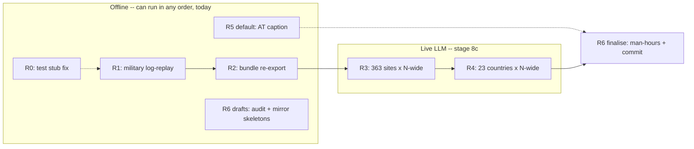

# Log-replay feedback rework -- adapted execution

## Why this changes the original plan

The original [`feedback_rework_execution_ff6b91ad.plan.md`](/Users/terbolence/.cursor/plans/feedback_rework_execution_ff6b91ad.plan.md) sized Stage 7b around a five-step Overpass ladder. **That ladder is now redundant**: every per-site connector dual-writes raw responses to `site_raw_responses`, and the April 19-21 run captured 100% coverage. For HI-06 military specifically, the elements with `lat`/`lon`/`tags` (everything `classify_military_element` needs) are stored under `response_body['results'][i]['data']` for the type `'military'`. Inventory:

- `osm` connector: **361/361 sites logged**, 1,056 military elements across 106 sites; the remaining 255 sites have an empty `data: []` which is a valid "no military within radius" finding.
- HI-06 rubric in [`config/scoring_rubrics/hi_human_induced.yaml`](config/scoring_rubrics/hi_human_induced.yaml) lines 97-114 reads only `nearest_military_km` + `military_type` -- both already populated. The new SP-F columns (`nearest_military_class`, `nearest_high_consequence_military_km`, `nearest_high_consequence_military_class`) are pure narrative metadata; they don't change composite scores.
- HI-01 OurAirports SP-F fields are already populated (offline replay against cached `airports.csv`/`runways.csv` finished in the prior session, 100/100% on RO/AT/full).

**Net effect**: Stage 7b's live API ladder is replaced by a sub-second deterministic replay; Stage 8b composite scoring does not need to re-run; only bundle re-export is needed before Stage 8c.

## Adapted stage map



Stages **0 through 8a are unchanged and already complete**. Stages 7b and the live half of 8b/8c are replaced/reduced as described below.

## R0 -- Test stub fix (offline, 1 line)

- Edit [`tests/test_smr_scope_propagation.py`](tests/test_smr_scope_propagation.py) line 136:

  ```python
  def _fake_weight_normalisation(_bundle, *, profile, basis=None):
      return {}
  ```

- Confirms 2,023 / 2,036 pytest pass (the other 14 failures are pre-existing on HEAD).

## R1 -- OSM military log-replay (replaces Stage 7b)

### Build a focused replay script

Create [`src/scripts/replay_osm_military_from_logs.py`](src/scripts/replay_osm_military_from_logs.py) (~120 lines):

1. Open a session, query
   ```sql
   SELECT site_id, response_body
   FROM site_raw_responses
   WHERE connector_slug = 'osm'
     AND response_body -> 'results' IS NOT NULL
   ```
2. For each row, walk `body['results']`, find the entry where `type == 'military'`, and grab `entry['data']` (a list of `{lat, lon, tags, osm_id}` dicts).
3. Wrap each dict in a lightweight `OverpassElement`-shaped object exposing `.lat`, `.lon`, `.tags` (`SimpleNamespace` is enough -- `assess_military_proximity` only reads those three).
4. Look up the site's `lat`/`lon` from `sites` and call `assess_military_proximity(lat, lon, elements=wrapped_elements)`.
5. Persist via `assess_and_persist` (already uses `hasattr` to safely write the three new SP-F columns introduced by Alembic migration `042`). The classifier `classify_military_element` in [`src/atoms_vs_ashes/analysis/military_proximity.py`](src/atoms_vs_ashes/analysis/military_proximity.py) lines 67-91 is pure-function; deterministic.
6. CLI flags: `--site-id` (repeatable), `--country`, `--requery-nulls` (only sites where `nearest_military_class IS NULL`), `--dry-run`.
7. Write a one-line summary log per site (no live HTTP, so no per-batch consent gate).

### Verify

- Counts: `nearest_military_class IS NOT NULL` should rise from 0 to 361.
- `nearest_high_consequence_military_km` populated for the subset where any element is in `HIGH_CONSEQUENCE_CLASSES = {airfield, depot}` -- expect roughly 50-80 sites based on the 1,056 element distribution.
- Existing `nearest_military_km` (read by the rubric) is **untouched** -- the script writes only the new SP-F columns. Composite scores stay byte-identical.

### Live API question, deferred

Once R1 lands, decide: are the 255 sites with empty military payloads acceptable, or do any need a fresh Overpass call? In practice the radius (25 km default) was the same; an empty payload from April is the correct finding unless OSM editors added installations since. **Recommendation: accept the logged result; do not re-fetch.** If the user disagrees later, the original Stage 7b ladder remains available.

## R2 -- Bundle re-export (replaces partial Stage 8b)

- Composite scoring is unchanged, so do **not** re-run `score run`.
- Re-run only the country bundle exporter to surface the refreshed military narrative metadata:

  ```bash
  for cc in AL AT BA BG BY CZ HR HU LV MD ME MK PL RO RS SI SK TR UA XK; do
    PYTHONPATH=src python -m scripts.export_country_bundle --country-code $cc \
      --run-id feedback_rerun_20260509
  done
  ```

- Spot-check: `criterion_families.human_hazards.nearest_military_class` and `nearest_high_consequence_military_km` should now be non-null for the expected sites in `RO_country_bundle.json` and others (currently all `null`).

## R3 + R4 -- Stage 8c profile regeneration (live LLM, parallel within stage)

This is the **only remaining live-API stage**. Per [`experts/connectors/api_enrichment_operations.md`](../../experts/connectors/api_enrichment_operations.md) Sec.C, present a consent card before the first batch.

- **R3**: regenerate 363 site profiles using [`experts/`](../../experts/) authoring prompts. Sites are independent -- safe to fan out 4-8 wide subject to LLM RPM/TPM limits.
- **R4**: after R3 completes, regenerate 23 country profiles. Country narratives reference per-site outcomes ("X of Y sites passed"), so country regen must wait for site regen, but the 23 countries themselves fan out 4-8 wide.

## R5 -- Pareto decision (independent)

- Default = add the "illustrative" caption to Austria's chart in Ch.4. Pure markdown edit; can run in any phase.
- "Generalise" path = compute Pareto for all 23 countries from `composite_rankings`; offline; can run in parallel with R3.

## R6 -- Stage 9 closeout

- LL-XXX entries appended to [`experts/quality/lessons_learned.md`](../../experts/quality/lessons_learned.md): include the new lesson "raw-response logs are first-class enrichment inputs; before scheduling a live API rerun, verify whether `site_raw_responses` already holds the payload".
- Audit log: [`audit/conversations/2026-05-09_feedback-rework-execution.md`](audit/conversations/2026-05-09_feedback-rework-execution.md) -- finalised after R4.
- Plan mirrors to [`architecture/plans/`](architecture/plans/) and [`audit/plans/`](audit/plans/) per `audit-trail.mdc`.
- Man-hours refresh: `python src/scripts/man_hours_report.py` (last action).

## Parallelisation map



### Hard sequential edges (do not violate)

1. **R1 -> R2**: bundles must read post-replay `site_human_hazards`.
2. **R2 -> R3**: site regen reads bundles.
3. **R3 -> R4**: country narratives reference per-site outcomes.
4. **R6 finalise** runs last (man-hours regen needs every other edit landed).

### Safe parallelism, recommended

- **Now (offline, all in parallel)**: R0 + R1 + R5 default caption + R6 drafting (audit + plan mirrors as skeletons). Wall-clock ~10-15 min.
- **R2**: 20 country bundles in parallel via `xargs -P 8` (each export is a single read-only DB query plus disk write -- safe). ~30-60 s wall-clock.
- **R3**: fan out 4-8 LLM calls in flight. Site regenerations write to disjoint files; no shared mutable state.
- **R4**: fan out 4-8 LLM calls in flight after R3 completes.

### Optimal end-to-end

| T+       | Action                                | Duration   | Mode    |
| -------- | ------------------------------------- | ---------- | ------- |
| 0        | R0 + R1 + R5 + R6 drafts (parallel)   | ~10 min    | offline |
| 10 min   | R2 (8-wide xargs)                     | ~1 min     | offline |
| 11 min   | R3 (8-wide LLM fan-out, 363 sites)    | ~30-90 min | live    |
| ~80 min  | R4 (8-wide LLM fan-out, 23 countries) | ~10-20 min | live    |
| ~100 min | R6 finalise (man-hours + commit)      | ~5 min     | offline |
| ~105 min | DONE                                  |            |         |

Compared to the original sequential ladder (estimated ~3-4 hours including the 5-step Overpass climb plus serial regen), this saves roughly half.

## What does NOT change

- Stage 0 through Stage 6 are already complete and signed off.
- Stage 8a cross-chapter numeric lint already landed (0 findings).
- Live-API safety (per [`experts/connectors/api_enrichment_operations.md`](../../experts/connectors/api_enrichment_operations.md) and [`.cursor/rules/live-api-safety.mdc`](../../.cursor/rules/live-api-safety.mdc)) still applies to R3/R4 -- a single Sec.C card before the first LLM call covers the run.
- Audit-trail and man-hours rules still apply to every edited file.

## Out of scope (parked, may surface in SP-H backlog)

- The `transport_combined` query has 322/361 errored payloads in `site_raw_responses` -- a connector reliability bug, unrelated to the feedback rework. Track in `SP-H_backlog.plan.md`.
- The OSM `airports` payload (1,079 elements, 135 sites) could cross-check OurAirports for missed military airfields, but OurAirports is the canonical HI-01 source and is already complete.
