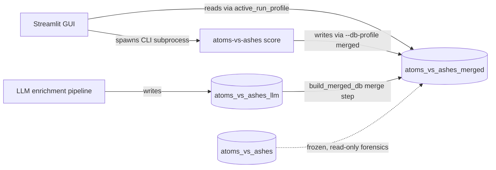

<!-- man_hours: 6.0 -->
# Merged-DB Canonical Cutover

**Status:** Completed — 2026-05-15.
**Working plan:** `~/.cursor/plans/merged_db_canonical_cutover_92c36454.plan.md`.

## Objective

Make `atoms_vs_ashes_merged` the only DB the system reads or writes. The GUI runner already writes there (because `active_run_profile.db_profile = 'merged'`), but the Streamlit process reads from `atoms_vs_ashes`, which is why fresh runs like `score-9a041741` and `score-7dc6f558` never appeared in the picker. Both DBs were at alembic head `043` (no schema work needed); the gap was data plus the GUI bootstrap.

## Architecture decisions

- **D1** Merged is canonical. API gets frozen, then deleted after a 30-day cooling period (separate consent).
- **D2** Migration is **additive API to merged only**. Merged-only tables (LLM verdicts, country rankings, swing weights, failure aggregates, OAT importance) must not be lost.
- **D3** Two-stage cutover: data migration first, GUI/`.env` switch second, with a verifiable parity gate between them.
- **D4** Per-run migration receipts written to `audit_log` (not `merge_audit`, which is keyed by `site_id` and a poor fit for run-level provenance).
- **D5** Single-source the `_DB_PROFILES` map into a new `src/atoms_vs_ashes/db/profiles.py`; GUI bootstrap and CLI both import from it.

## Discovery snapshot (verified 2026-05-15)

| Layer | Rows in API not in merged | Rows in merged not in API | Action |
| --- | --- | --- | --- |
| `runs` | 39 (incl. `score-ri04fix-001853`) | 24 (incl. `score-9a041741`, `score-7dc6f558`) | Phase 2 migrates API→merged; merged-only stays |
| `screening_verdicts` / `ranking_scores` / `composite_score_components` | +131 251 / +238 992 / +42 140 | --- | Migrated as children of their parent runs |
| `country_rankings_summary`, `criterion_correlations`, `failure_aggregates`, `failure_outcomes`, `oat_importance`, `swing_weights`, `weight_profile_stability` | --- | merged-only | Untouched |
| `site_llm_observations` / `site_llm_verdicts` | --- | 9 808 / 8 463 | Untouched |
| `site_observations` / `site_raw_responses` / `country_balance_check` | +1 343 / +1 078 / +91 | --- | Phase 3 delta-resync |
| `threshold_overrides` | +2 | --- | Phase 3 |
| `sites` | --- | +1 (duplicate Brăila, UUID `323cdbf0-…`, status `cancelled`) | Phase 1 cleanup |

## Data flow after cutover

## Phase 0 — Safety net (read-only + backups)

- Took `pg_dump --format=custom` of both databases into `backups/20260515T095759Z/` (~1.1 GB each).
- Wrote `src/scripts/verify_merged_canonical.py` with `--baseline` and `--against-baseline` modes.
- Captured baseline at `audit/post_processing/02_data_verification/canonical_baseline_pre_cutover.json` (+ `.md`).

## Phase 1 — Clean stale data in merged

- Wrote `src/alembic/versions/044_dedupe_braila_in_merged.py`. Cascade-deletes the `cancelled`-status duplicate Brăila row by UUID `323cdbf0-c4a8-467a-af76-e2e3df0b537f`, idempotent.
- Verified that every run that referenced the duplicate also referenced the canonical Brăila (`29836b52-…`) with the same number of verdicts, so deletion is a clean dedupe.
- Applied via `alembic upgrade head` against both DBs (no-op against API).

## Phase 2 — Migrate API-only runs into merged

- Wrote `src/scripts/migrate_runs_api_to_merged.py` (defaults to `--dry-run`).
- Migrated **39** API-only runs and **1 945 706** child rows in dependency order: `runs → compiled_scoring_snapshots (+8 missing) → dataset_snapshot → scoring_run_snapshots → screening_verdicts → ranking_scores → composite_rankings → composite_score_components → site_bands → threshold_sensitivity → country_balance_check`.
- All inserts use `INSERT … ON CONFLICT DO NOTHING` for idempotency.
- Per-run receipt written to `audit_log` (`operation='migrate_run_from_api'`, JSON counts in `after_value`).

## Phase 3 — Operator and connector data delta-resync

- Same script with `--include-operator-data`. Migrated:
  - `threshold_overrides`: +2 (PK-keyed)
  - `data_sources`: +1 (`osm_overpass_military_spf`, name-keyed)
  - `site_observations`: +1 343
  - `site_raw_responses`: +1 078 (had to drop batch size to 5 — the `response_body` JSONB hits ~7 MB max and a 500-row batch closes the connection)
  - `audit_log`: +22

## Phase 4 — Verification gate

- `python -m scripts.verify_merged_canonical --against-baseline canonical_baseline_pre_cutover.json --label post-cutover` → diff written to `audit/post_processing/02_data_verification/canonical_diff_post_cutover.json` (+ `.md`). Only the expected deltas appear.
- Spot-checked the run picker: `list_recent_runs_for_kind('scoring', limit=10)` against merged returns `score-7dc6f558`, `score-9a041741`, `score-021498cb`, `score-ri04fix-001853`, … i.e. the previously invisible runs.
- `pytest tests/db tests/runprofile -q` — 16 passed.

## Phase 5 — Cutover (the GUI switch)

- `.env`: flipped `POSTGRES_DB` to `atoms_vs_ashes_merged` and updated comment block.
- New `src/atoms_vs_ashes/db/profiles.py` (≤ 30 LOC) holds the canonical `DB_PROFILES` dict + `resolve_db_name()`.
- `src/atoms_vs_ashes/db/engine.py` gained `init_engine_for_active_profile()` (queries `active_run_profile.db_profile`, overrides `POSTGRES_DB` if needed, rebinds the engine) and `current_db_name()` for diagnostic display.
- `src/atoms_vs_ashes/cli.py` now imports the canonical map.
- `src/atoms_vs_ashes/gui/app.py` calls `init_engine_for_active_profile()` immediately after `load_dotenv` so every page sees the right engine.
- `src/atoms_vs_ashes/gui/_results_page_main.py` shows the connected DB name in the page caption.
- Defaulted `DatabaseSettings.db` to `atoms_vs_ashes_merged` so any process forgetting to load `.env` still lands on the canonical DB.
- New `tests/db/test_profile_resolution.py` (7 tests) covers the resolver + bootstrap.

## Phase 6 — Freeze and decommission API

- Day 0 (today): `REVOKE INSERT, UPDATE, DELETE, TRUNCATE` from role `atoms` on `atoms_vs_ashes`. SELECT still works (forensics). Confirmed: `INSERT` returns *permission denied for table audit_log*.
- Flipped CLI's `--db-profile` default from `api` → `merged`.
- Updated `src/scripts/run_efsm20_faults.py` and `src/scripts/report_enrichment_coverage.py` to add `merged` and default to it.
- Updated `AGENTS.md` and `experts/connectors/api_enrichment_operations.md`.
- Day 90: drop `atoms_vs_ashes` (separate explicit consent — not yet executed).

## Risk register (post-execution)

| ID | Risk | Status |
| --- | --- | --- |
| R1 | Mid-migration corruption | Mitigated — Phase 0 backups in place; idempotent inserts succeeded |
| R2 | Hidden FK to `sites` not in pre-delete order | Verified — Phase 1 deletion succeeded with the documented order |
| R3 | Stale `db_profile` string after a future Run Profile UI edit | Covered by `test_init_engine_for_active_profile_unknown_db_profile_raises` |
| R4 | Cron / CI scripts still hit `atoms_vs_ashes` | CLI default flipped; remaining scripts updated; doc updated |
| R5 | Engine initialised at import time before bootstrap runs | `gui/app.py` now calls bootstrap before any page imports `session_scope` |
| R6 | LLM pipeline drifts merged after cutover | Deferred (OI-3); `build_merged_db.py` remains the merge path |

## Open issues

- **OI-1, OI-2, OI-4, OI-5** Resolved by execution.
- **OI-3** LLM-direct-write redesign deferred; `build_merged_db.py` continues as the LLM merge path.
- **Day 90** API DB drop is *not* yet executed; requires fresh consent.

## Deliverables (final)

| # | Path | Purpose |
| --- | --- | --- |
| 1 | `src/scripts/verify_merged_canonical.py` | Baseline + diff snapshot tool |
| 2 | `src/scripts/migrate_runs_api_to_merged.py` | Per-run + operator-data additive migration |
| 3 | `src/alembic/versions/044_dedupe_braila_in_merged.py` | Brăila duplicate cleanup |
| 4 | `src/atoms_vs_ashes/db/profiles.py` | Canonical `DB_PROFILES` map |
| 5 | `src/atoms_vs_ashes/db/engine.py` (edited) | `init_engine_for_active_profile`, `current_db_name` |
| 6 | `src/atoms_vs_ashes/cli.py` (edited) | Imports shared profiles, `--db-profile` default → `merged` |
| 7 | `src/atoms_vs_ashes/gui/app.py` (edited) | Bootstrap binds engine to active profile |
| 8 | `src/atoms_vs_ashes/gui/_results_page_main.py` (edited) | DB caption |
| 9 | `src/atoms_vs_ashes/config.py` (edited) | Default `db` → `atoms_vs_ashes_merged` |
| 10 | `.env` (edited) | `POSTGRES_DB=atoms_vs_ashes_merged` |
| 11 | `src/scripts/report_enrichment_coverage.py` (edited) | Adds `merged` profile, defaults to it |
| 12 | `src/scripts/run_efsm20_faults.py` (edited) | Adds `merged` profile, defaults to it |
| 13 | `AGENTS.md`, `experts/connectors/api_enrichment_operations.md` (edited) | Doc updates |
| 14 | `tests/db/test_profile_resolution.py` | 7 tests covering resolver + bootstrap |
| 15 | `audit/post_processing/02_data_verification/canonical_baseline_pre_cutover.{json,md}` | Pre-cutover snapshot |
| 16 | `audit/post_processing/02_data_verification/canonical_diff_post_cutover.{json,md}` | Post-cutover diff |
| 17 | `backups/20260515T095759Z/atoms_vs_ashes{,_merged}.dump` | Custom-format pg_dump backups |
| 18 | `audit/conversations/2026-05-15_merged-db-canonical-cutover.md` | Conversation audit |
| 19 | `architecture/plans/merged-db-canonical-cutover.md` (this file) and `audit/plans/merged-db-canonical-cutover.md` | Mirrored plan |
