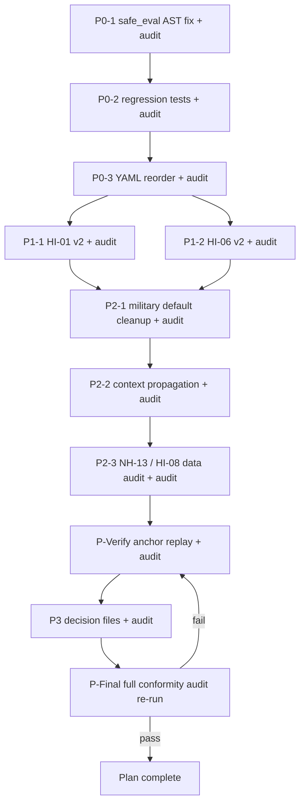
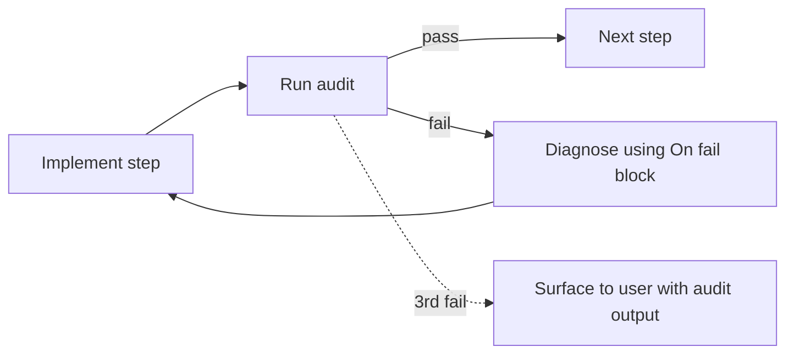

## Scoring Engine and Rubric Fix Plan

### Scope (per user)

- **In scope:** P0 engine + test fixes, P1 HI-01 / HI-06 rubric rewrites, P2 context-derivation cleanup and data-path investigation, P3 decision gates for NH-11, EP-01 and full-pass drift.
- **Explicitly out of scope (do separately, with consent):** live API re-runs for NH-13 / HI-08 data gaps, GUI sensitivity run, renderer EPRI-basis change and site-profile regeneration.

### Source of truth

Required actions list in [audit/post_processing/scoring_conformity/band_reliability_conclusion.md](audit/post_processing/scoring_conformity/band_reliability_conclusion.md) §"Required actions" 1-5 plus the diagnostic in §"What is not yet reliable" 1-6.

### Sequencing



The verification step does not need a fresh scoring run — it replays the engine against the persisted context for the three anchor sites in run `20260513T030738_70d5bc2c` and checks the band each criterion lands in.

### Iterative audit protocol

Every implementation step ends with an **Audit** block that re-runs a defined check to confirm the fix landed. The protocol per step:

1. Execute the change as described.
2. Run the audit command exactly as written.
3. Compare the audit output to the **Pass criteria** in the same block.
4. If **pass**: mark the todo complete, move to the next step.
5. If **fail**: do not move on. Add a sub-task `<step-id>.f1`, `.f2`, ... under the same todo with the proposed fix from the **On fail** block (or a new diagnosis if neither pre-described case fits). Re-implement, re-audit. Up to three iterations per step; on the fourth, stop and surface the blocker to the user with the audit output as evidence.

The full-cohort audit at the end (P-Final) is the gate on declaring the plan complete: a refreshed conformity matrix + cohort reliability summary must show the previously partial / not-implemented comments moving to implemented for the in-scope items, with no regressions in the comments that were already green.

Audit outputs live under `audit/post_processing/scoring_conformity/iter_<N>/` so each iteration is preserved for comparison; `N` is the loop counter started at `01` when the first audit runs.



---

### P0-1. Fix `safe_eval` so favorable branches with `is null` survive arithmetic disjuncts

**Problem.** `safe_eval` in [src/atoms_vs_ashes/scoring/bands.py](src/atoms_vs_ashes/scoring/bands.py) lines 54-78 compiles the whole expression and runs `eval()` once. If any subexpression raises `TypeError` (e.g. `nearest_seveso_km > 20` when `nearest_seveso_km is None`), the entire expression returns `None` and the band is rejected — even when the right-hand disjunct (`nearest_seveso_km is null and hi02_search_completed == true`) would have evaluated to `True`. This is the root cause of HI-02, HI-04, HI-05, HI-08, NH-07, NH-08, NH-13 favorable bands not firing.

**Change.** Walk the AST in `safe_eval`. For a top-level `ast.BoolOp` with `ast.Or` op, evaluate each value independently with the existing exception-swallowing logic; if any returns `True`, return `True`. For `ast.And`, all must return `True` (treat a `None` / exception disjunct as `False`). For everything else, fall through to the current single-`eval` path. Keep the public signature and return contract.

**Files touched.**

- [src/atoms_vs_ashes/scoring/bands.py](src/atoms_vs_ashes/scoring/bands.py) — replace the body of `safe_eval` with an AST-aware version. No call-site changes.

**Acceptance.**

- New unit test (see P0-2) passes.
- All existing tests in `tests/scoring/` still pass.

**Audit.**

- Command: `pytest tests/scoring/ -v 2>&1 | tee audit/post_processing/scoring_conformity/iter_<N>/p01_safe_eval_pytest.log`.
- Pass criteria: every test in `tests/scoring/` green; `test_safe_eval_disjuncts.py` cases all pass (added in P0-2 — so this audit is co-evaluated with P0-2).
- On fail:
  - If `test_safe_eval_disjuncts.py` cases fail with `assertion errored True != False`, the AST walk is not recursing into nested `BoolOp`s. Fix: in `safe_eval`, recurse `_eval_or` / `_eval_and` into sub-`BoolOp` nodes before delegating to the single-`eval` fallback.
  - If an existing test in `test_safety_floor_pipeline.py` or `test_compiler_parity.py` regresses, the AST walk is changing the semantics of `and` / `or` that used to evaluate cleanly. Fix: only switch to the AST walk when the single-`eval` path returns `None`; if the single-`eval` returns a concrete boolean, keep that result.
  - If a test in `test_threshold_band_runtime.py` regresses, check whether the test depends on the previous all-or-nothing failure mode (e.g. expecting `None` from a partly-malformed expression); update the test only if the new behaviour matches rubric intent, otherwise narrow the AST walk to only `Or` and `And` at the top level.

### P0-2. Add regression tests for `safe_eval` and the SP-F search-sentinel pattern

Add `tests/scoring/test_safe_eval_disjuncts.py` covering:

- `safe_eval("a > 5 or b == true", {"a": None, "b": True})` returns `True`.
- `safe_eval("a > 5 or (a is null and b == true)", {"a": None, "b": True})` returns `True` (the HI-02 favorable shape).
- `safe_eval("a > 5 and (a is null or b == true)", {"a": None, "b": True})` returns `False`.
- `safe_eval("a > 5", {"a": None})` still returns `None` (no regression — single comparison with `None`).
- `safe_eval("default", {})` still returns `True`.

Then add `tests/scoring/test_search_sentinel_bands.py` that loads the real bundle via `load_rubric_bundle(REPO_ROOT / "config" / "scoring_rubrics")` and asserts the HI-02, HI-04, HI-05, HI-08 favorable band fires when `nearest_*_km = None` and `hi0X_search_completed = True`, and does **not** fire when `hi0X_search_completed = False`.

**Acceptance.** Both files green; tests fail on `main` (without the P0-1 fix) and pass with it.

**Audit.**

- Command: `git stash --keep-index && pytest tests/scoring/test_safe_eval_disjuncts.py tests/scoring/test_search_sentinel_bands.py 2>&1 | tee audit/post_processing/scoring_conformity/iter_<N>/p02_tests_pre_fix.log; git stash pop && pytest tests/scoring/test_safe_eval_disjuncts.py tests/scoring/test_search_sentinel_bands.py 2>&1 | tee audit/post_processing/scoring_conformity/iter_<N>/p02_tests_post_fix.log`.
- Pass criteria: the pre-fix log shows at least three failing assertions (`or with None`, sentinel-fires-on-null, sentinel-does-not-fire-without-quality); the post-fix log shows all green.
- On fail:
  - If both logs are green, the new tests are not exercising the bug. Strengthen the assertions to compare the matched band's `score_range` (must be `[9, 10]` for the sentinel case) rather than just `is not None`.
  - If the post-fix log is still red, the AST walk change in P0-1 is incomplete — see P0-1 "On fail" block.

### P0-3. Belt-and-braces: reorder `is null` disjuncts to the front

For the four already-correct sentinel bands (HI-02 L51, HI-04 L95, HI-05 L119, HI-08 in [config/scoring_rubrics/hi_human_induced.yaml](config/scoring_rubrics/hi_human_induced.yaml)) and the equivalent NH-07 / NH-08 / NH-13 branches in [config/scoring_rubrics/nh_natural_hazards.yaml](config/scoring_rubrics/nh_natural_hazards.yaml), reorder each `or` so the `... is null and *_search_completed == true` clause comes first. This is redundant after P0-1 but makes intent visible at YAML review time. No semantic change.

**Acceptance.** `git diff` shows reordered disjuncts only; the new tests still pass.

**Audit.**

- Command: `pytest tests/scoring/ 2>&1 | tee audit/post_processing/scoring_conformity/iter_<N>/p03_reorder_pytest.log; git diff config/scoring_rubrics/ > audit/post_processing/scoring_conformity/iter_<N>/p03_reorder.diff`.
- Pass criteria: full `tests/scoring/` green; the diff contains only re-ordered disjuncts within an `or` (no descriptor changes, no threshold changes, no operator changes), confirmed by eyeball review against the diff file.
- On fail:
  - If a test regressed, the reorder accidentally changed semantics (most likely by switching the lazy / eager evaluation of a comparison that needs the left side first). Revert the offending hunk; the P0-1 fix already makes the order semantically irrelevant.
  - If the diff contains anything other than disjunct reordering, revert and re-apply the YAML change as a pure reorder.

---

### P1-1. HI-01 v2 rubric — consume `nearest_airport_class`, soften the AND-clause

**Problem.** [config/scoring_rubrics/hi_human_induced.yaml](config/scoring_rubrics/hi_human_induced.yaml) line 18 reads

```yaml
- {
    score_range: [9, 10],
    condition_expr: "nearest_airport_km > 30 and nearest_military_airfield_km > 60",
    ...,
  }
```

`nearest_military_airfield_km` is missing for most sites (the derivation falls back to `999.0` — see P2-1), but the AND still drags the band down when context propagation is incomplete. The SP-F connector populates `nearest_airport_class` (`large_intl`, `medium`, `small`, `military`, `heliport`, `none_in_radius`) and that field is not consulted.

**Change.** Rewrite the band list to (a) require `nearest_airport_km` only, (b) gate the high band on `nearest_airport_class != 'large_intl'`, (c) treat a null military distance as favourable (after the sentinel pattern). Update `db_fields.api` to declare `site_human_induced.nearest_airport_class`. Add a comment above the bands describing the rationale (no airport class consumption was the FB-LL-08 gap).

Indicative target shape (final wording finalised at edit time):

```yaml
bands:
  - {
      score_range: [9, 10],
      condition_expr: "nearest_airport_km > 30 and nearest_airport_class != 'large_intl' and (nearest_military_airfield_km > 60 or nearest_military_airfield_km is null)",
      descriptor: "...",
    }
  - {
      score_range: [7, 8],
      condition_expr: "nearest_airport_km >= 15 and nearest_airport_class in ['small', 'medium', 'none_in_radius'] and under_flight_path == false",
      descriptor: "...",
    }
  - {
      score_range: [5, 6],
      condition_expr: "nearest_airport_km >= 8",
      descriptor: "...",
    }
  - {
      score_range: [3, 4],
      condition_expr: "nearest_airport_km < 15 and nearest_airport_class in ['large_intl', 'medium']",
      descriptor: "...",
    }
  - {
      score_range: [1, 2],
      condition_expr: "(nearest_airport_class == 'large_intl' and nearest_airport_km < 8) or nearest_military_airfield_km < 16",
      descriptor: "...",
    }
  - {
      score_range: [0, 0],
      condition_expr: "under_flight_path == true and nearest_airport_class == 'large_intl'",
      descriptor: "...",
    }
```

A1-A4 fail-conditions list stays unchanged.

**Acceptance.** At Timelkam (no large airport in 30 km, no military airfield populated), HI-01 lands in `[7,8]` or `[9,10]`. At Brăila and Riedersbach, HI-01 reflects the reviewer's qualitative read (medium-airport ≥ 15 km → 7-8; small / GA only → 9-10). New cases added to `test_search_sentinel_bands.py` covering each band at least once.

**Audit.**

- Command: `PYTHONPATH=src python src/scripts/replay_scoring_at_anchors.py --criterion HI-01 --run-id 20260513T030738_70d5bc2c --output audit/post_processing/scoring_conformity/iter_<N>/p11_hi01_replay.md` (the replay script is added in P-Verify; for this audit a minimal stub that only handles `--criterion HI-01` is fine, the full version arrives in P-Verify).
- Pass criteria: the replay table shows HI-01 ≥ 7.0 at Timelkam and Riedersbach, and matches the reviewer expectation at Brăila as recorded in [audit/post_processing/scoring_conformity/anchor_score_conformity.md](audit/post_processing/scoring_conformity/anchor_score_conformity.md).
- On fail:
  - If `nearest_airport_class` is None at the anchor sites, the new bands collapse to default. Action: run the P2-3 read-only DB audit early to confirm whether the column is populated. If absent, raise this to the user as a data gap — the rubric rewrite is correct but needs the connector to have populated `nearest_airport_class`. Track in `audit/post_processing/scoring_conformity/iter_<N>/p11_hi01_data_gap.md`.
  - If `nearest_airport_class` is populated but the band still under-scores, walk the matched-band descriptor printed by the replay. Most likely cause: a more-restrictive clause (`under_flight_path == false`) is firing because the upstream column is None. Fix: relax the clause to `(under_flight_path == false or under_flight_path is null)` and re-audit.

### P1-2. HI-06 v2 rubric — consume `nearest_military_class` and `nearest_high_consequence_military_km`

**Problem.** [config/scoring_rubrics/hi_human_induced.yaml](config/scoring_rubrics/hi_human_induced.yaml) lines 127-147 still use `nearest_military_km` + legacy `military_type`. The SP-F connector populates `nearest_military_class` (`high_consequence`, `medium_consequence`, `low_consequence`, `none_in_radius`) and `nearest_high_consequence_military_km` for 361 sites (37 high-consequence), and neither is consumed.

**Change.** Rewrite the band list to band on `nearest_high_consequence_military_km` first and `nearest_military_km` second, gated by `nearest_military_class`. Update `db_fields.api` to include the two new columns. Keep A5 and A6 fail-conditions, but rewrite the conditions to use `nearest_military_class` where it matches the legacy `military_type` semantics (firing/bombing ranges → `high_consequence`; ammunition storage → `high_consequence`).

**Acceptance.** A site with `nearest_military_class == 'none_in_radius'` lands in `[9,10]`. A site with `nearest_high_consequence_military_km < 8` lands in `[1,2]` or triggers the avoidance fail. Three anchor sites land where the reviewer expected (recorded in `audit/post_processing/scoring_conformity/anchor_score_conformity.md`).

**Audit.**

- Command: `PYTHONPATH=src python src/scripts/replay_scoring_at_anchors.py --criterion HI-06 --run-id 20260513T030738_70d5bc2c --output audit/post_processing/scoring_conformity/iter_<N>/p12_hi06_replay.md` and a cohort-level distribution: `PYTHONPATH=src python src/scripts/replay_scoring_at_anchors.py --criterion HI-06 --run-id 20260513T030738_70d5bc2c --cohort --output audit/post_processing/scoring_conformity/iter_<N>/p12_hi06_cohort.md`.
- Pass criteria: at the three anchors HI-06 matches reviewer expectation. Across the cohort, the 37 sites tagged `nearest_military_class == 'high_consequence'` all score ≤ `[5,6]`, and `none_in_radius` sites score `[9,10]`.
- On fail:
  - If `nearest_military_class` is None at anchor sites, repeat the data-gap escalation from P1-1 with the corresponding column. The HI-06 fix04 replay already confirmed 100 % coverage in [audit/post_processing/hi06_fix04_preview/hi06_fix04_post_apply_verify.md](audit/post_processing/hi06_fix04_preview/hi06_fix04_post_apply_verify.md), so a gap here is a propagation issue — go to P2-2 first.
  - If the 37 high-consequence sites do not consistently drop to ≤ `[5,6]`, the new band threshold (`nearest_high_consequence_military_km < X`) is set too tight. Action: rebucket against the cohort distribution observed in `p12_hi06_cohort.md` and re-audit.

---

### P2-1. Remove the `nearest_military_airfield_km = 999.0` default and audit the derivation

**Problem.** [src/atoms_vs_ashes/scoring/merge_context_derivations.py](src/atoms_vs_ashes/scoring/merge_context_derivations.py) lines 186-187 force `nearest_military_airfield_km = 999.0` whenever the field is missing. That hides "data not produced" as "favorable" and contradicts the SP-F sentinel design.

**Change.** Replace the unconditional default with: if the upstream connector quality column for HI-06 reports a successful search and no airfield was found, set the value to `None` and rely on the rubric's `is null` branch (post P1-2). If the connector did not run or returned `no_data`, leave the key absent so the band falls through to the unscored default. Add a unit test in `tests/scoring/test_context_derivations.py` (new file) covering both branches.

**Acceptance.** Sites with no SP-F military search return `nearest_military_airfield_km is None` and HI-06 lands at pass-mark with `unscored`. Sites with a completed search and no airfield in radius score in `[9,10]`.

**Audit.**

- Command: `pytest tests/scoring/test_context_derivations.py -v 2>&1 | tee audit/post_processing/scoring_conformity/iter_<N>/p21_derivation_pytest.log` then `PYTHONPATH=src python src/scripts/replay_scoring_at_anchors.py --criterion HI-06 --run-id 20260513T030738_70d5bc2c --diff-against-prev audit/post_processing/scoring_conformity/iter_<N>/p12_hi06_cohort.md --output audit/post_processing/scoring_conformity/iter_<N>/p21_hi06_after_default_removal.md`.
- Pass criteria: new test green; the diff shows that previously falsely-favorable sites (where `nearest_military_airfield_km` had been auto-filled as 999.0) now resolve to "unscored" or fire a deliberate `is null` favorable band, with no site silently shifting band without an explanation.
- On fail:
  - If sites that previously scored `[9,10]` now mass-shift to "unscored" without a sentinel decision, the connector quality column for HI-06 (`hi06_quality` or equivalent) is not being read by the derivation. Fix: extend `_derive_hi_search_sentinels` to cover HI-06 and re-audit.
  - If the test passes but the replay shows no change, the merge path is not going through `apply_derived_context_values`. Defer the diagnosis to P2-2 and re-audit P2-1 after P2-2 lands.

### P2-2. Verify SP-F derived flags actually reach the band evaluator

**Problem.** The conformity report records that HI-02 / HI-04 / HI-05 / HI-08 favorable bands fire for 0-9 sites of 361 even though the YAML is correct. After P0-1 the most likely remaining cause is that `country_is_landlocked` and / or `hi0X_search_completed` are not in the per-site context dict at the moment `evaluate_criterion_value` is called.

**Change.** Add a small script `src/scripts/debug_context_propagation.py` (no live API, DB-only) that loads the persisted context for the three anchor sites in run `20260513T030738_70d5bc2c` and prints which of the keys in `DERIVED_CONTEXT_NAMES` (from `merge_context_derivations`) are present. Use the result to identify any merge / context-assembly call site that skips `apply_derived_context_values`. If a gap is found, the fix is one of (a) call `apply_derived_context_values` in the missing path, or (b) extend `DERIVED_CONTEXT_NAMES` to declare the missing key. Document the actual cause in `audit/post_processing/scoring_conformity/context_propagation_findings.md` and apply the fix.

**Acceptance.** All four `hi0X_search_completed` keys and `country_is_landlocked` are present in the per-site context for the three anchor sites. Re-evaluating the engine against persisted context (P-Verify) produces favorable scores where the data warrants it.

**Audit.**

- Command: `PYTHONPATH=src python src/scripts/debug_context_propagation.py --run-id 20260513T030738_70d5bc2c --site timelkam --site braila --site riedersbach --output audit/post_processing/scoring_conformity/iter_<N>/p22_context_propagation.md`.
- Pass criteria: for each anchor site, the markdown table shows `present=true` for every key in `DERIVED_CONTEXT_NAMES` that should be derivable from the persisted context (specifically `hi02_search_completed`, `hi04_search_completed`, `hi05_search_completed`, `hi08_search_completed`, `country_is_landlocked`, `nearest_volcano_km`, `coast_distance_km`, `slope_angle_mean_deg`).
- On fail:
  - If `country_is_landlocked` is missing, the `country_code` is not joined into the per-site context. Fix: trace the merge path in [src/atoms_vs_ashes/scoring/merge_resolver.py](src/atoms_vs_ashes/scoring/merge_resolver.py) and add a `country_code` projection from `sites.country_code` before `apply_derived_context_values` is called.
  - If `hi0X_search_completed` keys are missing, `apply_derived_context_values` was never called. Fix: identify the call site that constructs the context and either call the derivation helper there or move the call upstream to the merge resolver.
  - If keys are present but evaluation still does not fire favorable bands, dump the failing band's condition and walk it manually — likely a quality string mismatch (e.g. connector wrote `"OK"` not `"ok"`). Fix: extend `_SEARCH_COMPLETED_QUALITY_OK` or normalise the quality string at write time.

### P2-3. Confirm NH-13 / HI-08 data is genuinely absent vs not propagated

**Problem.** The conformity assessment recorded that `combustible_veg_pct` (NH-13) and `nearest_nuclear_km` (HI-08) are populated for zero sites. This may be a connector gap (separate, consent-gated) or a propagation gap (in-scope here).

**Change.** Read-only DB query (run via existing helper, no live API): count `site_natural_hazards.combustible_veg_pct IS NOT NULL` and `site_human_induced.nearest_nuclear_km IS NOT NULL` across all sites. If non-zero rows exist but the score-time context shows None, that is a propagation bug — fix it the same way as P2-2. If zero rows truly exist, record the finding in `audit/post_processing/scoring_conformity/data_gaps_followup.md` and stop (re-running the connectors is a separate, consent-gated task).

**Acceptance.** A one-page note in `audit/post_processing/scoring_conformity/data_gaps_followup.md` stating which case applies, and (if propagation) the fix is committed.

**Audit.**

- Command: read-only DB query via `src/scripts/_db_helpers.py` patterns already used in `inventory_scoring_runs.py`: `PYTHONPATH=src python -c "from atoms_vs_ashes.db import session_scope; ..."` counting non-null `combustible_veg_pct` and `nearest_nuclear_km` rows, written to `audit/post_processing/scoring_conformity/iter_<N>/p23_data_gap_counts.json`.
- Pass criteria: a JSON file exists with `combustible_veg_pct_non_null` and `nearest_nuclear_km_non_null` counts, and `audit/post_processing/scoring_conformity/data_gaps_followup.md` interprets the result (`source` vs `propagation`).
- On fail:
  - If the DB query errors out (table / column missing), check the actual column names in [src/atoms_vs_ashes/db/models.py](src/atoms_vs_ashes/db/models.py) — likely renamed during SP-F. Update the query and re-audit.
  - If non-null counts are zero and the SP-F connectors claim to write these fields, file the discrepancy under `audit/post_processing/scoring_conformity/iter_<N>/p23_connector_writes_vs_db.md` and surface to the user — connector re-run is out of scope.

---

### P-Verify. Anchor-site re-evaluation against the persisted snapshot

Add `src/scripts/replay_scoring_at_anchors.py` (read-only) that:

- Loads run `20260513T030738_70d5bc2c` for the three anchor sites (Timelkam, Brăila, Riedersbach).
- Re-applies `evaluate_criterion_value` per criterion using the post-fix code and rubric, against the persisted DB context.
- Prints a per-criterion table: previous band, new band, descriptor, matched / unscored.
- Writes the table to `audit/post_processing/scoring_conformity/anchor_replay_post_fix.md`.

**Acceptance.** After P0 + P1 + P2 are committed, the anchor replay shows HI-01 and HI-06 in the reviewer-expected bands and HI-02 / HI-04 / HI-05 / HI-08 / NH-07 / NH-08 / NH-13 firing their favorable branches where context allows.

**Audit.**

- Command: `PYTHONPATH=src python src/scripts/replay_scoring_at_anchors.py --run-id 20260513T030738_70d5bc2c --output audit/post_processing/scoring_conformity/iter_<N>/p_verify_anchor_replay.md` (no `--criterion` flag → all criteria).
- Pass criteria: a side-by-side table for Timelkam, Brăila, Riedersbach in which (a) every criterion either matches reviewer expectation in [audit/post_processing/scoring_conformity/anchor_score_conformity.md](audit/post_processing/scoring_conformity/anchor_score_conformity.md) or carries an explicit explanation of the divergence, (b) HI-02 / HI-04 / HI-05 / HI-08 fire `[9,10]` at sites where the search completed cleanly, (c) NH-07 / NH-08 / NH-13 fire favorable branches where appropriate.
- On fail (case-by-case routing):
  - Residual HI-01 / HI-06 mismatch → revisit P1-1 / P1-2 with the audit's matched-band descriptor.
  - HI-02 / HI-04 / HI-05 / HI-08 still pass-mark → P2-2 (context propagation) is incomplete; re-audit.
  - NH-07 / NH-08 / NH-13 still pass-mark → confirm the AST fix in P0-1 covers the specific disjunct shape (`nh*_search_completed` is the analogous flag; if it's not in `DERIVED_CONTEXT_NAMES`, add it).
  - More than two anchors regress on a previously-correct criterion → roll back the most recent step and re-audit; the change has unintended cross-criterion effects.

---

### P3-1. NH-11 framing — DECISION REQUIRED (no code edit until signed off)

**State.** [config/scoring_rubrics/nh_natural_hazards.yaml](config/scoring_rubrics/nh_natural_hazards.yaml) lines 269-307 score climate-typical annual precipitation. `extreme_precip_mm` is declared in `db_fields` but no sub-score consumes it. Reviewer comments #100 / #573 framed "low extreme daily precipitation = favorable", which does not map. NH-11 mean = 4.0 flat across all 361 sites.

**Open choices (write up in `audit/post_processing/scoring_conformity/nh11_framing_decision.md`, then wait for user OK):**

- **A.** Add a fourth sub-score `extreme_precip` that consumes `extreme_precip_mm` (favorable when low). NH-11 then differentiates by extreme-day risk while keeping climate-typical banding. Implementation effort: ~1 hour rubric YAML + ~0.5 hour test.
- **B.** Leave NH-11 scoping climate-typical precipitation and document explicitly that reviewer #100 / #573 require a new criterion (NH-15 "tornado / extreme weather"). No code change here.
- **C.** Hybrid: rename the criterion `NH-11 Precipitation patterns` and add the sub-score from A.

Plan does **not** edit YAML for this item until the user picks A / B / C.

### P3-2. EP-01 direction — DECISION REQUIRED

**State.** [config/scoring_rubrics/ep_emergency_planning.yaml](config/scoring_rubrics/ep_emergency_planning.yaml) lines 18-22 map Timelkam's 44/100 composite to `[3,4]` (= 3.5). Reviewer hoped for "higher than 5.5". Cohort mean dropped 5.19 → 3.14.

**Open choices (write up in `audit/post_processing/scoring_conformity/ep01_direction_decision.md`):**

- **A.** Accept the re-banded thresholds as authoritative. Update the chapter narrative to show Timelkam at 3.5 with a "severe EP feasibility penalty" descriptor. No rubric edit.
- **B.** Re-band so 44 sits in `[5,6]` (e.g. shift `>= 40` → `>= 30`, `>= 30` → `>= 20`, etc.). Re-evaluate cohort distribution before committing.
- **C.** Split EP-01 into a sub-score weighted average (composite vs hospital vs trauma) so 44/100 alone is not decisive.

Plan does **not** edit YAML until the user picks A / B / C.

### P3-3. Full-pass drift A/B/C — DECISION REQUIRED

**State.** Canonical 36 full-pass sites → latest 11 (-69%). Driven by the new `:floor` mechanism in [src/atoms_vs_ashes/scoring/\_safety_floor.py](src/atoms_vs_ashes/scoring/_safety_floor.py) producing 549 new exclusionary rows at `E2:floor`, `E3:floor`, `E4:floor`, `E_RI04:floor`. The rework-execution audit log already lists three options.

**Open choices (write up in `audit/post_processing/scoring_conformity/full_pass_drift_decision.md`):**

- **A.** Accept the drift. Regenerate the cohort narrative + executive brief. (Requires renderer / regeneration, which is out of scope here — this gate just records the decision.)
- **B.** Roll back the `:floor` mechanism. Revert the `_safety_floor.py` integration into composite assembly.
- **C.** Pin to canonical anchor scoring for the report cohort, mark the new run as advisory only.

Plan does **not** touch `_safety_floor.py` or composite until the user picks A / B / C.

**Audit (for P3-1 / P3-2 / P3-3 collectively).** Each decision file must be written and surfaced to the user. The audit is just confirmation that the three markdown files exist and each contains the option table with a clearly marked "decision pending" field. No YAML or code touched.

- Command: `ls audit/post_processing/scoring_conformity/{nh11_framing_decision,ep01_direction_decision,full_pass_drift_decision}.md`.
- Pass criteria: all three files exist; each contains options A, B, C with effort / cohort-impact estimates and a `Decision: pending` line at the top.
- On fail: write the missing file with the structure from the prior decision-gate sections.

---

### P-Final. Full-cohort conformity audit re-run

After P0 + P1 + P2 + P-Verify pass on the most recent iteration, re-run the May-13 conformity audit against the post-fix engine. This is the gate on declaring the plan complete.

**Steps.**

1. `PYTHONPATH=src python src/scripts/build_scoring_conformity_matrix.py --output audit/post_processing/scoring_conformity/iter_<N>/ovidiu_comment_conformity_post_fix.md` — regenerate per-comment status against the updated rubrics, code and tests.
2. `PYTHONPATH=src python src/scripts/cohort_reliability_summary.py --run-id 20260513T030738_70d5bc2c --replay --output audit/post_processing/scoring_conformity/iter_<N>/cohort_reliability_post_fix.md` — regenerate cohort signals using the engine-replay (no DB writes) over the persisted context.
3. `PYTHONPATH=src python src/scripts/compare_anchor_scores.py --replay --output audit/post_processing/scoring_conformity/iter_<N>/anchor_score_conformity_post_fix.md` — refresh the anchor-vs-reviewer table using replayed scores.
4. Write `audit/post_processing/scoring_conformity/iter_<N>/band_reliability_conclusion_post_fix.md` mirroring the structure of [audit/post_processing/scoring_conformity/band_reliability_conclusion.md](audit/post_processing/scoring_conformity/band_reliability_conclusion.md) §"Final rating" / §"Per-comment status" / §"What is reliable" / §"What is not yet reliable", with deltas from the May-13 baseline.

**Pass criteria.**

- Comments tagged `partially_implemented` or `not_implemented` in the May-13 matrix that fall under HI-01, HI-06, HI-02, HI-04, HI-05, HI-08, NH-07, NH-08, NH-13 propagation (FB-LL-01, FB-LL-08 family) all move to `implemented`.
- No comment moves backward (`implemented` → `partially_implemented` or worse).
- Anchor replay matches reviewer expectation for HI-01 and HI-06 at all three sites.
- The cohort distribution for HI-01 shows >0 sites in the `[9,10]` band (currently 0 / 361).
- NH-11, EP-01, full-pass drift remain flagged as decision-gated — they are not expected to flip in this run, only the engine + rubric fixes are.

**On fail.**

- For any comment that does not flip to `implemented`, the audit must identify which step left it red: either the underlying rubric clause, the context propagation, or the data path. Open a new sub-iteration (`iter_<N+1>`) and rerun the affected steps with the diagnosis recorded in `audit/post_processing/scoring_conformity/iter_<N+1>/diagnosis.md`.
- For any comment that regressed, the most recent rubric or code change has a side effect — bisect by reverting the suspected step in isolation and re-running the audit.
- After three iterations without clearing the in-scope HI / NH cluster, stop, surface the matrix and cohort summary to the user, and propose a connector / data-collection re-run (which would move out of scope and require live-API consent).

**Acceptance for the plan as a whole.** A `band_reliability_conclusion_post_fix.md` whose "Final rating" line reads _"Reliable for HI-01 / HI-06 / favorable-branch family; three decision gates remain open."_

---

### Out of scope for this plan

Tracked separately so they do not get re-discovered:

- NH-13 / HI-08 connector live re-runs (require live-API consent).
- GUI sensitivity run paired with `20260513T030738_70d5bc2c`.
- Renderer EPRI weight-basis bullet change in [src/scripts/\_site_profile_markdown.py](src/scripts/_site_profile_markdown.py).
- Site profile regeneration for the three anchors / 361 cohort (LLM-gated).

### Audit-trail housekeeping

- Add a conversation log entry under `audit/conversations/2026-05-13_scoring-engine-fix-plan.md` once the plan is approved.
- Each new file (`tests/scoring/test_safe_eval_disjuncts.py`, `tests/scoring/test_search_sentinel_bands.py`, `tests/scoring/test_context_derivations.py`, `src/scripts/debug_context_propagation.py`, `src/scripts/replay_scoring_at_anchors.py`, decision markdown files) gets a `man_hours:` frontmatter line and `audit/man_hours_registry.yml` is updated alongside the commit.
- Mirror this plan into `architecture/plans/scoring_engine_fix_plan.md` and `audit/plans/scoring_engine_fix_plan.md` per `.cursor/rules/audit-trail.mdc`.
- All audit outputs go into `audit/post_processing/scoring_conformity/iter_<N>/` where `<N>` is a 2-digit counter starting at `01` for the first iteration. Each iteration's folder gets its own `README.md` with the date, the steps run, and a one-line outcome (pass / fail / partial-fail with which sub-step). When a step fails and re-implementation is required, the next iteration's folder also carries a `diagnosis.md` recording what was changed and why.
- Audit scripts called repeatedly (`build_scoring_conformity_matrix.py`, `cohort_reliability_summary.py`, `compare_anchor_scores.py`) get a `--replay` flag added if they do not already have one, so the audit cycle never depends on a fresh DB scoring run.
