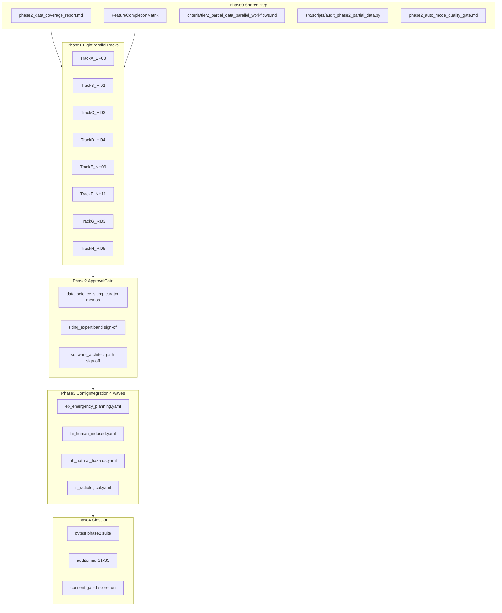

# Phase 2 Partial Data Scoring Plan

## Scope And Baseline

Implement **Phase 2 / Bucket C** from [`audit/post_processing/06_scoring/20260517_logic_only_criteria_todo.md`](audit/post_processing/06_scoring/20260517_logic_only_criteria_todo.md) (lines 90–175):

| Track | Criterion | Baseline symptom                      | Primary acceptance target                                                      |
| ----- | --------- | ------------------------------------- | ------------------------------------------------------------------------------ |
| A     | **EP-03** | 100% unscored; `relief_m_per_10km` 0% | Scoreable from relief alias and/or barrier/waterway interim ladder             |
| B     | **HI-02** | 13% unscored; `nearest_seveso_km` 4%  | ≤5% unscored; sentinel favourable NULL works                                   |
| C     | **HI-03** | 75.3% unscored; toxic distance ~25%   | Material unscored reduction via `hi03_search_completed` + bands (no connector) |
| D     | **HI-04** | 13% unscored; flammable distance 4%   | ≤5% unscored; mirror HI-02 sentinel pattern                                    |
| E     | **NH-09** | 0% unscored, stdev 0.00               | Cohort spread stdev ≥0.5; A11 independent                                      |
| F     | **NH-11** | 0% unscored, stdev 0.00               | Score populated sub-metrics only; stdev ≥0.5                                   |
| G     | **RI-03** | 100% unscored; `aquifer_type` 99%     | Score from `aquifer_type` when vulnerability class empty                       |
| H     | **RI-05** | 54.8% unscored; city proxy 45%        | ≤20% unscored via proxy ladder / GHSL fallback                                 |

**Baseline:** run `20260517T104618_459ae424`, SMR `nuscale_voygr6`, 361-site cohort ([`20260517_criteria_implementation_status.md`](audit/post_processing/06_scoring/20260517_criteria_implementation_status.md)).

**Out of scope (unchanged from logic-only TODO):** new connectors, live API calls, Bucket E criteria (HI-05/08, NH-13, NS-07/09/11, EP-05), RI-01 dispersion API, Phase 3 LLM tier persistence (NS-06/10/12/13).

**Template:** [`/Users/terbolence/.cursor/plans/tier1_data_ok_5b567a39.plan.md`](/Users/terbolence/.cursor/plans/tier1_data_ok_5b567a39.plan.md) and [`criteria/tier1_data_ok_parallel_band_workflows.md`](criteria/tier1_data_ok_parallel_band_workflows.md).



---

## Expert Workflow (mandatory per track)

Use local expert prompts as **role gates** (no paid/external model calls without separate consent):

| Role            | Prompt                                                                                             | When                                                                                     |
| --------------- | -------------------------------------------------------------------------------------------------- | ---------------------------------------------------------------------------------------- |
| Architect       | [`experts/connectors/software_architect.md`](experts/connectors/software_architect.md)             | Before code: confirm scoring/context-only path, no connector scope creep, file ownership |
| Siting expert   | [`experts/quality/siting_expert.md`](experts/quality/siting_expert.md)                             | Approve band ladders, null semantics, evidence-grade wording, avoidance interactions     |
| Data curator    | [`experts/quality/data_science_siting_curator.md`](experts/quality/data_science_siting_curator.md) | Distribution audit, field classification, spread justification                           |
| Senior engineer | [`experts/connectors/senior_software_engineer.md`](experts/connectors/senior_software_engineer.md) | Implementation, tests, idempotent derivations, provenance                                |
| Auditor         | [`experts/quality/auditor.md`](experts/quality/auditor.md)                                         | §S surface matrix, end-to-end trace, outermost-surface tests                             |

**Lessons learned (apply before every edit):** `LL-027`, `LL-029`, `LL-030`, `LL-031`, `LL-036`, `LL-037`, `LL-038`, `LL-015`, `LL-017`, `LL-018`, `LL-022` from [`experts/quality/lessons_learned.md`](experts/quality/lessons_learned.md).

---

## Data Coverage Gate (mandatory before band work)

Phase 2 is **partial data**, not **missing data**. Every track must prove what exists in Postgres for the baseline run **before** proposing bands or derivations. Band tuning cannot fix a field that is 0% populated unless the track documents an approved remediation path.

### Existing coverage artifacts (reuse, do not reinvent)

| Artifact / tool | Purpose |
| --- | --- |
| [`audit/post_processing/06_scoring/20260517_criteria_db_fields_and_site_samples.md`](audit/post_processing/06_scoring/20260517_criteria_db_fields_and_site_samples.md) | Per-criterion anchor columns, cohort fill %, 10-site samples |
| [`audit/post_processing/06_scoring/20260517_criteria_implementation_status.md`](audit/post_processing/06_scoring/20260517_criteria_implementation_status.md) | Bucket C symptoms (unscored %, stdev) |
| [`src/scripts/report_enrichment_coverage.py`](src/scripts/report_enrichment_coverage.py) | Global/per-criterion field fill via `RELEVANT_ENRICHMENT_FIELDS` (read-only SELECT) |
| [`src/scripts/verify_raw_response_coverage.py`](src/scripts/verify_raw_response_coverage.py) | Whether connector raw JSON exists on disk/DB when domain columns are NULL |
| [`src/scripts/scan_api_db_anomalies.py`](src/scripts/scan_api_db_anomalies.py) | Plausibility ranges for numeric columns (unit errors vs true NULL) |
| [`report/version 1.01/requirements/coverage_reports/coverage_20260417.md`](report/version 1.01/requirements/coverage_reports/coverage_20260417.md) | Historical enrichment fill snapshot (sanity cross-check) |
| [`src/dataAcquisition/Data Source Access Plan/connector_inventory_and_api_keys.md`](src/dataAcquisition/Data%20Source%20Access%20Plan/connector_inventory_and_api_keys.md) | Which S-xx connector owns a column; implemented vs pending |
| [`IMPROVEMENTS.md`](IMPROVEMENTS.md) | Known metric gaps and deferred API work (e.g. ERA5 hourly for NH-11 drought) |

### Phase 2 data coverage report (deliverable)

Produce **`audit/post_processing/06_scoring/20260517_phase2_data_coverage_report.md`** (+ optional CSV) in Phase 0, scoped to the 8 criteria and baseline run `20260517T104618_459ae424` / 361 sites.

**Option A (preferred):** extend [`src/scripts/audit_phase2_partial_data.py`](src/scripts/audit_phase2_partial_data.py) with a `--coverage-only` mode that emits the coverage report.

**Option B:** run [`src/scripts/report_enrichment_coverage.py`](src/scripts/report_enrichment_coverage.py) locally and extract rows for EP-03, HI-02/03/04, NH-09/11, RI-03/05 into the same markdown file.

Each criterion block in the report must include:

1. **Rubric anchors** — every `db_fields.api` / scoring context key from rubric YAML.
2. **Cohort fill** — `% non-null`, `% zero`, distinct value count, for baseline run domain tables.
3. **Quality column** — distribution of `*_quality` (proves search ran vs never ran).
4. **Alternate columns in DB** — columns populated when primary anchor is empty (e.g. `ep03_gee_relief_16km_m` when `relief_m_per_10km` is empty).
5. **Raw-response check** — for sparse distance fields (HI-02/03/04): % sites with logged Overpass/OSM raw JSON vs NULL domain column (read-only `verify_raw_response_coverage` or SQL on `raw_responses` if present).
6. **Verdict** — one of:
   - `scoreable_with_derivation` — primary empty but alternate measured column exists.
   - `scoreable_with_sentinel` — distance NULL but quality proves completed search.
   - `scoreable_with_partial_metrics` — sub-metrics partially populated (NH-11).
   - `blocked_without_backfill` — data exists only in LLM text/raw JSON, not domain table.
   - `blocked_without_connector` — no in-repo source; see remediation D below.

### Remediation ladder (per field — required in each track memo)

When fill is insufficient, document **exactly one primary path** and classify the rest:

| Class | Action | Phase 2 in scope? | Consent |
| --- | --- | --- | --- |
| **A — Context alias** | Map existing DB column → rubric name in `merge_context_derivations.py` | Yes | No DB write |
| **B — In-DB alternate** | Score from secondary populated column (barrier/waterway, `aquifer_type`, `pop_density_*`) | Yes | No DB write |
| **C — Local backfill** | Parse LLM observations / raw responses / existing DEM path into domain column | Only if approved | **DB write** — explicit consent |
| **D — Connector / API** | Re-run implemented connector, batch not run, or new S-xx source | **Out of Phase 2** | **Live API** — separate consent; link to [`priority_work_queue.md`](src/dataAcquisition/Data%20Source%20Access%20Plan/priority_work_queue.md) |

**Architect rule:** Tracks may not mark "implementation complete" on Class D gaps without matrix §7 deferral. Auto Mode must not silently assume an API will be called.

### Per-criterion coverage expectations (seed from baseline audit)

| Track | Primary gap | First check | Likely remediation |
| --- | --- | --- | --- |
| A EP-03 | `relief_m_per_10km` 0% | `ep03_gee_relief_16km_m`, `major_river_barrier`, `waterway_count_epz` | A: alias GEE relief; B: interim barrier/waterway ladder; C: DEM re-derive from existing Copernicus path; D: GEE batch if column also empty |
| B HI-02 | 13% unscored, seveso 4% | `hi02_quality` vs `_SEARCH_COMPLETED_QUALITY_OK` | A/B: fix sentinel mapping; C: promote distance from raw cache; D: Seveso/OSM batch re-run |
| C HI-03 | 75% unscored, toxic 25% | `hi03_quality`, LLM text vs `nearest_toxic_source_km` | A: add `hi03_search_completed`; C: LLM→column backfill; D: EEA/industrial connector top-up |
| D HI-04 | 13% unscored, flammable 4% | `hi04_quality` sentinel | Same pattern as HI-02 |
| E NH-09 | stdev 0 | `flood_zone_class_500yr` fill vs `river_distance_km` 4% | A: aliases; B: band on zone class; D: HydroRIVERS batch if distance needed |
| F NH-11 | drought/snow 0% | `mean_annual_precip_mm`, `extreme_precip_mm`, ERA5 column names | B: partial sub-score only; A: discover ERA5 aliases; D: NOAA/CDS drought indices |
| G RI-03 | vulnerability 0%, aquifer 99% | `aquifer_type` enum distribution | B: aquifer-only bands; C: LLM→`groundwater_vulnerability_class`; D: EGDI hydrogeo |
| H RI-05 | 55% unscored, city 45% | `nearest_city_50k_km`, `pop_density_*` | B: GHSL density fallback ladder; D: Eurostat GISCO / GeoNames refresh |

### Coverage gate in worker workflow

Each track memo must start with a **Data coverage** section copied from the Phase 2 report row, then **Remediation decision** (class A–D). The siting expert approves only scoring surfaces backed by class A/B evidence (or documented interim B with explicit proxy language).

**Coordinator stop:** If verdict is `blocked_without_connector` and no class A/B path exists, track moves to matrix **Deferred** — do not implement YAML.

---

## Auto Mode Quality Pack (compensate for weaker models)

Auto Mode workers must **not** skip these mechanisms:

### 1. Worker contract file (create first)

Create [`criteria/tier2_partial_data_parallel_workflows.md`](criteria/tier2_partial_data_parallel_workflows.md) mirroring Tier 1:

- One **Track A–H** section per criterion with: baseline symptom, reviewed columns, current/future band tables, rejected/deferred fields, test cases, explicit **STOP — await approval** before YAML edits.
- Shared prep checklist (read lessons + experts + field map).
- Per-track deliverable list and approval question.

### 2. Auto Mode quality gate checklist

Create [`audit/post_processing/06_scoring/phase2_auto_mode_quality_gate.md`](audit/post_processing/06_scoring/phase2_auto_mode_quality_gate.md):

- **TDD order:** write failing band/context tests → implement → green.
- **Evidence chain:** every band operand must appear in curation memo as `measured` or `derived` (never `unsupported` without deferral).
- **No phantom fields:** cross-check [`audit/post_processing/06_scoring/20260517_criteria_db_fields_and_site_samples.md`](audit/post_processing/06_scoring/20260517_criteria_db_fields_and_site_samples.md) and ORM [`src/atoms_vs_ashes/db/models.py`](src/atoms_vs_ashes/db/models.py).
- **Coverage-first:** no band YAML until the track's data coverage row shows `scoreable_*` verdict; cite fill % from the Phase 2 coverage report.
- **Remediation class labeled:** every missing field lists A/B/C/D; C and D require `STOP_DB_WRITE` / `STOP_CONNECTOR` / `STOP_LIVE_API` markers.
- **Dual-model simulation:** each implementer track produces memo; a **reviewer pass** (separate Auto session) loads only `auditor.md` + the track memo + diff and files a short pass/fail checklist before merge.
- **Stop markers** (`LL-031`): label `STOP_DB_WRITE`, `STOP_LIVE_API`, `STOP_CONNECTOR` in track memos.
- **Required commands before track close:** `pytest tests/scoring/test_phase2_partial_data_bands.py -k <CRITERION>` and relevant `test_context_derivations` / `test_search_sentinel_bands` subsets.

### 3. Read-only audit script (extend Tier 1 pattern)

Add [`src/scripts/audit_phase2_partial_data.py`](src/scripts/audit_phase2_partial_data.py) by generalizing [`src/scripts/audit_tier1_data_ok.py`](src/scripts/audit_tier1_data_ok.py):

- Default read-only; writes:
  - `audit/post_processing/06_scoring/20260517_phase2_data_coverage_report.md` (and optional `.csv`) — **coverage gate**
  - `audit/post_processing/06_scoring/20260517_phase2_partial_data_{summary,detail}.csv` — distribution/scoring diagnostics
  - per-track memo stubs under `audit/post_processing/06_scoring/phase2_track_<CRITERION>_curation_memo.md`
- `--coverage-only` flag: emit coverage report without band evaluation (fast coordinator pass).
- Per-criterion coverage section: rubric anchors, cohort fill %, quality distribution, alternate columns, raw-response hint, remediation class recommendation.
- Per-criterion scoring section: quantiles, band-hit counts, unscored %, 20 sample rows.
- In-memory band evaluation via `evaluate_criterion_value` + `apply_derived_context_values` (same as Tier 1).

### 4. Parametrized test harness

Add [`tests/scoring/test_phase2_partial_data_bands.py`](tests/scoring/test_phase2_partial_data_bands.py):

- One test class per criterion with representative rows from audit samples (favourable NULL + sentinel, partial NH-11 sub-scores, RI-03 aquifer-only, RI-05 margin ladder, EP-03 barrier-only interim).
- Reuse patterns from [`tests/scoring/test_tier1_data_ok_bands.py`](tests/scoring/test_tier1_data_ok_bands.py) and [`tests/scoring/test_search_sentinel_bands.py`](tests/scoring/test_search_sentinel_bands.py).

### 5. Feature Completion Matrix

Open [`audit/feature_completion_matrices/2026-05-17_tier2_partial_data_scoring.md`](audit/feature_completion_matrices/2026-05-17_tier2_partial_data_scoring.md) from [`audit/templates/feature_completion_matrix.md`](audit/templates/feature_completion_matrix.md) **before** code. Mirror plan text to `architecture/plans/` and `audit/plans/` per audit-trail rule when execution starts.

### 6. Extend data-science curator

Add **Tier 2 / Phase 2 criteria notes** section to [`experts/quality/data_science_siting_curator.md`](experts/quality/data_science_siting_curator.md) with one paragraph per EP-03, HI-02/03/04, NH-09/11, RI-03/05 (metric caveats, null semantics, known sparse fields).

---

## Eight-Worker Parallel Model

**Important:** 8 workers can run **fully in parallel** for Phase 1 (audit, memos, tests, isolated derivations, criterion docs). **YAML edits** must be **serialized per config file** to avoid merge conflicts:

| Config file                                                                                                          | Criteria            | Integration wave |                         Max parallel YAML editors |
| -------------------------------------------------------------------------------------------------------------------- | ------------------- | ---------------- | ------------------------------------------------: |
| [`config/scoring_rubrics/ep_emergency_planning.yaml`](config/scoring_rubrics/ep_emergency_planning.yaml) + spec twin | EP-03               | Wave 1           |                                                 1 |
| [`config/scoring_rubrics/hi_human_induced.yaml`](config/scoring_rubrics/hi_human_induced.yaml) + spec                | HI-02, HI-03, HI-04 | Wave 2           | 1 (single integrator merges B+C+D approved diffs) |
| [`config/scoring_rubrics/nh_natural_hazards.yaml`](config/scoring_rubrics/nh_natural_hazards.yaml) + spec            | NH-09, NH-11        | Wave 3           |                         1 (integrator merges E+F) |
| [`config/scoring_rubrics/ri_radiological.yaml`](config/scoring_rubrics/ri_radiological.yaml) + spec                  | RI-03, RI-05        | Wave 4           |                         1 (integrator merges G+H) |

**Shared code file:** [`src/atoms_vs_ashes/scoring/merge_context_derivations.py`](src/atoms_vs_ashes/scoring/merge_context_derivations.py) — each track owns **named functions only** (no cross-edits):

- A: `_derive_ep03_relief_alias`
- B/D: verify `_derive_hi_search_sentinels` (already has hi02/hi04); fix quality→sentinel mapping if audit shows gap
- C: add `hi03_search_completed` to `_derive_hi_search_sentinels` (mirror HI-02)
- E: `_derive_nh09_flood_aliases` (confirm `river_distance_km`, `flood_zone_class_500yr`)
- F: no derivation unless ERA5 alias discovery (document only)
- G: `_derive_ri03_aquifer_proxy` (optional enum normalization)
- H: extend `_derive_ri05_population_centre_proxy` with GHSL/`pop_density_*` fallback ladder

Integrator runs `pytest tests/scoring/` after each wave.

---

## Per-Track Implementation Briefs

### Track A — EP-03 Physical geography

- **Measured:** `site_emergency_planning.ep03_gee_relief_16km_m`, `major_river_barrier`, `waterway_count_epz` ([`models.py`](src/atoms_vs_ashes/db/models.py) ~L715).
- **Derived:** `relief_m_per_10km` from GEE relief (document unit/grain: 16 km relief → screening proxy; siting expert approves scaling if needed).
- **Interim ladder:** when relief NULL, score from barrier + waterway only (approved interim, not connector).
- **Files:** EP rubric/spec, derivation, [`criteria/ranking/EP-03 — Physical-geography constraints.md`](criteria/ranking/EP-03%20%E2%80%94%20Physical-geography%20constraints.md).

### Track B — HI-02 Industrial explosions

- **Note:** Rubric already has `hi02_search_completed` bands ([`hi_human_induced.yaml`](config/scoring_rubrics/hi_human_induced.yaml) L59–64); sentinel derived in [`merge_context_derivations.py`](src/atoms_vs_ashes/scoring/merge_context_derivations.py) L254–272.
- **Work:** Audit why 13% remain unscored (likely `hi02_quality` not in `_SEARCH_COMPLETED_QUALITY_OK`). Fix mapping or quality normalization—not band invention.
- **Optional (consent-gated):** promote sparse `nearest_seveso_km` from raw responses—classify as backfill, not Tier 2 core.

### Track C — HI-03 Toxic releases

- **Gap:** No `hi03_search_completed`; bands require numeric distance only ([`hi_human_induced.yaml`](config/scoring_rubrics/hi_human_induced.yaml) L80–88). [`criteria/avoidance/HI-03_A8_toxic_gas_releases.md`](criteria/avoidance/HI-03_A8_toxic_gas_releases.md) documents desired sentinel.
- **Implement:** Add sentinel + favourable NULL band + A8 `null_pass_condition_expr` parity with HI-02.
- **Defer (separate consent):** LLM backfill into `nearest_toxic_source_km`—DB write; record in matrix §7 if not approved.

### Track D — HI-04 External fires

- Same pattern as Track B; rubric already has `hi04_search_completed` (L104). Diagnose residual unscored cohort.

### Track E — NH-09 River flooding

- **Aliases:** `nearest_river_km` → `river_distance_km`; `flood_zone_class` → `flood_zone_class_500yr` (confirm in derivations).
- **Collapse fix:** Cohort audit on `flood_zone_class_500yr` vs `river_distance_km`; tighten relative bands if all sites hit 9–10 ([`nh_natural_hazards.yaml`](config/scoring_rubrics/nh_natural_hazards.yaml) L259–265).
- **Cross-check:** A11 fail_conditions still fire independently.

### Track F — NH-11 Extreme precipitation

- **Issue:** `spi12_min`, `snow_months_per_year`, `freezing_days_per_year` at 0% fill; aggregation `cap_if_any_sub_score_below` may collapse scores ([`bands.py`](src/atoms_vs_ashes/scoring/bands.py) L262–277).
- **Implement:** Score only populated sub-metrics (`mean_annual_precip_mm`, `extreme_precip_mm`); missing sub-scores → `partial_unscored` not false-high mean.
- **Optional:** Map ERA5 columns if they exist under different names (read-only discovery first).

### Track G — RI-03 Groundwater dispersion

- **Measured:** `aquifer_type` ~99%; `groundwater_vulnerability_class` 0%.
- **Implement:** Aquifer-only bands (`confined` / `unconfined` / `none` / `karst`) approved by siting expert; ensure engine scores when primary metric NULL but aquifer present.
- **Defer (consent):** LLM parse `ri03_groundwater_text` → persist `groundwater_vulnerability_class` (DB write).

### Track H — RI-05 Population centres

- **Existing:** `_derive_ri05_population_centre_proxy` ([`merge_context_derivations.py`](src/atoms_vs_ashes/scoring/merge_context_derivations.py) L174–209) exits early when `nearest_city_pop` NULL.
- **Implement:** Fallback ladder using `pop_density_5km` / `pop_density_16km` when city fields NULL; document margin % in [`criteria/ranking/`](criteria/ranking/) RI-05 doc.
- **Target:** ≤20% unscored (pragmatic vs 95% where data truly absent).

---

## Phased Execution

### Phase 0 — Envelope (1 coordinator worker)

- Open Feature Completion Matrix; record literal nouns and end-to-end trace (Tier 1 matrix as template).
- Create `tier2_partial_data_parallel_workflows.md`, `phase2_auto_mode_quality_gate.md`, extend curator Tier 2 notes.
- Implement `audit_phase2_partial_data.py` + script tests mirroring [`tests/scripts/test_audit_tier1_data_ok.py`](tests/scripts/test_audit_tier1_data_ok.py).
- **Run data coverage gate first:** `audit_phase2_partial_data.py --coverage-only` (or coverage section of full run) → `20260517_phase2_data_coverage_report.md`.
- Optionally refresh global context: `report_enrichment_coverage.py --write-report` and link relevant criterion rows in the coverage report appendix.
- Run full read-only audit; commit artifacts under `audit/post_processing/06_scoring/20260517_phase2_*`.
- **Gate:** publish per-track verdict table; tracks with only Class D remediation default to Deferred unless user approves connector/API sub-epic.

### Phase 1 — Eight parallel tracks (audit + design only)

Each worker completes **only**:

1. **Data coverage slice** — confirm row in `20260517_phase2_data_coverage_report.md`; document remediation class A–D and any API/connector reference from connector inventory (no live calls).
2. Read-only scoring audit slice + curator memo (`audit/post_processing/06_scoring/phase2_track_<ID>_curation_memo.md`) with mandatory **Data coverage** + **Remediation decision** sections.
3. Architect one-pager (≤15 lines): files touched, no-connector attestation unless Class D deferred.
4. Current vs proposed band tables (siting expert review).
5. Failing tests in `test_phase2_partial_data_bands.py` for their criterion.
6. **STOP** — approval question; no YAML until approved.

### Phase 2 — Combined approval gate

- User may approve per criterion.
- Rejected tracks → matrix `Deferred` with reason.
- Approved tracks → Phase 3 integration queue.

### Phase 3 — Config integration (4 waves, 1 editor per wave)

- Apply approved YAML + spec changes; sync compiler parity tests if both trees edited.
- Merge derivations from tracks; run full `pytest tests/scoring/`.
- Update 8 criterion docs under `criteria/ranking/` (and avoidance doc for HI-03 if A8 touched).

### Phase 4 — User-visible surfaces

- Verify unscored semantics in [`src/atoms_vs_ashes/gui/_results_site_detail_bars.py`](src/atoms_vs_ashes/gui/_results_site_detail_bars.py), [`_results_render_drawer.py`](src/atoms_vs_ashes/gui/_results_render_drawer.py), site bundle/profile paths (Tier 1 pattern).
- Auditor §S: surface matrix + final trace in matrix §8.

### Phase 5 — Validation and consent

- Read-only: re-run `audit_phase2_partial_data.py`; compare to baseline in [`20260517_criteria_implementation_status.md`](audit/post_processing/06_scoring/20260517_criteria_implementation_status.md).
- **DB-write gate:** `score run` only after explicit consent (scope: run id, SMR, row counts).
- Optional consent-gated sub-tracks: HI-03 toxic backfill, RI-03 LLM enum persist, EP-03 DEM one-time backfill.

---

## Done Criteria

- Feature Completion Matrix complete; §8 trace pasted in final response.
- **`20260517_phase2_data_coverage_report.md` exists** with all 8 criteria, fill rates, verdicts, and remediation classes.
- All 8 tracks have curation memos with Accept/Conditions/Reject recorded; each cites coverage verdict and remediation class.
- `test_phase2_partial_data_bands.py` green; sentinel/derivation tests extended.
- Read-only audit shows per-criterion progress toward acceptance targets (or documented justification).
- Auditor pass: no surface-gap (GUI/report/export); unscored ≠ fake 5.0.
- No DB write / live API / new connector without explicit session consent.
- Conversation log + man-hours per project rules.

## End-to-End Trace (target for matrix §8)

```
CLI/GUI scoring: src/atoms_vs_ashes/scoring/_cli.py + gui/screen_pages/04_run_dashboard.py
  -> _cli_run.py / gui/_runner.py
  -> engine.py + merge_context_derivations.py + bands.py
  -> config/scoring_{rubrics,specs}/{ep_emergency_planning,hi_human_induced,nh_natural_hazards,ri_radiological}.yaml
  -> ranking_scores / composite_rankings / screening_verdicts
  -> audit/post_processing/06_scoring/20260517_phase2_partial_data_* (read-only)
  -> gui/_results_* + reporting/site_bundle.py + scripts/_site_profile_*.py
  -> tests/scoring/test_phase2_partial_data_bands.py + tests/scripts/test_audit_phase2_partial_data.py
```
