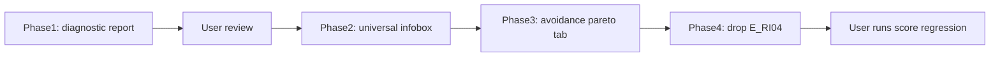

<!-- man_hours: 2.0 -->
# Status: Completed

Execution notes:
- Implemented the diagnostic report, universal criterion info popovers, avoidance diagnostics tab, and RI-04 exclusion removal.
- Kept RI-04 A12 as an avoidance/ranking signal and removed only E_RI04 from active configs and code catalogues.
- Added focused tests for preview metadata, avoidance diagnostics, and RI-04 non-exclusion behaviour.

---

---
name: Universal infobox + avoidance pareto + RI-04 fix
overview: 'Three deliverables: (1) a diagnostic-only investigation of why NH-02/NH-03/NH-04/NH-07/EP-01 fail so many sites, (2) a universal "?" infobox shown for every criterion (not just user-editable thresholds), and a sibling Avoidance Diagnostics Pareto tab, (3) removal of the E_RI04 exclusion row (A12 ranking penalty stays). No threshold edits in this pass — the diagnostic report drives those decisions in a follow-up.'
todos:
  - id: phase1-diagnostic-report
    content: "Write audit/post_processing/failure_diagnostics_20260514/REPORT.md covering NH-02, NH-03, NH-04, NH-07, EP-01: data field semantics, query against site_* tables, root-cause categorisation, recommended fix options. No rubric edits until user approves."
    status: completed
  - id: phase2a-preview-extend
    content: Extend FailConditionPreview with descriptor + pass_mark and CriterionPreview with weight_factors + weight_basis_source in src/atoms_vs_ashes/criterion_spec/preview.py. Populate for ALL fail conditions (not gated on user_editable).
    status: completed
  - id: phase2b-infobox-helper
    content: Refactor _help_caption in src/atoms_vs_ashes/gui/_threshold_editor_widgets.py into a unified criterion_infobox renderer using the EP-01 template (Code, Action, Pass mark, Fail value, Expression, Descriptor, Sources, Bounds, Rationale, User-tunable flag).
    status: completed
  - id: phase2c-popovers
    content: Add st.popover('?') in criterion_card (threshold editor) and in src/atoms_vs_ashes/gui/_results_render_drawer.py (site detail drawer) so every criterion exposes the infobox in both surfaces.
    status: completed
  - id: phase2d-tests
    content: Add tests/criterion_spec/test_preview_descriptor.py for NH-03 E2 and NH-07 E4 descriptor/pass_mark exposure, plus a render smoke test for the new infobox.
    status: completed
  - id: phase3a-avoidance-data
    content: Create src/atoms_vs_ashes/gui/_results_data_avoidance_diag.py mirroring _results_data_exclusion_diag.py but filtered on phase='avoidance' / verdict='caution'.
    status: completed
  - id: phase3b-avoidance-render
    content: "Create src/atoms_vs_ashes/gui/_results_render_avoidance_diag.py mirroring _results_render_exclusion_diag.py: Pareto, gap distribution, unlock curve, near-miss table."
    status: completed
  - id: phase3c-avoidance-tab
    content: Wire the new Avoidance Diagnostics tab into src/atoms_vs_ashes/gui/_results_page_main.py next to the existing Failure Diagnostics tab.
    status: completed
  - id: phase4-drop-ri04-exclusion
    content: Remove the E_RI04 fail_condition row from config/scoring_rubrics/ri_radiological.yaml and config/scoring_specs/ri_radiological.yaml. Keep A12 avoidance. Update notes block.
    status: completed
  - id: phase4-tests
    content: Add tests/scoring/test_ri04_no_exclusion.py and update any test that hard-codes the E-code count or expects E_RI04 verdicts.
    status: completed
  - id: phase4-audit
    content: Mirror the plan into architecture/plans/ and audit/plans/ per .cursor/rules/audit-trail.mdc.
    status: in_progress
isProject: false
---

# Universal Infobox + Avoidance Pareto + RI-04 Cleanup

## Context discovered

- The "?" infobox in `[src/atoms_vs_ashes/gui/_threshold_editor_widgets.py](src/atoms_vs_ashes/gui/_threshold_editor_widgets.py)` (`_help_caption` + `threshold_input`) only renders when the fail-condition has a `threshold` block via `[config/scoring_specs/threshold_metadata.yaml](config/scoring_specs/threshold_metadata.yaml)`. Codes without an entry (NH-03 E2 categorical, NH-07 pyroclastic clause, EP-01 trauma-centre clause, plus every avoidance code without a `threshold_metadata` entry) silently render "No user-editable fail-thresholds for this criterion."
- `Criterion` already carries `weight_factor`, `weight_factors` (baseline + EPRI), and `weight_basis_source` (cite strings) per `[src/atoms_vs_ashes/scoring/rubric.py](src/atoms_vs_ashes/scoring/rubric.py)`. `FailCondition` carries `action`, `code`, `condition_expr`, `descriptor`, `pass_mark`. Nothing new is required at the rubric layer.
- `[src/atoms_vs_ashes/criterion_spec/preview.py](src/atoms_vs_ashes/criterion_spec/preview.py)` flattens these into `CriterionPreview` / `FailConditionPreview` for the GUI but DROPS `weight_factors`, `weight_basis_source`, and the rubric `descriptor` for non-user-editable codes.
- `[src/atoms_vs_ashes/gui/_results_render_exclusion_diag.py](src/atoms_vs_ashes/gui/_results_render_exclusion_diag.py)` already renders Pareto + gap distribution + unlock curve + near-miss table from `ScreeningVerdict` rows with `phase = 'fail'`. Avoidance verdicts (`phase = 'avoidance'`, verdict `caution`) are written by `[src/atoms_vs_ashes/scoring/avoidance.py](src/atoms_vs_ashes/scoring/avoidance.py)` but no UI surfaces a Pareto for them.
- `RI-04` in `[config/scoring_rubrics/ri_radiological.yaml](config/scoring_rubrics/ri_radiological.yaml)` (lines 85–148) has both `A12` (avoidance_penalty) and `E_RI04` (exclude). Removing only the exclusion row keeps A12 active.

## Phase 1 — Diagnostic report (no code changes)

Deliverable: `audit/post_processing/failure_diagnostics_20260514/REPORT.md`. One section per criterion below; each section follows the same template (Field semantics → DB query → Why N sites trigger → Root-cause categories → Recommended fix options).

- **NH-02 Surface Rupture** — `nearest_fault_km < 8` exclusion vs. `[5, 10] => score 5–6` band creates a 3 km dead-zone where sites score "borderline acceptable" but are still excluded. Pull the EFEHR fault dataset call log + `site_natural_hazards.fault_name` for the 63 failing sites; tabulate by country and slip-rate availability. Confirm whether Türkiye/Balkans triggers are real capable faults or Quaternary mapped traces with no slip-rate evidence.
- **NH-03 Liquefaction** — `liquefaction_suscept == 'very_high' AND has_remedy is null` excludes 62 sites. Investigate whether the connector is over-classifying brownfield alluvial sites and whether `has_remedy` is ever populated (check `[src/atoms_vs_ashes/scoring/merge_context_derivations.py](src/atoms_vs_ashes/scoring/merge_context_derivations.py)` and the LLM ranking prompt).
- **NH-04 Slope** — Confirm what `site_natural_hazards.slope_angle_deg` actually contains. Trace through `[src/atoms_vs_ashes/connectors/copernicus_dem/batch.py](src/atoms_vs_ashes/connectors/copernicus_dem/batch.py)` to see whether it is footprint mean, 1 km buffer mean, or buffer maximum. Cross-reference Zeltweg (26.02°), Trbovlje (27.25°) physical reality — these are mountain-flank sites so the >25° trigger is plausible. Verify the other 156 failing sites are not false positives caused by buffer maximum.
- **NH-07 Volcanism** — `nearest_volcano_km < 50` excludes 121 sites. Pull the `volcano_name` column for failing sites; if many cite Pleistocene/extinct volcanoes in PL/CZ/HU/SK, the connector is including non-Holocene features. If they cite Vesuvius/Etna/Türkiye Quaternary chain (Hasan Dağı, Karaca Dağ, Nemrut, Süphan) that may be real and we should accept the count.
- **EP-01 Composite < 30** — 56 sites failing with margins clustered in the 24–29 band. Decompose `ep01_composite_score` per `[src/atoms_vs_ashes/analysis/emergency_plan.py](src/atoms_vs_ashes/analysis/emergency_plan.py)` to identify which sub-component (population, hospital distance, road density, evacuation feasibility) is dragging composites under 30. Likely the trauma-centre > 60 km clause OR an over-strict population sub-score.

The report ends with a recommended-fix table (per criterion: change | rationale | risk) ready for user approval. **No rubric edits in this pass.**

## Phase 2 — Universal "?" infobox

Surface the EP-01-style infobox on every criterion regardless of `user_editable`. No edits to `threshold_metadata.yaml` (we keep the user-tunable list as-is).

1. Extend `FailConditionPreview` in `[src/atoms_vs_ashes/criterion_spec/preview.py](src/atoms_vs_ashes/criterion_spec/preview.py)` with `descriptor: str` (from `FailCondition.descriptor`) and `pass_mark: float | None`. Populate from the rubric for ALL codes (not gated on `user_editable`).
2. Extend `CriterionPreview` with `weight_factors: dict[str, int] | None` and `weight_basis_source: dict[str, str] | None` so the GUI can show "EPRI weight: 5" and "Basis: NS-R-3 §3.7; SSG-35 Table II-1".
3. Refactor `_help_caption` in `[src/atoms_vs_ashes/gui/_threshold_editor_widgets.py](src/atoms_vs_ashes/gui/_threshold_editor_widgets.py)` into a new `criterion_infobox(crit, fc)` helper that always emits the EP-01 template:

```text
Code: E1 | Action: exclude | Pass mark: 5.0
Fail value: 8 km   (the threshold the metric is compared against)
Expression: nearest_fault_km < 8 or (fault_slip_rate_mm_yr >= 2 and nearest_fault_km < 8)
Descriptor: Capable fault within 8 km.
Sources: IAEA SSG-9 §6.21, IAEA SSG-35 §3.18-3.22, NUREG-0800 §2.5.3
Bounds: [1.0, 25.0]                                  (only if user-editable)
Rationale: ...                                       (only if user-editable)
User-tunable: yes/no
```

4. Render the infobox in two places:
   - `[src/atoms_vs_ashes/gui/_threshold_editor_widgets.py](src/atoms_vs_ashes/gui/_threshold_editor_widgets.py)` `criterion_card`: add a `st.popover("?")` next to the criterion title (always present); inside, list every fail/avoidance code's infobox + the criterion-level weight block (`baseline / epri / weight_basis_source`).
   - `[src/atoms_vs_ashes/gui/_results_render_drawer.py](src/atoms_vs_ashes/gui/_results_render_drawer.py)` (site detail drawer): same popover next to each criterion row in the verdicts list, so reviewers can read the rule that triggered without leaving the results page.
5. Cite the rubric path in the popover footer (`config/scoring_rubrics/<bucket>.yaml`) so reviewers can audit the source.
6. Tests:
   - Add `tests/criterion_spec/test_preview_descriptor.py` to assert NH-03 E2 and NH-07 E4 now expose `descriptor` and `pass_mark` even though `user_editable` is `False`.
   - Snapshot test for the rendered infobox text on EP-01 (must remain backward-compatible) + NH-03 (currently empty) + RI-04 A12 (avoidance code).

## Phase 3 — Avoidance Diagnostics tab (Pareto + gap + unlock + near-miss)

Mirror the exclusion-diagnostics module suite for avoidance verdicts.

1. New module `src/atoms_vs_ashes/gui/_results_data_avoidance_diag.py`: clone of `[src/atoms_vs_ashes/gui/_results_data_exclusion_diag.py](src/atoms_vs_ashes/gui/_results_data_exclusion_diag.py)` but filtering `ScreeningVerdict.phase == 'avoidance'` and `verdict == 'caution'`. Pareto counts: distinct sites flagged per criterion. "Numeric margin" semantics for avoidance: how far inside the avoidance threshold the metric sits (negative meaning, but sortable by absolute relaxation). Reuse the `unlock_steps` plumbing for "if I relax A12 by 5/10/25%, how many sites stop being penalised".
2. New module `src/atoms_vs_ashes/gui/_results_render_avoidance_diag.py`: clone of the exclusion render module; identical four sections (summary strip, Pareto, gap distribution, near-miss table). Tooltip text replaces "exclusionary failures" with "avoidance flags".
3. Wire into the results page in `[src/atoms_vs_ashes/gui/_results_page_main.py](src/atoms_vs_ashes/gui/_results_page_main.py)` as a new tab "Avoidance Diagnostics" adjacent to the existing "Failure Diagnostics" tab. Same `RunScope` / `country_code` / `weight_profile` / `near_miss_gap_pct` controls.
4. Tests: copy the exclusion diag tests into avoidance variants (data shape only — render is Streamlit and untestable beyond import smoke).

## Phase 4 — Remove only the E_RI04 exclusion row (A12 stays)

User decision: keep avoidance penalty A12, drop exclusion E_RI04 so sites are no longer hard-failed for EPZ-ring population density. The criterion stays in the rubric, the avoidance Pareto, and the ranking score.

1. `[config/scoring_rubrics/ri_radiological.yaml](config/scoring_rubrics/ri_radiological.yaml)` lines 129–148: delete the `E_RI04` `fail_condition` row only. Keep `A12`. Update the `notes:` block to drop the exclusion-mode language and the FB-LL-05 dual-mode framing.
2. Mirror in `[config/scoring_specs/ri_radiological.yaml](config/scoring_specs/ri_radiological.yaml)`. No `threshold_metadata.yaml` change (no entry exists for E_RI04).
3. Verify no live references to `E_RI04` remain — `[src/atoms_vs_ashes/scoring/_codes.py](src/atoms_vs_ashes/scoring/_codes.py)`, LLM prompts, exclusion-code tooltip catalogues, scoring tests. Any audit/report references are historical and stay (we do not rewrite history).
4. Tests:
   - `tests/scoring/test_ri04_no_exclusion.py`: a synthetic site with `pop_density_5km = 2000` MUST NOT produce a `fail` verdict on RI-04 after this change (only a `caution` from A12).
   - Update any rubric-loader test that asserts the count of E-codes (search `tests/` for hard-coded counts).
5. Document the change in `architecture/plans/` + `audit/plans/` per `[.cursor/rules/audit-trail.mdc](.cursor/rules/audit-trail.mdc)`.

## Out of scope for this pass

- Threshold edits to NH-02 / NH-03 / NH-04 / NH-07 / EP-01 — gated on user approval of the Phase 1 report.
- Changes to `threshold_metadata.yaml` (the user-tunable surface stays as-is; the new infobox does not gate user-editable status).
- Reruns of the scoring engine. The user runs scoring after the rubric edit lands.

## Sequencing



Phase 1 lands first as a standalone markdown deliverable. Phases 2 and 3 are independent and can land in either order once the user is satisfied with Phase 1. Phase 4 is a small targeted edit and lands last so the score regression on the new rubric can be observed against a stable infobox/Pareto baseline.
