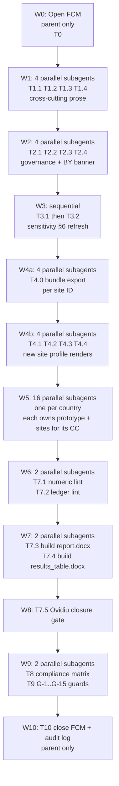

# v1.03 Full Report Consistency Sweep

## 0. Resolved decisions

- **Belarus is NOT in the published roster** (user decision 2026-05-24). All downstream counts and surfaces use 16 published countries. This locks:
  - Total full-pass = **33** (Zelwa excluded from the published universe).
  - Total avoidance-flag = **269** (Lelchitsy excluded).
  - Total hard-fail = **50**.
  - Published total = **352** records, matching the existing exec-brief figure and Ovidiu closure note #50 ("33 regional full-pass sites across 16 published-country ledgers").
  - §5.2 master table = 16 rows (no BY row).
  - Chapter 4 Tables 4.1.1 / 4.2.1 / 4.3.1 = no BY entries.
  - [recommended_top5_sites.md](report/version%201.03/output/report/chapters/05_country_and_site_profiles/recommended_top5_sites.md) = no BY block.
  - Chapter 6 §6.4 = no Zelwa entry in any priority group.
  - Executive brief "Austria through Ukraine, excluding Belarus" sentence retained verbatim.
- **Implication for the existing [BY_country_prototype.md](report/version%201.03/output/report/chapters/05_country_and_site_profiles/BY_country_prototype.md)**: the file exists in the repository but must not be linked from the published Chapter 5 index. Verify no chapter-level link points at it, and add an in-file banner stating "Belarus country profile is held outside the published v1.03 roster" so a future reader cannot mistake it for a published deliverable. The BY ledger CSV, country bundle JSON and site bundle JSON stay on disk as audit artefacts.
- **Guard G-15 (BY framing consistency)** therefore reduces to: confirm zero published-surface references to Zelwa or Belarus full-pass; confirm the BY prototype carries the unpublished banner; confirm Chapter 4 / §5.2 / brief all use 16 countries / 33 FP / 269 AV / 50 HF.

## 1. Data deltas already established

- Aggregates (published 16-country roster, BY excluded): v1.02 28/261/63 → v1.03 **33/269/50** (total 352). All 14 hard-fail removals and 5 net full-pass promotions sit inside the published roster.
- Status flips per country verified from `*_site_ledger.csv` (Section 2 below has the country matrix).
- 4 new sites need Chapter 5 profile pages because they are now published-country leaders or published-country full-pass entrants: **Gacko (BA), Maritsa Iztok-2 (BG), Starobesheve (UA), Çerkezköy (TR)**. Berane (ME) and Novaky (SK) already have pages. Zelwa (BY) is excluded per §0 and therefore needs no profile page.

## 1.5 Files in scope (explicit enumeration)

Every file below is **audited** (read against v1.03 ledgers, country bundles or canonical fact list); files marked **edit** receive surgical changes; files marked **verify-only** are read and a no-edit record is kept in the FCM if the audit confirms they are already consistent.

### Cross-cutting chapter prose (edit, file by file)

- [chapters/03_stage_2_site_selection.md](report/version%201.03/output/report/chapters/03_stage_2_site_selection.md) — line 224 avoidance-led leader list (T1.4)
- [chapters/05_country_and_site_profiles.md](report/version%201.03/output/report/chapters/05_country_and_site_profiles.md) — §5.2 master table cells for BA / BG / PL (T1.1)
- [chapters/06_recommendations_for_detailed_site_evaluation.md](report/version%201.03/output/report/chapters/06_recommendations_for_detailed_site_evaluation.md) — §6.4 priority-group rows lines 110-113 (T1.3)
- [executive_technical_brief.md](report/version%201.03/output/report/executive_technical_brief.md) — §5 Operational Metrics table (T2.1)

### Cross-cutting chapter prose (verify-only)

- [chapters/00_acronyms.md](report/version%201.03/output/report/chapters/00_acronyms.md) — confirm no count or site-name drift
- [chapters/01_introduction.md](report/version%201.03/output/report/chapters/01_introduction.md) — confirm no leader-site mention
- [chapters/02_stage_1_site_survey.md](report/version%201.03/output/report/chapters/02_stage_1_site_survey.md) — confirm Stage 1 framing unchanged (Ovidiu #32 acknowledgement)
- [chapters/04_results_and_findings.md](report/version%201.03/output/report/chapters/04_results_and_findings.md) — already regenerated; numeric-lint will validate
- [chapters/07_final_remarks.md](report/version%201.03/output/report/chapters/07_final_remarks.md) — confirm no count drift
- [chapters/08_references.md](report/version%201.03/output/report/chapters/08_references.md) — references list, no data changes expected
- [chapters/index.md](report/version%201.03/output/report/chapters/index.md) — confirm no stale leader mention

### Chapter 5 country prototypes (17 files, one per country)

Each is **audited + edited** by the corresponding T5.{CC} todo. Specifically:

- AT, BA, CZ, HR, LV, MD, ME, MK, RS (9 prototypes) — fix the "retains a full-pass status" boilerplate where the national #1 is avoidance, plus any leader-name / pool-count drift.
- BG, BY, HU, PL, RO, SK, TR, UA (8 prototypes) — boilerplate already class-correct (full-pass leader present); verify pool counts and interpretation paragraphs.
- [BY_country_prototype.md](report/version%201.03/output/report/chapters/05_country_and_site_profiles/BY_country_prototype.md) additionally receives the "unpublished — held for audit only" banner (T2.2).

### Chapter 5 supporting files (in `05_country_and_site_profiles/`)

- `recommended_top5_sites.md` — edit (T1.2)
- `consolidated_failure_section.md` — verify-only (T2.3)
- `02_ukraine_occupied_territory_caveat_plan.md` — verify-only (T2.4)
- Chapter 5 `data/*` (ledger CSVs, country bundles, site bundles) — **read-only**, source of truth, not edited

### Chapter 5 site profile files (66 existing + 4 new = 70 in scope)

Per-country distribution (existing files actually present today: **66** — AT 5 / BA 5 / BG 5 / CZ 5 / HR 2 / HU 5 / LV 1 / MD 1 / ME 4 / MK 3 / PL 5 / RO 5 / RS 5 / SK 5 / TR 5 / UA 5). Every single file is audited individually by the per-country `T5.{CC}.sites` todo, which lists each filename and the expected edit. The audit reads each profile's snapshot table — National rank, composite score, MC band, national stability band, top-10% hit rate, screening class — against the same row in the country ledger CSV and surgically edits any divergence.

- **Sites needing field-level edits** (snapshot tables, rank, band, hit-rate, screening class): every existing site profile in BA, BG, CZ, HU, ME, MK, PL, RS, SK, TR, UA — handled inside the corresponding `T5.{CC}.sites` todo (filenames enumerated in the todo body). The PL_polaniec page already shows the correct v1.03 numbers; the rest must be confirmed file by file.
- **Sites needing verify-only** (audit performed, no edit expected): every existing site profile in AT (5), HR (2), LV (1), MD (1), RO (5) — handled inside `T5.{CC}.sites`. Empirical expectation is zero edits, but each file is opened and the snapshot table is read against the ledger row before closing the todo.
- **New site profile pages** (4): T4.1 Gacko (BA), T4.2 Maritsa Iztok-2 (BG), T4.3 Starobesheve (UA), T4.4 Çerkezköy (TR). Each must render the SSG-9 5 km NH-02 verdict (#104/#105) and must not list `nearest_light_airport_km` in HI-01 (#183).

### Methodology files (in `report/version 1.03/methodology/`)

- [sensitivity_analysis.md](report/version%201.03/methodology/sensitivity_analysis.md) — Phase 3 refresh (T3.1 / T3.2). Sensitivity follows the same rule as scoring: the v1.03 numbers are taken from the **20260523** frozen pack (`report/output/sensitivity/20260523/`). §6.6 Band A shortlist, regional summary and per-country figures all rewire to that stamp. Any retained v1.02 reference in §6 must be labelled explicitly.
- [methodology.md](report/version%201.03/methodology/methodology.md), [business_logic.md](report/version%201.03/methodology/business_logic.md), [exclusionary_floors.md](report/version%201.03/methodology/exclusionary_floors.md), [ssr1_traceability.md](report/version%201.03/methodology/ssr1_traceability.md), [assumption_register.md](report/version%201.03/methodology/assumption_register.md), [criterion_correlation.md](report/version%201.03/methodology/criterion_correlation.md), [failure_analysis.md](report/version%201.03/methodology/failure_analysis.md), [swing_weight_audit.md](report/version%201.03/methodology/swing_weight_audit.md) — verify-only; numeric-lint (T7.1) plus canonical-fact V1_3_NH02_E1_THRESHOLD (#104/#105) will catch any 8 km / 5 km drift here.
- 8 per-SMR `failure_analysis_*.md` files — verify-only; the "Pivot view: Pivot view" typo flagged in the prior chat is captured by Guard G-12.

### Historical sensitivity carry-overs (NOT touched)

The following directories are pre-v1.03 carry-overs and are NOT in scope: [output/report/sensitivity/20260423/](report/version%201.03/output/report/sensitivity/20260423/), [output/report/sensitivity/20260425/](report/version%201.03/output/report/sensitivity/20260425/), [output/report/sensitivity/20260425b/](report/version%201.03/output/report/sensitivity/20260425b/). The v1.03 frozen sensitivity pack lives outside this version dir at [report/output/sensitivity/20260523/](report/output/sensitivity/20260523/) and is the source of truth for §6 figure refresh in T3.2. The historical stamps stay on disk for diff visibility only and are unreferenced from published chapters; G-15 confirms.

### Out of scope

- [sites_evaluation/\*](report/version%201.03/sites_evaluation/) and [requirements/\*](report/version%201.03/requirements/) — these are working-paper / requirements documents, not published deliverables. Audit only if the numeric-lint or ledger-lint flags a finding that traces back here.
- Any file under `report/version 1.02/` — frozen baseline, untouched.
- Specialist interpretation `status=pending` blocks — separate workstream (Guard G-13 enforces no change).

## 2. Per-country audit matrix

| CC  | Status (v1.03 vs v1.02)                                                                                                                                                      | Surfaces requiring edit                                                                                                                                                                                                                                                                                                                                                                                                                                                                                                                                    |
| --- | ---------------------------------------------------------------------------------------------------------------------------------------------------------------------------- | ---------------------------------------------------------------------------------------------------------------------------------------------------------------------------------------------------------------------------------------------------------------------------------------------------------------------------------------------------------------------------------------------------------------------------------------------------------------------------------------------------------------------------------------------------------- |
| AT  | identical                                                                                                                                                                    | None                                                                                                                                                                                                                                                                                                                                                                                                                                                                                                                                                       |
| BA  | Gacko HF→AV #1 (Stanari drops to #2 band H)                                                                                                                                  | §5.2 cell, [BA_country_prototype.md](report/version%201.03/output/report/chapters/05_country_and_site_profiles/BA_country_prototype.md) interpretation paragraph (line 68: "retains a full-pass status" is wrong — Gacko is avoidance), [recommended_top5_sites.md](report/version%201.03/output/report/chapters/05_country_and_site_profiles/recommended_top5_sites.md) BA block, Ch 3 line 224 ("Stanari" → "Gacko"), Ch 6 §6.4 avoidance-led leader list, new site page `sites/BA_gacko_thermal_power_plant.md`                                         |
| BG  | Maritsa Iztok-2 HF→FP #1 (Lom drops to #2 band D)                                                                                                                            | §5.2 cell, [recommended_top5_sites.md](report/version%201.03/output/report/chapters/05_country_and_site_profiles/recommended_top5_sites.md) BG block (pool now 1/7/7), Ch 3 line 224 (drop "Lom"; BG no longer avoidance-led), Ch 6 §6.4 (add Maritsa Iztok-2 to full-pass national leaders, drop Lom from avoidance-led), new site page `sites/BG_maritsa_iztok_2_power_station.md`                                                                                                                                                                       |
| BY  | Zelwa HF→FP #1; pool 1/1/0                                                                                                                                                   | **Not published** (§0). Add an "unpublished — held for audit only" banner to the top of [BY_country_prototype.md](report/version%201.03/output/report/chapters/05_country_and_site_profiles/BY_country_prototype.md); confirm no link from Chapter 5 index or any other published surface points at it. No new site profile page. No entry in §5.2, Ch 4, Ch 6 §6.4, exec brief or `recommended_top5_sites.md`.                                                                                                                                            |
| CZ  | trivial reorder #27/#28                                                                                                                                                      | None visible in prose                                                                                                                                                                                                                                                                                                                                                                                                                                                                                                                                      |
| HR  | identical                                                                                                                                                                    | None                                                                                                                                                                                                                                                                                                                                                                                                                                                                                                                                                       |
| HU  | Torony #5→#3, mid-rank reorder, Mecsek Hills score 5.22→5.405                                                                                                                | Confirm [HU_country_prototype.md](report/version%201.03/output/report/chapters/05_country_and_site_profiles/HU_country_prototype.md) ledger table reflects new rank order; check HU site profiles for stale rank lines                                                                                                                                                                                                                                                                                                                                     |
| LV  | identical                                                                                                                                                                    | None                                                                                                                                                                                                                                                                                                                                                                                                                                                                                                                                                       |
| MD  | identical                                                                                                                                                                    | None                                                                                                                                                                                                                                                                                                                                                                                                                                                                                                                                                       |
| ME  | Berane HF→AV; pool 0/2/2; Bar band A→F, Berane new at band C 0.5833                                                                                                          | §5.2 cell stays "Bar power station" but now an effective Bar / Berane tie; [recommended_top5_sites.md](report/version%201.03/output/report/chapters/05_country_and_site_profiles/recommended_top5_sites.md) ME block (pool, Bar band A→F, add Berane row); [ME_country_prototype.md](report/version%201.03/output/report/chapters/05_country_and_site_profiles/ME_country_prototype.md) interpretation; Berane already has a site page — verify rank/band consistent                                                                                       |
| MK  | Oslomej score 5.905→6.181                                                                                                                                                    | Verify [MK_country_prototype.md](report/version%201.03/output/report/chapters/05_country_and_site_profiles/MK_country_prototype.md) and `MK_oslomej_power_station.md` snapshot                                                                                                                                                                                                                                                                                                                                                                             |
| PL  | Polaniec AV→FP #1, score 7.422→7.684; pool 3/58/2 → 4/57/2; multiple mid-rank reorders 19-37 and 52-57                                                                       | §5.2 cell screening class AV→FP; [PL_country_prototype.md](report/version%201.03/output/report/chapters/05_country_and_site_profiles/PL_country_prototype.md) interpretation; [recommended_top5_sites.md](report/version%201.03/output/report/chapters/05_country_and_site_profiles/recommended_top5_sites.md) PL block; Ch 3 line 224 (drop Polaniec from avoidance-led); Ch 6 §6.4 (move Polaniec from avoidance-led to full-pass leaders); verify PL site profiles in the reordered ranks 19-37 and 52-57 update their "national rank N" snapshot lines |
| RO  | identical ledger                                                                                                                                                             | Verify no site profile asserts a regional or other-country fact that drifted                                                                                                                                                                                                                                                                                                                                                                                                                                                                               |
| RS  | Morava HF→AV #2; pool 0/7/1; Štavalj top-10 hit 0.9167→0.8333                                                                                                                | [RS_country_prototype.md](report/version%201.03/output/report/chapters/05_country_and_site_profiles/RS_country_prototype.md) interpretation; [recommended_top5_sites.md](report/version%201.03/output/report/chapters/05_country_and_site_profiles/recommended_top5_sites.md) RS block (pool, Štavalj top-10 92%→83%); verify [RS_stavalj_power_station.md](report/version%201.03/output/report/chapters/05_country_and_site_profiles/sites/RS_stavalj_power_station.md) snapshot top-10 percentage                                                        |
| SK  | Novaky AV→FP #2; pool 1/4/1 → 2/3/1                                                                                                                                          | [SK_country_prototype.md](report/version%201.03/output/report/chapters/05_country_and_site_profiles/SK_country_prototype.md), [recommended_top5_sites.md](report/version%201.03/output/report/chapters/05_country_and_site_profiles/recommended_top5_sites.md) SK block (Novaky AV→FP), Ch 6 §6.4 (add Novaky to full-pass set), verify [SK_novaky_power_station.md](report/version%201.03/output/report/chapters/05_country_and_site_profiles/sites/SK_novaky_power_station.md) snapshot full-pass                                                        |
| TR  | Çerkezköy AV→FP; 9 new sites HF→AV (Yıldırım Elazığ, Bursa, Bingöl, Çan-2, Eti Maden Bandirma, DOSAB, Gebze Çolakoğlu, Bandırma Karat, Ant Enerji); pool 8/102/36 → 9/110/27 | [TR_country_prototype.md](report/version%201.03/output/report/chapters/05_country_and_site_profiles/TR_country_prototype.md); [recommended_top5_sites.md](report/version%201.03/output/report/chapters/05_country_and_site_profiles/recommended_top5_sites.md) TR block (pool); Ch 6 §6.4 (add Çerkezköy to full-pass set as new entrant); new site page `sites/TR_cerkezkoy_power_station.md`; ranks shift by ±1-3 for many existing TR site profiles in the 28-118 range — sweep snapshot lines                                                          |
| UA  | Starobesheve AV→FP; pool 12/8/0 → 13/7/0                                                                                                                                     | [UA_country_prototype.md](report/version%201.03/output/report/chapters/05_country_and_site_profiles/UA_country_prototype.md); [recommended_top5_sites.md](report/version%201.03/output/report/chapters/05_country_and_site_profiles/recommended_top5_sites.md) UA block (pool); Ch 6 §6.4 (consider Starobesheve in full-pass leaders + Ukraine caveat set); new site page `sites/UA_starobesheve_power_station.md`; verify UA site profile snapshots for ranks 6-10                                                                                       |

## 3. Cross-cutting narrative surfaces (priority order)

### P1 — wrong-leader or wrong-class statements (high reader-visibility)

1. **[05_country_and_site_profiles.md](report/version%201.03/output/report/chapters/05_country_and_site_profiles.md) §5.2 table** — cells: BA leader → "Gacko Thermal Power Plant"; BG leader → "Maritsa Iztok-2 power station" (Full pass); PL class → "Full pass". §5.2 stays at 16 rows (no BY).

2. **[recommended_top5_sites.md](report/version%201.03/output/report/chapters/05_country_and_site_profiles/recommended_top5_sites.md)** — regenerate via the existing script (per closure evidence for #70, `build_country_profile_prototype.py` already projects from the ledger CSV; confirm `recommended_top5_sites.md` is in scope). Verify each pool count, leader, class, top-10 hit rate, band against the v1.03 ledger. No BY block.

3. **[06_recommendations_for_detailed_site_evaluation.md](report/version%201.03/output/report/chapters/06_recommendations_for_detailed_site_evaluation.md) §6.4** — rewrite the three priority-group rows on lines 110-113:
   - "Full-pass national leaders": add Maritsa Iztok-2 (BG), Polaniec (PL); confirm Vojany I + Mohacs + Konya Karapınar + Turceni + Zmiivska remain. **Zelwa (BY) excluded per §0.**
   - "Full-pass fast followers": add Novaky (SK), Starobesheve (UA), Çerkezköy (TR); confirm existing list.
   - "Avoidance-led national leaders": replace Stanari → Gacko (BA); remove Lom (BG no longer avoidance-led); remove Polaniec (now full-pass); keep Riedersbach, Tusimice, Plomin, Kurzeme, Kuchurgan, Bar / Berane, Bitola, Štavalj, Tufanbeyli, Karapinar Konya Şeker.
   - "Ukraine caveat set": add Starobesheve.

4. **[03_stage_2_site_selection.md](report/version%201.03/output/report/chapters/03_stage_2_site_selection.md) line 224** — replace the avoidance-led leader list (drop Stanari → Gacko, drop Lom, drop Polaniec; verify Bar / Berane wording).

### P2 — governance / aggregate surfaces

5. **[executive_technical_brief.md](report/version%201.03/output/report/executive_technical_brief.md) §5** — Operational Metrics (16-country published roster, BY excluded):
   - Full-pass: **33** (was reported 36 in current brief — stale).
   - Avoidance: **269** (was reported 249 — stale).
   - Hard-fail: **50** (was reported 75 — stale).
   - Scored/ranked: **302** (352 − 50; was reported 285 — stale).
   - Published country profiles: **16**, retain "Austria through Ukraine, excluding Belarus" sentence verbatim.
   - Published site records in country ledgers: **352** (already correct in brief; verify against `sum_published_ledger_rows = 354 − 2 (BY)`).

6. **[consolidated_failure_section.md](report/version%201.03/output/report/chapters/05_country_and_site_profiles/consolidated_failure_section.md)** — already lists AL/SI/XK only (verified clean). No BY mention to remove. Confirm no other country has slipped into or out of this set.

### P3 — sensitivity §6 refresh from the v1.03 20260523 frozen pack

7. **[methodology/sensitivity_analysis.md](report/version%201.03/methodology/sensitivity_analysis.md) §6** — sensitivity follows the same rule as scoring: numbers come from the **20260523** run. §6 currently inherits v1.02 figures with an inheritance note (lines 134-136). Refresh:
   - §6.6 Band A shortlist text rewired to `report/output/sensitivity/20260523/20260523_site_bands.csv` (T3.1).
   - §6 regional summary numbers and per-country tables/figures rewired to `report/output/sensitivity/20260523/national/` and `report/output/sensitivity/20260523/figures/` (T3.2).
   - Any retained v1.02 reference is labelled explicitly so the reader can tell which figure came from which run stamp.

### P4 — Chapter 5 site profile gap (extends #60 logic)

8. **Build the 4 missing site bundles** (T4.0) via the existing exporter, identical to the path used for the other 65 sites:

   ```bash
   PYTHONPATH=src python -m scripts.export_site_bundle --site-id <UUID-Gacko>
   PYTHONPATH=src python -m scripts.export_site_bundle --site-id <UUID-Maritsa-Iztok-2>
   PYTHONPATH=src python -m scripts.export_site_bundle --site-id <UUID-Starobesheve>
   PYTHONPATH=src python -m scripts.export_site_bundle --site-id <UUID-Cerkezkoy>
   ```

   Bundles land under `report/version 1.03/output/report/chapters/05_country_and_site_profiles/data/sites/`.

9. **Render the 4 new site profile markdown pages** (T4.1 - T4.4) via the existing `_country_profile_outputs.py` / `_site_profile_markdown.py` pipeline on the freshly exported bundles:
   - `sites/BA_gacko_thermal_power_plant.md` (new avoidance leader)
   - `sites/BG_maritsa_iztok_2_power_station.md` (new full-pass leader)
   - `sites/UA_starobesheve_power_station.md` (new full-pass; Ukraine caveat header)
   - `sites/TR_cerkezkoy_power_station.md` (new full-pass)
   - Zelwa (BY) is excluded per §0; no `sites/BY_zelwa_power_station.md` is generated.

### P5 — Site profile snapshot sweep (every existing profile)

9. **Run a programmatic snapshot lint** across all 66 existing site profiles in [chapters/05_country_and_site_profiles/sites/](report/version%201.03/output/report/chapters/05_country_and_site_profiles/sites/):
   - Read `National rank` line from each profile; compare to v1.03 ledger row's `national_rank`.
   - Read `Composite score`, `MC band`, `National stability band`, `top-10% hit rate` from the snapshot table; compare to ledger.
   - Read screening class label ("Full pass" / "Avoidance flag" / "Hard fail") if present; compare to ledger flags.
   - Output a per-file diff; surgical-edit the divergent fields only. Do not re-run specialist passes.

### P6 — Country prototype boilerplate fix (extends #60 / #50 logic)

10. **"retains a full-pass status" boilerplate** appears in all 17 country prototype interpretation paragraphs but is factually wrong for the 9 countries whose national #1 is an avoidance-flag site (AT, BA, CZ, HR, LV, MD, ME, MK, RS). Replace with class-appropriate phrasing:
    - For avoidance leader: "carries an avoidance flag against criterion <X>" or "remains in the avoidance-led country pool".
    - For full-pass leader: keep "retains a full-pass status".
      Sample evidence: [BA_country_prototype.md line 68](report/version%201.03/output/report/chapters/05_country_and_site_profiles/BA_country_prototype.md) currently asserts Gacko "retains a full-pass status".

### P7 — DOCX rebuild and Ovidiu numeric-lint re-run

11. Rebuild `atoms_vs_ashes_report.docx` and `atoms_vs_ashes_results_table.docx` with explicit `--format "report/version 1.03/output/report/writing plan/report_format.json"` (the default in `report_format_config.py` still points at v1.02).
12. Re-run [cross_chapter_numeric_lint.py](src/scripts/cross_chapter_numeric_lint.py) and [lint_ledger_consistency.py](src/scripts/lint_ledger_consistency.py); both must exit 0.
13. Re-run the Ovidiu closure gate (10/10) per [feedback_implementation_master_plan.md](report/version%201.03/output/report/feedback/feedback_implementation_master_plan.md).

## 4. Ovidiu / Bogdan compliance matrix (design-time + post-write)

For each of the 14 review items, the design check ensures the rewrite plan respects the prior closure, and the post-write check verifies after the edits.

| #            | Comment summary                                      | Design check (before editing)                                                                                                                              | Post-write check                                                                                                                                                             |
| ------------ | ---------------------------------------------------- | ---------------------------------------------------------------------------------------------------------------------------------------------------------- | ---------------------------------------------------------------------------------------------------------------------------------------------------------------------------- |
| 32           | Stage 1 handoff "O.K."                               | n/a — acknowledgement only                                                                                                                                 | n/a                                                                                                                                                                          |
| 38           | Stage 3 = detailed evaluation + confirmation framing | Do not remove the Stage 1 / Stage 2 / Stage 3 framing from §3.3, §3.10, Ch 6 opening; the Ch 3 line-224 and Ch 6 §6.4 edits are surgical only              | `rg "detailed site evaluation and confirmation"` returns ≥3 hits across Ch 3 + Ch 6; §3.10 "ranking plus socioeconomic-and-implementation considerations" intact             |
| 43           | Weight sum invariant                                 | No prose edits restate per-criterion weight percentages; cite [methodology/swing_weight_audit.md](report/version%201.03/methodology/swing_weight_audit.md) | `tests/scoring/test_weight_sum_invariant.py` passes; both lints exit 0                                                                                                       |
| 50           | Text–table count reconcile                           | Every full-pass / avoidance / hard-fail count quoted in narrative must agree with v1.03 ledger CSVs and Chapter 4 Tables 4.1.1 / 4.2.1 / 4.3.1 / 4.3.2     | [lint_ledger_consistency.py](src/scripts/lint_ledger_consistency.py) exit 0                                                                                                  |
| 54 / 57 / 70 | Redundancy / canonical-home                          | Each table has one canonical home: §4 = regional, §5 = country, `recommended_top5_sites.md` = per-country top-N. No new sibling table introduced.          | Regenerate [redundancy_inventory.md](report/version%201.03/output/report/feedback/redundancy_inventory.md) signature scan; one occurrence per signature                      |
| 55           | Lost text (deferred)                                 | No LLM regeneration of Chapter 4 intro; surgical edits only                                                                                                | Chapter 4 intro paragraph unchanged unless explicitly required by a delta                                                                                                    |
| 60           | Iernut in Table 4.3.1                                | Every full-pass site in the published 16-country roster (33 in v1.03) appears in Table 4.3.1 AND has a Chapter 5 site profile page                         | Row count of Table 4.3.1 = 33; for each row, `sites/<CC>_<slug>.md` exists                                                                                                   |
| 61           | Romania in Table 4.3.2                               | Every Chapter-5-profiled avoidance site appears in Table 4.3.2 with the controlling avoidance driver                                                       | Regenerate via `build_chapter_4_tables.py` and confirm rows                                                                                                                  |
| 63           | `cohort` → `set`                                     | New prose written for the consistency sweep contains no `cohort` in reader-facing surfaces                                                                 | `rg -i '\bcohort\b' "report/version 1.03/output/report/chapters" --type md` = 0                                                                                              |
| 104 / 105    | SSG-9 capable fault @ 5 km                           | Newly generated site profiles emit `E1 verdict (radius 5 km): inside\|outside` from `provenance.nh02_e1_threshold_km = 5.0`; no narrative text says "8 km" | [cross_chapter_numeric_lint.py](src/scripts/cross_chapter_numeric_lint.py) `V1_3_NH02_E1_THRESHOLD` canonical fact = 0 findings; spot-check on every newly generated profile |
| 183          | HI-01 small airfields                                | New site profiles do not list `nearest_light_airport_km` in HI-01 evidence; only large/medium commercial and military airports drive HI-01                 | Spot-check HI-01 evidence lines on each new profile; `rg "nearest_light_airport_km" "report/version 1.03/output/report/chapters/05_country_and_site_profiles/sites"` = 0     |

## 5. Similar-issue guard catalogue (issues analogous to the 14 that could surface in this rewrite)

These guard against repeating-pattern defects that would draw the same kind of review comment a second time.

| Guard                                                                                                                                                                           | Analogy / origin                                  | Check                                                                                                                                                                                                           |
| ------------------------------------------------------------------------------------------------------------------------------------------------------------------------------- | ------------------------------------------------- | --------------------------------------------------------------------------------------------------------------------------------------------------------------------------------------------------------------- |
| G-1: Total full-pass / avoidance / hard-fail counts in prose match v1.03 published-roster ledgers (33 / 269 / 50, total 352, BY excluded)                                       | #50 generalised to all surfaces                   | `rg "full[- ]pass" report/version 1.03/output/report --type md` then manual or scripted comparison                                                                                                              |
| G-2: Per-country pool descriptions ("Bulgaria has 0 full pass and 7 avoidance") match country ledger                                                                            | #50 generalised                                   | Country-by-country word search of "<n> full pass" / "<n> avoidance" / "<n> hard fail"                                                                                                                           |
| G-3: Country leader names in prose match `national_rank = 1` row                                                                                                                | new (from this sweep)                             | Build a leader map from ledgers, grep prose, diff                                                                                                                                                               |
| G-4: Country leader stability band and top-10% hit rate in prose match ledger                                                                                                   | new (Štavalj 92→83, Bar A→F, Oslomej 5.905→6.181) | Programmatic comparison of "band <X>" and "<Y>% hit rate" strings to ledger rows                                                                                                                                |
| G-5: Every Chapter 5 site profile snapshot table agrees with `<CC>_site_ledger.csv` row for that site                                                                           | #60 generalised                                   | Section P5 lint above                                                                                                                                                                                           |
| G-6: Every full-pass site has a Chapter 5 profile page                                                                                                                          | #60 generalised                                   | Set difference `(full_pass_in_ledger) − (sites/*.md basenames)` = empty                                                                                                                                         |
| G-7: Every avoidance #1 country leader has a Chapter 5 profile page                                                                                                             | new — extends #60 to leaders                      | Same set-difference logic for `national_rank = 1 AND passed_avoidance = False`                                                                                                                                  |
| G-8: No new prose introduces `cohort`, `tranche`, "league table", or other casual register words                                                                                | #63 generalised                                   | `rg -i '\b(cohort\|tranche\|league table)\b' "report/version 1.03/output/report/chapters" --type md` = 0                                                                                                        |
| G-9: Every NH-02 narrative mention says "5 km" radius; no "8 km" remnants in v1.03 chapters                                                                                     | #104 / #105                                       | Canonical-fact lint already covers; double-check newly generated pages                                                                                                                                          |
| G-10: HI-01 narrative consistently says "only large/medium commercial and military airports drive HI-01"; no penalty discussion of small airfields or helipads                  | #183 generalised                                  | Grep + spot-check site profiles                                                                                                                                                                                 |
| G-11: Stage 1 / Stage 2 / Stage 3 definitions stable across Ch 1, 2, 3, 4, 5, 6, exec brief                                                                                     | #38 generalised                                   | Programmatic search for the canonical sentence variants                                                                                                                                                         |
| G-12: No double counting — each piece of data has one canonical home and other sites cite it                                                                                    | #54 / #57 / #70 generalised                       | Re-run [redundancy_inventory.md](report/version%201.03/output/report/feedback/redundancy_inventory.md) signature scan                                                                                           |
| G-13: Specialist `status=pending` blocks untouched (not blank-filled by the consistency rewrite)                                                                                | #55 generalised                                   | `rg "status=pending" "report/version 1.03/output/report" --type md` count = unchanged before/after                                                                                                              |
| G-14: Ukraine occupied-territory caveat preserved on any UA site newly added to Stage 3 lists (Starobesheve)                                                                    | new — extends Ovidiu's UA caveat acceptance       | Cross-reference [02_ukraine_occupied_territory_caveat_plan.md](report/version%201.03/output/report/chapters/05_country_and_site_profiles/02_ukraine_occupied_territory_caveat_plan.md) when adding Starobesheve |
| G-15: Belarus framing consistent — BY excluded everywhere on the published surface, unpublished banner present on `BY_country_prototype.md`, no link from any published chapter | new — from §0 decision                            | `rg "Belarus\|Zelwa\|Lelchitsy\|BY_" "report/version 1.03/output/report" --type md` shows hits only inside the BY prototype, its data files, and the explicit "excluding Belarus" sentence in the exec brief    |

## 6. Execution sequence and parallelism

The 51 todos are executed in **waves**. Inside each wave, work is dispatched to parallel subagents (one task per file or country); the parent agent collates results between waves. Waves are sequential because each one depends on the artifacts the previous wave produces (e.g. lints in Wave 6 must read the final markdown from Waves 1-5).

| Wave   | Concurrency                    | Todos dispatched in parallel                                                                                                                                                                                                                        | Why this is safe                                                                                                 |
| ------ | ------------------------------ | --------------------------------------------------------------------------------------------------------------------------------------------------------------------------------------------------------------------------------------------------- | ---------------------------------------------------------------------------------------------------------------- |
| W0     | 1 (parent only)                | T0 open FCM                                                                                                                                                                                                                                         | Single artifact, must exist before subagents can write rows into it.                                             |
| W1     | 4 subagents                    | T1.1 §5.2 master table; T1.2 recommended_top5_sites.md; T1.3 Ch 6 §6.4; T1.4 Ch 3 line 224                                                                                                                                                          | Four distinct files; no overlap.                                                                                 |
| W2     | 4 subagents                    | T2.1 executive_technical_brief.md; T2.2 BY_country_prototype banner; T2.3 consolidated_failure_section verify; T2.4 Ukraine caveat plan verify                                                                                                      | Four distinct files; no overlap.                                                                                 |
| W3     | 1 (T3.1) → 1 (T3.2) sequential | T3.1 then T3.2                                                                                                                                                                                                                                      | Both edit the same file (`methodology/sensitivity_analysis.md`); must be sequential.                             |
| W4a    | 4 subagents                    | T4.0 bundle exports — one subagent per site ID (Gacko, Maritsa Iztok-2, Starobesheve, Çerkezköy)                                                                                                                                                    | Different `--site-id` arguments, different output filenames. DB is read-only for this step.                      |
| W4b    | 4 subagents                    | T4.1 Gacko render; T4.2 Maritsa Iztok-2 render; T4.3 Starobesheve render; T4.4 Çerkezköy render                                                                                                                                                     | Different output markdown files; each consumes its own bundle from W4a.                                          |
| **W5** | **16 subagents** (peak)        | One subagent per country `CC ∈ {AT, BA, BG, CZ, HR, HU, LV, MD, ME, MK, PL, RO, RS, SK, TR, UA}`. Each subagent owns both T5.{CC}.prototype and T5.{CC}.sites for its country — country prototype + every site profile in that country's directory. | Per-country file scopes are disjoint (different filename prefixes). 16-way concurrency, ~5-7 minutes wall clock. |
| W6     | 2 subagents                    | T7.1 cross_chapter_numeric_lint; T7.2 lint_ledger_consistency                                                                                                                                                                                       | Read-only lints over the same tree but independent processes.                                                    |
| W7     | 2 subagents                    | T7.3 build atoms_vs_ashes_report.docx; T7.4 build atoms_vs_ashes_results_table.docx                                                                                                                                                                 | Two separate output files; both consume the now-frozen markdown.                                                 |
| W8     | 1                              | T7.5 Ovidiu closure gate                                                                                                                                                                                                                            | Single verification pass.                                                                                        |
| W9     | 2 subagents                    | T8 compliance matrix re-pass; T9 similar-issue guards G-1..G-15                                                                                                                                                                                     | Both are read-only grep / data-comparison passes.                                                                |
| W10    | 1 (parent only)                | T10 close FCM + write audit log                                                                                                                                                                                                                     | Single artifact each. Parent-only write.                                                                         |

### Write-contention discipline

- **FCM** (`audit/feature_completion_matrices/2026-05-24_v1_03_consistency_rewrite.md`) is the only artifact written by every todo. **Subagents do not write to it directly.** Each subagent returns a structured FCM row (todo id, status, evidence, file paths touched, lint counts) in its final message; the parent agent collates and appends rows sequentially between waves. This eliminates merge conflicts and keeps the FCM linearly auditable.
- **Conversation audit log** (`audit/conversations/<timestamp>_v1_03_consistency_sweep.md`) is written only once at W10 by the parent, summarising all subagent transcripts.
- **Markdown files** under `chapters/`: each file has exactly one owner subagent per wave (no two subagents edit the same file). The per-country split in W5 enforces this — country `CC`'s subagent owns `<CC>_*.md` everywhere under `05_country_and_site_profiles/`.
- **Cross-cutting files** edited in Waves 1-2 (Ch 3, Ch 5 index, Ch 6, exec brief, recommended_top5_sites.md, BY banner) are each a single-owner edit by definition.
- If a wave produces a finding that requires re-touching a file already edited by an earlier wave, that re-edit happens in the parent agent (sequential), not in a parallel subagent.

### Execution diagram



### Wall-clock estimate

W0 + W1 + W2 + W3 + W4a + W4b + W5 + W6 + W7 + W8 + W9 + W10 ≈ 1 + 5 + 5 + 6 + 4 + 6 + 8 + 4 + 3 + 2 + 3 + 2 = **~49 minutes** assuming 16-way subagent concurrency and no rework cycle. A rework cycle (lint finds 1-2 stragglers and one country has to be re-touched) adds another ~10 minutes.

## 7. Out of scope

- New scoring or sensitivity runs.
- New connector enrichment.
- Specialist interpretation prose for the `status=pending` blocks (separate workstream).
- Map callout / "dialog box" content (already a separate active request).
- Recovering Ovidiu's #55 lost paragraph (closed `deferred-with-rationale`).

## 8. Definition of done (per project DoD)

1. Feature Completion Matrix opened at `audit/feature_completion_matrices/2026-05-24_v1_03_consistency_rewrite.md` before any non-Markdown edit.
2. Every row in the per-country audit matrix (§2) marked Implemented or Not applicable.
3. Every row in the Ovidiu compliance matrix (§4) and similar-issue guard catalogue (§5) marked clean.
4. [cross_chapter_numeric_lint.py](src/scripts/cross_chapter_numeric_lint.py) and [lint_ledger_consistency.py](src/scripts/lint_ledger_consistency.py) exit 0.
5. Rebuilt DOCX deliverables present under [report/version 1.03/output/report/build/](report/version%201.03/output/report/build/).
6. Audit log under `audit/conversations/` per [.cursor/rules/audit-trail.mdc](.cursor/rules/audit-trail.mdc).
7. The previous plan file at [~/.cursor/plans/v1_03_consistency_restoration_7d4a1b22.plan.md](~/.cursor/plans/v1_03_consistency_restoration_7d4a1b22.plan.md) superseded by this expanded version; do not edit the old plan.
