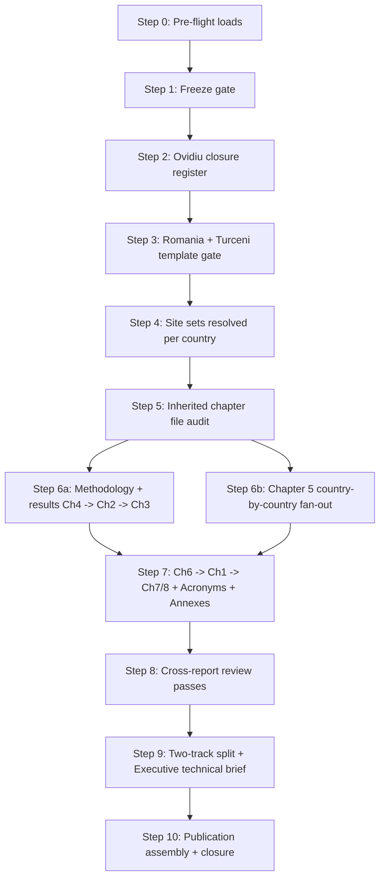

<!-- man_hours: 8.9 -->
---
name: v1.2 full report writing plan
overview: "End-to-end campaign plan for writing the version 1.2 Atoms vs Ashes report against the frozen 2026-05-17 baseline. Sequences the kickoff prompt's 12 numbered gates into an auditable campaign of 11 steps: pre-flight, freeze verification, Ovidiu closure register, Romania/Turceni template lock, inherited-file audit, country-by-country fan-out across Chapter 5, methodology/results/intro chapters, cross-report reviews, two-track publication separation, and the separate executive technical brief. Terminology: 'Step N' = campaign workflow unit; 'Stage 1/2/3' = IAEA siting stages; 'Chapter N' = report chapter."
todos:
  - id: step-0-preflight
    content: "Step 0 - Pre-flight: acknowledge controls (writingDecisions, v1_2_iteration_controls, writingStyle, ToC, prep dossier, country/site/specialist prompts, workflow skill, Ovidiu conformity, 2026-05-17 scoring health artefacts); open Feature Completion Matrix from template"
    status: pending
  - id: step-1-freeze-gate
    content: "Step 1 - Freeze gate: load v1_2_baseline_decision.md, restate the three run IDs, verify the three active_profile YAMLs under audit/.runtime/, report any drift, stage the regeneration manifest (bundles/charts/maps/methodology artefacts) pinned to score-2ffc8a70 / nat-sens-139d3947 / sens-751884cf"
    status: pending
  - id: step-2-ovidiu-register
    content: "Step 2 - Build ovidiu_v1_2_closure_register.md under v1_2_report_preparation/ with the eight required columns; seed from ovidiu_comment_conformity.md, update against the 2026-05-17 scoring artefacts; flag the Romania attention list (NH-11, HI-01, HI-06, EP-01, RI-04, §4.1 #568, VOYGR-6 #119)"
    status: pending
  - id: step-3-template-gate
    content: "Step 3 - Romania + Turceni template gate: regenerate RO country bundle + Turceni site bundle, refresh renderer scaffolds, draft Romania country profile applying the full-country-coverage rule, fill the six Turceni placeholders + country_exec for RO, walk through with user, freeze country_template_decision.md and site_template_decision.md"
    status: pending
  - id: step-4-site-sets
    content: Step 4 - Resolve Romania site set (top 5 + Romag Termo + Feldioara) against the frozen runs and confirm; define the per-country site-set resolution rule (top 5 by national ranking, regenerated, user-confirmed before each batch)
    status: pending
  - id: step-5-inherited-file-audit
    content: "Step 5 - Inherited chapter file audit: classify every existing chapters/0N_*.md (00_acronyms, 01_introduction, 02_stage_1_site_survey, 03_stage_2_site_selection, 04_results_and_findings, 05_country_and_site_profiles + folder, 06_recommendations, 07_final_remarks, 08_references, index.md) as 'rewrite from frozen bundle', 'rewrite with structural reuse', or 'replace wholesale'. Flag known v1.02 defects (00 contains banned dataset names; 01 §1.5 mistitled + 'API-primary'/'LLM' body prose; 04 uses v1.01 site counts and regional-frame sensitivity; 06 mentions ERA5/OSM/GEM). Record decisions in v1_2_report_preparation/inherited_chapter_audit.md"
    status: pending
  - id: chapter-4-results
    content: "Chapter 4 - Results and Findings: draft 4.1 Regional and Cross-Country Findings, 4.2 Per-Country Top Candidate Sites, 4.3 Sites Recommended for Stage 3, 4.4 Main Drivers of Suitability and Exclusion, 4.5 Uncertainty/Data Gaps/Confidence, 4.6 National Sensitivity and Site-Stability Findings. Reconcile §4.1 against Romania country full-pass count (Ovidiu #568). Drafted first per writingDecisions.md §5; QA note per subsection"
    status: pending
  - id: chapter-2-stage1
    content: "Chapter 2 - Stage 1: Site Survey: draft 2.1 Objectives, 2.2 Study Region and Initial Site Universe, 2.3 Data Acquisition and Evidence Base, 2.4 Initial Eligibility Checks and Screening Logic, 2.5 Candidate Site Identification, 2.6 Description of Candidate Sites, 2.7 Stage 1 Outputs and Limitations. Author: experts/report/stage_methodology_author.md from frozen methodology artefacts"
    status: completed
  - id: chapter-3-stage2
    content: "Chapter 3 - Stage 2: Site Selection: draft 3.1 Objectives, 3.2 Evaluation Framework and Criterion Families, 3.3 Safety-Related Criteria, 3.4 Nuclear Security and Human-Induced Hazard Considerations, 3.5 Radiological Impact and Emergency Planning Considerations, 3.6 Non-Safety-Related Criteria and Implementation Considerations, 3.7 Scoring, Ranking, and Comparison of Candidate Sites, 3.8 National Sensitivity and Robustness Analysis, 3.9 Preferred Sites and Shortlist Rationale, 3.10 Stage 2 Outputs and Limitations. Show weight basis at every criterion-weight surface; cite the frozen runs in prose-safe language only. Drafted through 3.10; 3.9 named preferred-site table remains pending Chapter 4 / Chapter 5 alignment."
    status: in_progress
  - id: chapter-5-structure
    content: "Chapter 5 - Country and Site Profiles (structure subsections): draft 5.1 Country Profile Structure and Interpretation Rules; align 5.2 Country Profiles and Top Sites scaffold, 5.3 Site-Level Summaries and Supporting Maps, 5.4 Ownership/Infrastructure/Coal-to-Nuclear Interpretation, 5.5 National Sensitivity, Rank Stability, and Stage 3 Sequencing as cross-country narrative wrappers around the per-country fan-out"
    status: pending
  - id: chapter-5-romania-batch
    content: "Chapter 5 - RO batch (Romania): regenerate selected-site bundles for top 5 + Romag Termo + Feldioara; dispatch country author + N site authors concurrently; fill the six per-site specialist placeholders + country_exec via run_specialist_pass.py; batch reviewer pass to clean. Country profile applies the full-country-coverage rule (22 ranked sites distribution before naming any leader)"
    status: pending
  - id: chapter-5-fanout-remaining
    content: "Chapter 5 - fan-out for remaining 15 published countries in alphabetical order (AT, BA, BG, CZ, HR, HU, LV, MD, ME, MK, PL, RS, SK, TR, UA): per batch - bundle regen, user site-set confirmation (top 5 by national ranking), multitask dispatch of country author + site authors, specialist fill, batch reviewer, clean-output gate. Belarus is excluded from the published analysis unless the user restores it; countries without a viable VOYGR-6 candidate collapse into the consolidated failure section after user confirmation; Ukraine receives occupied-territory caveat language"
    status: pending
  - id: chapter-6-recommendations
    content: "Chapter 6 - Recommendations for Detailed Site Evaluation: draft 6.1 Recommended Stage 3 Investigations, 6.2 Data Gaps Requiring Field Confirmation, 6.3 Recommended Regulatory and Stakeholder Follow-Up, 6.4 Prioritisation of Next-Step Work - derived from selected sites' residual-risk registers and Stage 3 follow-up checklists"
    status: pending
  - id: chapter-1-introduction
    content: "Chapter 1 - Introduction (revised last per writingDecisions.md §5): draft 1.1 Purpose of the Report, 1.2 Scope and Boundaries (IAEA Stages 1 and 2 Only), 1.3 Coal-to-Nuclear Transition Context, 1.4 Regulatory and Methodological Framework (IAEA, EPRI, Project Alignment), 1.5 Data, Scoring, and National Sensitivity Overview, 1.6 Structure of the Report. Enforce the brand/voice opening guard (no 'This report shows', 'The data indicate', 'It can be seen that', 'We have analysed')"
    status: pending
  - id: chapter-7-final-remarks
    content: "Chapter 7 - Final Remarks: synthesis only, no new facts; institutional voice; close-out paragraphs reconciling Stage 1–2 conclusions with the recommendations of Chapter 6"
    status: pending
  - id: chapter-8-references
    content: "Chapter 8 - References: compile a consolidated Harvard-style reference list; every numeric or factual claim points to a public source reference or an explicit assumption ID; reader-facing references must not cite repository paths, markdown files, run IDs, working notes, or the GEM database"
    status: pending
  - id: acronyms-glossary
    content: "Acronyms and Abbreviations: canonical glossary in front matter; every acronym expanded at first use per chapter then used as acronym alone; the writing-quality auditor flags inconsistent usage and missing expansions"
    status: completed
  - id: annex-a-iaea-epri
    content: "Annex A - IAEA and EPRI Traceability: regenerated against the freeze via scripts.generate_ssr1_traceability into report/methodology/ssr1_traceability.md"
    status: completed
  - id: annex-b-exclusionary-floors
    content: "Annex B - Scoring Methodology and Exclusionary Floors: regenerated via scripts.generate_exclusionary_floors into report/methodology/exclusionary_floors.md"
    status: completed
  - id: annex-c-national-sensitivity
    content: "Annex C - National Sensitivity Methodology: regenerated from the frozen national sensitivity run nat-sens-139d3947; narrative pass aligned with writingStyle.md"
    status: completed
  - id: annex-d-failure-mode
    content: "Annex D - Failure-Mode Analysis: regenerated via scripts.generate_failure_analysis (global pack) and scripts.generate_failure_analysis --smr-nuscale (VOYGR-6 pack) into report/methodology/failure_analysis*.md"
    status: completed
  - id: annex-e-assumption-register
    content: "Annex E - Assumption Register and Data Limitations: manual pass aligned with the frozen rubric and the data-gap rows from country/site QA notes"
    status: completed
  - id: annex-f-generated-artefacts
    content: "Annex F - Generated Methodology Artefacts and Script References: rebuild the artefact-path table in tableOfContents.md against the frozen runs; cross-link swing_weight_audit, criterion_correlation, assumption_register, and the regenerated sensitivity export pack under report/output/sensitivity/"
    status: completed
  - id: step-8-reviews
    content: "Step 8 - Cross-report review passes in order: writing-quality auditor (binding), software auditor, siting expert, lessons-learned, Ovidiu closure reviewer, numeric-consistency lint, publication-leak lint (new), clean-output lint (extended), caption-denominator lint, justification lint (advisory); plus premium adversarial Ovidiu pass and IAEA Stage 1–2 methodology pass"
    status: pending
  - id: step-9-output-split
    content: Step 9a - Produce output_separation.md manifest; enforce two-track split (published copy / internal audit copy); replace interactive *_site_status_map.html with static publication-grade renders or move them to audit copy only
    status: pending
  - id: step-9-exec-brief
    content: Step 9b - Draft the separate Executive Technical Brief (writingDecisions.md §12) as a standalone deliverable
    status: pending
  - id: step-10-final
    content: Step 10 - Run Required Final Checks block, confirm Feature Completion Matrix is fully resolved, write the one-line end-to-end trace, close audit/conversations log and update man_hours_registry.yml
    status: pending
isProject: false
---

# Version 1.2 Full Report Writing Plan

## Source of truth

- Kickoff prompt: [`report/version 1.02/output/report/writing plan/prompts/v1_2_writing_kickoff_prompt.md`](report/version 1.02/output/report/writing plan/prompts/v1_2_writing_kickoff_prompt.md) - 12 numbered steps with hard gates.
- Composition index: [`report/version 1.02/output/report/writing plan/tableOfContents.md`](report/version 1.02/output/report/writing plan/tableOfContents.md).
- Editorial controls: [`writingDecisions.md`](report/version 1.02/output/report/writing plan/writingDecisions.md), [`v1_2_iteration_controls.md`](report/version 1.02/output/report/writing plan/v1_2_iteration_controls.md), [`writingStyle.md`](report/version 1.02/output/report/writing plan/writingStyle.md).
- Frozen baseline: [`v1_2_baseline_decision.md`](report/version 1.02/v1_2_report_preparation/v1_2_baseline_decision.md). Run IDs: scoring `score-2ffc8a70`, regional sensitivity `sens-751884cf`, national sensitivity `nat-sens-139d3947`, weight `baseline`, DB `merged`, HEAD `11aab2f43acb1690416131d97026c806aedb530a`.

## Progress update - 2026-05-18

- Downstream chapter tranche started for Chapter 1, Chapter 6, Chapter 7, and Chapter 8. `01_introduction.md`, `06_recommendations_for_detailed_site_evaluation.md`, `07_final_remarks.md`, and `08_references.md` were rewritten to remove inherited process/source leakage, use Harvard-style external references, keep NuScale VOYGR-6 and national sensitivity framing, and record that Chapter 6 site-specific prioritisation depends on the final Chapter 4 shortlist and completed Chapter 5 selected-site residual-risk registers. No Chapter 1, 6, 7, or 8 ToC row was checked because those sections still require downstream review and unresolved Chapter 5 evidence.
- Chapter 2 and Chapter 3 methodology tranche updated on 2026-05-18: `02_stage_1_site_survey.md` and `03_stage_2_site_selection.md` were rewritten from the frozen methodology, local scoring counts, rubric weights, and national sensitivity controls. ToC rows 2.1-2.7, 3.1-3.8, and 3.10 were checked; 3.9 remains unchecked until Chapter 4 preferred-site results and Chapter 5 selected-site profiles are aligned.
- Acronyms and annexes tranche completed on 2026-05-18. `00_acronyms.md` was rewritten to remove source/platform and process acronyms; Annexes A-F were refreshed from local methodology artefacts, with Annex C rewritten for the 50,000-iteration national sensitivity basis and Annex F / the ToC artefact table corrected to actual local paths. ToC rows for Acronyms and Annexes A-F were checked after the scoped clean-output scan.

## Terminology

This plan uses three distinct terms that must never be conflated:

- **Step N** - a unit of this campaign workflow (Step 0 through Step 10).
- **Stage 1 / Stage 2 / Stage 3** - the IAEA siting stages defined in SSG-35; Stage 1 and Stage 2 are the report scope, Stage 3 is the downstream characterisation work the report recommends.
- **Chapter N** - a numbered chapter of the report itself (Chapters 1–8 plus front matter and annexes).

## Inviolable rails (apply to every step)

- **Source-attribution discipline.** No upstream dataset / tile / library / vendor / paper name in any reader-facing surface (full prohibited list in kickoff §1). No run IDs, repo paths, alembic numbers, branch names, CLI invocations in body prose.
- **Full-country coverage** in every country profile opening paragraph (distribution first, leader inside the distribution).
- **No live API without per-call consent.** Standing consent only for web search via auto-mode or Composer 2 to confirm public regulatory/programme context - never for measured site values.
- **Clean-output rule.** No `TODO`, `placeholder`, `specialist interpretation pending`, `AI`, `agent`, `draft note`, `model says`, `Cursor`, `Composer`, `auto mode`, `LLM`, `prompt`, or unresolved specialist tags in any reader-facing surface.
- **Rewrite-on-doubt.** v1.01 / v1.02 paragraphs are structural reference only; rewrite from the frozen bundle if correctness is uncertain.
- **Audit / man-hours.** Per-session log in `audit/conversations/<YYYY-MM-DD>_<slug>.md`, man-hours updates per `.cursor/rules/man-hours.mdc`, and a Feature Completion Matrix at `audit/feature_completion_matrices/<YYYY-MM-DD>_v1_2_report_writing.md` opened before substantive work starts.
- **Direct publication prose.** The Unicode em dash character U+2014 is banned in reader-facing text. Use positive, direct phrasing and avoid defining an idea by negating another idea.
- **Harvard citations only.** Use Harvard-style in-text citations and a consolidated Harvard-style reference list. Reader-facing text must not cite repository paths, markdown files, working references, run IDs, internal project files, or the GEM database.
- **Evidence-source confidentiality.** Chapter 2.3 and all evidence-base sections describe sources qualitatively. Use automated web searches and structured evidence collection language where needed. Do not mention LLMs, internal databases, connector names, or upstream platform names.
- **Results and country ledgers.** Chapter 4 and country profiles use ranked tables with national composite scores, score bands, national sensitivity bands, failure criteria, avoidance criteria, and threshold evidence where available. Excluded sites must show real coverage and measured evidence, not 0% coverage labels.
- **Visual and table layout.** Tables use black borders on all cell sides. Country maps use full page width where practical, with landscape treatment for map-dominant pages and a 20-label cap for dense countries such as Turkey.
- **Country and conclusion additions.** Country descriptions state first-time nuclear-power status where relevant. Belarus is excluded from the published analysis unless restored by the user. Chapter 1 includes the coal-to-nuclear transition hypothesis. Conclusions state that the framework can expand to other large industrial sites suitable for SMR accommodation.

## Campaign sequence (11 steps)



### Step 0 - Pre-flight loads (read-only)

Acknowledge and confirm: `writingDecisions.md`, `v1_2_iteration_controls.md`, `writingStyle.md`, `tableOfContents.md`, `report_writing_tools_and_templates_evaluation.md`, `prompts/country_profile_author.md`, `prompts/site_profile_author.md`, `prompts/specialists/siting_expert.md`, `.cursor/skills/report-writing-workflow/SKILL.md`, `audit/post_processing/scoring_conformity/ovidiu_comment_conformity.md`, and the 2026-05-17 scoring health artefacts (`criteria_implementation_status`, `phase2_data_coverage_report`, `phase2_auditor_review`, `logic_only_criteria_todo`, `sensitivity_mc_10000`). One-line acknowledgement per file. Open the Feature Completion Matrix from `audit/templates/feature_completion_matrix.md`.

### Step 1 - Freeze gate verification

- Load `v1_2_baseline_decision.md`, restate the three run IDs back to the user.
- Verify the three active-profile snapshots exist under `audit/.runtime/`: `active_profile.score-2ffc8a70.yaml`, `active_profile.sens-751884cf.yaml`, `active_profile.nat-sens-139d3947.yaml`.
- Diff each YAML against the freeze block; report any drift in `weight_profile`, `db_profile`, `smr_keys`, seed (42), and sensitivity iteration basis. Regional sensitivity remains 10,000 iterations in its active-profile snapshot; national sensitivity for report drafting is `nat-sens-139d3947`, corrected by the user on 2026-05-18 as 50,000 iterations.
- Stage the regeneration manifest: every country bundle, every selected site bundle, every chart, every static country map, every methodology artefact rebuilt from the frozen scoring run and national sensitivity run only. Pin CLIs to `--run-id score-2ffc8a70 --sensitivity-run-id nat-sens-139d3947`; do not use regional sensitivity for report drafting unless the user later reopens a narrow comparator exhibit. **Gate: user confirms freeze before any regeneration begins.**

### Step 2 - Ovidiu v1.2 closure register

Produce `report/version 1.02/v1_2_report_preparation/ovidiu_v1_2_closure_register.md` with columns: comment id, historical conformity status, current scoring/data status, report surface, v1.2 action, evidence file, verification method, publication status. Seed from `ovidiu_comment_conformity.md`; update against the 2026-05-17 artefacts. Flag the Romania-specific attention list explicitly (NH-11 #100/#573, HI-01 #76/#79/#106/#578, HI-06 #120/#563/#582, EP-01 #112, RI-04 #33/#564, §4.1 reconciliation #568, VOYGR-6 capacity #119). Every country and site subagent will receive its filtered slice. **Gate: register accepted by user in this chat on 2026-05-18; unresolved rows retain their register status until report regeneration/rewrite/lint resolves them.**

### Step 3 - Template confirmation gate (Romania + Turceni)

- Regenerate Romania country bundle: `python -m scripts.export_country_bundle --country-code RO --run-id score-2ffc8a70 --sensitivity-run-id nat-sens-139d3947`.
- Regenerate Turceni site bundle: `python -m scripts.export_site_bundle --site-id <Turceni UUID> --run-id score-2ffc8a70 --sensitivity-run-id nat-sens-139d3947`.
- Refresh renderer scaffolds for both. Draft the Romania country profile **applying §2 of the inviolable rules**: opening paragraph names total ranked count (22), full-pass count, avoidance-flag count, hard-fail count, before naming any individual site. Fill the six per-site specialist placeholders for Turceni and the `country_exec` placeholder for Romania (consolidated `siting_expert.md`, escalating to family/criterion level for HI-01, HI-06, NH-11, EP-01, RI-04).
- Walk both through with the user. Freeze the result as `country_template_decision.md` and `site_template_decision.md` under `report/version 1.02/v1_2_report_preparation/`. When those files are ready, prompt the user explicitly for review and acceptance. The decisions must be written with full national context in mind: all in-scope countries and all relevant data, not a narrow Romania-only perspective. **Gate: both decision files signed off - no fan-out before this.**

### Step 4 - Romania site set + per-country site-set resolution rule

- Resolve Romania set against the frozen runs: top 5 by NuScale VOYGR-6 national ranking, **plus** Romag Termo (if not already in top 5), **plus** Feldioara (strategic, outside ranking). Present the resolved list (current ledger expectation: Turceni, Rovinari, Braila, Romag Termo, Giurgiu + Feldioara) and ask the user to confirm.
- For every other in-scope country, the rule is **top 5 by national ranking** under the existing `recommended_top5_sites.md` status/avoidance/exclusionary logic regenerated against the frozen runs, re-presented to the user **before that country's batch is launched** (not all at once).

### Step 5 - Inherited chapter file audit (v1.02 → v1.2)

Every reader-facing file already in `report/version 1.02/output/report/chapters/` must be triaged before drafting begins. The default per the rewrite-on-doubt rail is **rewrite from the frozen bundle**; inherited prose survives only if the batch reviewer can point to evidence for every claim. Record the per-file decision (rewrite / structural reuse / replace wholesale) and known-defect ledger in `report/version 1.02/v1_2_report_preparation/inherited_chapter_audit.md`.

Known defects already identified in the existing v1.02 files (non-exhaustive - full lint runs in Step 8):

- **`00_acronyms.md`** - body table currently lists banned upstream dataset / library / vendor names (CORINE, ERA5, GEM, JRC, OSM, WDPA, EFEHR, EGDI, ISW). Per kickoff §1 source-attribution rule these must be removed from the published copy. Treatment: **rewrite the glossary** to keep only IAEA / EPRI / regulator / standard / generic-technical acronyms; move any preserved internal vocabulary to the audit copy.
- **`01_introduction.md`** - §1.5 is titled "Data, Scoring, and Sensitivity Overview" but the ToC requires "Data, Scoring, and **National** Sensitivity Overview"; body prose mentions "API-primary" and "curated LLM-assisted enrichment" (banned process language per kickoff §1 and v1_2 clean-output lint). Body footnote ref [4] embeds a repository path (`sources/regulations/dos/...`) and ref [6] embeds repository paths under `report/...`. Treatment: **rewrite** §1.5 from the frozen baseline; strip process language and repository paths from body prose; keep IAEA / EPRI / DOE / DOE-INL citations in Chapter 8.
- **`02_stage_1_site_survey.md`** - audit for source-attribution leaks and stale site counts; rewrite 2.2 and 2.6 against the frozen site universe; preserve structural skeleton.
- **`03_stage_2_site_selection.md`** - show weight basis at every criterion-weight surface; reframe 3.8 as national sensitivity; preserve criterion-family framework; rewrite ranking and shortlist paragraphs from frozen runs.
- **`04_results_and_findings.md`** - uses v1.01 counts (252 records, "regional top-20" framing) and **regional** sensitivity framing; the v1.2 freeze is national sensitivity. Treatment: **rewrite wholesale** from the frozen scoring + national sensitivity runs; the existing structural skeleton may be reused for table layout only.
- **`05_country_and_site_profiles.md`** + the `05_country_and_site_profiles/` folder - every `<CC>_country_prototype.md` and every `sites/<CC>_<slug>.md` is regenerated from the freeze. Inherited prototypes serve as structural reference and Ovidiu trace only. The Romania (RO) prototype is the historical Turceni-centric narrative flagged in the kickoff and must be rewritten to the full-country-coverage rule.
- **`06_recommendations_for_detailed_site_evaluation.md`** - body prose names ERA5, OpenStreetMap, GEM (banned). Treatment: **rewrite** the investigation families to use generic terms ("reanalysis-grade meteorology", "open mapping inventory", "open infrastructure inventory") and the regulator-facing investigation specification instead of dataset names.
- **`07_final_remarks.md`** - currently 15 lines; **rewrite from final report state** once Chapters 4 / 5 / 6 are accepted.
- **`08_references.md`** - preserve the IAEA / EPRI / DOE / DOE-INL anchors; rebuild the numeric reference list from the consolidated chapter citations; strip every repository-path reference.
- **`index.md`** - rebuild as the assembler index pointing at the published-copy chapter files.

The audit ledger is updated as each chapter is drafted and is one of the inputs to the writing-quality auditor and publication-leak lint in Step 8.

### Step 6 - Methodology + results drafting (Chapters 4, 2, 3)

Drafted at subsection level by the author roles in `v1_2_iteration_controls.md §"Use of Existing Experts"`. Order per `writingDecisions.md §5`: Chapter 4 first (it anchors numerical conclusions), then Chapters 2 and 3 from the frozen methodology. Each subsection ships with a separate QA note (never inserted in the report). Each subsection below names its evidence anchor, target depth, and acceptance criteria.

**Chapter 4 - Results and Findings** (replaces `04_results_and_findings.md` wholesale; structural reuse of table layouts only).

Authors: `experts/report/stage_methodology_author.md` + `experts/scoring/national_sensitivity_report_author.md`.

- 4.1 Regional and Cross-Country Findings - evidence: cross-country composite ledger rebuilt from `score-2ffc8a70`; depth: 4–6 paragraphs + 1–2 tables; acceptance: regional top-N count reconciles with §5 country full-pass totals (Ovidiu #568); no upstream dataset names.
- 4.2 Per-Country Top Candidate Sites - evidence: per-country leading-candidate inventory from frozen ranking; depth: one short table block per country contributing to the regional top tier, ≤10 sites per country; acceptance: no implication of Stage 3 readiness; clear "candidate inventory for human selection" caveat.
- 4.3 Sites Recommended for Progression Toward Stage 3 - evidence: regenerated `recommended_top5_sites.md` for each country plus Romania selected set; depth: 1 table + 2–3 interpretation paragraphs; acceptance: every named site appears in §5 with a full profile.
- 4.4 Main Drivers of Suitability and Exclusion - evidence: family-component decomposition from the frozen scoring run; depth: 3–4 paragraphs grouped by NH / HI / RI+EP / NS; acceptance: drivers traceable to criterion family weights and to the swing-weight audit.
- 4.5 Uncertainty, Data Gaps, and Confidence Levels - evidence: MC band widths from `nat-sens-139d3947`, phase-2 data coverage report; depth: 2–3 paragraphs + 1 confidence-band table; acceptance: missing-evidence rows shown as "unscored / no measured basis", never as low scores.
- 4.6 National Sensitivity and Site-Stability Findings - evidence: `nat-sens-139d3947` top-1 / top-3 / top-5 probabilities; depth: 3–4 paragraphs + 1 stability summary table; acceptance: framed as **national sensitivity** per `writingDecisions.md §2`; regional comparison from `sens-751884cf` appears only as an explicit comparator.

**Chapter 2 - Stage 1: Site Survey** (rewrite with structural reuse of `02_stage_1_site_survey.md`).

Author: `experts/report/stage_methodology_author.md`. Drawn from the frozen methodology artefacts and the site universe at HEAD `11aab2f43acb1690416131d97026c806aedb530a`.

- 2.1 Objectives of the Site Survey Stage - evidence: SSG-35 §3.3; depth: 2–3 paragraphs; acceptance: Stage 1 framed as identification + screening, distinct from Stage 2 ranking.
- 2.2 Study Region and Initial Site Universe - evidence: frozen site universe count and country distribution; depth: 2–3 paragraphs + 1 regional inventory table; acceptance: country list aligned with the 17-country roster in Chapter 5; no upstream catalogue names.
- 2.3 Data Acquisition and Evidence Base - evidence: data architecture description; depth: 3–4 paragraphs; acceptance: no "API-primary", "LLM-assisted", "merged DB", dataset, or vendor names; generic language only ("authoritative public sources, structured enrichment, expert review").
- 2.4 Initial Eligibility Checks and Screening Logic - evidence: `report/methodology/exclusionary_floors.md` (Annex B source); depth: 3–4 paragraphs + 1 floor summary table; acceptance: every floor named in prose appears in Annex B.
- 2.5 Candidate Site Identification - evidence: post-screening site counts from `score-2ffc8a70`; depth: 2–3 paragraphs; acceptance: counts match Chapter 4 §4.1 totals.
- 2.6 Description of Candidate Sites - evidence: frozen candidate set; depth: 1 summary table + 2 paragraphs; acceptance: no premature ranking interpretation (that belongs in Ch3/Ch4).
- 2.7 Stage 1 Outputs and Limitations - evidence: Stage 1 disclosures and known data gaps; depth: 2–3 paragraphs; acceptance: explicit statement that Stage 1 outputs feed Stage 2 ranking, not Stage 3 licensing.

**Chapter 3 - Stage 2: Site Selection** (rewrite with structural reuse of `03_stage_2_site_selection.md`).

Author: `experts/report/stage_methodology_author.md` with `experts/scoring/national_sensitivity_report_author.md` on 3.8.

- 3.1 Objectives of the Site Selection Stage - evidence: SSG-35 + EPRI siting guide; depth: 2 paragraphs; acceptance: Stage 2 framed as comparative ranking, not licensing.
- 3.2 Evaluation Framework and Criterion Families - evidence: criterion families (NH, HI, RI, EP, NS, BF) from the frozen rubric; depth: 3–4 paragraphs + 1 family overview table; acceptance: family scope cited verbatim from the frozen rubric.
- 3.3 Safety-Related Criteria - evidence: NH-\* criterion list from frozen rubric; depth: 4–6 paragraphs + 1 criterion table; acceptance: weight basis shown at every criterion-weight surface.
- 3.4 Nuclear Security and Human-Induced Hazard Considerations - evidence: HI-\* criterion list; depth: 4–6 paragraphs + 1 table; acceptance: HI-01 major-vs-minor airport distinction and HI-06 ammunition-depot / firing-range distinction described in prose per Ovidiu #76/#79/#106/#578 and #120/#563/#582.
- 3.5 Radiological Impact and Emergency Planning Considerations - evidence: RI-_ and EP-_ criterion list; depth: 4–6 paragraphs + 1 table; acceptance: RI-04 framed as screening proxy with CNCAN dose-feasibility as the controlling test (Ovidiu #33/#564); EP-01 rebanding described (Ovidiu #112).
- 3.6 Non-Safety-Related Criteria and Implementation Considerations - evidence: NS-_ and BF-_ criterion list; depth: 4–6 paragraphs + 1 table; acceptance: NS-05 (area adequacy) language distinguishes canonical `site_area_ha` from wider `favourable_area_ha` per `writingDecisions.md §7`.
- 3.7 Scoring, Ranking, and Comparison of Candidate Sites - evidence: frozen scoring algorithm description; depth: 3–4 paragraphs + 1 worked example or scoring schematic; acceptance: explicit dual-gate (exclusionary then weighted) language; no implication that weighted scoring overrides exclusion.
- 3.8 National Sensitivity and Robustness Analysis - evidence: `nat-sens-139d3947` summary; depth: 4–5 paragraphs + 1 robustness summary table; acceptance: framed as **national sensitivity** per `writingDecisions.md §2`; MC iterations (50 000), seed (42), reference SMR (NuScale VOYGR-6) named.
- 3.9 Preferred Sites and Shortlist Rationale - evidence: per-country preferred-site logic; depth: 2–3 paragraphs + 1 shortlist table; acceptance: every named preferred site receives a full profile in Chapter 5.
- 3.10 Stage 2 Outputs and Limitations - evidence: Stage 2 disclosures; depth: 2–3 paragraphs; acceptance: explicit statement that Stage 2 outputs support Stage 3 progression decisions, not licensing.

### Step 6 (continued) - Chapter 5: Country and Site Profiles (country by country, never region-wide)

Structure subsections of Chapter 5 are drafted as cross-country wrappers around the per-country fan-out (each ≈ 2–3 paragraphs; the heavy lifting lives in the per-country pages and per-site profiles):

- 5.1 Country Profile Structure and Interpretation Rules - evidence: `country_profile_author.md` + accepted Romania template; depth: 3–4 paragraphs explaining the country-profile shape, the full-country-coverage rule, the data-gap disclosure rule, the consolidated-failure-section rule, and how site selection is announced; acceptance: a reader can read §5.1 and predict the layout of every subsequent country page.
- 5.2 Country Profiles and Top Sites - evidence: per-country prototypes regenerated against the freeze; depth: short intro paragraph + ordered links to the 17 country pages; acceptance: alphabetical order; countries collapsed into the consolidated failure section flagged here.
- 5.3 Site-Level Summaries and Supporting Maps - evidence: site-profile renderer scaffold + static `<CC>_site_status_map.png`; depth: 2–3 paragraphs explaining how to read a site profile (criterion ledger, residual-risk register, Stage 3 follow-up); acceptance: no reference to interactive HTML maps (those live in the audit copy only).
- 5.4 Ownership, Infrastructure, and Coal-to-Nuclear Interpretation - evidence: ownership block specification + DOE/INL coal-to-nuclear framing; depth: 2–3 paragraphs; acceptance: factual-first rule enforced (no implication of project control, public acceptance, or procurement feasibility).
- 5.5 National Sensitivity, Rank Stability, and Stage 3 Sequencing - evidence: `nat-sens-139d3947` stability output spec; depth: 2–3 paragraphs; acceptance: stability framed as national, not regional; Stage 3 sequencing always positioned downstream of the screening decision.

Per the kickoff §7 multitasking operating model, three role types per country batch:

- **Country author** (one subagent per country): `country_profile_author.md`, country bundle JSON, accepted Romania model, Ovidiu closure subset (country-level + cross-cutting). Output: clean country profile + QA note.
- **Site authors** (one subagent per selected site, country by country): `site_profile_author.md` + the appropriate specialist prompt (default consolidated `specialists/siting_expert.md`; escalate to family/criterion specialist for HI-01, HI-06, NH-11, EP-01, RI-04, RI-05, NS-02, NS-05, or wherever the closure register flags depth), site bundle JSON, Ovidiu closure subset for that site. Country-specific caveats injected for Ukraine. Belarus remains excluded from the published analysis unless restored by the user.
- **Batch reviewer** (one subagent per country batch): reconciles country lead language, site selection logic, Stage 3 sequencing, prohibited-claim hygiene, Ovidiu closure visibility, clean-output gate. Has authority to require rewrites.

Dispatch order (proposed; alphabetical per `writingDecisions.md §6` with Romania kept as accepted template):

```
RO (already template-locked) -> AT -> BA -> BG -> CZ -> HR -> HU -> LV -> MD -> ME -> MK -> PL -> RS -> SK -> TR -> UA
```

Per country batch:

1. Regenerate country bundle.
2. Resolve and confirm site set with user.
3. Regenerate selected-site bundles.
4. Dispatch country author + N site authors concurrently (multitask mode).
5. Specialist placeholder fill inside Cursor via `src/scripts/run_specialist_pass.py` (`list`, `show`, `patch`); six per site + one `country_exec` per country.
6. Batch reviewer pass - block until clean.
7. Filed clean prose under `report/output/chapters/05_country_and_site_profiles/`; QA notes filed separately.

Countries with no viable VOYGR-6 candidate collapse into the consolidated failure section per `writingDecisions.md §6` rather than receiving a full profile. The borderline decision is escalated to the user, never inferred.

### Step 7 - Chapter 6, then 1, then 7/8, Acronyms, Annexes

Per `writingDecisions.md §5` (introduction last). Each subsection below names its evidence anchor, target depth, and acceptance criteria.

**Chapter 6 - Recommendations for Detailed Site Evaluation** (rewrite of `06_recommendations_for_detailed_site_evaluation.md`; structural skeleton reusable, body prose rewritten to remove banned dataset names).

- 6.1 Recommended Stage 3 Investigations - evidence: residual-risk registers from selected-site profiles; depth: ~6 investigation-family blocks (geotechnical/seismic; flooding/cooling/hydrology; meteorology/combined hazards; human-induced/nuclear security; radiological/dispersion; emergency planning) at 1 paragraph each; acceptance: investigation specs use generic language ("reanalysis-grade meteorology", "open mapping inventory") - no ERA5 / OSM / GEM / WDPA / EFEHR / Vs30-dataset names.
- 6.2 Data Gaps Requiring Field Confirmation - evidence: QA-note data gaps from country and site batches + `phase2_data_coverage_report`; depth: 2–3 paragraphs + 1 gap-to-site cross-reference table; acceptance: every gap traces to either a Stage 3 question or an Annex E assumption ID.
- 6.3 Recommended Regulatory and Stakeholder Follow-Up - evidence: per-country regulator inventory (CNCAN, ANANP, IRP-MAI, etc.); depth: 2–3 paragraphs; acceptance: only public regulator names (kickoff §1 allow-list).
- 6.4 Prioritisation of Next-Step Work - evidence: shortlist from §4.3 + national sensitivity from §3.8; depth: 2–3 paragraphs + 1 sequencing table; acceptance: prioritisation explicitly framed as advisory; no procurement-readiness language.

**Chapter 1 - Introduction** (rewrite of `01_introduction.md`; finalised after Ch4 / Ch5 / Ch6 are stable).

- 1.1 Purpose of the Report - evidence: writingDecisions §1; depth: 2–3 paragraphs; acceptance: institutional opening sentence (no "This report shows", "The data indicate", "It can be seen that", "We have analysed").
- 1.2 Scope and Boundaries: IAEA Stages 1 and 2 Only - evidence: SSG-35 stage table; depth: 2–3 paragraphs + 1 stage table; acceptance: no claim of Stage 3 readiness; no repository paths in body.
- 1.3 Coal-to-Nuclear Transition Context - evidence: DOE coal-to-nuclear guide + DOE/INL retiring-coal report; depth: 3–4 paragraphs; acceptance: cited as DOE / DOE-INL (allow-listed); no Wikipedia or proprietary catalogue citations in body.
- 1.4 Regulatory and Methodological Framework: IAEA, EPRI, and Project Alignment - evidence: SSG-35, SSR-1, EPRI siting guide; depth: 3–4 paragraphs + 1 IAEA/EPRI/project alignment table; acceptance: SSR-1 traceability mention points to Annex A, not to repository paths.
- 1.5 Data, Scoring, and **National** Sensitivity Overview - evidence: 50 000-iteration national MC sensitivity description from `writingDecisions.md §2`; depth: 3–4 paragraphs + 1 criterion-family treatment table; acceptance: title and prose use **national** sensitivity framing; no "API-primary", "LLM-assisted", or dataset names; mention of NuScale VOYGR-6 reference case at 462 MWe.
- 1.6 Structure of the Report - evidence: the finalised ToC; depth: 2–3 paragraphs; acceptance: chapter-by-chapter description matches the assembled report exactly.

**Chapter 7 - Final Remarks** (rewrite of `07_final_remarks.md` from final report state).

Evidence: synthesised from Chapters 4 / 5 / 6 conclusions. Depth: 4–6 paragraphs in institutional voice. Acceptance: no new facts; no policy advocacy; explicit re-statement of the Stage 1–2-only scope.

**Chapter 8 - References** (rewrite of `08_references.md` as the consolidated reference list).

Evidence: every `[N]` citation across Chapters 1–7 and the Annexes. Depth: full Harvard-style list. Acceptance: every numeric / factual claim in the body points to a source ref, a project-artefact ref, or an explicit assumption ID; no repository paths; URLs only for citable public documents.

**Acronyms and Abbreviations** (rewrite of `00_acronyms.md`).

Evidence: terms actually used in the published copy. Depth: one canonical glossary table + country-code table. Acceptance: contains only IAEA / EPRI / regulator / standard / generic-technical acronyms (allow-listed by kickoff §1); banned dataset / library / vendor names (CORINE, ERA5, GEM, JRC, OSM, WDPA, EFEHR, EGDI, ISW, LLM, …) removed from the published copy and moved to the audit copy if needed for internal traceability; every acronym used in the report is defined here and expanded at first use per chapter.

**Annexes A–F** (all regenerated against the freeze; published-copy paths per `tableOfContents.md` Annex F table).

- Annex A - IAEA and EPRI Traceability: regenerated via `scripts.generate_ssr1_traceability` into `report/methodology/ssr1_traceability.md`; depth: full SSR-1 → project-criterion matrix; acceptance: coverage labels (full / partial / screening-only / out-of-scope) explicit for every requirement.
- Annex B - Scoring Methodology and Exclusionary Floors: regenerated via `scripts.generate_exclusionary_floors` into `report/methodology/exclusionary_floors.md`; depth: complete floor specification with thresholds; acceptance: every floor mentioned in Chapters 2 / 3 appears here.
- Annex C - National Sensitivity Methodology: regenerated from `nat-sens-139d3947`; depth: methodology narrative + national rank-probability tables; acceptance: 50 000 iterations, seed 42, NuScale VOYGR-6 reference case named; regional sensitivity not used for report drafting unless the user later reopens a narrow comparator exhibit.
- Annex D - Failure-Mode Analysis: regenerated via `scripts.generate_failure_analysis` (global pack) and `scripts.generate_failure_analysis --smr-nuscale` (VOYGR-6 pack); depth: full failure-mode catalogue; acceptance: every failure mode cross-references the relevant criterion.
- Annex E - Assumption Register and Data Limitations: manual pass; depth: one row per assumption with ID, evidence, scope, and confidence; acceptance: every "unscored / no measured basis" disclosure in Chapters 4 / 5 / 6 traces back to an assumption ID.
- Annex F - Generated Methodology Artefacts and Script References: rebuild the artefact-path table from `tableOfContents.md` against the frozen runs; depth: 1 table; acceptance: every cross-referenced artefact exists at the cited path.

### Step 8 - Cross-report review passes (post-assembly)

In order - each pass is blocking:

1. **Writing-quality auditor** (`prompts/specialists/writing_quality_auditor.md`) - publishing-house editor / book-designer voice on every chapter, profile, annex, table, figure, caption, front- and back-matter surface. Verdict binding.
2. **Software/architecture auditor** (`experts/quality/auditor.md`) - conformance and traceability (distinct from the writing pass).
3. **Siting domain reviewer** (`experts/quality/siting_expert.md`).
4. **Lessons-learned reviewer** (`experts/quality/lessons_learned.md`) - prior lessons not reintroduced.
5. **Ovidiu closure reviewer** - against `ovidiu_v1_2_closure_register.md`. No "unresolved publication blocker" rows remain.
6. **Numeric-consistency lint** - extend `cross_chapter_numeric_lint.py`: VOYGR-6 = 462 MWe everywhere; ban "924 MWe", "VOYGR-12", "12-module" outside a marked historical-error appendix; Romania regional-top-N vs national full-pass reconciliation (#568).
7. **Publication-leak lint (new)** - scans every reader-facing surface (chapters, profiles, annexes, figure HTML, shipped README) for the prohibited upstream dataset / tile / library names listed in the kickoff's source-attribution rule, plus run IDs, repo paths, alembic numbers, branch names, CLI invocations.
8. **Clean-output lint (extended)** - bans `TODO`, `placeholder`, `specialist interpretation pending`, `AI`, `agent`, `draft note`, `model says`, `Cursor`, `Composer`, `auto mode`, `LLM`, `prompt`, half-rendered specialist tags.
9. **Caption-denominator lint** - every table/chart caption matches the template `<Class>. <Country/cohort>. <Metric>. <Denominator>. <Time / basis>. <Interpretation limit if illustrative>`.
10. **Justification lint (advisory)** - flags one-line paragraphs, three consecutive short declaratives, em-dash clause separators.

A premium adversarial review pass against the Ovidiu closure register and an IAEA Stage 1–2 methodology pass are budgeted (kickoff §"Premium review passes are budgeted, not improvised"). Premium reviewers work from the same bundles and closure register; they never free-write new facts.

### Step 9 - Two-track output separation + Executive technical brief

- Produce `report/version 1.02/v1_2_report_preparation/output_separation.md` manifest mapping each file to **published copy** vs **internal audit copy**.
- **Published copy**: no upstream dataset names, no run IDs, no interactive-map attribution, no internal placeholders, no agent/drafting language. The interactive `figures/*_site_status_map.html` files are either replaced with static publication-grade renders from `src/scripts/_country_profile_map.py` (Natural Earth fallback, publisher-owned attribution) or moved to the audit copy only.
- **Internal audit copy**: retains run IDs, bundle citations, specialist tag history, Ovidiu closure attributions, reviewer notes.
- **Separate Executive Technical Brief** (`writingDecisions.md §12`) - process, API discovery, flaky-API handling, direct spend, human hours, equivalent hours avoided, token usage, DB and artefact volumes, what else could be done, further-development recommendations. Standalone deliverable.

### Step 10 - Publication assembly + closure

- Run the full `Required Final Checks` block from `v1_2_iteration_controls.md §"Required Final Checks"`.
- Confirm every Feature Completion Matrix row is `Implemented`, `Not applicable` (with justification), or `Deferred` (with explicit user approval recorded inline).
- One-line end-to-end trace in the final response (entry point → assembler → chapter files → published-copy manifest → reader).
- Final session log under `audit/conversations/`; man-hours registry updated.

## Operating rules during the campaign

- **No mid-drafting reuse of the kickoff prompt** - it is the session opener only; use `country_profile_author.md`, `site_profile_author.md`, and the specialist prompts during drafting.
- **Multitask only after templates are accepted.** Pre-template work is single-threaded.
- **Subagent boundaries.** Country authors receive country-level + cross-cutting Ovidiu rows; site authors receive their site's criterion rows; batch reviewers receive the full country slice. No site author may rewrite the country profile; no country author may rewrite a site profile - the batch reviewer arbitrates.
- **Data gaps disclosed, not scored low.** A missing field surfaces as "unscored / no measured basis" in the report and as a Stage 3 question in the residual risk register.
- **Plan storage.** Save this plan under `/Users/terbolence/.cursor/plans/` per the workspace rule and mirror into `architecture/plans/` and `audit/plans/` per the audit-trail rule once the user accepts it.
