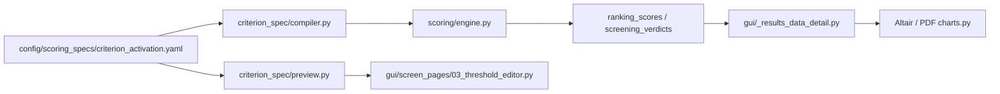

<!-- man_hours: 0.5 -->
# Feature Completion Matrix — Criterion deactivation flux

## 1. Feature Identification

- **Feature title:** Central criterion activation registry (deactivate criteria without data)
- **User request (verbatim noun phrases):** Site Selection Criteria page greyed out; pending implementation of connector; scoring/sensitivity/charts exclude inactive; single switch; IMPROVEMENTS.md
- **Owning chat / plan:** `criterion_deactivation_flux_8a03e8f0`
- **Date opened:** 2026-05-17
- **Date closed:** 2026-05-17

## 2. Literal Request Check

| Noun in request | Surface it implies | Where it is satisfied | Status |
| --- | --- | --- | --- |
| Site Selection Criteria page | Grey pending rows | `gui/_threshold_editor_*.py` | Implemented |
| scoring | Skip inactive criteria | `scoring/_engine_loop.py`, `rubric.py` | Implemented |
| sensitivity runs | Same pool as composite | `scoring/sensitivity.py` | Implemented |
| charts and graphs | Omit inactive | `gui/_results_site_detail_bars.py`, `_results_data_detail.py` | Implemented |
| single switch | `criterion_activation.yaml` `active:` | `config/scoring_specs/criterion_activation.yaml` | Implemented |
| IMPROVEMENTS.md | Required improvements block | `IMPROVEMENTS.md` | Implemented |

## 3. End-to-End User Path Diagram



- **Entry point file:** `src/atoms_vs_ashes/gui/screen_pages/03_threshold_editor.py`
- **Runner/dispatcher:** `src/atoms_vs_ashes/scoring/engine.py` → `_engine_loop.score_sites`
- **Engine module:** `src/atoms_vs_ashes/criterion_spec/activation.py`, `scoring/rubric.py`
- **Persistence:** compiled snapshot + no new rows for inactive criteria on re-score
- **Reader:** `_results_data_detail.py`, `_results_site_detail_bars.py`
- **Acceptance:** GUI tests + scoring pool tests

## 4. Surface Matrix

| Surface | Required artifact | File / symbol / test | Status | Notes |
| --- | --- | --- | --- | --- |
| GUI page | Grey inactive rows | `_threshold_editor_criteria_header.py` | Implemented | |
| CLI | N/A | — | N/A | No new CLI flag |
| Engine | Skip inactive | `_engine_loop.py` | Implemented | |
| DB schema | N/A | — | N/A | Uses existing snapshot JSON |
| Results charts | Filter bars | `_results_site_detail_bars.py` | Implemented | |
| Tests | `test_criterion_activation.py`, GUI test | `tests/` | Implemented | |
| IMPROVEMENTS.md | Block + new IMP rows | `IMPROVEMENTS.md` | Implemented | |
| Audit log | Conversation log | `audit/conversations/` | Implemented | |

## 5. Negative Acceptance Tests

| Surface | Test file | Assertion |
| --- | --- | --- |
| Scoring pool | `tests/scoring/test_criterion_activation.py` | Inactive excluded from weights/composite |
| Preview | `tests/criterion_spec/test_criterion_activation.py` | Inactive flagged in preview |
| Bar merge | `tests/gui/test_results_inactive_criteria_bars.py` | Inactive omitted from merged bars |

## 6. Subtle Consumption Check

| Artifact | Consumer | Surface |
| --- | --- | --- |
| `CompiledScoringSnapshot.bundles_by_smr` `active` field | `_results_site_detail_bars.filter_active_ordered_ids` | Results drawer charts |

## 7. Deferred Surfaces

| Surface | Reason | User approval | Follow-up |
| --- | --- | --- | --- |
| — | — | — | — |

## 8. Final Trace

```
Registry: config/scoring_specs/criterion_activation.yaml
  -> criterion_spec/loader.py + activation.py
  -> criterion_spec/compiler.py (Criterion.active on snapshot)
  -> scoring/_engine_loop.py (skip inactive)
  -> scoring/rubric.participates_in_composite
  -> sensitivity.py / composite.py
  -> gui/_threshold_editor_* (grey pending rows)
  -> gui/_results_data_detail.py (filter bar list)
Tests: tests/scoring/test_criterion_activation.py, tests/criterion_spec/test_criterion_activation_loader.py
```
