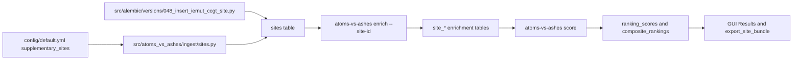

<!-- man_hours: 2.0 -->
# Feature Completion Matrix: Iernut CCGT Full Enrichment

## 1. Feature Identification

- **Feature title:** Add Iernut CCGT and full enrichment
- **User request (verbatim noun phrases):** "Add Iernut CCGT and full enrichment"; "get all relevant data for it"; "populate this line just as well as we have done for the others"
- **Owning chat / plan:** `/Users/terbolence/.cursor/plans/add_iernut_ccgt_site_2890d9b9.plan.md`
- **Date opened:** 2026-05-17
- **Date closed:** 2026-05-17

## 2. Literal Request Check

| Noun in request | Surface it implies | Where it is satisfied (file or test) | Status |
| --- | --- | --- | --- |
| Iernut CCGT | Canonical site catalogue row | `config/default.yml`, `src/alembic/versions/049_insert_iernut_ccgt_site.py`, `tests/test_config.py`, `tests/test_integration_db.py` | Implemented |
| DB | PostgreSQL `sites` row with geometry and audit trail | `src/alembic/versions/049_insert_iernut_ccgt_site.py`, `src/atoms_vs_ashes/ingest/sites.py` | Implemented |
| full enrichment | Connector stack writes per-site enrichment tables | `atoms-vs-ashes enrich ... --site-id af7f107f-71b5-5a33-8125-9ccb7060f895`, run `iernut-20260517T1051` | Implemented |
| relevant data | Site master fields, hazard, infrastructure, radiological, emergency planning, scoring, export | `sites`, `site_*` enrichment tables, `ranking_scores`, `composite_rankings`, `audit/post_processing/06_scoring/20260517_iernut_site_bundle.json` | Implemented |

## 3. End-to-End User Path Diagram



- **Entry point file:** `config/default.yml`; migration path `src/alembic/versions/049_insert_iernut_ccgt_site.py`
- **Runner/dispatcher file and command line:** `src/atoms_vs_ashes/cli.py` via existing `atoms-vs-ashes enrich <slug> --site-id <uuid>` and `atoms-vs-ashes score`
- **Engine module:** Existing connector modules under `src/atoms_vs_ashes/connectors/`; `src/atoms_vs_ashes/scoring/engine.py`
- **Persistence target(s):** `sites`, `audit_logs`, `site_natural_hazards`, `site_human_hazards`, `site_infrastructure_v2`, `site_radiological`, `site_emergency_planning`, `ranking_scores`, `screening_verdicts`, `composite_rankings`
- **Reader / consumer file(s):** `src/atoms_vs_ashes/gui/_results_data_failure.py`; `src/scripts/export_site_bundle.py`
- **User-visible acceptance evidence:** Iernut appears in DB, enrichment run `iernut-20260517T1051`, scoring run `iernut-score-20260517T1141`, and site export bundle `audit/post_processing/06_scoring/20260517_iernut_site_bundle.json`.

## 4. Surface Matrix

| Surface | Required artifact | File / symbol / test | Status | Notes |
| --- | --- | --- | --- | --- |
| GUI page / Streamlit screen | Existing Results page consumes scored site rows | `src/atoms_vs_ashes/gui/_results_data_failure.py` | Implemented | Active profile scope includes `RO` and `construction`; composite rows exist for scoring run `iernut-score-20260517T1141`. |
| CLI subcommand / flag | Existing enrichment/scoring commands accept `--site-id` / profile scope | `src/atoms_vs_ashes/cli.py` | Implemented | EP composite CLI now forwards the supplied site scope instead of processing every site. |
| Script driver | Existing export/coverage scripts read the new site | `src/scripts/export_site_bundle.py` | Implemented | Export smoke wrote `audit/post_processing/06_scoring/20260517_iernut_site_bundle.json`. |
| Runner / subprocess wiring | Existing `load_supplementary_sites` and migration path write catalogue row | `src/atoms_vs_ashes/ingest/sites.py` | Implemented | Idempotency added for re-ingest safety. |
| Engine code | Existing connectors and scoring engine operate on `Site` rows | `src/atoms_vs_ashes/scoring/engine.py` | Implemented | Scoring run processed 362 sites x 8 SMRs. |
| DB schema | Data migration inserts stable row | `src/alembic/versions/049_insert_iernut_ccgt_site.py` | Implemented | No schema change. |
| DB writers | Supplementary writer skips duplicates | `src/atoms_vs_ashes/ingest/sites.py` | Implemented | |
| CSV / file artifacts | Coverage/export artifacts from verification | `audit/post_processing/06_scoring/20260517_iernut_site_bundle.json` | Implemented | |
| Report / export reader | Site bundle exporter can render the site | `src/scripts/export_site_bundle.py` | Implemented | |
| Tests: unit | Config and scope assertions | `tests/test_config.py`, `tests/test_emergency_plan_cli.py` | Implemented | |
| Tests: persistence | Integration DB assertion for Iernut row | `tests/test_integration_db.py` | Implemented | |
| Tests: entry-point smoke | Supplementary-site and CLI scope smoke tests | `tests/test_integration_db.py::test_supplementary_sites_present`, `tests/test_emergency_plan_cli.py::test_enrich_ep_composite_forwards_site_scope` | Implemented | Negative cases fail if Iernut is only in config or EP composite ignores `--site-id`. |
| Methodology / report docs | Not applicable | N/A | Not applicable | User asked for DB/enrichment, not report prose. |
| Expert prompts | Not applicable | N/A | Not applicable | Existing prompts are sufficient. |
| Audit log | Conversation log at close | `audit/conversations/2026-05-17_iernut_ccgt_full_enrichment.md` | Implemented | |
| Man-hours metadata | First-line metadata + registry entries | `audit/man_hours_registry.yml`, touched files | Implemented | |

## 5. Negative Acceptance Tests

| Surface | Test file | Assertion that proves user-visible wiring |
| --- | --- | --- |
| Catalogue config | `tests/test_config.py` | Fails if `Iernut power station` is missing from `settings.supplementary_sites`. |
| DB catalogue | `tests/test_integration_db.py` | Fails if the migrated DB lacks an `Iernut` row with `plant_type='gas'` and Romanian country code. |
| Entry-point smoke | `tests/test_integration_db.py::test_supplementary_sites_present` | Fails if config-defined supplementary sites are not present in DB after ingestion/migration. |
| CLI scope | `tests/test_emergency_plan_cli.py` | Fails if `enrich-ep-composite --site-id` does not forward the requested site id to the EP composite runner. |

## 6. Subtle Consumption Check

| Artifact (table / CSV / JSON) | Consumer file | Surface where the user sees it |
| --- | --- | --- |
| `sites` | `src/atoms_vs_ashes/gui/_overview_scope.py`, `src/scripts/export_site_bundle.py` | Run Profile/Results scope and site export |
| `site_*` enrichment tables | `src/atoms_vs_ashes/llm/context.py`, scoring context loaders | Scoring context and coverage checks |
| `ranking_scores`, `screening_verdicts`, `composite_rankings` | `src/atoms_vs_ashes/gui/_results_data_failure.py`, `src/scripts/export_site_bundle.py` | Results page and export bundle |

## 7. Deferred Surfaces (require explicit user approval)

| Surface | Reason for deferral | User approval evidence | Follow-up ticket |
| --- | --- | --- | --- |
| None | N/A | N/A | N/A |

## 8. Final Trace (paste into the final response)

```
Catalogue: config/default.yml + src/alembic/versions/049_insert_iernut_ccgt_site.py
  -> ingest writer src/atoms_vs_ashes/ingest/sites.py (idempotent supplementary site)
  -> existing connector CLI src/atoms_vs_ashes/cli.py (atoms-vs-ashes enrich <slug> --site-id)
  -> site_* enrichment tables + scoring tables
  -> Results/export consumers src/atoms_vs_ashes/gui/_results_data_failure.py and src/scripts/export_site_bundle.py
Tests: tests/test_config.py, tests/test_integration_db.py
```
