<!-- man_hours: 3.7 -->
# Feature Completion Matrix — National Sensitivity GUI Wiring

> Opened **before** implementation of the corrective change for LL-038.
> Backend is partially in place (Phase 1.6 national stage, ORM models,
> Alembic 046, CSV writers). This matrix tracks the first-class
> GUI/server/results/report wiring that the original change skipped.

## 1. Feature Identification

- **Feature title:** National Sensitivity Engine — separated GUI, server, Results, Stability, and report wiring
- **User request (verbatim noun phrases):** "national scoring engine" in the **Scoring Engine page**; "national rankings and national sensitivity analysis"; "another section in the Scoring Engine"; downstream visibility in the **country profile** (per the report-writing plan); the existing **Results** sensitivity tab should expose the national outputs; "work for just one SMR for now" while retaining later multi-SMR capability.
- **Owning chat / plan:** `/Users/terbolence/.cursor/plans/implementation_qa_correction_0f53b685.plan.md` (process plan) and follow-up implementation plan to be opened for the code fix.
- **Date opened:** 2026-05-17
- **Date closed:** 2026-05-17

## 2. Literal Request Check

| Noun in request | Surface it implies | Where it is satisfied (file or test) | Status |
| --- | --- | --- | --- |
| "Scoring Engine page" | Separate Streamlit Run Dashboard sections for Regional Sensitivity Run and National Sensitivity Run | `src/atoms_vs_ashes/gui/screen_pages/04_run_dashboard.py` | Implemented |
| "national sensitivity analysis" | Engine path invoked by the new control | `src/atoms_vs_ashes/scoring/_national_sensitivity.py` (existing) | Implemented (backend) |
| "another section in the Scoring Engine" | Visible National Sensitivity Run subsection with independent handle/status | `src/atoms_vs_ashes/gui/screen_pages/04_run_dashboard.py` (new section) | Implemented |
| "national rankings" | New artifacts visible in Results page National Sensitivity tool | `src/atoms_vs_ashes/gui/_results_render_national_sens.py` + `src/atoms_vs_ashes/gui/_results_data_national_sens.py` | Implemented |
| "stability" | Separate Regional Stability and National Stability Results tools | `src/atoms_vs_ashes/gui/_results_render_stability.py` + `src/atoms_vs_ashes/gui/_results_data_stability.py` | Implemented |
| "country profile" (implied by report writing plan) | Country report renderer surfaces national sensitivity figures and national stability | `src/atoms_vs_ashes/gui/reports/country_sensitivity.py` + `src/scripts/_phase_1_6_country_report.py` | Implemented |

## 3. End-to-End User Path Diagram

```mermaid
flowchart LR
    EntryPoint["Run Dashboard: National Sensitivity Run\nsrc/atoms_vs_ashes/gui/screen_pages/04_run_dashboard.py"] --> Runner["GUI runner: start_national_sensitivity_run\nsrc/atoms_vs_ashes/gui/_runner_national.py"]
    Runner --> Driver["Click command\nscore national-sensitivity"]
    Driver --> Engine["National sensitivity service\nsrc/atoms_vs_ashes/scoring/national_suite.py"]
    Engine --> Persist["national_rank_sensitivity\nnational_sensitivity_summary\nnational_mc_rank_distribution\n+ CSVs under audit/post_processing/06_scoring/"]
    Persist --> ResultsRead["National Results data loader\nsrc/atoms_vs_ashes/gui/_results_data_national_sens.py"]
    Persist --> CountryRead["Country report renderer\nsrc/atoms_vs_ashes/gui/reports/country_sensitivity.py"]
    ResultsRead --> ResultsRender["Results render\nsrc/atoms_vs_ashes/gui/_results_render_national_sens.py"]
    CountryRead --> ReportOutput["report/output/sensitivity/<stamp>/national/<CC>.md"]
    ResultsRender --> Acceptance["User sees national sensitivity in Results"]
    ReportOutput --> Acceptance
```



Per-hop file commitments:

- **Entry point file:** `src/atoms_vs_ashes/gui/screen_pages/04_run_dashboard.py` — keep the old flow as "Regional Sensitivity Run" and add a separate "National Sensitivity Run" section with a single-SMR selector, national-only controls (`--mc-rank-draws`, `--min-pairs`, seed), and its own status panel.
- **Runner/dispatcher file and command line:** `src/atoms_vs_ashes/gui/_runner_national.py` — keep regional `start_sensitivity_run()` in `_runner.py` and add `start_national_sensitivity_run()` that launches `score national-sensitivity --smr-key <one-smr>`.
- **Engine module:** `src/atoms_vs_ashes/scoring/national_suite.py` plus existing pure modules (`_national_sensitivity.py`, `_national_oat.py`, `_national_mc_rank.py`).
- **Persistence target(s):** `national_rank_sensitivity`, `national_sensitivity_summary`, `national_mc_rank_distribution` ORM tables plus per-stage CSV under `audit/post_processing/06_scoring/<stamp>/national/`.
- **Reader / consumer file(s):** `src/atoms_vs_ashes/gui/_results_data_national_sens.py` (load national rows), `src/atoms_vs_ashes/gui/_results_render_national_sens.py` (render national tool), `src/atoms_vs_ashes/gui/_results_data_stability.py` (explicit regional vs national stability readers), `src/atoms_vs_ashes/gui/reports/country_sensitivity.py` (country-profile national subsection).
- **User-visible acceptance evidence:** Run Dashboard exposes separate Regional and National sections; Results auto-routes scoring vs sensitivity runs from the selected tool; Results shows Regional Sensitivity, Regional Stability, National Sensitivity, and National Stability tools; national tools include a country selector defaulting to Romania; country profile renders national sensitivity/stability.

## 4. Surface Matrix

| Surface | Required artifact | File / symbol / test | Status | Notes |
| --- | --- | --- | --- | --- |
| GUI page / Streamlit screen | Rename old section to "Regional Sensitivity Run" | `src/atoms_vs_ashes/gui/screen_pages/04_run_dashboard.py` | Implemented | Regional-only controls. |
| GUI page / Streamlit screen | New "National Sensitivity Run" section on Run Dashboard | `src/atoms_vs_ashes/gui/screen_pages/04_run_dashboard.py` | Implemented | Separate handle/status; bind to national command. |
| GUI page / Streamlit screen | National Sensitivity Run works on one saved SMR for now | `src/atoms_vs_ashes/gui/screen_pages/04_run_dashboard.py` | Implemented | SMR is derived from `Sites & SMR Setup -> SMR technologies`; national run is disabled until exactly one SMR is saved. |
| GUI page / Streamlit screen | Results tools auto-route run kind from selected tool | `src/atoms_vs_ashes/gui/_results_page_main.py`, `_results_run_picker.py` | Implemented | Normal flow no longer exposes Run pool first. |
| GUI page / Streamlit screen | Explicit Results tools: Regional/National Sensitivity and Stability | `src/atoms_vs_ashes/gui/_results_page_main.py` | Implemented | No ambiguous "Regional", "Stability", "Sensitivity" tail. |
| GUI page / Streamlit screen | National country selector defaults to Romania when available | `src/atoms_vs_ashes/gui/_results_page_main.py` | Implemented | Fallback to first in-scope country. |
| CLI subcommand / flag | National flags on Phase 1.6 driver | `src/scripts/run_phase_1_6_sensitivity.py` (`--skip-national`, `--national-mc-rank-draws`, `--min-national-pairs`) | Implemented | Already wired in `_phase_1_6_driver_stages.py`. |
| Script driver | National stage runner | `src/scripts/_phase_1_6_national_sensitivity.py` | Implemented | |
| Runner / subprocess wiring | Separate national runner forwards national flags to `score national-sensitivity` | `src/atoms_vs_ashes/gui/_runner_national.py` | Implemented | Regional runner does not pass national flags; national runner derives `--smr-key` from the active profile. |
| Engine code | Pure national modules | `src/atoms_vs_ashes/scoring/_national_ranking.py`, `_national_oat.py`, `_national_mc_rank.py`, `_national_sensitivity.py`, `_national_ranking_metrics.py` | Implemented | |
| DB schema | Alembic 046 | `src/alembic/versions/046_national_sensitivity_rankings.py` + `src/atoms_vs_ashes/db/migrations/_046_national_sensitivity.py` | Implemented | |
| DB writers | National analytics writers | `src/atoms_vs_ashes/db/analytics_writers_national.py` | Implemented | |
| CSV / file artifacts | Stamped national CSVs | `audit/post_processing/06_scoring/<stamp>/national/*.csv` | Implemented | Verify path resolution in GUI reader. |
| Report / export reader (Results) | National Results loader reads national tables | `src/atoms_vs_ashes/gui/_results_data_national_sens.py` | Implemented | Keep regional loader regional-only. |
| Report / export reader (country) | Country report renderer pulls national sensitivity/stability | `src/atoms_vs_ashes/gui/reports/country_sensitivity.py` | Implemented | Does not overload regional snapshot. |
| Tests: unit | Pure national tests | `tests/scoring/test_national_ranking.py`, `test_national_oat.py`, `test_national_sensitivity_persist.py`, `test_national_mc_rank.py` | Implemented | |
| Tests: persistence | National writer tests | `tests/scoring/test_national_sensitivity_persist.py` | Implemented | |
| Tests: entry-point smoke | GUI / runner smoke test proving the new control reaches the national command | `tests/gui/test_runner.py`, `tests/gui/test_results_tool_routing.py`, `tests/gui/test_results_sensitivity_scopes.py`, `tests/gui/test_reports_export.py` | Implemented | Negative-acceptance tests for EFF-001 / EFF-006. |
| Tests: Results UX routing | Tool selection resolves scoring/sensitivity run kind without visible Run pool switch | `tests/gui/test_results_tool_routing.py` | Implemented | Prevents empty views caused by wrong pool. |
| Methodology / report docs | National sensitivity methodology and author prompt | `report/version 1.01/methodology/sensitivity_analysis.md`, `report/version 1.01/output/writing plan/prompts/country_profile_author.md` | Implemented | Existing backend implementation updated these. |
| Expert prompts | National sensitivity interpretation prompt | `experts/scoring/national_sensitivity_report_author.md` | Implemented | |
| Audit log | Process correction and GUI fix logs | `audit/conversations/2026-05-17_implementation_qa_systemization.md`, `audit/conversations/2026-05-17_national_sensitivity_finish.md` | Implemented | |
| Man-hours metadata | First-line metadata and registry entries | touched files + `audit/man_hours_registry.yml` | Implemented | |

## 5. Negative Acceptance Tests

These tests must be added during the GUI fix. They should fail if the
national engine exists only in backend modules.

| Surface | Test file | Assertion that proves user-visible wiring |
| --- | --- | --- |
| Run Dashboard | `tests/gui/test_run_dashboard_national.py` | Rendering the Scoring Engine / Run Dashboard exposes separate "Regional Sensitivity Run" and "National Sensitivity Run" sections and a single-SMR national selector. |
| GUI runner | `tests/gui/test_runner.py` | Selecting national sensitivity launches `score national-sensitivity` with `--mc-rank-draws`, `--min-pairs`, and `--smr-key`; the regional runner does not receive national flags. |
| Results UX routing | `tests/gui/test_results_run_picker.py` | Selecting scoring tools resolves scoring runs, while regional/national sensitivity/stability tools resolve sensitivity runs without a visible Run pool radio. |
| Results page | `tests/gui/test_results_render_national.py` | A fixture with national sensitivity rows renders a National tab/section and displays rank-delta, top-k Jaccard, Spearman rho, OAT importance, and MC rank probability labels. |
| Country profile | `tests/gui/reports/test_country_sensitivity_national.py` | A fixture with national sensitivity artifacts renders a country-specific National Sensitivity subsection. |

## 6. Subtle Consumption Check

| Artifact (table / CSV / JSON) | Consumer file | Surface where the user sees it |
| --- | --- | --- |
| `national_rank_sensitivity` | `src/atoms_vs_ashes/gui/_results_data_national_sens.py` | Results page, National Sensitivity tool |
| `national_sensitivity_summary` | `src/atoms_vs_ashes/gui/_results_data_national_sens.py` | Results page, National slice robustness summaries |
| `national_mc_rank_distribution` | `src/atoms_vs_ashes/gui/_results_data_national_sens.py` | Results page, MC national rank probability table / chart |
| `audit/post_processing/06_scoring/<stamp>/national/*.csv` | `src/atoms_vs_ashes/gui/reports/country_sensitivity.py` and `src/scripts/_phase_1_6_country_report.py` | Country-profile national robustness section |

## 7. Deferred Surfaces

No surface is deferred.

| Surface | Reason for deferral | User approval evidence | Follow-up ticket |
| --- | --- | --- | --- |
| _none_ | _none_ | _none_ | _none_ |

## 8. Final Trace (paste into the final response after the GUI fix)

```text
GUI: src/atoms_vs_ashes/gui/screen_pages/04_run_dashboard.py (National Sensitivity Run)
  -> src/atoms_vs_ashes/gui/_runner_national.py (start_national_sensitivity_run)
  -> python -m atoms_vs_ashes score national-sensitivity --smr-key <selected-smr>
  -> src/atoms_vs_ashes/scoring/national_suite.py
  -> src/atoms_vs_ashes/scoring/_national_sensitivity.py + _national_oat.py + _national_mc_rank.py
  -> national_rank_sensitivity / national_sensitivity_summary / national_mc_rank_distribution + audit/post_processing/06_scoring/<stamp>/national/*.csv
  -> src/atoms_vs_ashes/gui/_results_data_national_sens.py
  -> src/atoms_vs_ashes/gui/_results_render_national_sens.py (National Sensitivity tool)
  -> src/atoms_vs_ashes/gui/_results_data_stability.py / _results_render_stability.py (National Stability tool)
  -> src/atoms_vs_ashes/gui/reports/country_sensitivity.py / src/scripts/_phase_1_6_country_report.py
  -> user sees national sensitivity in Results and country-profile outputs
Tests: tests/gui/test_runner.py, tests/gui/test_run_dashboard_national.py, tests/gui/test_results_run_picker.py, tests/gui/test_results_render_national.py, tests/gui/reports/test_country_sensitivity_national.py
```

This matrix is ready to govern the later implementation. It is not a
claim that the GUI fix is complete; the pending rows must be closed by
the implementation step.