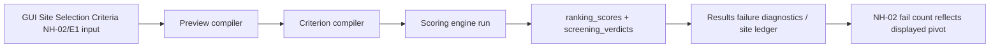

<!-- man_hours: 1.2 -->
# NH-02 Threshold Menu Source Of Truth

## 1. Feature Identification

- **Feature title:** NH-02 threshold menu source of truth
- **User request (verbatim noun phrases):** "user input", "site selection criteria", "NH-02 menu", "source of truth"
- **Owning chat / plan:** `nh02_threshold_menu_source_of_truth`
- **Date opened:** 2026-05-17
- **Date closed:** 2026-05-17

## 2. Literal Request Check

| Noun in request | Surface it implies | Where it is satisfied (file or test) | Status |
| --- | --- | --- | --- |
| user input | Threshold-editor numeric input must determine runtime scoring | `src/atoms_vs_ashes/criterion_spec/compiler.py`; `tests/scoring/test_threshold_propagation.py` | Implemented |
| site selection criteria | Streamlit Site Selection Criteria preview page | `src/atoms_vs_ashes/gui/_threshold_editor_widgets.py`; `tests/criterion_spec/test_preview.py` | Implemented |
| NH-02 menu | `NH-02 / E1` threshold control | `src/atoms_vs_ashes/criterion_spec/preview.py`; `tests/criterion_spec/test_preview.py` | Implemented |
| source of truth | Compiler bands and exclusion expression use the shown value | `tests/criterion_spec/test_excl_expr_derived_from_pivot.py`; `tests/scoring/test_threshold_band_runtime.py` | Implemented |

## 3. End-to-End User Path Diagram



- **Entry point file:** `src/atoms_vs_ashes/gui/screen_pages/03_threshold_editor.py`
- **Runner/dispatcher file and command line:** `src/atoms_vs_ashes/gui/_threshold_editor_impl.py` calls `build_live_preview(...)`; `src/atoms_vs_ashes/gui/_runner.py` exports active profile to `atoms-vs-ashes score run --profile <runtime-yaml>`.
- **Engine module:** `src/atoms_vs_ashes/criterion_spec/compiler.py` and `src/atoms_vs_ashes/scoring/engine.py`
- **Persistence target(s):** existing `ranking_scores`, `screening_verdicts`, `scoring_run_snapshots`
- **Reader / consumer file(s):** `src/atoms_vs_ashes/gui/_results_data_failure.py`, `src/atoms_vs_ashes/gui/_results_data_exclusion_diag.py`
- **User-visible acceptance evidence:** `NH-02/E1` preview value, compiled 5-6 band, and hard fail expression use the same km value.

## 4. Surface Matrix

| Surface | Required artifact | File / symbol / test | Status | Notes |
| --- | --- | --- | --- | --- |
| GUI page / Streamlit screen | Existing NH-02/E1 threshold input remains visible and becomes authoritative | `src/atoms_vs_ashes/gui/_threshold_editor_widgets.py::threshold_input`; `tests/criterion_spec/test_preview.py::test_nh02_preview_value_matches_compiled_threshold_default` | Implemented | No new widget required; preview value now matches compiler. |
| CLI subcommand / flag | Existing `score run --profile` consumes profile thresholds | `src/atoms_vs_ashes/scoring/_cli_run.py::execute_score_run` | Not applicable | Existing path already passes profile thresholds; no new flag requested. |
| Script driver | Not applicable | N/A | Not applicable | No script surface requested. |
| Runner / subprocess wiring | Existing GUI runner forwards active profile | `src/atoms_vs_ashes/gui/_runner.py`; `src/atoms_vs_ashes/scoring/_cli_run.py::execute_score_run` | Implemented | Existing runner profile path preserved. |
| Engine code | Compiler resolves NH-02 pivot from user-editable threshold value | `src/atoms_vs_ashes/criterion_spec/compiler.py`; `tests/scoring/test_threshold_propagation.py` | Implemented | Core behavior changed. |
| DB schema | Existing tables reused | `threshold_overrides`, `ranking_scores`, `screening_verdicts` | Not applicable | No schema change. |
| DB writers | Existing threshold override writer reused | `src/atoms_vs_ashes/db/threshold_overrides.py` | Not applicable | No writer change expected. |
| CSV / file artifacts | No new scoring artifact | N/A | Not applicable | Existing audit outputs can be regenerated later. |
| Report / export reader | Existing Results diagnostics consume persisted verdicts | `src/atoms_vs_ashes/gui/_results_data_failure.py`; `src/atoms_vs_ashes/gui/_results_data_exclusion_diag.py` | Implemented | No report format change. |
| Tests: unit | Compiler behavior for default and override pivots | `tests/criterion_spec/test_excl_expr_derived_from_pivot.py`; `tests/scoring/test_threshold_band_runtime.py` | Implemented | Covers 8 default and 5 override. |
| Tests: persistence | Existing threshold writer tests sufficient | Existing tests | Not applicable | No persistence behavior changes. |
| Tests: entry-point smoke | Preview-level test proves GUI-visible value matches compiled behavior | `tests/criterion_spec/test_preview.py::test_nh02_preview_value_matches_compiled_threshold_default` | Implemented | Required outer-surface proxy. |
| Methodology / report docs | Not requested | N/A | Not applicable | No report wording change. |
| Expert prompts | Not requested | N/A | Not applicable | No prompt change. |
| Audit log | Conversation log and plan mirrors | `audit/conversations/2026-05-17_nh02_threshold_menu_source_of_truth.md`; plan mirrors | Implemented | Created at close-out. |
| Man-hours metadata | Metadata and registry updated | `audit/man_hours_registry.yml` | Implemented | Updated for touched files. |

## 5. Negative Acceptance Tests

| Surface | Test file | Assertion that proves user-visible wiring |
| --- | --- | --- |
| Site Selection Criteria preview | `tests/criterion_spec/test_preview.py::test_nh02_preview_value_matches_compiled_threshold_default` | `NH-02/E1` preview value 8 compiles to `nearest_fault_km < 8` and `nearest_fault_km >= 8.0`. |
| Scoring compiler | `tests/criterion_spec/test_excl_expr_derived_from_pivot.py` | The default metadata value, not hidden recipe pivot, is used unless a user override is present. |

## 6. Subtle Consumption Check

| Artifact (table / CSV / JSON) | Consumer file | Surface where the user sees it |
| --- | --- | --- |
| `screening_verdicts` | `src/atoms_vs_ashes/gui/_results_data_failure.py`; `src/atoms_vs_ashes/gui/_results_data_exclusion_diag.py` | Results page failure ledger and diagnostics |
| `ranking_scores` | `src/atoms_vs_ashes/gui/_results_data_detail.py` | Site detail bars |
| `threshold_overrides` | `src/atoms_vs_ashes/gui/_state.py`; `src/atoms_vs_ashes/runprofile/loader.py` | Site Selection Criteria threshold input and score runner profile |

## 7. Deferred Surfaces (require explicit user approval)

| Surface | Reason for deferral | User approval evidence | Follow-up ticket |
| --- | --- | --- | --- |

## 8. Final Trace (paste into the final response)

```
GUI: src/atoms_vs_ashes/gui/screen_pages/03_threshold_editor.py -> src/atoms_vs_ashes/gui/_threshold_editor_impl.py (build_live_preview with fail_thresholds) -> src/atoms_vs_ashes/criterion_spec/preview.py -> src/atoms_vs_ashes/criterion_spec/compiler.py (NH-02/E1 pivot resolves from displayed/user threshold) -> src/atoms_vs_ashes/scoring/_cli_run.py / src/atoms_vs_ashes/scoring/engine.py -> ranking_scores + screening_verdicts -> Results readers src/atoms_vs_ashes/gui/_results_data_failure.py and src/atoms_vs_ashes/gui/_results_data_exclusion_diag.py; Tests: tests/criterion_spec/test_preview.py, tests/criterion_spec/test_excl_expr_derived_from_pivot.py, tests/scoring/test_threshold_propagation.py, tests/scoring/test_threshold_band_runtime.py
```
