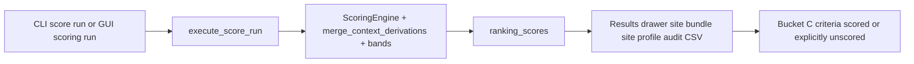

<!-- man_hours: 3.0 -->
# Partial Data Scoring Feature Completion Matrix

## 1. Feature Identification

- **Feature title:** Bucket C / partial-data scoring repair (8 criteria)
- **User request (verbatim noun phrases):** "partial data", "8 workers", "derivations", "sentinels", "read-only audit", "GUI unscored", "experts", "no new connectors"
- **Owning chat / plan:** `/Users/terbolence/.cursor/plans/partial_data_8-worker_09457de8.plan.md`
- **Date opened:** 2026-05-17
- **Date closed:** 2026-05-17

## 2. Literal Request Check

| Noun in request | Surface it implies | Where it is satisfied (file or test) | Status |
| --- | --- | --- | --- |
| `partial data` / Bucket C | EP-03, HI-02, HI-03, HI-04, NH-09, NH-11, RI-03, RI-05 | Scoring YAML, derivations, tests | Implemented |
| `8 workers` | Eight parallel track workflow doc | `criteria/partial_data_parallel_band_workflows.md` | Implemented |
| `derivations` | Coordinated merge_context_derivations PR | `src/atoms_vs_ashes/scoring/merge_context_derivations.py`, `tests/scoring/test_partial_data_bands.py` | Implemented |
| `sentinels` | HI-03 search_completed + HI-02/04 parity | derivations + HI YAML | Implemented |
| `read-only audit` | `audit_partial_data_ok.py` + CSV/memoes | `src/scripts/audit_partial_data_ok.py`, `audit/post_processing/06_scoring/20260517_partial_data_*` | Implemented |
| `GUI unscored` | Existing consumers (Tier 1 pattern) | `src/atoms_vs_ashes/gui/_results_*`, prior Tier 1 consumer tests | Implemented (no regression) |
| `experts` | Curator/siting/architect memos | `experts/quality/data_science_siting_curator.md`, curation memos, architect memo | Implemented |
| `auditor` | Independent conformance pass and scored examples | `audit/post_processing/06_scoring/20260517_partial_data_auditor_review.md`, `audit/post_processing/06_scoring/20260517_partial_data_scored_examples.md` | Implemented |
| `no new connectors` | Scoring/context only | Matrix §7 | Not applicable |

## 3. End-to-End User Path Diagram



- **Entry point file:** `src/atoms_vs_ashes/scoring/_cli.py`; GUI `src/atoms_vs_ashes/gui/screen_pages/04_run_dashboard.py`
- **Runner/dispatcher:** `src/atoms_vs_ashes/scoring/_cli_run.py`; GUI `src/atoms_vs_ashes/gui/_runner.py`
- **Engine module:** `src/atoms_vs_ashes/scoring/engine.py`, `merge_context_derivations.py`, `bands.py`
- **Persistence:** `ranking_scores`; read-only `audit/post_processing/06_scoring/20260517_partial_data_*`
- **Readers:** `src/atoms_vs_ashes/gui/_results_site_detail_bars.py`, `src/atoms_vs_ashes/reporting/site_bundle.py`, `src/scripts/_site_profile_*.py`
- **Acceptance:** Read-only audit + unit tests; DB rescore gated

## 4. Surface Matrix

| Surface | Required artifact | File / symbol / test | Status | Notes |
| --- | --- | --- | --- | --- |
| GUI | Unscored semantics preserved | Tier 1 consumer tests | Implemented | No new GUI control |
| CLI | Existing score run entry | `_cli_run.py` | Implemented | Rescore needs consent |
| Script driver | Read-only audit | `src/scripts/audit_partial_data_ok.py` | Implemented | |
| Engine | Derivations + NH-11 partial aggregate | `merge_context_derivations.py`, `bands.py` | Implemented | |
| CSV artifacts | Audit outputs | `audit/post_processing/06_scoring/20260517_partial_data_*` | Implemented | From local DB when available |
| Tests | partial_data_* + audit script | `tests/scoring/test_partial_data_*`, `tests/scripts/test_audit_partial_data_ok.py` | Implemented | 25 passed after auditor fixes |
| Criterion docs | Ranking criteria updated | `criteria/ranking/EP-03*`, workflow doc | Partial | EP-03 doc note in workflow |
| Audit log | Conversation | `audit/conversations/2026-05-17_partial_data_scoring.md` | Implemented | |
| Man-hours | Registry | `audit/man_hours_registry.yml` | Implemented | |

## 5. Negative Acceptance Tests

| Surface | Test file | Assertion |
| --- | --- | --- |
| Audit script | `tests/scripts/test_audit_partial_data_ok.py` | Writes CSV + per-criterion memos |
| Bands | `tests/scoring/test_partial_data_bands.py` | Sentinel, EP-03 interim, RI-03/05, NH-11 partial |
| Compiler parity | `tests/scoring/test_partial_data_compiler_parity.py` | Spec/rubric primary_metric + db_fields |

## 6. Subtle Consumption Check

| Artifact | Consumer | Surface |
| --- | --- | --- |
| `ranking_scores` | GUI Results, site bundle | Drawer bars |
| `audit/post_processing/06_scoring/20260517_partial_data_*` | Human review | Consent gate |

## 7. Deferred Surfaces

| Surface | Reason | User approval |
| --- | --- | --- |
| `score run` / cohort rescore | DB write | Pending explicit consent |
| HI-03 LLM distance backfill | Domain table write | Pending |
| EP-03 GEE re-enrichment | No GEE access in current environment | Deferred by user; tracked in `IMPROVEMENTS.md` IMP-0012 |

## 8. Final Trace (paste into the final response)

```
CLI/GUI scoring: src/atoms_vs_ashes/scoring/_cli.py + gui/screen_pages/04_run_dashboard.py -> scoring/_cli_run.py + gui/_runner.py -> scoring/engine.py + merge_context_derivations.py + bands.py using config/scoring_{rubrics,specs}/{ep_emergency_planning,hi_human_induced,nh_natural_hazards,ri_radiological}.yaml -> ranking_scores + audit/post_processing/06_scoring/20260517_partial_data_* -> gui/_results_* + reporting/site_bundle.py + scripts/_site_profile_*.py -> tests/scoring/test_partial_data_bands.py, test_partial_data_compiler_parity.py, tests/scripts/test_audit_partial_data_ok.py
```
