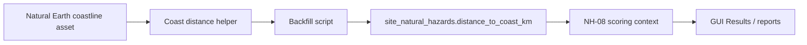

<!-- man_hours: 1.0 -->
# S-38 Natural Earth Coast Distance Feature Completion Matrix

## 1. Feature Identification

- **Feature title:** S-38 Natural Earth coast-distance source for NH-08
- **User request (verbatim noun phrases):** "S-38 Natural Earth Coast Distance Plan"; "Implement the plan"; "new data source"
- **Owning chat / plan:** `/Users/terbolence/.cursor/plans/natural-earth-coast-distance_8c1d28b8.plan.md`
- **Date opened:** 2026-05-17
- **Date closed:** 2026-05-17

## 2. Literal Request Check

| Noun in request | Surface it implies | Where it is satisfied (file or test) | Status |
| --- | --- | --- | --- |
| S-38 Natural Earth Coast Distance Plan | Data-source implementation | `src/atoms_vs_ashes/connectors/natural_earth/` | Implemented |
| new data source | Source asset + provenance | `data/cartography/ne_50m_coastline.geojson`, `src/scripts/backfill_s38_coast_distance.py` | Implemented |
| plan | Audit/completion trace | This matrix + audit conversation | Implemented |

## 3. End-to-End User Path Diagram



- **Entry point file:** `src/scripts/backfill_s38_coast_distance.py`
- **Runner/dispatcher file and command line:** `PYTHONPATH=src python src/scripts/backfill_s38_coast_distance.py --apply`
- **Engine module:** `src/atoms_vs_ashes/connectors/natural_earth/coastline.py`
- **Persistence target(s):** `site_natural_hazards.distance_to_coast_km`, `nh08_quality`, `nh08_comment`
- **Reader / consumer file(s):** `src/atoms_vs_ashes/scoring/merge_context_derivations.py`, `src/atoms_vs_ashes/scoring/merge_resolver.py`, GUI result detail readers
- **User-visible acceptance evidence:** Scoring run `20260517T104618_459ae424` gives Braila NH-08 score `9.5` and A9 verdict `pass`.

## 4. Surface Matrix

| Surface | Required artifact | File / symbol / test | Status | Notes |
| --- | --- | --- | --- | --- |
| GUI page / Streamlit screen | Existing Results page consumes scoring verdicts | `src/atoms_vs_ashes/gui/_results_data_detail.py` | Implemented | Existing consumer reads `ScreeningVerdict` / ranking rows after rerun. |
| CLI subcommand / flag | Not a package CLI; script entry point is used | N/A | Not applicable | Plan specified script backfill. |
| Script driver | Dry-run/apply backfill | `src/scripts/backfill_s38_coast_distance.py` | Implemented | Dry-run by default. |
| Runner / subprocess wiring | Command line documented and tested | `tests/scripts/test_backfill_s38_coast_distance.py` | Implemented | Entry-point smoke covers dry-run path. |
| Engine code | Pure coast-distance module | `src/atoms_vs_ashes/connectors/natural_earth/coastline.py` | Implemented | Loads vendored coastline and computes distances. |
| DB schema | Existing column | `src/atoms_vs_ashes/db/models.py` | Not applicable | `distance_to_coast_km` already exists. |
| DB writers | Idempotent writer in backfill script | `apply_distances()` | Implemented | Creates NH row if missing. |
| CSV / file artifacts | Dry-run summary | Script stdout | Not applicable | No new persistent CSV required. |
| Report / export reader | Existing site bundle/profile readers | `src/scripts/_site_profile_intelligence.py` | Implemented | Existing readers include `distance_to_coast_km`. |
| Tests: unit | Pure logic test | `tests/connectors/test_natural_earth_coastline.py` | Implemented | Synthetic coastline and vendored asset smoke. |
| Tests: persistence | Backfill writer test | `tests/scripts/test_backfill_s38_coast_distance.py` | Implemented | Uses mocked distances/session. |
| Tests: entry-point smoke | Script dry-run test | `tests/scripts/test_backfill_s38_coast_distance.py` | Implemented | Proves script entry reaches helper. |
| Methodology / report docs | Criterion docs updated | `criteria/avoidance/NH-08_A9_coastal_flooding.md`, `criteria/ranking/NH-08 — Coastal flooding storm surge and tsunami.md` | Implemented | Documents measured coast-distance source. |
| Expert prompts | No prompt changes needed | N/A | Not applicable | Deterministic source replaces prompt inference. |
| Audit log | Conversation log | `audit/conversations/2026-05-17_s38-natural-earth-coast-distance.md` | Implemented | Created at completion. |
| Man-hours metadata | Metadata + registry | `audit/man_hours_registry.yml`, `audit/man_hours_summary.md` | Implemented | Updated at completion. |

## 5. Negative Acceptance Tests

| Surface | Test file | Assertion that proves user-visible wiring |
| --- | --- | --- |
| Script driver | `tests/scripts/test_backfill_s38_coast_distance.py` | Dry-run calls coast-distance collection and does not write without `--apply`. |
| Engine helper | `tests/connectors/test_natural_earth_coastline.py` | Inland point is farther from synthetic coast than coastal point. |
| NH-08 scoring | `tests/scoring/test_threshold_band_runtime.py` | Measured inland coast distance scores favourable and missing coast distance alone does not caution. |

## 6. Subtle Consumption Check

| Artifact (table / CSV / JSON) | Consumer file | Surface where the user sees it |
| --- | --- | --- |
| `site_natural_hazards.distance_to_coast_km` | `src/atoms_vs_ashes/scoring/merge_resolver.py` | NH-08 score/verdict in GUI Results and reports |
| `site_natural_hazards.nh08_comment` | site bundle/profile exporters | Site profile evidence text |

## 7. Deferred Surfaces (require explicit user approval)

| Surface | Reason for deferral | User approval evidence | Follow-up ticket |
| --- | --- | --- | --- |
| None | N/A | N/A | N/A |

## 8. Final Trace (paste into the final response)

```
S-38: data/cartography/ne_50m_coastline.geojson
  -> src/atoms_vs_ashes/connectors/natural_earth/coastline.py (distance_to_coast_km)
  -> src/scripts/backfill_s38_coast_distance.py (--apply writer)
  -> site_natural_hazards.distance_to_coast_km + nh08_comment
  -> src/atoms_vs_ashes/scoring/merge_context_derivations.py alias coast_distance_km
  -> NH-08 spec/rubric scoring
  -> GUI Results detail / avoidance flags
Tests: tests/connectors/test_natural_earth_coastline.py, tests/scripts/test_backfill_s38_coast_distance.py, tests/scoring/test_threshold_band_runtime.py
```
