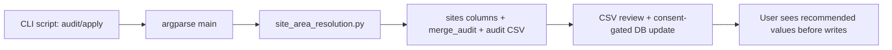

<!-- man_hours: 2.2 -->
# Feature Completion Matrix — Site Area Resolution

## 1. Feature Identification

- **Feature title:** Site area resolution and confidence audit
- **User request (verbatim noun phrases):** "site_area metric", "data sources", "formula/process", "new site_area value", "confidence", "suspicious entries", "rewrite the data with my consent only"
- **Owning chat / plan:** `site_area_resolution_2934200d`
- **Date opened:** 2026-05-17
- **Date closed:** 2026-05-17

## 2. Literal Request Check

| Noun in request | Surface it implies | Where it is satisfied (file or test) | Status |
| --- | --- | --- | --- |
| `site_area metric` | Resolver engine | `src/atoms_vs_ashes/analysis/site_area_resolution.py`; `tests/test_site_area_resolution.py` | Implemented |
| `data sources` | Read-only audit CSV and CLI output | `src/scripts/audit_site_area_confidence.py`; `tests/scripts/test_audit_site_area_confidence.py` | Implemented |
| `formula/process` | Resolver logic and tests | `src/atoms_vs_ashes/analysis/site_area_resolution.py`; `tests/test_site_area_resolution.py` | Implemented |
| `new site_area value` | Consent-gated apply script and DB columns | `src/scripts/apply_site_area_resolution.py`; `src/alembic/versions/048_site_area_resolution_provenance.py` | Implemented |
| `confidence` | Candidate scoring and provenance columns | `SiteAreaCandidate.confidence_score`; `sites.site_area_confidence` | Implemented |
| `suspicious entries` | Audit report | `audit/post_processing/06_scoring/20260517_site_area_confidence.csv` | Implemented |
| `rewrite the data with my consent only` | Dry-run default and explicit write flag | `src/scripts/apply_site_area_resolution.py`; CLI smoke test | Implemented |

## 3. End-to-End User Path Diagram



- **Entry point file:** `src/scripts/audit_site_area_confidence.py`, `src/scripts/apply_site_area_resolution.py`
- **Runner/dispatcher file and command line:** `python src/scripts/audit_site_area_confidence.py --out ...`; `python src/scripts/apply_site_area_resolution.py --dry-run`
- **Engine module:** `src/atoms_vs_ashes/analysis/site_area_resolution.py`
- **Persistence target(s):** `sites.site_area_*`, `merge_audit`, `audit/post_processing/06_scoring/*site_area_confidence.csv`
- **Reader / consumer file(s):** `src/scripts/audit_site_area_confidence.py` reads the DB and writes CSV; `src/scripts/apply_site_area_resolution.py` reads the same recommendations before update
- **User-visible acceptance evidence:** CLI smoke tests assert dry-run output and consent protection

## 4. Surface Matrix

| Surface | Required artifact | File / symbol / test | Status | Notes |
| --- | --- | --- | --- | --- |
| GUI page / Streamlit screen | Visible control or section that triggers the feature | N/A | Not applicable | User requested a data process and consent-gated rewrite, not GUI wiring |
| CLI subcommand / flag | New flag wired through `argparse` | `src/scripts/audit_site_area_confidence.py`; `src/scripts/apply_site_area_resolution.py`; `tests/scripts/test_audit_site_area_confidence.py`; `tests/scripts/test_apply_site_area_resolution.py` | Implemented | Script entry points are the user-visible surface |
| Script driver | Updated orchestrator under `src/scripts/` | Same scripts | Implemented | Audit and apply are separate to enforce consent |
| Runner / subprocess wiring | Command string built and forwarded | N/A | Not applicable | No GUI/subprocess runner requested |
| Engine code | Pure module under `src/atoms_vs_ashes/` | `src/atoms_vs_ashes/analysis/site_area_resolution.py`; `src/atoms_vs_ashes/analysis/site_area_db.py` | Implemented | Candidate scoring and selection |
| DB schema | Alembic revision + ORM model | `src/alembic/versions/048_site_area_resolution_provenance.py`; `src/atoms_vs_ashes/db/models.py` | Implemented | Adds provenance columns only |
| DB writers | Idempotent writer helpers | `src/scripts/apply_site_area_resolution.py`; `tests/scripts/test_apply_site_area_resolution.py` | Implemented | Dry-run default; explicit consent required |
| CSV / file artifacts | Stamped output under `audit/post_processing/` | `audit/post_processing/06_scoring/20260517_site_area_confidence.csv` | Implemented | Suspicious-entry report |
| Report / export reader | Results tab or assembler that surfaces the output | Deferred | Deferred | Scoring/report narrative deferred by user until footprint logic is accepted |
| Tests: unit | Pure logic tests | `tests/test_site_area_resolution.py` | Implemented | Candidate scoring and selection |
| Tests: persistence | DB writer tests | `tests/scripts/test_apply_site_area_resolution.py` | Implemented | Uses fake connection/cursor |
| Tests: entry-point smoke | CLI smoke test proving script reaches engine | `tests/scripts/test_audit_site_area_confidence.py` | Implemented | Verifies dry-run CSV path |
| Methodology / report docs | Updates under report methodology | Deferred | Deferred | Separate criterion/report decision postponed |
| Expert prompts | Updated prompt under `experts/` | N/A | Not applicable | No LLM prompt changes; no live API calls |
| Audit log | Conversation log | `audit/conversations/2026-05-17_site_area_resolution.md` | Implemented | Final action |
| Man-hours metadata | First-line metadata and registry | `audit/man_hours_registry.yml` | Implemented | Updated after file set stabilized |

## 5. Negative Acceptance Tests

| Surface | Test file | Assertion that proves user-visible wiring |
| --- | --- | --- |
| Audit CLI | `tests/scripts/test_audit_site_area_confidence.py` | Script main writes a CSV from supplied rows and includes suspicious flags |
| Apply CLI | `tests/scripts/test_apply_site_area_resolution.py` | Write mode fails without explicit consent flag |
| Resolver | `tests/test_site_area_resolution.py` | Bounded inference covers buildable, capped contiguous, favourable envelope, capacity fallback, and cancelled-zero guardrails |

## 6. Subtle Consumption Check

| Artifact (table / CSV / JSON) | Consumer file | Surface where the user sees it |
| --- | --- | --- |
| `audit/post_processing/06_scoring/*site_area_confidence.csv` | `src/scripts/audit_site_area_confidence.py` | User review before consent |
| `sites.site_area_candidates_json` | `src/scripts/apply_site_area_resolution.py` and DB inspection | Provenance for every write |
| `merge_audit` rows for `site_area_resolve_v2` | `src/scripts/audit_site_area_confidence.py` | Side-by-side current vs proposed |

## 7. Deferred Surfaces (require explicit user approval)

| Surface | Reason for deferral | User approval evidence | Follow-up ticket |
| --- | --- | --- | --- |
| Favourable-area criterion split | User asked to postpone until `site_area` logic is visible | "postpone the answers until I see how you would solve the site_area metric" | Future NS-04/NS-11 decision |
| NS-05/A15 scoring rewrite | Depends on accepting footprint logic first | Same as above | Future scoring plan |
| Site description/report prose | Depends on final two-number policy | Same as above | Future report update |

## 8. Final Trace (paste into the final response)

```
CLI: src/scripts/audit_site_area_confidence.py / src/scripts/apply_site_area_resolution.py
  -> src/atoms_vs_ashes/analysis/site_area_resolution.py
  -> sites.site_area_* + merge_audit (DB) + audit/post_processing/06_scoring/*site_area_confidence.csv
  -> CSV review + consent-gated apply script
Tests: tests/test_site_area_resolution.py, tests/scripts/test_audit_site_area_confidence.py, tests/scripts/test_apply_site_area_resolution.py
```
