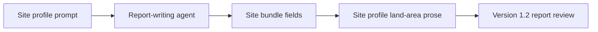

<!-- man_hours: 0.4 -->
# Feature Completion Matrix — Site Area Template Wiring

## 1. Feature Identification

- **Feature title:** Site area template wiring
- **User request (verbatim noun phrases):** `each site`, `clear template`, `site area available`, `site_area_ha`, `overall area available for development`, `favourable_area_ha`, `sites template`
- **Owning chat / plan:** `site_area_template_wiring_81f7d2a9.plan.md`
- **Date opened:** 2026-05-17
- **Date closed:** 2026-05-17

## 2. Literal Request Check

| Noun in request | Surface it implies | Where it is satisfied (file or test) | Status |
| --- | --- | --- | --- |
| `each site` | Site profile output | `report/version 1.02/output/report/writing plan/prompts/site_profile_author.md` | Implemented |
| `clear template` | Writing prompt/template | `report/version 1.02/output/report/writing plan/prompts/site_profile_author.md` | Implemented |
| `site_area_ha` | DB/bundle field verification | `src/atoms_vs_ashes/db/models.py`; `src/atoms_vs_ashes/reporting/site_bundle.py`; `tests/reporting/test_site_bundle_land_area.py` | Implemented |
| `favourable_area_ha` | DB/bundle field verification | `src/atoms_vs_ashes/db/models.py`; `src/atoms_vs_ashes/reporting/site_bundle.py`; `tests/reporting/test_site_bundle_land_area.py` | Implemented |
| `sites template` | Site profile author prompt | `report/version 1.02/output/report/writing plan/prompts/site_profile_author.md` | Implemented |

## 3. End-to-End User Path Diagram

- **Entry point file:** Active site profile prompt under `report/version 1.02/output/report/writing plan/prompts/site_profile_author.md`
- **Runner/dispatcher file and command line:** Not applicable; prompt/control update only.
- **Engine module:** Existing bundle/renderer modules if inspected.
- **Persistence target(s):** No new persisted artifact.
- **Reader / consumer file(s):** Site profile Markdown generated from the prompt.
- **User-visible acceptance evidence:** Prompt explicitly requires correct site-area and favourable/developable area interpretation.

## 4. Surface Matrix

| Surface | Required artifact | File / symbol / test | Status | Notes |
| --- | --- | --- | --- | --- |
| GUI page / Streamlit screen | Visible control or section that triggers the feature | N/A | Not applicable | Documentation/prompt change only. |
| CLI subcommand / flag | New flag wired through `argparse` / `click` | N/A | Not applicable | No CLI change. |
| Script driver | Updated orchestrator under `src/scripts/` if applicable | `src/scripts/export_site_bundle.py` inspected | Implemented | No script edit needed. |
| Runner / subprocess wiring | Command string built and forwarded | N/A | Not applicable | No runner change. |
| Engine code | Pure module under `src/atoms_vs_ashes/` | `src/atoms_vs_ashes/reporting/site_bundle.py` inspected | Implemented | Existing bundle already exposes `land_area`. |
| DB schema | Alembic revision + ORM model | `src/atoms_vs_ashes/db/models.py` | Implemented | Existing fields verified. |
| DB writers | Idempotent writer helpers | N/A | Not applicable | No writer change. |
| CSV / file artifacts | Stamped output under `audit/post_processing/` or `report/output/` | Prompt/control file | Implemented | Writing-control artifact only. |
| Report / export reader | Results tab, country/site bundle, PDF/MD assembler that surfaces the output | Site profile prompt | Implemented | Required user surface. |
| Tests: unit | Pure logic tests | N/A | Not applicable | No code logic change. |
| Tests: persistence | DB writer tests | N/A | Not applicable | No persistence. |
| Tests: entry-point smoke | GUI / CLI / runner test proving the new control reaches the new code | Lint/read verification | Implemented | Docs-only verification. |
| Methodology / report docs | Updates under report controls | Site prompt / writing controls | Implemented | Main change. |
| Expert prompts | Updated or new prompt under `experts/` | Site and specialist prompts | Implemented | Report prompts, not root expert prompt. |
| Audit log | Conversation log under `audit/conversations/` and plan mirror | Audit log + plan mirrors | Implemented | Required. |
| Man-hours metadata | First-line metadata plus registry | `audit/man_hours_registry.yml` | Implemented | Required. |

## 5. Negative Acceptance Tests

| Surface | Test file | Assertion that proves user-visible wiring |
| --- | --- | --- |
| Site profile prompt | Manual/lint inspection | Prompt names the correct field(s), interpretation, and caution against overstating development-ready land. |

## 6. Subtle Consumption Check

| Artifact (table / CSV / JSON) | Consumer file | Surface where the user sees it |
| --- | --- | --- |
| Existing site bundle land-area fields | Site profile prompt / generated site profile | Chapter 5 site profile land-area discussion |

## 7. Deferred Surfaces

| Surface | Reason for deferral | User approval evidence | Follow-up ticket |
| --- | --- | --- | --- |
| None | Not applicable | Not applicable | Not applicable |

## 8. Final Trace

`sites.site_area_ha` + `site_infrastructure_v2.favourable_area_ha` -> `src/atoms_vs_ashes/reporting/site_bundle.py::_land_area_summary` -> `report/version 1.02/output/report/writing plan/prompts/site_profile_author.md` + `prompts/specialists/siting_expert.md` -> version 1.2 site profile land-area prose.
