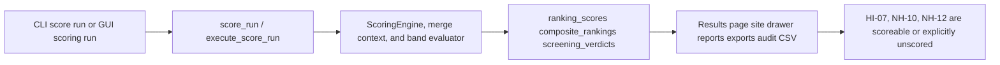

<!-- man_hours: 2.5 -->
# Tier 1 Data OK Scoring Feature Completion Matrix

## 1. Feature Identification

- **Feature title:** Tier 1 Data OK scoring repair for HI-07, NH-10, and NH-12
- **User request (verbatim noun phrases):** "tier1 data ok", "repository", "experts", "software design", "implementation", "verifications", "business logic", "scoring bands", "criteria", "Phase 1 / Bucket B", "connector work", "system prompt", "read-only distribution/context audit", "baseline run", "GUI/results/report/export consumers", "criterion docs", "tests", "audit conversation/man-hours"
- **Owning chat / plan:** `/Users/terbolence/.cursor/plans/tier1_data_ok_5b567a39.plan.md`
- **Date opened:** 2026-05-17
- **Date closed:** 2026-05-17

## 2. Literal Request Check

| Noun in request | Surface it implies | Where it is satisfied (file or test) | Status |
| --- | --- | --- | --- |
| `tier1 data ok` / `Phase 1 / Bucket B` | HI-07, NH-10, NH-12 scoring/context repair only | `config/scoring_rubrics/hi_human_induced.yaml`, `config/scoring_specs/hi_human_induced.yaml`, `config/scoring_rubrics/nh_natural_hazards.yaml`, `config/scoring_specs/nh_natural_hazards.yaml`, focused scoring tests | Implemented |
| `repository` | Scoped repo implementation under `/Users/terbolence/projects/atoms_vs_ashes` | This matrix and changed project files | Implemented |
| `experts` | Local expert prompts used as implementation gates, no external model calls | `experts/connectors/software_architect.md`, `experts/connectors/senior_software_engineer.md`, `experts/quality/auditor.md`, `experts/quality/siting_expert.md`, `experts/quality/lessons_learned.md` | Implemented |
| `software design` / `implementation` | Existing scoring engine/config patterns preserved; no connector work | Scoring config, context derivation, read-only audit script, tests | Implemented |
| `verifications` | Focused local tests, lints, and read-only audit artifacts | `tests/scoring/`, `tests/scripts/`, `tests/gui/`, generated audit Markdown/CSV | Implemented |
| `business logic` / `scoring bands` | Distribution-aware HI-07/NH-10/NH-12 band updates with metric caveats | Criterion docs and YAML descriptors | Implemented |
| `criteria` | Criterion docs updated for accepted columns and caveats | `criteria/ranking/HI-07 — Electromagnetic interference.md`, `criteria/ranking/NH-10 — Extreme winds.md`, `criteria/ranking/NH-12 — Extreme temperatures.md` | Implemented |
| `connector work` | Explicitly excluded from this implementation | Matrix §7 notes no new connector/schema/backfill work | Not applicable |
| `system prompt` | New data-science siting curator prompt | `experts/quality/data_science_siting_curator.md` | Implemented |
| `read-only distribution/context audit` | Repeatable local read-only audit script and artifacts | `src/scripts/audit_tier1_data_ok.py`, `audit/post_processing/06_scoring/20260517_tier1_data_ok_*` | Implemented |
| `baseline run` | Audit defaults to `20260517T104618_459ae424`, `nuscale_voygr6`; local DB returned 362 site rows and 0 baseline `ranking_scores` rows | `src/scripts/audit_tier1_data_ok.py`, audit memo | Implemented with caveat |
| `GUI/results/report/export consumers` | Unscored rows render/export as unscored, not real `5.0` evidence | `src/atoms_vs_ashes/gui/_results_site_detail_bars.py`, `src/atoms_vs_ashes/gui/_results_data_detail.py`, `src/atoms_vs_ashes/gui/_results_render_drawer.py`, `src/atoms_vs_ashes/reporting/site_bundle.py`, `src/scripts/_site_profile_intelligence.py`, `src/scripts/_site_profile_markdown.py`, consumer tests | Implemented |
| `tests` | Context, band, compiler parity, script, and consumer tests | `tests/scoring/`, `tests/scripts/`, `tests/gui/` | Implemented |
| `audit conversation/man-hours` | Conversation log and man-hours registry/summary updated | `audit/conversations/2026-05-17_tier1_data_ok_scoring.md`, `audit/man_hours_registry.yml`, `audit/man_hours_summary.md` | Implemented |

## 3. End-to-End User Path Diagram



- **Entry point file:** `src/atoms_vs_ashes/scoring/_cli.py`; GUI trigger via `src/atoms_vs_ashes/gui/screen_pages/04_run_dashboard.py`
- **Runner/dispatcher file and command line:** `src/atoms_vs_ashes/scoring/_cli_run.py` (`execute_score_run`); GUI subprocess via `src/atoms_vs_ashes/gui/_runner.py`
- **Engine module:** `src/atoms_vs_ashes/scoring/engine.py`, `src/atoms_vs_ashes/scoring/_engine_loop.py`, `src/atoms_vs_ashes/scoring/merge_context_derivations.py`, `src/atoms_vs_ashes/scoring/bands.py`
- **Persistence target(s):** `ranking_scores`, `composite_rankings`, `screening_verdicts`; read-only audit artifacts under `audit/post_processing/06_scoring/`
- **Reader / consumer file(s):** `src/atoms_vs_ashes/gui/_results_site_detail_bars.py`, `src/atoms_vs_ashes/gui/_results_data_detail.py`, `src/atoms_vs_ashes/gui/_results_render_drawer.py`, `src/atoms_vs_ashes/reporting/site_bundle.py`, `src/scripts/_site_profile_intelligence.py`, `src/scripts/_site_profile_markdown.py`
- **User-visible acceptance evidence:** Focused tests plus read-only audit artifacts showing band spread/null semantics without a DB-writing rescore.

## 4. Surface Matrix

| Surface | Required artifact | File / symbol / test | Status | Notes |
| --- | --- | --- | --- | --- |
| GUI page / Streamlit screen | Existing scoring/results surfaces preserve unscored semantics | `src/atoms_vs_ashes/gui/screen_pages/04_run_dashboard.py`, Results drawer files, GUI/consumer tests | Implemented | No new control added; existing score-run/result view consumes repaired scores correctly. |
| CLI subcommand / flag | Existing scoring CLI remains entry point | `src/atoms_vs_ashes/scoring/_cli.py`, `src/atoms_vs_ashes/scoring/_cli_run.py` | Implemented | No new DB-writing CLI command added. |
| Script driver | Read-only distribution/context audit | `src/scripts/audit_tier1_data_ok.py`, script tests | Implemented | Defaults to read-only DB query and file artifacts only. |
| Runner / subprocess wiring | Existing score run and GUI runner dispatch unchanged | `src/atoms_vs_ashes/scoring/_cli_run.py`, `src/atoms_vs_ashes/gui/_runner.py` | Implemented | DB write remains consent-gated. |
| Engine code | Context derivations and band evaluation cover selected criteria | `src/atoms_vs_ashes/scoring/merge_context_derivations.py`, `src/atoms_vs_ashes/scoring/bands.py`, tests | Implemented | No schema change required. |
| DB schema | No new schema | N/A | Not applicable | Plan forbids connector/schema work unless separately approved. |
| DB writers | No DB-writing run in this implementation | N/A | Not applicable | Scoring persistence exists; final rescore requires explicit consent. |
| CSV / file artifacts | Read-only audit Markdown/CSV under audit folder | `audit/post_processing/06_scoring/20260517_tier1_data_ok_*` | Implemented | Generated from local read-only data; no DB writes. |
| Report / export reader | Site bundle/profile paths preserve unscored rows | `src/atoms_vs_ashes/reporting/site_bundle.py`, `src/scripts/_site_profile_intelligence.py`, `src/scripts/_site_profile_markdown.py`, tests | Implemented | Required by LL-027/LL-030/LL-038. |
| Tests: unit | Context/band/compiler parity tests | `tests/scoring/` | Implemented | Covers representative rows and aliases. |
| Tests: persistence | No new writer/persistence layer | N/A | Not applicable | DB writes are gated. |
| Tests: entry-point smoke | Script/consumer outermost-surface tests | `tests/scripts/`, `tests/gui/` | Implemented | Fails if backend-only audit/consumer changes are missing. |
| Methodology / report docs | Criterion docs updated | `criteria/ranking/HI-07 — Electromagnetic interference.md`, `criteria/ranking/NH-10 — Extreme winds.md`, `criteria/ranking/NH-12 — Extreme temperatures.md` | Implemented | Include accepted/deferred fields and caveats. |
| Expert prompts | Data-science curation prompt | `experts/quality/data_science_siting_curator.md` | Implemented | Local artifact only; no model call. |
| Audit log | Conversation log and plan mirrors | `audit/conversations/2026-05-17_tier1_data_ok_scoring.md`; plan mirror status if present | Implemented | Final conversation summary recorded. |
| Man-hours metadata | First-line metadata and registry updates | Edited files, `audit/man_hours_registry.yml` | Implemented | Summary updated/generated where available. |

## 5. Negative Acceptance Tests

| Surface | Test file | Assertion that proves user-visible wiring |
| --- | --- | --- |
| Read-only audit script | `tests/scripts/test_audit_tier1_data_ok.py` | CLI-style invocation writes Markdown/CSV from supplied rows and includes baseline scope/quality flags. |
| Scoring engine | `tests/scoring/test_tier1_data_ok_bands.py` | HI-07/NH-10/NH-12 representative rows match expected score bands and reject unsupported fields. |
| Context alias | `tests/scoring/test_context_derivations.py` | `transmitter_count` populates `transmitter_count_10km` and distance/type metadata is preserved. |
| GUI/report consumers | `tests/scripts/test_site_profile_unscored_rendering.py` plus GUI-focused tests if changed | Unscored rows render as `Unscored`, not as a real `5.0` score. |

## 6. Subtle Consumption Check

| Artifact (table / CSV / JSON) | Consumer file | Surface where the user sees it |
| --- | --- | --- |
| `ranking_scores` (`quality_flag`, `matched_band_label`, `score_0_10`) | `src/atoms_vs_ashes/gui/_results_site_detail_bars.py`, `src/atoms_vs_ashes/gui/_results_data_detail.py`, `src/atoms_vs_ashes/gui/_results_render_drawer.py`, `src/atoms_vs_ashes/reporting/site_bundle.py`, `src/scripts/_site_profile_intelligence.py`, `src/scripts/_site_profile_markdown.py` | Results drawer, site bundle, site profile Markdown/PDF inputs |
| `audit/post_processing/06_scoring/20260517_tier1_data_ok_*.md` / `.csv` | Human audit review; no production consumer required | Post-processing audit evidence for consent gate |

## 7. Deferred Surfaces (require explicit user approval)

| Surface | Reason for deferral | User approval evidence | Follow-up ticket |
| --- | --- | --- | --- |
| DB-writing rescore/backfill | User explicitly constrained DB writes; final before/after cohort DB rows require consent | Pending explicit consent | Request after local read-only/tests pass |
| Live API/model calls | User explicitly forbade without consent; not required for Tier 1 | Not requested | None |
| `transmitter_power_class` scoring | Unsupported by current ORM/schema/connectors; cannot be treated as measured evidence | Plan directs remove or defer unsupported field | Documented in criterion docs and audit memo |

## 8. Final Trace (paste into the final response)

```
CLI/GUI scoring: src/atoms_vs_ashes/scoring/_cli.py and src/atoms_vs_ashes/gui/screen_pages/04_run_dashboard.py -> src/atoms_vs_ashes/scoring/_cli_run.py / src/atoms_vs_ashes/gui/_runner.py -> src/atoms_vs_ashes/scoring/engine.py + merge_context_derivations.py + bands.py using config/scoring_{rubrics,specs}/{hi_human_induced,nh_natural_hazards}.yaml -> ranking_scores/composite_rankings/screening_verdicts plus audit/post_processing/06_scoring/20260517_tier1_data_ok_* read-only artifacts -> Results/report/export consumers in src/atoms_vs_ashes/gui/_results_* + src/atoms_vs_ashes/reporting/site_bundle.py + src/scripts/_site_profile_*.py -> tests/scoring/test_tier1_data_ok_bands.py, tests/scripts/test_audit_tier1_data_ok.py, consumer unscored rendering tests
```
