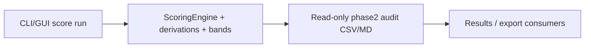

<!-- man_hours: 3.0 -->
# Tier 2 Partial Data Scoring Feature Completion Matrix

## 1. Feature Identification

- **Feature title:** Tier 2 Phase 2 partial-data scoring (Bucket C)
- **User request (verbatim noun phrases):** Phase 2 partial data scoring, 8 criteria EP-03 HI-02 HI-03 HI-04 NH-09 NH-11 RI-03 RI-05, baseline run, read-only audit, tests, FCM, no DB write, no live API
- **Owning chat / plan:** `/Users/terbolence/.cursor/plans/tier2_partial_data_fcda7049.plan.md`
- **Date opened:** 2026-05-17
- **Date closed:** 2026-05-17

## 2. Literal Request Check

| Noun in request | Surface it implies | Where it is satisfied | Status |
| --- | --- | --- | --- |
| Phase 2 / Bucket C / 8 criteria | Scoring repair for EP-03, HI-02/03/04, NH-09/11, RI-03/05 | YAML rubrics+specs, `merge_context_derivations.py`, `bands.py` | Implemented |
| baseline run `20260517T104618_459ae424` | Audit defaults and coverage report | `src/scripts/audit_phase2_partial_data.py` | Implemented |
| read-only audit | Coverage report, summary/detail CSV, track memos | `audit/post_processing/06_scoring/20260517_phase2_*` | Implemented |
| auditor review / scored site examples | Human QA review of bands and representative sites | `audit/post_processing/06_scoring/20260517_phase2_auditor_review.md`, `audit/post_processing/06_scoring/20260517_phase2_scored_site_examples.md` | Implemented |
| tests | Band, derivation, sentinel, script tests | `tests/scoring/test_phase2_partial_data_bands.py`, related tests | Implemented |
| no DB write / no live API | Deferred rescore and connectors | Matrix §7 | Deferred |
| FCM / plan mirrors / conversation / man-hours | Audit trail | This file, `audit/plans/`, `architecture/plans/`, `audit/conversations/` | Implemented |

## 3. End-to-End User Path Diagram



- **Entry point:** `src/atoms_vs_ashes/scoring/_cli.py`; GUI `src/atoms_vs_ashes/gui/screen_pages/04_run_dashboard.py`
- **Engine:** `merge_context_derivations.py`, `bands.py`, `config/scoring_{rubrics,specs}/`
- **Persistence:** Existing `ranking_scores` (consent-gated write); read-only `audit/post_processing/06_scoring/20260517_phase2_*`
- **Consumers:** `src/atoms_vs_ashes/gui/_results_*`, `reporting/site_bundle.py`, `_site_profile_*.py`

## 4. Surface Matrix

| Surface | Required artifact | File / test | Status | Notes |
| --- | --- | --- | --- | --- |
| Engine code | Derivations + partial sub-score aggregation | `merge_context_derivations.py`, `bands.py` | Implemented | |
| YAML | Four-wave rubric+spec sync | `config/scoring_*` | Implemented | HI hand-bands runtime=rubric |
| Script driver | `audit_phase2_partial_data.py` | `src/scripts/`, `tests/scripts/` | Implemented | |
| CSV/MD artifacts | Coverage + audit outputs | `audit/post_processing/06_scoring/` | Implemented | |
| Human QA examples | Scored site examples and auditor review | `20260517_phase2_scored_site_examples.md`, `20260517_phase2_auditor_review.md` | Implemented | Shows low/median/high/unscored examples where available. |
| Tests | Phase 2 band suite | `tests/scoring/test_phase2_partial_data_bands.py` | Implemented | |
| Expert prompts | Curator Tier 2 notes | `experts/quality/data_science_siting_curator.md` | Implemented | |
| Workflows / quality gate | Parallel worker contract | `criteria/tier2_partial_data_parallel_workflows.md`, `phase2_auto_mode_quality_gate.md` | Implemented | |
| DB write / rescore | Consent-gated | N/A | Deferred | User scope |
| Live API / connectors | Out of scope | N/A | Deferred | |

## 5. Negative Acceptance Tests

| Surface | Test file | Assertion |
| --- | --- | --- |
| Audit script | `tests/scripts/test_audit_phase2_partial_data.py` | Writes coverage + CSV from fixture rows |
| Bands | `tests/scoring/test_phase2_partial_data_bands.py` | EP-03, HI-03, NH-11, RI-03/05 representative rows |
| Sentinels | `tests/scoring/test_search_sentinel_bands.py` | HI-03 favourable NULL pattern |
| Examples | `tests/scripts/test_audit_phase2_partial_data.py` | Audit writer emits `*_phase2_scored_site_examples.md` for human review |

## 6. Subtle Consumption Check

| Artifact | Consumer | Surface |
| --- | --- | --- |
| `ranking_scores` (after consent-gated rescore) | GUI Results drawer | Site criterion bars |
| `20260517_phase2_*` audit | Human review / consent gate | Post-processing folder |

## 7. Deferred Surfaces (require explicit user approval)

| Surface | Reason | Follow-up |
| --- | --- | --- |
| DB-writing rescore | User forbade without consent | Re-run `audit_phase2_partial_data.py` after score run |
| EP-03 GEE relief backfill | `ep03_gee_relief_16km_m` 0% in local DB; barrier interim only | Class C/D if GEE batch needed |
| HI-03 toxic distance LLM backfill | Class C DB write | Separate consent |
| RI-03 `groundwater_vulnerability_class` persist | Class C | EGDI / LLM enum |
| NH-09 cohort spread | Homogeneous `negligible` flood class limits stdev even after all rows score | HydroRIVERS / freeboard top-up (Class D) |
| RI-05 exact distance-margin proof | GHSL fallback scores no-city-distance cases, but exact A12 margin still lacks `nearest_city_50k_km` for some sites | GISCO / GeoNames refresh or consented local backfill |

## 8. Final Trace (paste into the final response)

```
CLI/GUI scoring: src/atoms_vs_ashes/scoring/_cli.py + gui/screen_pages/04_run_dashboard.py -> _cli_run.py / gui/_runner.py -> engine.py + merge_context_derivations.py + bands.py using config/scoring_{rubrics,specs}/{ep_emergency_planning,hi_human_induced,nh_natural_hazards,ri_radiological}.yaml -> ranking_scores/composite_rankings/screening_verdicts plus audit/post_processing/06_scoring/20260517_phase2_* read-only artifacts and scored-site examples -> gui/_results_* + reporting/site_bundle.py + scripts/_site_profile_*.py -> tests/scoring/test_phase2_partial_data_bands.py + tests/scripts/test_audit_phase2_partial_data.py
```
