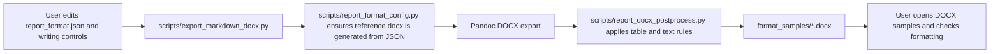

<!-- man_hours: 2.0 -->
# Feature Completion Matrix: Report Format and Writing Controls

## 1. Feature Identification

- **Feature title:** Report format and writing-control enforcement
- **User request (verbatim noun phrases):** `report_format.json`, `writingStyle.md`, `writingDecisions.md`, `v1_2_iteration_controls.md`, `v1.2_full_report_writing_plan_5c7dbbf9.plan.md`, exports
- **Owning chat / plan:** Current Cursor session, v1.2 full report writing plan
- **Date opened:** 2026-05-18
- **Date closed:** 2026-05-18

## 2. Literal Request Check

| Noun in request | Surface it implies | Where it is satisfied (file or test) | Status |
| --- | --- | --- | --- |
| `report_format.json` | Machine-readable format contract | `report/version 1.02/output/report/writing plan/report_format.json` | Implemented |
| `writingStyle.md` | Prose and citation rules | `report/version 1.02/output/report/writing plan/writingStyle.md` | Implemented |
| `writingDecisions.md` | Report structure and content rules | `report/version 1.02/output/report/writing plan/writingDecisions.md` | Implemented |
| `v1_2_iteration_controls.md` | Publication gates and final checks | `report/version 1.02/output/report/writing plan/v1_2_iteration_controls.md` | Implemented |
| Full report writing plan | Campaign execution plan | `/Users/terbolence/.cursor/plans/v1.2_full_report_writing_plan_5c7dbbf9.plan.md` | Implemented |
| Exports | User-visible DOCX samples | `scripts/export_markdown_docx.py`, `tests/test_report_format_config.py` | Implemented |

## 3. End-to-End User Path Diagram

- **Entry point file:** `scripts/export_markdown_docx.py`
- **Runner/dispatcher file and command line:** `python scripts/export_markdown_docx.py <files>`
- **Engine module:** `scripts/report_format_config.py`, `scripts/make_reference_docx.py`, `scripts/report_docx_postprocess.py`
- **Persistence target(s):** `report/version 1.02/output/report/build/format_samples/*.docx`
- **Reader / consumer file(s):** DOCX outputs opened by the user
- **User-visible acceptance evidence:** regenerated `00_index.docx`, `01_introduction.docx`, `04_results_and_findings.docx`

## 4. Surface Matrix

| Surface | Required artifact | File / symbol / test | Status | Notes |
| --- | --- | --- | --- | --- |
| GUI page / Streamlit screen | Visible control or section that triggers the feature | N/A | Not applicable | Request concerns report exports, not GUI. |
| CLI subcommand / flag | Export command | `scripts/export_markdown_docx.py` | Implemented | Exports arbitrary Markdown files through the report format pipeline. |
| Script driver | Updated orchestrator | `scripts/build_report.py`, `scripts/export_markdown_docx.py` | Implemented | Both use `ensure_reference_docx()`. |
| Runner / subprocess wiring | Pandoc invocation | `run_pandoc()`, `export_markdown()` | Implemented | Reference template is derived from JSON. |
| Engine code | Formatting modules | `scripts/report_format_config.py`, `scripts/report_docx_postprocess.py`, `scripts/make_reference_docx.py` | Implemented | JSON owns layout. |
| DB schema | Alembic revision + ORM model | N/A | Not applicable | No database change. |
| DB writers | Idempotent writer helpers | N/A | Not applicable | No database change. |
| CSV / file artifacts | DOCX samples | `report/version 1.02/output/report/build/format_samples/*.docx` | Implemented | Regenerated for review. |
| Report / export reader | DOCX export output | `scripts/export_markdown_docx.py` | Implemented | User-visible review files written. |
| Tests: unit | Config and template assertions | `tests/test_report_format_config.py` | Implemented | Covers config load and reference template rebuild. |
| Tests: persistence | N/A | N/A | Not applicable | No persistence layer. |
| Tests: entry-point smoke | CLI sample export | `scripts/export_markdown_docx.py` command run | Implemented | Command regenerated requested files. |
| Methodology / report docs | Writing controls | `writingStyle.md`, `writingDecisions.md`, `v1_2_iteration_controls.md`, Annex F | Implemented | New rules are blocking controls. |
| Expert prompts | Prompt files | N/A | Not applicable | User named writing controls, not prompt rewrite. |
| Audit log | Conversation log and plan mirrors | `audit/conversations/2026-05-18_report_format_writing_controls.md`; plan mirrors | Implemented | Created before final response. |
| Man-hours metadata | Registry and first-line metadata | `audit/man_hours_registry.yml` | Implemented | Updated for touched files. |

## 5. Negative Acceptance Tests

| Surface | Test file | Assertion that proves user-visible wiring |
| --- | --- | --- |
| DOCX export | `tests/test_report_format_config.py` | A changed format JSON rebuilds `reference.docx`, and generated styles use Times New Roman with justified body text. |
| Sample export | Manual CLI smoke | Requested files are exported through the same format pipeline into `format_samples/`. |

## 6. Subtle Consumption Check

| Artifact (table / CSV / JSON) | Consumer file | Surface where the user sees it |
| --- | --- | --- |
| `report_format.json` | `scripts/report_format_config.py` | Full report and sample DOCX exports |
| `reference.docx` | `scripts/build_report.py`, `scripts/export_markdown_docx.py` | Pandoc-rendered DOCX files |

## 7. Deferred Surfaces

| Surface | Reason for deferral | User approval evidence | Follow-up ticket |
| --- | --- | --- | --- |
| None | N/A | N/A | N/A |

## 8. Final Trace

`scripts/export_markdown_docx.py` -> `scripts/report_format_config.py` (`ensure_reference_docx`) -> `scripts/make_reference_docx.py` -> Pandoc -> `scripts/report_docx_postprocess.py` -> `report/version 1.02/output/report/build/format_samples/*.docx`; tests: `tests/test_report_format_config.py`
