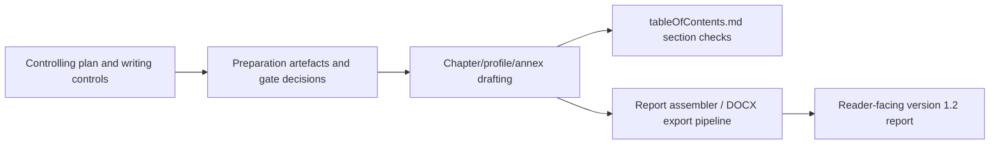

<!-- man_hours: 3.6 -->
# Feature Completion Matrix: Version 1.2 Full Report Writing

## 1. Feature Identification

- **Feature title:** Version 1.2 full report writing campaign
- **User request (verbatim noun phrases):** `multitask_full_report_system_prompt.md`, `v1.2_full_report_writing_plan_5c7dbbf9.plan.md`, `experts/`, `report/version 1.02/output/report/writing plan/`, `tableOfContents.md`, `green checkmark`, `report outputs`, `audit conversation log`, `feature completion matrix`, `man-hours`
- **Owning chat / plan:** `/Users/terbolence/.cursor/plans/v1.2_full_report_writing_plan_5c7dbbf9.plan.md`
- **Date opened:** 2026-05-18
- **Date closed:** Open

## 2. Literal Request Check

| Noun in request | Surface it implies | Where it is satisfied (file or test) | Status |
| --- | --- | --- | --- |
| `multitask_full_report_system_prompt.md` | Campaign orchestration control | `report/version 1.02/output/report/writing plan/multitask_full_report_system_prompt.md` | Implemented for pre-flight |
| `v1.2_full_report_writing_plan_5c7dbbf9.plan.md` | Ordered implementation plan | `/Users/terbolence/.cursor/plans/v1.2_full_report_writing_plan_5c7dbbf9.plan.md` | Implemented for Chapters 1-8, Acronyms, Annexes A-F, and local build validation; Step 8 reviewer suite and Step 9 output split / executive brief remain open |
| `experts/` | Expert prompt inventory and role mapping | `report/version 1.02/v1_2_report_preparation/expert_prompt_inventory.md` | Implemented for current tranche |
| `report/version 1.02/output/report/writing plan/` | Mandatory writing controls | `writingDecisions.md`, `writingStyle.md`, `tableOfContents.md`, `report_format.json`, `v1_2_iteration_controls.md`, prompt files | Implemented for pre-flight |
| `tableOfContents.md` | Section-by-section progress marker | `report/version 1.02/output/report/writing plan/tableOfContents.md` | Implemented for Acronyms, Chapters 1-8, and Annexes A-F |
| `green checkmark` | Completed-section marker | Same as above | Implemented for all current ToC rows after Chapter 5 integration, shortlist reconciliation, and local build validation |
| `report outputs` | Published markdown chapter/profile/annex outputs | `report/version 1.02/output/report/chapters/00_acronyms.md`; `report/version 1.02/output/report/chapters/01_introduction.md`; `report/version 1.02/output/report/chapters/02_stage_1_site_survey.md`; `report/version 1.02/output/report/chapters/03_stage_2_site_selection.md`; `report/version 1.02/output/report/chapters/04_results_and_findings.md`; `report/version 1.02/output/report/chapters/05_country_and_site_profiles.md`; `report/version 1.02/output/report/chapters/05_country_and_site_profiles/00_index.md`; `report/version 1.02/output/report/chapters/05_country_and_site_profiles/recommended_top5_sites.md`; `report/version 1.02/output/report/chapters/06_recommendations_for_detailed_site_evaluation.md`; `report/version 1.02/output/report/chapters/07_final_remarks.md`; `report/version 1.02/output/report/chapters/08_references.md`; `report/version 1.02/output/report/annexes/*.md` | Implemented for current published report pass; local DOCX build succeeds |
| `audit conversation log` | Session audit record | `audit/conversations/2026-05-18_v1_2_report_writing_tranche.md`; `audit/conversations/2026-05-18_v1_2_report_writing_step3.md`; `audit/conversations/2026-05-18_v1_2_report_writing_step3_acceptance_step4.md`; `audit/conversations/2026-05-18_v1_2_acronyms_annexes.md` | Implemented for current tranche |
| `feature completion matrix` | Surface trace for this work | This file | Implemented |
| `man-hours` | First-line metadata and registry entries | `audit/man_hours_registry.yml`; `audit/man_hours_summary.md` | In progress |

## 3. End-to-End User Path Diagram

- **Entry point file:** `/Users/terbolence/.cursor/plans/v1.2_full_report_writing_plan_5c7dbbf9.plan.md`; `report/version 1.02/output/report/writing plan/tableOfContents.md`
- **Runner/dispatcher file and command line:** Report assembly/export path uses `scripts/build_report.py` and `scripts/export_markdown_docx.py`; country/site regeneration remains gated before execution.
- **Engine module:** Report-writing controls, renderers, and local helper scripts under `scripts/` and `src/scripts/`; no new scoring engine code in this tranche.
- **Persistence target(s):** Markdown preparation artefacts under `report/version 1.02/v1_2_report_preparation/`, report chapters under `report/version 1.02/output/report/chapters/`, and audit artefacts under `audit/`.
- **Reader / consumer file(s):** `report/version 1.02/output/report/chapters/index.md`, `scripts/build_report.py`, DOCX export pipeline, and human review against `tableOfContents.md`.
- **User-visible acceptance evidence:** Completed ToC rows carry a green checkmark only after the corresponding report section is drafted, reviewed, and accepted.

## 4. Surface Matrix

| Surface | Required artifact | File / symbol / test | Status | Notes |
| --- | --- | --- | --- | --- |
| GUI page / Streamlit screen | Visible control or section that triggers the feature | Not applicable | Not applicable | Report-writing campaign, not GUI work. |
| CLI subcommand / flag | Local report/export or bundle commands where used | `scripts/build_report.py`, `scripts/export_markdown_docx.py`, `scripts.export_country_bundle`, `scripts.export_site_bundle` | Implemented for current pass | `scripts/build_report.py --keep-merged --skip-postprocess` succeeds and excludes non-published country/caveat material. |
| Script driver | Updated or used report orchestrator if applicable | `scripts/build_report.py` | Implemented | Assembler now excludes non-published country material, excludes the Ukraine caveat plan, strips stale identifiers to 50,000-iteration national language, and drops missing image references from the built output. |
| Runner / subprocess wiring | Command string built and forwarded | Existing report/export pipeline | Implemented | Build runner consumed 98 markdown files into merged markdown and DOCX. |
| Engine code | Pure module under `src/atoms_vs_ashes/` | Not applicable | Not applicable | Current tranche is preparation/report text control work. |
| DB schema | Alembic revision + ORM model | Not applicable | Not applicable | No schema change. |
| DB writers | Idempotent writer helpers | Not applicable | Not applicable | No DB writes. |
| CSV / file artifacts | Stamped output under `audit/post_processing/` or `report/output/` | Chapter 5 ledgers, country profiles, selected site profiles, `recommended_top5_sites.md`, `merged.md`, DOCX build output | Implemented for current pass | Current pass consumes existing country/site outputs and validates the assembled publication copy locally. |
| Report / export reader | Report sections and ToC checks visible to the user | `tableOfContents.md`, Chapters 00-08, Chapter 5 folder index/recommendation list, Annexes A-F | Implemented | All current ToC rows are checked after integration and validation. |
| Tests: unit | Pure logic tests | Not applicable | Not applicable | No code path changed in this tranche. |
| Tests: persistence | DB writer tests | Not applicable | Not applicable | No persistence layer changed. |
| Tests: entry-point smoke | GUI / CLI / runner test proving user-visible wiring | `python scripts/build_report.py --keep-merged --skip-postprocess`; merged-output scans | Implemented | Build succeeded and merged-output scans found no stale sensitivity IDs, scoring IDs, regional-sensitivity drafting language, excluded-country code, Ukraine caveat plan, unresolved placeholder/TODO language, image markdown references, or U+2014 characters. |
| Methodology / report docs | Report preparation and writing controls | `report/version 1.02/v1_2_report_preparation/*.md` | In progress | Current tranche produces the gate artefacts. |
| Expert prompts | Inventory and role mapping | `report/version 1.02/v1_2_report_preparation/expert_prompt_inventory.md` | Implemented for current tranche | Prompts are mapped, not rewritten. |
| Audit log | Conversation log under `audit/conversations/` | `audit/conversations/2026-05-18_v1_2_report_integration_finisher.md` plus earlier tranche logs | Implemented for current tranche | Integration finisher log records plan/ToC updates, report integration, build validation, and remaining Step 8/9 work. |
| Man-hours metadata | First-line metadata and registry | `audit/man_hours_registry.yml` | In progress | Registry and summary updated at closeout. |

## 5. Negative Acceptance Tests

| Surface | Test file | Assertion that proves user-visible wiring |
| --- | --- | --- |
| Preparation controls | Manual diff / markdown inspection | Required preparation artefacts exist and name their evidence basis. |
| ToC progress | Manual diff / markdown inspection | ToC rows are checked only after the corresponding report output exists and the merged-output scan passes. |
| Acronyms and annexes | Scoped clean-output scan and markdown inspection | Acronyms and Annexes A-F were checked only after source/process acronym cleanup, Annex C national 50,000-iteration rewrite, path correction, and scoped lint/diff validation. |
| Final assembly | `python scripts/build_report.py --keep-merged --skip-postprocess` | Assembler consumes the accepted chapter/profile files and writes merged markdown plus DOCX. |

## 6. Subtle Consumption Check

| Artifact (table / CSV / JSON) | Consumer file | Surface where the user sees it |
| --- | --- | --- |
| `freeze_gate_verification.md` | Report-writing campaign and batch packets | Gate decision before regeneration |
| `ovidiu_v1_2_closure_register.md` | Writing-quality and Ovidiu closure review passes | Reader-facing comment closure status |
| `inherited_chapter_audit.md` | Chapter author/reviewer packets | Rewrite/reuse decisions for report files |
| `expert_prompt_inventory.md` | Chapter/profile worker packets | Expert-role assignment by report area |
| `RO_country_bundle.json` | `RO_country_prototype.md`; `country_template_decision.md` | Romania country template review |
| `RO_turceni_power_station_site_bundle.json` | `sites/RO_turceni_power_station.md`; `site_template_decision.md` | Turceni site template review |
| Current Chapter 5 country ledgers | `04_results_and_findings.md` | Chapter 4 results counts, per-country candidates, driver tables, and national stability summary |
| Methodology artefacts under `report/version 1.02/methodology/` | Annexes A-F and `tableOfContents.md` artefact table | Traceability, thresholds, national sensitivity method, failure modes, assumptions, and reproducibility index |
| `country_template_decision.md` | User review before Chapter 5 fan-out | Country template approval gate |
| `site_template_decision.md` | User review before Chapter 5 fan-out | Selected-site template approval gate |

## 7. Deferred Surfaces

| Surface | Reason for deferral | User approval evidence | Follow-up ticket |
| --- | --- | --- | --- |
| Full named Step 8 reviewer suite | This pass completed local clean-output/build validation but not every named adversarial/reviewer role in the campaign plan | User asked to finish as far as possible in this pass | Run writing-quality, siting-expert, lessons-learned, Ovidiu closure, numeric-consistency, and adversarial methodology reviews |
| Step 9 output split and executive technical brief | Not produced in this integration pass | User asked not to create discretionary side documents; these remain plan-required follow-ups | Produce the two-track publication/internal split and separate executive technical brief |

## 8. Final Trace

`/Users/terbolence/.cursor/plans/v1.2_full_report_writing_plan_5c7dbbf9.plan.md` + `report/version 1.02/output/report/writing plan/*` -> `report/version 1.02/v1_2_report_preparation/*` gate artefacts -> `report/version 1.02/output/report/chapters/*` drafted/accepted sections -> `report/version 1.02/output/report/writing plan/tableOfContents.md` green checks -> `scripts/build_report.py` / `scripts/export_markdown_docx.py` -> reader-facing version 1.2 report.
