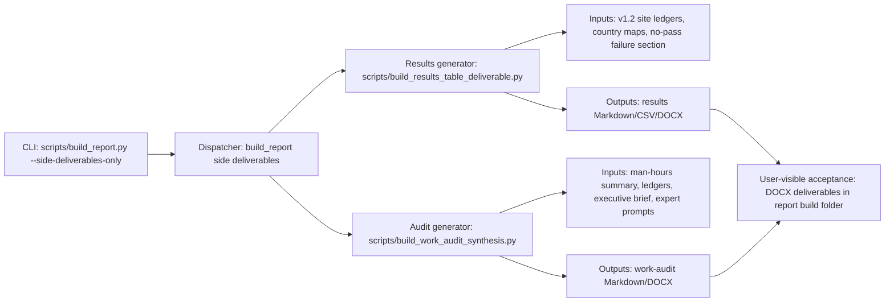

<!-- man_hours: 1.7 -->
# Feature Completion Matrix: v1.2 Build Deliverables

## 1. Feature Identification

- **Feature title:** v1.2 build side deliverables: results table and stakeholder work-audit synthesis
- **User request (verbatim noun phrases):** "results table"; "top 5 sites per country"; "full list for Romania"; "country status maps"; "A4 landscape DOCX"; "Work Audit Synthesis"; "expert prompts"; "build process"; "side-deliverables-only mode"
- **Owning chat / plan:** V1.2 Build Deliverables Plan, `/Users/terbolence/.cursor/plans/v1.2_build_deliverables_cd6c0d55.plan.md`
- **Date opened:** 2026-05-20
- **Date closed:** 2026-05-20

## 2. Literal Request Check

| Noun in request | Surface it implies | Where it is satisfied (file or test) | Status |
| --- | --- | --- | --- |
| results table | Generated DOCX and supporting Markdown/CSV | `scripts/build_results_table_deliverable.py`, `report/version 1.02/output/report/build/atoms_vs_ashes_results_table.docx` | Implemented |
| top 5 sites per country | Country-scoped table logic | `scripts/results_table_data.py` | Implemented |
| full list for Romania | Country exception in generator | `scripts/results_table_data.py`, validated 23 Romania rows | Implemented |
| country status maps | Map embedding before country sections | `scripts/results_table_data.py`, 16 copied map assets | Implemented |
| A4 landscape DOCX | DOCX section/page setup | `scripts/build_results_table_deliverable.py`, DOCX XML validation | Implemented |
| Work Audit Synthesis | Generated stakeholder-facing DOCX | `scripts/build_work_audit_synthesis.py`, `report/version 1.02/output/report/build/atoms_vs_ashes_work_audit_synthesis.docx` | Implemented |
| expert prompts | Three reusable prompts under `experts/report/` | `experts/report/stakeholder_nuclear_engineering_expert.md`; `stakeholder_energy_transition_expert.md`; `stakeholder_management_consultant.md` | Implemented |
| build process | Build CLI wiring | `scripts/build_report.py --side-deliverables-only`; `scripts/report_side_deliverables.py` | Implemented |
| actual avoidance / failure flags | Results-table note column with criterion codes | `scripts/results_table_flags.py`, `atoms_vs_ashes_results_table.md`, validated `NS-02` and `EP-01, NH-05` examples | Implemented |

## 3. End-to-End User Path Diagram



- **Entry point file:** `scripts/build_report.py`
- **Runner/dispatcher file and command line:** `python scripts/build_report.py --side-deliverables-only`; `scripts/report_side_deliverables.py`
- **Engine module:** `scripts/build_results_table_deliverable.py`; `scripts/results_table_data.py`; `scripts/results_table_flags.py`; `scripts/build_work_audit_synthesis.py`
- **Persistence target(s):** `report/version 1.02/output/report/build/atoms_vs_ashes_results_table.md`; `atoms_vs_ashes_results_table.csv`; `atoms_vs_ashes_results_table.docx`; `atoms_vs_ashes_work_audit_synthesis.md`; `atoms_vs_ashes_work_audit_synthesis.docx`
- **Reader / consumer file(s):** Pandoc export and DOCX post-processing consume generated Markdown; stakeholder/user consumes DOCX outputs.
- **User-visible acceptance evidence:** Side build produced 80 selected site rows, 16 maps, both DOCX files; XML and clean-output validation passed.

## 4. Surface Matrix

| Surface | Required artifact | File / symbol / test | Status | Notes |
| --- | --- | --- | --- | --- |
| GUI page / Streamlit screen | Visible control or section that triggers the feature | N/A | Not applicable | User requested build deliverables, not a GUI feature. |
| CLI subcommand / flag | New flag wired through `argparse` | `scripts/build_report.py --side-deliverables-only` | Implemented | Generates only the two new deliverables. |
| Script driver | Updated orchestrator | `scripts/build_report.py` | Implemented | Normal build produces report plus side deliverables unless skipped. |
| Runner / subprocess wiring | Generator calls from build script | `scripts/report_side_deliverables.py` | Implemented | Side-only mode avoids rebuilding the main report. |
| Engine code | Generator scripts | `scripts/build_results_table_deliverable.py`; `scripts/results_table_data.py`; `scripts/results_table_flags.py`; `scripts/build_work_audit_synthesis.py` | Implemented | Local-only generation; no live web/API calls. |
| DB schema | Alembic revision + ORM model | N/A | Not applicable | No database changes requested or needed. |
| DB writers | Idempotent writer helpers | N/A | Not applicable | Outputs are files under the report build folder. |
| CSV / file artifacts | Build-folder supporting outputs | Generated Markdown, CSV, copied map assets, and DOCX outputs | Implemented | Required for traceability. |
| Report / export reader | DOCX outputs surfaced to user | `atoms_vs_ashes_results_table.docx`; `atoms_vs_ashes_work_audit_synthesis.docx` | Implemented | Two standalone deliverables under `report/.../build/`. |
| Tests: unit | Pure logic tests | `tests/scripts/test_v1_2_build_deliverables.py` | Implemented | Validates country scope rules, expert prompt wiring, and actual flag-code rendering. |
| Tests: persistence | File-output assertions | Validation command inspecting CSV, assets, and DOCX XML | Implemented | Validates files exist and CSV country coverage. |
| Tests: entry-point smoke | CLI smoke proving flag reaches generators | `tests/scripts/test_v1_2_build_deliverables.py` | Implemented | Confirms `--side-deliverables-only` reaches dispatcher. |
| Methodology / report docs | Existing report framing reused | `report/version 1.02/output/report/executive_technical_brief.md` used as local boundary source | Implemented | No methodology rewrite required. |
| Expert prompts | Three new stakeholder prompts | `experts/report/stakeholder_*.md` | Implemented | Each includes consent gate for online searches/downloads. |
| Audit log | Conversation log | `audit/conversations/2026-05-20_v1_2_build_deliverables.md`; `audit/conversations/2026-05-20_results_table_actual_flags.md` | Implemented | Added during closeout and follow-up flag detail work. |
| Man-hours metadata | First-line metadata and registry | First-line metadata, `audit/man_hours_registry.yml`, regenerated `audit/man_hours_summary.md` | Implemented | Summary regenerated after registry update. |

## 5. Negative Acceptance Tests

| Surface | Test file | Assertion that proves user-visible wiring |
| --- | --- | --- |
| Build CLI | `tests/scripts/test_v1_2_build_deliverables.py` plus side-build command | `python scripts/build_report.py --side-deliverables-only` creates both DOCX outputs without rebuilding the main report. |
| Results table DOCX | Validation command inspecting CSV and DOCX XML | DOCX XML contains landscape orientation, black borders, and autofit layout; CSV covers 16 countries and all 23 Romanian ledger rows. |
| Results table flag notes | `tests/scripts/test_v1_2_build_deliverables.py` plus validation command inspecting Markdown/CSV/DOCX XML | Avoidance rows include actual codes such as `NS-02`; the Romania hard-fail row includes `EP-01, NH-05`; old generic flag wording is absent. |
| Work-audit synthesis DOCX | Validation command inspecting Markdown and DOCX XML | Markdown/DOCX contain required stakeholder sections and no internal paths or stale 10,000/regional sensitivity language. |

## 6. Subtle Consumption Check

| Artifact (table / CSV / JSON) | Consumer file | Surface where the user sees it |
| --- | --- | --- |
| `atoms_vs_ashes_results_table.md` | Pandoc export in `scripts/build_results_table_deliverable.py` | `atoms_vs_ashes_results_table.docx` |
| `atoms_vs_ashes_results_table.csv` | Validation logic / audit review | Build-folder traceability for site coverage |
| copied map assets | Markdown image references consumed by Pandoc | Country status maps in results-table DOCX |
| `atoms_vs_ashes_work_audit_synthesis.md` | Pandoc export in `scripts/build_work_audit_synthesis.py` | `atoms_vs_ashes_work_audit_synthesis.docx` |

## 7. Deferred Surfaces (require explicit user approval)

| Surface | Reason for deferral | User approval evidence | Follow-up ticket |
| --- | --- | --- | --- |
| None | N/A | N/A | N/A |

## 8. Final Trace (paste into the final response)

```
CLI: scripts/build_report.py --side-deliverables-only
  -> scripts/report_side_deliverables.py
  -> scripts/build_results_table_deliverable.py + scripts/results_table_data.py + scripts/results_table_flags.py + scripts/build_work_audit_synthesis.py
  -> country/site ledgers + figures/*_site_status_map.png + audit/man_hours_summary.md + experts/report/stakeholder_*.md
  -> report/version 1.02/output/report/build/atoms_vs_ashes_results_table.docx + atoms_vs_ashes_work_audit_synthesis.docx
Validation: py_compile, pytest focused suite, side-deliverables build, CSV/XML/clean-output checks passed on 2026-05-20
```
