# Feature Completion Matrix — v1.03 Feedback Closure

Opened during Phase 0 of the v1.03 feedback closure round. Sections 1 and 2
are filled now; sections 3 to 8 remain as scaffolding and will be populated
through Phases 1 to 6 as concrete files are touched.

The canonical store for per-comment closure is the triage YAML at
`report/version 1.03/output/report/feedback/synthesised_comments/atoms_vs_ashes_report_feedback_triage.yaml`.
This matrix tracks the _user-visible feature surface_ of the closure round
itself — i.e. that every reviewer-named noun ends up visible to the reader.
That is a different concern from per-comment closure status.

---

## 1. Feature Identification

- **Feature title:** v1.03 feedback closure (Ovidiu + Bogdan, 14 reviewer comments)
- **User request (verbatim noun phrases):** see §2 — all literal nouns from
  the 14 reviewer comments and the user's seven master-plan answers
  (2026-05-23).
- **Owning chat / plan:** [feedback_implementation_master_plan.md](../../report/version%201.03/output/report/feedback/feedback_implementation_master_plan.md)
  and [v1.03_phase_0_triage plan](file:///Users/terbolence/.cursor/plans/v1.03_phase_0_triage_ed31b4d4.plan.md).
- **Date opened:** 2026-05-23
- **Date closed:** (Phase 6)

## 2. Literal Request Check

Quote-derived noun set, with reviewer comment id and the v1.03 surface each
noun implies. Status is `Phase 0 opened` for every row at this point; later
phases will move each row to `Implemented`, `Not applicable`, or `Deferred`.

| Noun in request                                                                                            | Reviewer comment         | Surface it implies                                                                                                                                                                                                                                                                                                                                                                                     | Where it is satisfied (file or test)                                                                                                                                                                                                                                                                                                                                                                                                                                                                                                                                                                                                                                                                                                                                                                                                                                                                                                                                                                                                                                                     | Status                                                             |
| ---------------------------------------------------------------------------------------------------------- | ------------------------ | ------------------------------------------------------------------------------------------------------------------------------------------------------------------------------------------------------------------------------------------------------------------------------------------------------------------------------------------------------------------------------------------------------ | ---------------------------------------------------------------------------------------------------------------------------------------------------------------------------------------------------------------------------------------------------------------------------------------------------------------------------------------------------------------------------------------------------------------------------------------------------------------------------------------------------------------------------------------------------------------------------------------------------------------------------------------------------------------------------------------------------------------------------------------------------------------------------------------------------------------------------------------------------------------------------------------------------------------------------------------------------------------------------------------------------------------------------------------------------------------------------------------- | ------------------------------------------------------------------ |
| "weight factors", "sum is 1 or 100%", "97.4"                                                               | #43                      | Active-criterion weight normalisation in the scoring engine, exposed to the UI per-criterion percentages                                                                                                                                                                                                                                                                                               | `src/atoms_vs_ashes/scoring/engine.py` (`__init__` sum==1.0 invariant), `src/atoms_vs_ashes/scoring/rubric.py` `weight_normalisation()`, `src/scripts/normalise_published_weights.py` (new SST script), `config/scoring_rubrics/*.yaml` + `config/scoring_specs/*.yaml` `normalised_weight_pct`, `report/version 1.03/sites_evaluation/02_master_weights.md`, `report/version 1.03/output/report/chapters/03_stage_2_site_selection.md` Tables 3.2-3.6, `report/version 1.03/methodology/swing_weight_audit.md` (Declared column refreshed), `tests/scoring/test_weight_sum_invariant.py`                                                                                                                                                                                                                                                                                                                                                                                                                                                                                                | Phase 1 implemented                                                |
| "capable fault" definition (SSG-9 rev. 1)                                                                  | #104                     | NH-02 criterion spec encodes "fault capable of producing surface deformation of the ground"                                                                                                                                                                                                                                                                                                            | `src/atoms_vs_ashes/connectors/efsm20_faults/models.py` (`CAPABLE_ACTIVITY_CLASSES` docstring), `src/atoms_vs_ashes/connectors/egdi_geology/parsers.py` `build_fault_assessment` (capability filter), `report/version 1.03/methodology/exclusionary_floors.md`, `report/version 1.03/methodology/business_logic.md` NH-02, `report/version 1.03/sites_evaluation/03_criteria_natural_hazards.md` NH-02, `tests/test_connector_egdi_geology.py::TestBuildFaultAssessment` capability tests, every Chapter 5 site profile NH-02 line (Phase 2 rerun)                                                                                                                                                                                                                                                                                                                                                                                                                                                                                                                                       | Phase 1 implemented (rerun-dependent surfaces deferred to Phase 2) |
| "5 km not 8 km" (clarified: user-tunable)                                                                  | #105                     | NH-02 screening radius is a run-profile parameter, norm default 8 km (SSG-9 rev. 1), bounds widened to [0.1, 500.0], propagated end-to-end through bands, E1 expression, bundle provenance, and the site-profile verdict line                                                                                                                                                                          | `config/scoring_specs/threshold_metadata.yaml` NH-02 E1, `config/scoring_specs/nh_natural_hazards.yaml`, `config/scoring_rubrics/nh_natural_hazards.yaml` (fallback aligned to 8 km), `src/atoms_vs_ashes/criterion_spec/_band_recipe_faults.py`, `src/atoms_vs_ashes/connectors/efsm20_faults/` (no more `E1_THRESHOLD_KM`; degrade-case for SEARCH_RADIUS_KM documented), `src/atoms_vs_ashes/reporting/run_profile_provenance.py` (new module), `src/atoms_vs_ashes/reporting/site_bundle.py` + `country_bundle.py` (`provenance.nh02_e1_threshold_km` block), `src/scripts/_site_profile_intelligence.py` + `_site_profile_markdown.py` (dynamic E1 verdict signal), `report/version 1.03/methodology/exclusionary_floors.md`, `tests/criterion_spec/test_excl_expr_derived_from_pivot.py` (parametrised propagation + bounds + cross-stack), `tests/reporting/test_run_profile_provenance.py` (snapshot round-trip + fallback + renderer verdict), GUI threshold-editor surface (`src/atoms_vs_ashes/gui/_threshold_editor_widgets.py` sources bounds from `spec.bounds`, no clamp) | Phase 1 implemented                                                |
| "Large airports and military airports prevail; small heliports and aerodromes do not affect this criteria" | #183                     | HI-01 scoring bands strip helipads and small airfields                                                                                                                                                                                                                                                                                                                                                 | `config/scoring_rubrics/hi_human_induced.yaml` HI-01, `config/scoring_specs/hi_human_induced.yaml` HI-01, `src/atoms_vs_ashes/scoring/merge_context_derivations.py` (no more `nearest_light_airport_km`), `src/atoms_vs_ashes/connectors/ourairports/parsers.py` + `models.py` (`nearest_any_airport_km` informational column), `report/version 1.03/sites_evaluation/04_criteria_human_induced.md`, `report/version 1.03/sites_evaluation/10_appendices.md`, `report/version 1.03/methodology/business_logic.md` HI-01, `tests/test_connectors_ourairports.py::TestAvoidanceViolations`, `tests/scoring/test_search_sentinel_bands.py`, Chapter 5 site profiles HI-01 line (Phase 2 rerun)                                                                                                                                                                                                                                                                                                                                                                                              | Phase 1 implemented (rerun-dependent surfaces deferred to Phase 2) |
| "3 sites fully passed - here are only 2"                                                                   | #50                      | Chapter 3.9 prose count matches Table 4.3.1 cohort after rerun                                                                                                                                                                                                                                                                                                                                         | `report/version 1.03/output/report/chapters/03_stage_2_site_selection.md` §3.9                                                                                                                                                                                                                                                                                                                                                                                                                                                                                                                                                                                                                                                                                                                                                                                                                                                                                                                                                                                                           | Phase 0 opened                                                     |
| "Iernut is a full pass"                                                                                    | #60                      | Table 4.3.1 first-wave Stage 3 candidates either lists Iernut or carries explicit sequencing prose                                                                                                                                                                                                                                                                                                     | `report/version 1.03/output/report/chapters/04_results_and_findings.md` §4.3, Iernut site profile (Chapter 5, RO)                                                                                                                                                                                                                                                                                                                                                                                                                                                                                                                                                                                                                                                                                                                                                                                                                                                                                                                                                                        | Phase 0 opened                                                     |
| "Romania has sites in this category"                                                                       | #61                      | Table 4.3.2 conditional-unlock candidates either lists the Romanian records or carries explicit explanation                                                                                                                                                                                                                                                                                            | `report/version 1.03/output/report/chapters/04_results_and_findings.md` §4.3, Romania country profile (Chapter 5)                                                                                                                                                                                                                                                                                                                                                                                                                                                                                                                                                                                                                                                                                                                                                                                                                                                                                                                                                                        | Phase 0 opened                                                     |
| "redundant text", "explain same thing with different wording"                                              | #54                      | Chapter 4 prose tightened per the redundancy holistic pass                                                                                                                                                                                                                                                                                                                                             | `report/version 1.03/output/report/chapters/04_results_and_findings.md`                                                                                                                                                                                                                                                                                                                                                                                                                                                                                                                                                                                                                                                                                                                                                                                                                                                                                                                                                                                                                  | Phase 0 opened                                                     |
| "Do we need cross countries evaluation more than Table 4.1"                                                | #57                      | Cross-country findings have a single canonical home (Table 4.1) with siblings cross-referenced or removed                                                                                                                                                                                                                                                                                              | `report/version 1.03/output/report/chapters/04_results_and_findings.md` §4.1, `chapters/05_country_and_site_profiles.md` §5.2                                                                                                                                                                                                                                                                                                                                                                                                                                                                                                                                                                                                                                                                                                                                                                                                                                                                                                                                                            | Phase 0 opened                                                     |
| "several similar table saying same things" (Chapter 5.2)                                                   | #70                      | Chapter 5.2 country tables consolidated into a single canonical table generated from country bundles                                                                                                                                                                                                                                                                                                   | `report/version 1.03/output/report/chapters/05_country_and_site_profiles.md` §5.2, country-summary renderer script                                                                                                                                                                                                                                                                                                                                                                                                                                                                                                                                                                                                                                                                                                                                                                                                                                                                                                                                                                       | Phase 0 opened                                                     |
| "de recompletat - s-a pierdut textul" (lost text)                                                          | #55                      | Chapter 4 intro paragraph recovered from v1.02 source                                                                                                                                                                                                                                                                                                                                                  | `report/version 1.03/output/report/chapters/04_results_and_findings.md` Chapter 4 intro                                                                                                                                                                                                                                                                                                                                                                                                                                                                                                                                                                                                                                                                                                                                                                                                                                                                                                                                                                                                  | Phase 0 opened                                                     |
| "Stage 3 should be detailed site evaluation and confirmation"                                              | #38                      | Stage 3 framing propagated to §3.3, §3.10, Chapter 6                                                                                                                                                                                                                                                                                                                                                   | `chapters/03_stage_2_site_selection.md`, `chapters/06_recommendations_for_detailed_site_evaluation.md`                                                                                                                                                                                                                                                                                                                                                                                                                                                                                                                                                                                                                                                                                                                                                                                                                                                                                                                                                                                   | Phase 0 opened                                                     |
| "cohort" usage                                                                                             | #63                      | Repo-wide terminology sweep replaces `cohort` with `set` or `shortlist` per context                                                                                                                                                                                                                                                                                                                    | All v1.03 chapters, methodology, country/site profiles, executive summary                                                                                                                                                                                                                                                                                                                                                                                                                                                                                                                                                                                                                                                                                                                                                                                                                                                                                                                                                                                                                | Phase 0 opened                                                     |
| "O.K." (Stage 1 handoff)                                                                                   | #32                      | Acknowledged in triage YAML, no prose change                                                                                                                                                                                                                                                                                                                                                           | `report/version 1.03/output/report/feedback/synthesised_comments/atoms_vs_ashes_report_feedback_triage.yaml` (`closure_status: acknowledged`)                                                                                                                                                                                                                                                                                                                                                                                                                                                                                                                                                                                                                                                                                                                                                                                                                                                                                                                                            | Phase 0 opened                                                     |
| "report" + "executive summary" rebuilt (user answer 5)                                                     | All                      | Pandoc-built `merged.md`, DOCX/PDF, executive results-table side deliverable                                                                                                                                                                                                                                                                                                                           | `report/version 1.03/output/report/build/`, `scripts/build_results_table_deliverable.py`                                                                                                                                                                                                                                                                                                                                                                                                                                                                                                                                                                                                                                                                                                                                                                                                                                                                                                                                                                                                 | Phase 0 opened                                                     |
| "single instance of the data" (user answer 6)                                                              | #54 + #57 + #70          | Redundancy inventory and canonical-view discipline applied repo-wide                                                                                                                                                                                                                                                                                                                                   | `report/version 1.03/output/report/feedback/redundancy_inventory.md` (to be opened in Phase 5c)                                                                                                                                                                                                                                                                                                                                                                                                                                                                                                                                                                                                                                                                                                                                                                                                                                                                                                                                                                                          | Phase 0 opened                                                     |
| "rerun of the system" (user answer 1, 5)                                                                   | #43 + #104 + #105 + #183 | Frozen run identifiers `score-c2a90942` (scoring) + `sens-ad4f62bb` (regional sensitivity) + `nat-sens-b1a62885` (national sensitivity) + stamp `20260523`; refreshed 17 country + 65 site + 20 feedback_rerun bundles, 17 ledger CSVs, sensitivity pack with 17 country MDs and 17 figures, 9 failure_analysis MDs, swing_weight_audit + criterion_correlation + sensitivity_analysis methodology MDs | `report/version 1.03/output/report/chapters/05_country_and_site_profiles/data/*_bundle.json` and `*_site_ledger.csv`, `report/version 1.03/output/report/bundles/feedback_rerun_20260509/*_country_bundle.json`, `report/output/sensitivity/20260523/` (regional + per-country pack), `audit/post_processing/06_scoring/20260523_*.csv` + `per_smr/*/20260523_*.csv`, `report/version 1.03/methodology/failure_analysis*.md` + `sensitivity_analysis.md` + `swing_weight_audit.md` + `criterion_correlation.md` + `assumption_register.md`                                                                                                                                                                                                                                                                                                                                                                                                                                                                                                                                               | Phase 2 implemented                                                |

## 3. End-to-End User Path Diagram

Updated end of Phase 2 (post-processing of frozen DB runs); Phase 3+
will populate the final reader/consumer + acceptance rows.

```mermaid
flowchart LR
    EntryPoint["GUI Run Profile page / CLI atoms-vs-ashes enrich+score"] --> Runner["Runner / dispatcher (frozen for v1.03)"]
    Runner --> Engine["Scoring engine + criterion spec (NH-02 5 km capable fault, HI-01 ex-helipad, normalised weights summing to 1.0)"]
    Engine --> DB["DB: composite_rankings + ranking_scores + screening_verdicts + composite_score_components + site_bands + run_profile snapshot (score-c2a90942, sens-ad4f62bb, nat-sens-b1a62885)"]
    DB --> PostProc["Phase 2 post-processing (no rescoring): regenerate_v1_3_bundles.py + generate_failure_analysis.py + generate_swing_weight_audit.py + run_phase_1_6_extended_analysis.py"]
    PostProc --> Persistence["Bundles JSON + ledger CSV + sensitivity pack 20260523 + methodology MD refresh"]
    Persistence --> Consumption["Phase 3+: Chapter 4 generator + country/site profile prototypes + Annex E/F inheritance + executive summary"]
    Consumption --> Acceptance["Reviewer-named nouns visible in the rebuilt report + DOCX/PDF (Phase 6)"]
```



Concrete hops (Phase 2 frozen identifiers; Phase 3+ remaining):

- **Entry point file:** `src/scripts/regenerate_v1_3_bundles.py` (Phase 2 batch driver), `src/scripts/run_phase_1_6_extended_analysis.py` (sensitivity pack), `src/scripts/generate_failure_analysis.py` (failure pack), `src/scripts/generate_swing_weight_audit.py` (swing audit). Phase 3 reintroduces `src/scripts/build_country_profile_prototype.py` and the new `src/scripts/build_chapter_4_tables.py`.
- **Runner/dispatcher file and command line:** Phase 2 used `--scoring-run-id score-c2a90942 --sensitivity-run-id nat-sens-b1a62885 --sensitivity-stamp 20260523`; no fresh scoring or sensitivity rounds executed.
- **Engine module:** Phase 1 already wired (`scoring/rubric.py`, `scoring/engine.py`, `criterion_spec/_band_recipe_faults.py`, `connectors/efsm20_faults/`, `connectors/ourairports/`, `connectors/egdi_geology/`).
- **Persistence target(s):** `report/version 1.03/output/report/chapters/05_country_and_site_profiles/data/` (17 country bundles + 65 site bundles + 17 ledger CSVs), `report/version 1.03/output/report/bundles/feedback_rerun_20260509/` (20 country bundles), `report/output/sensitivity/20260523/` (regional + per-country pack), `audit/post_processing/06_scoring/20260523_*` (failure + correlation + swing audit CSVs), `report/version 1.03/output/report/sensitivity/20260523/figures/failure/per_smr/<smr>/` (failure figures).
- **Reader / consumer file(s):** `report/version 1.03/methodology/failure_analysis*.md` (9 files), `methodology/sensitivity_analysis.md`, `methodology/swing_weight_audit.md`, `methodology/criterion_correlation.md`, `methodology/assumption_register.md`. Phase 3 will add the Chapter 4 tables + country/site prototype MDs + Annex E/F.
- **User-visible acceptance evidence:** Phase 2 spot-check confirms `provenance.nh02_e1_threshold_km = 5.0` on every emitted bundle and the dynamic NH-02 E1 verdict line resolves "inside" / "outside" correctly (St Andrae 3.24 km inside, Polaniec 50 km outside, Turceni 50 km outside, Duernrohr 23.9 km outside); failure_analysis_nuscale_voygr6 confirms NH-02 is the dominant filter (50 / 58 fails). End-user visibility deferred to Phase 6 (rebuild + audit).

## 4. Surface Matrix

Scaffold for Phases 1 to 6.

| Surface                     | Required artifact                                                                                                                                                                                                 | File / symbol / test                                                                                                                                                                                                                                                                                                                                                                   | Status                                                                                   | Notes                                      |
| --------------------------- | ----------------------------------------------------------------------------------------------------------------------------------------------------------------------------------------------------------------- | -------------------------------------------------------------------------------------------------------------------------------------------------------------------------------------------------------------------------------------------------------------------------------------------------------------------------------------------------------------------------------------- | ---------------------------------------------------------------------------------------- | ------------------------------------------ |
| GUI page / Streamlit screen | Run Profile per-criterion contribution percentages reflect the normalised weights (#43)                                                                                                                           | `src/atoms_vs_ashes/gui/_threshold_editor_widgets.py` (Phase 1 audit confirmed bounds sourced from `spec.bounds`); end-user acceptance deferred to Phase 6 manual smoke check                                                                                                                                                                                                          | Phase 1 implemented                                                                      |                                            |
| CLI subcommand / flag       | `atoms-vs-ashes enrich` / scoring command honours frozen run ids `score-c2a90942` / `nat-sens-b1a62885` / stamp `20260523`                                                                                        | `src/scripts/regenerate_v1_3_bundles.py` (new `--scoring-run-id`, `--sensitivity-run-id`, `--sensitivity-stamp`), `src/scripts/export_site_bundle.py` (new `--sensitivity-run-id` flag), `src/scripts/run_phase_1_6_extended_analysis.py --stamp 20260523`, `src/scripts/generate_failure_analysis.py --stamp 20260523`, `src/scripts/generate_swing_weight_audit.py --stamp 20260523` | Phase 2 implemented                                                                      |                                            |
| Script driver               | `regenerate_v1_3_bundles.py` for bundles+ledgers; `build_country_profile_prototype.py` (Phase 3) for MD; `build_chapter_4_tables.py` (Phase 3 new) for Chapter 4 tables                                           | `src/scripts/regenerate_v1_3_bundles.py`                                                                                                                                                                                                                                                                                                                                               | Phase 2 implemented (bundles + ledgers); Phase 3 remaining (markdown + Chapter 4 tables) |                                            |
| Runner / subprocess wiring  | Phase 2 commands use frozen identifiers; no new scoring or sensitivity round                                                                                                                                      | Output captured under `report/output/sensitivity/20260523/` and `audit/post_processing/06_scoring/20260523_*`                                                                                                                                                                                                                                                                          | Phase 2 implemented                                                                      |                                            |
| Engine code                 | Phase 1 wired (`scoring/rubric.py`, `scoring/engine.py`, `criterion_spec/_band_recipe_faults.py`, `connectors/efsm20_faults/`, `connectors/ourairports/`, `connectors/egdi_geology/`)                             | Phase 1 evidence in triage YAML #43 / #104 / #105 / #183                                                                                                                                                                                                                                                                                                                               | Phase 1 implemented                                                                      |                                            |
| DB schema                   | Alembic check (existing migrations sufficient; no new migration in Phase 1 or Phase 2)                                                                                                                            | No-op                                                                                                                                                                                                                                                                                                                                                                                  | Not applicable                                                                           | Verified no schema drift Phase 1 + Phase 2 |
| DB writers                  | Idempotent ledger / bundle writers; failure_analysis + swing_audit register provenance runs                                                                                                                       | `src/atoms_vs_ashes/reporting/site_bundle.py`, `country_bundle.py`, `_phase_1_6_failure_db.py`, `analytics_writers.persist_swing_weights`                                                                                                                                                                                                                                              | Phase 2 implemented                                                                      |                                            |
| CSV / file artifacts        | 17 country + 65 site bundles JSON + 17 ledger CSVs + 20 feedback_rerun country bundles + 18 sensitivity-pack MDs + 19 figures + 9 failure_analysis MDs                                                            | `report/version 1.03/output/report/chapters/05_country_and_site_profiles/data/`, `report/version 1.03/output/report/bundles/feedback_rerun_20260509/`, `report/output/sensitivity/20260523/`, `audit/post_processing/06_scoring/20260523_*`, `report/version 1.03/output/report/sensitivity/20260523/figures/failure/per_smr/<smr>/`                                                   | Phase 2 implemented                                                                      |                                            |
| Report / export reader      | Chapters 3, 4, 5, annexes, executive summary; pandoc build of `merged.md` + DOCX/PDF                                                                                                                              | Phase 3+                                                                                                                                                                                                                                                                                                                                                                               | Phase 0 opened                                                                           | Phase 2 only refreshed methodology MDs     |
| Tests: unit                 | Pure-logic tests for normalisation (`sum == 1.0`), NH-02 capable-fault test, HI-01 small-airfield exclusion                                                                                                       | `tests/scoring/test_weight_sum_invariant.py`, `tests/test_connector_egdi_geology.py`, `tests/test_connectors_ourairports.py`, `tests/scoring/test_search_sentinel_bands.py`, `tests/reporting/test_run_profile_provenance.py`, `tests/criterion_spec/test_excl_expr_derived_from_pivot.py`                                                                                             | Phase 1 implemented                                                                      |                                            |
| Tests: persistence          | Bundle / ledger writer tests                                                                                                                                                                                      | `tests/reporting/test_run_profile_provenance.py` (bundle provenance round-trip); `tests/scripts/test_site_profile_unscored_rendering.py`                                                                                                                                                                                                                                               | Phase 1 implemented                                                                      |                                            |
| Tests: entry-point smoke    | Integration test that fails if the active-criterion percentages do not sum to 100% (per `.cursor/rules/integration-tests.mdc`)                                                                                    | Phase 6 manual smoke check on the rebuilt GUI Run Profile screen                                                                                                                                                                                                                                                                                                                       | Phase 0 opened                                                                           |                                            |
| Methodology / report docs   | `report/version 1.03/methodology/exclusionary_floors.md`, `criterion_correlation.md`, `swing_weight_audit.md`, `sites_evaluation.md`, `failure_analysis*.md`, `sensitivity_analysis.md`, `assumption_register.md` | Refreshed Phase 2: 9 failure_analysis MDs, swing_weight_audit.md, sensitivity_analysis.md (stamps + figure paths + v1.03 inheritance note), criterion_correlation.md (full rewrite), assumption_register.md (stamp note). `exclusionary_floors.md` + `sites_evaluation.md` already refreshed in Phase 1.                                                                               | Phase 2 implemented                                                                      |                                            |
| Expert prompts              | Updated specialist prompts under `report/version 1.03/output/report/writing plan/prompts/specialists/` if any rubric language is encoded there                                                                    | Phase 5 sweep                                                                                                                                                                                                                                                                                                                                                                          | Phase 0 opened                                                                           |                                            |
| Audit log                   | `audit/conversations/2026-05-23_v1_03_initial_setup.md` (continuation) + `audit/conversations/<close-date>_v1_03_feedback_closure.md`                                                                             | `audit/conversations/2026-05-23_v1_03_phase_1_rubric_and_engine.md`, `audit/conversations/2026-05-23_v1_03_phase_2_rerun_start.md`, Phase 2 closing log appended below                                                                                                                                                                                                                 | Phase 2 implemented                                                                      |                                            |
| Man-hours metadata          | Archived — not required (`.cursor/rules/man-hours.mdc` deactivated)                                                                                                                                               | Not applicable                                                                                                                                                                                                                                                                                                                                                                         | Rule disabled 2026-05-20                                                                 |

## 5. Negative Acceptance Tests

Filled in Phase 1 (engine) and Phase 6 (build / surface).

| Surface | Test file | Assertion that proves user-visible wiring |
| ------- | --------- | ----------------------------------------- |
|         |           |                                           |

## 6. Subtle Consumption Check

Every new or modified persisted artifact must have a named consumer. Filled
in Phases 2 and 3.

| Artifact (table / CSV / JSON) | Consumer file | Surface where the user sees it |
| ----------------------------- | ------------- | ------------------------------ |
|                               |               |                                |

## 7. Deferred Surfaces (require explicit user approval)

Empty at Phase 0 open.

| Surface | Reason for deferral | User approval evidence | Follow-up ticket |
| ------- | ------------------- | ---------------------- | ---------------- |
|         |                     |                        |                  |

## 8. Final Trace (paste into the final response)

To be written at Phase 6 close. Placeholder:

```
GUI/CLI entry -> Runner -> Engine (normalised weights, NH-02 5 km capable fault, HI-01 ex-helipad)
  -> DB / bundle JSON / ledger CSV / sensitivity pack (v1_3_national_50000)
  -> Chapter 3, 4, 5 + annexes + executive summary (rebuilt via pandoc)
  -> Reviewer-named nouns visible in the published DOCX/PDF
Tests: (to be added)
```

If any segment of the trace is empty at close, the feature is not complete.
