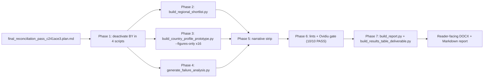

# Feature Completion Matrix — Final Reconciliation Pass

## 1. Feature Identification

- **Feature title:** Final Reconciliation Pass (BY deactivation + Regional Shortlist regen + 16-country figure rebuild + failure-analysis BY drop + narrative strip + DOCX rebuild)
- **User request (verbatim noun phrases):** "Make the plan for the full required rewrites. this should include any and all changes so that the report is final and aligned with the currently frozen scoring and sensitivity runs (national and regional) as well as all comments." / "1. You have consent. 2. All that require changes. Go for 15. 3. drop it 4. drop." / "ignore belaurs completely. you can take it out of the Definition of the region and thus from the entire project. deactivate it rather than delete it so I can bring it back if I want."
- **Owning chat / plan:** `/Users/terbolence/.cursor/plans/final_reconciliation_pass_c241ace3.plan.md` (mirrored to `audit/plans/` and `architecture/plans/`)
- **Date opened:** 2026-05-24
- **Date closed:** 2026-05-24

## 2. Literal Request Check

| Noun in request                                               | Surface it implies                                                                                           | Where it is satisfied                                                                                                                      | Status      |
| ------------------------------------------------------------- | ------------------------------------------------------------------------------------------------------------ | ------------------------------------------------------------------------------------------------------------------------------------------ | ----------- |
| "frozen scoring and sensitivity runs (national and regional)" | All reader-facing artefacts cite `score-c2a90942` + `nat-sens-b1a62885` + `sens-ad4f62bb` + stamp `20260523` | Regional Shortlist Provenance L7-8; sensitivity_analysis.md L134; failure_analysis.md L3                                                   | Implemented |
| "Belarus … deactivate"                                        | BY removed from all build allowlists; data preserved in DB                                                   | Phase 1 (3 script edits) + Phase 2/3/4 regens; `discover_sections` 16-country roster confirmed BY-clean (0 hits across 103 build sections) | Implemented |
| "all comments"                                                | Ovidiu closure gate stays at 10/10 PASS                                                                      | Phase 6 (10/10)                                                                                                                            | Implemented |
| "report is final"                                             | DOCX deliverables rebuilt and verified                                                                       | Phase 7 (3 DOCX, 103 MDs merged)                                                                                                           | Implemented |
| "15 → 16 in-region countries"                                 | All 16 country figures re-rendered against frozen runs                                                       | Phase 3 (16/16 status maps + Paretos refreshed)                                                                                            | Implemented |
| "drop [failure analysis BY rows]"                             | BY rows absent from `failure_analysis.md` + `failure_analysis_nuscale_voygr6.md`                             | Phase 4 (0 BY hits post-regen)                                                                                                             | Implemented |
| "drop [sensitivity §6.6 BY/Zelwa reminder]"                   | Paragraph removed from `methodology/sensitivity_analysis.md`                                                 | Phase 5 (sensitivity_analysis.md L203, L218, L220, L222 cleansed; 0 hits)                                                                  | Implemented |

## 3. End-to-End Path



- **Entry point file:** the plan + 4 build scripts under `src/scripts/`.
- **Engine modules:** `build_regional_shortlist.py`, `build_country_profile_prototype.py` (extended with `--figures-only`), `generate_failure_analysis.py`, `build_report.py`.
- **Persistence target(s):** `report/version 1.03/output/report/**` + `audit/post_processing/06_scoring/20260523_*` + DB `runs/failure_aggregates/failure_outcomes/dataset_snapshot` for new failure-analysis run.
- **Reader / consumer file(s):** `atoms_vs_ashes_report.docx` (35.7 MB / 103 MDs / 5467 paras / 157 tables), `atoms_vs_ashes_results_table.docx` (27.1 MB / 81 site rows / 16 maps), `atoms_vs_ashes_work_audit_synthesis.docx`.
- **User-visible acceptance evidence:** lints exit 0, Ovidiu gate 10/10, 0 BY hits across all 103 build-discovered sections, DOCX rebuilt with 16 country maps and frozen run IDs.

## 4. Surface Matrix

| Surface                              | Required artifact                                        | File / symbol / test                                                                                                                                                                                 | Status         | Notes                                                                                                                            |
| ------------------------------------ | -------------------------------------------------------- | ---------------------------------------------------------------------------------------------------------------------------------------------------------------------------------------------------- | -------------- | -------------------------------------------------------------------------------------------------------------------------------- |
| Build allowlist (country prototypes) | BY removed from script-level country list                | `src/scripts/regenerate_v1_3_country_prototypes.py` L23 (16-tuple) + docstring updated to "16 in-region country prototypes"                                                                          | Implemented    |                                                                                                                                  |
| Build allowlist (failure analysis)   | BY excluded at country iteration                         | `src/scripts/generate_failure_analysis.py` `EXCLUDED_PUBLISHED_COUNTRIES = frozenset({"BY"})` + filter at `_load()` country_by_site and verdicts_by_pair                                             | Implemented    |                                                                                                                                  |
| Build allowlist (regional shortlist) | BY-exclusion banner removed, default-out modernised      | `src/scripts/build_regional_shortlist.py` L327-328 deleted; `DEFAULT_OUT` → `report/version 1.03/output/report`; comment line cleansed                                                               | Implemented    |                                                                                                                                  |
| Build script extension               | `--figures-only` mode                                    | `src/scripts/build_country_profile_prototype.py` + `src/scripts/_country_profile_outputs.py::write_artifacts(figures_only=…)`                                                                        | Implemented    | Preserves hand-edited country prototype prose while refreshing status maps + Paretos                                             |
| Country profile filter               | `_UNPUBLISHED_COUNTRY_CODES` still active                | `src/scripts/_country_profile_outputs.py` L239 (verified, unchanged)                                                                                                                                 | Implemented    |                                                                                                                                  |
| Regional Shortlist regen             | Overwrite with frozen runs                               | `report/version 1.03/output/report/Regional Atoms vs Ashes Shortlist.md` (3168 lines, 16 country sections, 0 BY hits)                                                                                | Implemented    | Phase 2                                                                                                                          |
| Regional shortlist maps              | 16 PNG country maps                                      | `report/version 1.03/output/report/figures/regional_shortlist/[AT-UA]_shortlist_map.png`                                                                                                             | Implemented    | Phase 2 (16 PNGs, no BY)                                                                                                         |
| Country status maps + Pareto         | 16 countries refreshed                                   | `report/version 1.03/output/report/chapters/05_country_and_site_profiles/figures/<CC>_site_status_map.png` + `<CC>_avoidance_pareto.png` (+ `<CC>_exclusionary_pareto.png` where pool ≥ 1 hard-fail) | Implemented    | Phase 3 (16/16 maps fresh, 11/16 exclusionary Paretos emitted; 5 countries [HU, LV, MD, UA, CZ] have no hard-fail pool to chart) |
| Country prototype MDs preserved      | Hand-edited prose intact                                 | 16/16 MDs identical to pre-pass snapshot (`diff` = 0 lines)                                                                                                                                          | Implemented    | Verified post-Phase-3                                                                                                            |
| Failure analysis MDs                 | BY rows dropped                                          | `report/version 1.03/methodology/failure_analysis.md` + `failure_analysis_nuscale_voygr6.md` (0 BY hits)                                                                                             | Implemented    | Phase 4: full pack regenerated against `score-c2a90942` / stamp `20260523`                                                       |
| Failure analysis CSVs                | BY rows dropped                                          | `audit/post_processing/06_scoring/20260523_failure_per_country.csv` + `_failure_per_pair.csv` + per-SMR CSVs (0 BY rows)                                                                             | Implemented    | Phase 4                                                                                                                          |
| Failure analysis figures             | Refreshed without BY                                     | `report/version 1.03/output/report/sensitivity/20260523/figures/failure/failures_by_country.png` etc.                                                                                                | Implemented    | Phase 4 (mtime 16:03)                                                                                                            |
| Sensitivity methodology              | BY references removed                                    | `report/version 1.03/methodology/sensitivity_analysis.md` L134 (envelope updated 362→360 / 306→304), §6.5 head-country list cleansed, Band A counts 46→45 / 33→32, §6.6 BY framing reminder deleted  | Implemented    | Phase 5 (0 BY hits)                                                                                                              |
| Executive technical brief            | "excluding Belarus" phrasing cleared                     | `report/version 1.03/output/report/executive_technical_brief.md` L47 ("Austria through Ukraine, alphabetical by ISO 3166-1 alpha-2 code")                                                            | Implemented    | Phase 5 (0 BY hits)                                                                                                              |
| cross_chapter_numeric_lint           | exit 0                                                   | Phase 6                                                                                                                                                                                              | Implemented    | 0 findings                                                                                                                       |
| lint_ledger_consistency              | exit 0                                                   | Phase 6                                                                                                                                                                                              | Implemented    | 0 findings                                                                                                                       |
| audit_ovidiu_closure_evidence        | 10/10 PASS                                               | Phase 6                                                                                                                                                                                              | Implemented    | 10/10 PASS (rows #32 #38 #43 #50 #54 #57 #60 #61 #63 #70)                                                                        |
| DOCX rebuild                         | atoms_vs_ashes_report.docx + results table + work audit  | Phase 7                                                                                                                                                                                              | Implemented    | 35.7 MB / 5467 paras / 157 tables / 103 MDs merged; results-table 27.1 MB / 81 site rows / 16 maps                               |
| Build BY-cleanliness                 | 0 BY hits in build-discovered sections                   | Phase 7 verification script across 103 sections                                                                                                                                                      | Implemented    | 0 hits                                                                                                                           |
| Audit log                            | `audit/conversations/2026-05-24_final_reconciliation.md` | Phase 8                                                                                                                                                                                              | Implemented    |                                                                                                                                  |
| Man-hours metadata                   | Archived                                                 | —                                                                                                                                                                                                    | Not applicable | Rule disabled                                                                                                                    |

## 5. Negative Acceptance Tests

| Surface                       | Test                                                                           | Result                                                                |
| ----------------------------- | ------------------------------------------------------------------------------ | --------------------------------------------------------------------- |
| BY allowlist (build sections) | Python scan over `discover_sections()` output for `\bBelarus\b\|\bBY\b\|Zelwa` | 0 hits across 103 sections                                            |
| Regional Shortlist provenance | grep `score-c2a90942\|nat-sens-b1a62885`                                       | present L7-8                                                          |
| Regional Shortlist body       | grep `\bBY\b\|Belarus\|Zelwa`                                                  | 0 hits                                                                |
| Regional Shortlist coverage   | grep `^## .* \([A-Z]{2}\)`                                                     | 16 country sections (AT BA BG CZ HR HU LV MD ME MK PL RO RS SK TR UA) |
| Country status maps           | mtime newer than pass start (1779627551)                                       | 16/16 fresh                                                           |
| Country avoidance Paretos     | mtime newer than pass start                                                    | 16/16 fresh                                                           |
| Country exclusionary Paretos  | mtime newer than pass start                                                    | 11/16 fresh (5 countries have no hard-fail pool by construction)      |
| Country MD preservation       | `diff` per CC against pre-pass snapshot                                        | 16/16 identical (0 lines)                                             |
| Failure analysis MDs          | grep `\bBY\b\|Belarus\|Zelwa`                                                  | 0 hits                                                                |
| Failure analysis CSVs         | grep `^BY,` per_country + per_pair + all per-SMR                               | 0 rows                                                                |
| Executive technical brief     | grep `\bBelarus\b\|Zelwa`                                                      | 0 hits                                                                |
| Sensitivity methodology       | grep `\bBelarus\b\|\bBY\b\|Zelwa`                                              | 0 hits                                                                |
| Numeric lint                  | `cross_chapter_numeric_lint.py`                                                | exit 0, 0 findings                                                    |
| Ledger lint                   | `lint_ledger_consistency.py`                                                   | exit 0, 0 findings                                                    |
| Ovidiu closure gate           | `audit_ovidiu_closure_evidence.py`                                             | 10/10 PASS                                                            |
| DOCX rebuild                  | builder log                                                                    | 103 MDs / 5467 paras / 157 tables / 81 site rows / 16 maps            |

## 6. Subtle Consumption Check

| Artifact                                                                                                 | Consumer                                                                | Surface                                   |
| -------------------------------------------------------------------------------------------------------- | ----------------------------------------------------------------------- | ----------------------------------------- |
| `Regional Atoms vs Ashes Shortlist.md` (3168 lines)                                                      | Side-deliverable on disk (not in main DOCX)                             | Standalone MD reader                      |
| `<CC>_site_status_map.png` / `<CC>_avoidance_pareto.png` / `<CC>_exclusionary_pareto.png` (16 countries) | `<CC>_country_prototype.md` image refs → `build_report.py` Pandoc merge | `atoms_vs_ashes_report.docx` Chapter 5    |
| `failure_analysis.md` / `failure_analysis_nuscale_voygr6.md` (BY-clean)                                  | Annex D + methodology cross-references                                  | `atoms_vs_ashes_report.docx` Annex D      |
| `20260523_failure_per_country.csv` / `_failure_per_pair.csv` (BY-clean)                                  | Annex D table sources + failure-analysis methodology                    | Reader-facing tables                      |
| `executive_technical_brief.md` (BY-clean)                                                                | Standalone deliverable                                                  | PDF/MD export                             |
| `methodology/sensitivity_analysis.md` (BY-clean, 304-site published envelope)                            | Methodology bundle                                                      | Side-deliverable + cross-reference target |

## 7. Deferred Surfaces

| Surface                                                                                                                          | Reason for deferral                                                                                                        | User approval evidence                                                                                     | Follow-up ticket                                                                                                                                                           |
| -------------------------------------------------------------------------------------------------------------------------------- | -------------------------------------------------------------------------------------------------------------------------- | ---------------------------------------------------------------------------------------------------------- | -------------------------------------------------------------------------------------------------------------------------------------------------------------------------- |
| Regional sensitivity Monte Carlo re-run with BY excluded                                                                         | User chose `editorial_filter` in plan-mode question                                                                        | "Keep sens-ad4f62bb frozen; filter BY editorially" (Plan-mode AskQuestion answer 2026-05-24)               | None — frozen run preserved per user direction; published envelope cited as 360 pairs / 304 sites; underlying CSVs/figures still derive from the 362/306 Monte Carlo basis |
| `methodology/criterion_correlation.md` "Pairs observed: 362" + `methodology/swing_weight_audit.md` "Pool: 362 (site, SMR) pairs" | Both are side-deliverables outside the main DOCX build (not in `discover_sections`); cite the frozen Monte Carlo pool size | "editorial_filter" — keep underlying analytic frame visible in non-published methodology side-deliverables | None                                                                                                                                                                       |
| `BY_country_prototype.md` retention (with unpublished banner)                                                                    | User direction: "deactivate rather than delete so I can bring it back if I want"                                           | "deactivate it rather than delete it" (user 2026-05-24)                                                    | None — file kept on disk under `chapters/05_country_and_site_profiles/`; not in `discover_chapter5_sections` 16-country roster                                             |
| `report/output/report/sensitivity/20260423/` + `20260425/` + `20260425b/` legacy stamp directories (still contain BY)            | Out-of-build legacy sensitivity stamps preserved for diff inspection per Pass A precedent; not in published surface        | Pass A FCM 2026-05-24 (diff-inspection retention)                                                          | None                                                                                                                                                                       |

## 8. Final Trace

```
Plan: /Users/terbolence/.cursor/plans/final_reconciliation_pass_c241ace3.plan.md
  -> Phase 1: 4 source edits
       - src/scripts/regenerate_v1_3_country_prototypes.py (17 -> 16 country list; docstring updated)
       - src/scripts/generate_failure_analysis.py (EXCLUDED_PUBLISHED_COUNTRIES = frozenset({"BY"}) + _load filter)
       - src/scripts/build_regional_shortlist.py (L327-328 banner removed; DEFAULT_OUT v1.02 -> v1.03; comment line cleansed)
       - src/scripts/build_country_profile_prototype.py + src/scripts/_country_profile_outputs.py (--figures-only mode)
  -> Phase 2: scripts.build_regional_shortlist --scoring-run-id score-c2a90942 --sensitivity-run-id nat-sens-b1a62885 --out-dir "report/version 1.03/output/report"
       - report/version 1.03/output/report/Regional Atoms vs Ashes Shortlist.md (3168 lines, 16 countries, 0 BY hits)
       - report/version 1.03/output/report/figures/regional_shortlist/[AT-UA]_shortlist_map.png (16 PNGs, no BY)
  -> Phase 3: scripts.build_country_profile_prototype --figures-only per CC for AT BA BG CZ HR HU LV MD ME MK PL RO RS SK TR UA
       - figures/<CC>_site_status_map.png + <CC>_avoidance_pareto.png + <CC>_exclusionary_pareto.png refreshed
       - <CC>_country_prototype.md preserved (16/16 identical to snapshot via diff)
  -> Phase 4: scripts.generate_failure_analysis --db-profile merged --stamp 20260523 --method-path/-root/-report-root pointed at v1.03
       - DB run fail_20260523_c2a90942 deleted + re-emitted (with BY filter active)
       - report/version 1.03/methodology/failure_analysis.md + failure_analysis_nuscale_voygr6.md (0 BY hits)
       - audit/post_processing/06_scoring/20260523_failure_per_country.csv + _failure_per_pair.csv + all per-SMR CSVs (0 BY rows)
       - report/version 1.03/output/report/sensitivity/20260523/figures/failure/*.png (refreshed)
  -> Phase 5: surgical StrReplace edits
       - report/version 1.03/output/report/executive_technical_brief.md L47 ("excluding Belarus" -> "alphabetical by ISO 3166-1 alpha-2 code")
       - report/version 1.03/methodology/sensitivity_analysis.md L134 (envelope 362/306 -> published-roster 360/304)
       - report/version 1.03/methodology/sensitivity_analysis.md L203 (drop BY:1 from head country counts; drop editorial sentence)
       - report/version 1.03/methodology/sensitivity_analysis.md L216 (band counts: A=46/33 -> A=45/32; pool 306 -> 304; A-G totals/percentages recomputed)
       - report/version 1.03/methodology/sensitivity_analysis.md L218 (Band A all-SMR: drop "Zelwa (BY)"; 46 -> 45)
       - report/version 1.03/methodology/sensitivity_analysis.md L220 (Band A NuScale: drop "Zelwa (BY)"; 33 -> 32)
       - report/version 1.03/methodology/sensitivity_analysis.md L222 (BY framing reminder paragraph deleted)
  -> Phase 6 gates: cross_chapter_numeric_lint exit 0 / lint_ledger_consistency exit 0 / audit_ovidiu_closure_evidence 10/10 PASS
  -> Phase 7 DOCX rebuild: scripts/build_report.py --format "report/version 1.03/output/report/writing plan/report_format.json"
       -> report/version 1.03/output/report/build/atoms_vs_ashes_report.docx (35.7 MB / 103 MDs / 5467 paras / 157 tables)
       -> report/version 1.03/output/report/build/atoms_vs_ashes_results_table.docx (27.1 MB / 81 site rows / 16 maps)
       -> report/version 1.03/output/report/build/atoms_vs_ashes_work_audit_synthesis.docx (3 expert viewpoints)
       -> Build verification: 0 BY hits across all 103 discover_sections() outputs
  -> Audit log: audit/conversations/2026-05-24_final_reconciliation.md
  -> Deferred (explicit user approval): regional sensitivity Monte Carlo re-run (editorial-filter chosen instead); BY_country_prototype.md retained on disk
```
