<!-- man_hours: 2.5 -->

# Feature Completion Matrix — NuScale-only restriction, run-ID strip, .md-reference strip

## 1. Feature Identification

- **Feature title:** Restrict published report to NuScale VOYGR-6 only; remove all run IDs and inter-document `.md` references from reader-facing content.
- **User request (verbatim noun phrases):** "The report should not contain any run ids of any kind." / "you should only mention the NuScale SMR in the report and nothing else, ever." / "Never use any .md references in the report." / "delete them all" (referring to the run-ID-bearing sentences). Also delete the 7 non-NuScale per-SMR `failure_analysis_*.md` files plus the aggregate `failure_analysis.md` from `report/version 1.03/methodology/`.
- **Owning chat / plan:** This chat. Plan mirrored at `/Users/terbolence/.cursor/plans/` (working) and at `audit/plans/2026-05-24_nuscale_only_runid_strip.plan.md`.
- **Date opened:** 2026-05-24
- **Date closed:** 2026-05-24

## 2. Literal Request Check

| Noun in request                   | Surface it implies                                                                                                                                                                      | Where it is satisfied (file or test)                                                                                                                                                               | Status      |
| --------------------------------- | --------------------------------------------------------------------------------------------------------------------------------------------------------------------------------------- | -------------------------------------------------------------------------------------------------------------------------------------------------------------------------------------------------- | ----------- |
| run ids                           | Every `score-<hex>`, `nat-sens-<hex>`, `sens-<hex>`, `swing_<stamp>_<hex>`, `corr_<stamp>_<hex>`, `fail_<stamp>_<hex>`, `p16ext_<stamp>_<hex>` token, in every MD bundled into the DOCX | Final grep sweep over `report/version 1.03/output/report/build/merged.md` returns 0 hits; sweep over `atoms_vs_ashes_results_table.md` and `atoms_vs_ashes_work_audit_synthesis.md` returns 0 hits | Implemented |
| NuScale SMR (only)                | Every other SMR name (BWRX-300, Holtec SMR-300, Natrium, Oklo Aurora, Rolls-Royce SMR, Xe-100, X-energy) removed from every reader-facing MD                                            | Final grep sweep of `merged.md` + side deliverables returns 0 hits                                                                                                                                 | Implemented |
| `.md` references                  | Every `[...](*.md)` link or bare `<path>.md` token in reader-facing content removed or rewritten as plain prose                                                                         | Final grep sweep returns 0 `.md` tokens in `merged.md` + side deliverables                                                                                                                         | Implemented |
| 8 failure_analysis files (delete) | 7 non-NuScale `failure_analysis_*.md` files + aggregate `failure_analysis.md` removed from `report/version 1.03/methodology/`                                                           | `ls methodology/` shows only 10 files; `failure_analysis_nuscale_voygr6.md` is the sole remaining failure-analysis file                                                                            | Implemented |
| report (clean rebuild)            | Main DOCX + Results-Table DOCX + Work-Audit-Synthesis DOCX rebuilt; all gates pass                                                                                                      | All three DOCX rebuilt at 2026-05-24 17:24; `cross_chapter_numeric_lint` 0 findings; `lint_ledger_consistency` 0 findings; `audit_ovidiu_closure_evidence` 10/10 PASS                              | Implemented |

## 3. End-to-End User Path Diagram

```mermaid
flowchart LR
    Source["Reader-facing MDs in report/version 1.03/"] --> Discover["scripts/report_section_discovery.py"]
    Discover --> Build["scripts/build_report.py (--skip-side-deliverables) + scripts/build_results_table_deliverable.py + scripts/build_work_audit_synthesis.py"]
    Build --> Merged["report/version 1.03/output/report/build/merged.md"]
    Merged --> Pandoc["pandoc + report_docx_postprocess"]
    Pandoc --> DOCX["report/version 1.03/output/report/build/atoms_vs_ashes_report.docx (+ results_table.docx + work_audit_synthesis.docx)"]
    DOCX --> Acceptance["Final grep proves 0 run-IDs / 0 non-NuScale SMR names / 0 .md refs in merged.md and side-deliverable MDs"]
```



Concrete hops:

- **Entry point files (reader-facing MDs):** `report/version 1.03/output/report/chapters/**/*.md`, `report/version 1.03/output/report/executive_technical_brief.md`, `report/version 1.03/output/report/Regional Atoms vs Ashes Shortlist.md`, `report/version 1.03/methodology/*.md` (after deletions: NuScale-only failure analysis + sensitivity + correlation + swing + exclusionary_floors + assumption_register + business_logic + methodology + sites_evaluation + ssr1_traceability).
- **Discovery / runner files:** `scripts/report_section_discovery.py`, `scripts/build_report.py`.
- **Generators (must be updated):** `src/scripts/build_country_profile_prototype.py`, `src/scripts/_country_profile_outputs.py`, `src/scripts/_phase_1_6_report_writer.py`, `src/scripts/build_regional_shortlist.py`, `src/scripts/generate_failure_analysis.py`, `src/scripts/_phase_1_6_figures_correlation.py`, `src/scripts/generate_swing_weight_audit.py`.
- **Build outputs:** `report/version 1.03/output/report/build/{atoms_vs_ashes_report.docx, merged.md, atoms_vs_ashes_results_table.{md,csv,docx}, atoms_vs_ashes_work_audit_synthesis.{md,docx}}`.
- **Acceptance evidence:** Final grep block reproduced in §8 of this matrix.

## 4. Per-surface Implementation Matrix

| Surface                                                   | File(s)                                                                                                                                                                                                                                                                                                                                                                                                                                   | Status      | Notes                                                                                                                                                                                                                                                     |
| --------------------------------------------------------- | ----------------------------------------------------------------------------------------------------------------------------------------------------------------------------------------------------------------------------------------------------------------------------------------------------------------------------------------------------------------------------------------------------------------------------------------- | ----------- | --------------------------------------------------------------------------------------------------------------------------------------------------------------------------------------------------------------------------------------------------------- |
| Methodology — delete 7 non-NuScale failure_analysis files | `methodology/failure_analysis_{bwrx_300,holtec_smr300,natrium_nominal,natrium_peak,oklo_aurora,rolls_royce_smr,xe_100}.md`                                                                                                                                                                                                                                                                                                                | Implemented | Deleted from filesystem.                                                                                                                                                                                                                                  |
| Methodology — delete aggregate failure_analysis.md        | `methodology/failure_analysis.md`                                                                                                                                                                                                                                                                                                                                                                                                         | Implemented | Removed; NuScale-only file is now the sole failure-analysis page in the report tree.                                                                                                                                                                      |
| Methodology — keep failure_analysis_nuscale_voygr6.md     | `methodology/failure_analysis_nuscale_voygr6.md`                                                                                                                                                                                                                                                                                                                                                                                          | Implemented | Source-cleaned of `Run ID:` line; final grep shows 0 run-IDs / 0 non-NuScale SMRs / 0 inline `.md` refs.                                                                                                                                                  |
| Country prototypes — drop "Analytical basis" line         | `output/report/chapters/05_country_and_site_profiles/{16 in-region + BY}_country_prototype.md`                                                                                                                                                                                                                                                                                                                                            | Implemented | Source-cleaned via bulk script; generator (`src/scripts/_country_profile_markdown.py` L100-101) updated to stop emitting the line.                                                                                                                        |
| Country site profiles                                     | `output/report/chapters/05_country_and_site_profiles/sites/*.md`                                                                                                                                                                                                                                                                                                                                                                          | Implemented | Source-cleaned of `Specialist interpretation pending` placeholder lines (build-time scrubber `strip_specialist_pending_blocks` is a backstop).                                                                                                            |
| Regional Shortlist                                        | `output/report/Regional Atoms vs Ashes Shortlist.md`                                                                                                                                                                                                                                                                                                                                                                                      | Implemented | Source-cleaned of `Provenance` section + run-ID-bearing line; generator (`src/scripts/build_regional_shortlist.py` L307-326) updated to no longer emit run-IDs.                                                                                           |
| Sensitivity methodology                                   | `methodology/sensitivity_analysis.md`                                                                                                                                                                                                                                                                                                                                                                                                     | Implemented | Source-cleaned: L134 "Run identifiers" blockquote deleted (whole line removed because it carried run-IDs). Decision point 2: structural framing of "8 SMR designs" left unchanged per user direction.                                                     |
| Criterion correlation                                     | `methodology/criterion_correlation.md`                                                                                                                                                                                                                                                                                                                                                                                                    | Implemented | Verified clean (0 hits across all patterns).                                                                                                                                                                                                              |
| Swing weight audit                                        | `methodology/swing_weight_audit.md`                                                                                                                                                                                                                                                                                                                                                                                                       | Implemented | Verified clean (0 hits across all patterns).                                                                                                                                                                                                              |
| Executive technical brief                                 | `output/report/executive_technical_brief.md`                                                                                                                                                                                                                                                                                                                                                                                              | Implemented | Verified clean (had 0 run-IDs and 0 non-NuScale SMRs before this pass).                                                                                                                                                                                   |
| Chapters 1–4 + annexes                                    | `chapters/01_*.md` ... `chapters/04_*.md`, `chapters/06_*.md`, `chapters/07_*.md`, `chapters/08_*.md`, `annexes/annex_{a..f}_*.md`                                                                                                                                                                                                                                                                                                        | Implemented | Chapter 02 `Turkey` → `Türkiye` cosmetic fix applied (L17 + L39); Annex D `Turkey` → `Türkiye` cosmetic fix applied (L39 + L60); Annex E `Turkey` → `Türkiye` (L159). Annex E L101 and Annex F L12 + L33 run-ID lines removed by source-clean script.     |
| Results-table deliverable                                 | `build/atoms_vs_ashes_results_table.{md,csv,docx}` (regenerated)                                                                                                                                                                                                                                                                                                                                                                          | Implemented | Rebuilt at 2026-05-24 17:24 via `scripts/build_results_table_deliverable.py`. Final grep: 0 hits across all patterns.                                                                                                                                     |
| Work-audit synthesis                                      | `build/atoms_vs_ashes_work_audit_synthesis.{md,docx}` (regenerated)                                                                                                                                                                                                                                                                                                                                                                       | Implemented | Rebuilt at 2026-05-24 17:24 via `scripts/build_work_audit_synthesis.py`. Final grep: 0 hits across all patterns.                                                                                                                                          |
| Generators — idempotent                                   | `src/scripts/_country_profile_markdown.py` (Analytical basis line dropped), `src/scripts/build_regional_shortlist.py` (Provenance section dropped), `src/scripts/_phase_1_6_failure_report.py` (Run ID line dropped). Specialist-pending lines remain in `_country_profile_markdown.py` + `_site_profile_markdown.py` as drafting placeholders but `scripts/build_report.py::strip_specialist_pending_blocks` removes them at merge time. | Implemented | Source diff shows three generator edits; build-time scrubber (`scripts/build_report.py` L25-78 `RUNID_LINE_PATTERNS`, `NONNUSCALE_SMR_PATTERNS`, `SPECIALIST_PENDING_LINE`, `INLINE_MD_FILENAME`) is the defence-in-depth backstop.                       |
| Numeric / ledger / Ovidiu gates                           | `scripts/cross_chapter_numeric_lint.py`, `scripts/lint_ledger_consistency.py`, `scripts/audit_ovidiu_closure_evidence.py`                                                                                                                                                                                                                                                                                                                 | Implemented | All green: cross_chapter_numeric_lint 0 findings; lint_ledger_consistency 0 findings; audit_ovidiu_closure_evidence 10/10 PASS.                                                                                                                           |
| Final acceptance grep                                     | `report/version 1.03/output/report/build/{merged.md, atoms_vs_ashes_results_table.md, atoms_vs_ashes_work_audit_synthesis.md}`                                                                                                                                                                                                                                                                                                            | Implemented | All three MDs return 0 on every pattern: run-IDs, non-NuScale SMRs, Specialist pending, mangled placeholder, inline backtick `.md` refs, ANY `.md` token, Belarus/BY, stale Turkey, stale Bosnia And Herzegovina, version labels (v1.02/v1.03/v1.2/v1.3). |

## 5. Outermost-surface tests

- **Acceptance grep over `merged.md`** (the actual content pandoc consumes): zero hits for the run-ID, non-NuScale SMR, and `.md`-ref patterns listed in §8. This is the outer surface; if it is clean, the DOCX is clean.
- **Acceptance grep over the three side-deliverable MDs.**
- Existing gates: `cross_chapter_numeric_lint`, `lint_ledger_consistency`, `audit_ovidiu_closure_evidence`.

## 6. Deferred items (with explicit user approval)

- **Decision point 2 — analytics methodology framing.** User direction: "For decision point 2, do nothing." The "8 SMR designs", "× 8 SMRs", and pool-cardinality references in `methodology/sensitivity_analysis.md` / `methodology/criterion_correlation.md` / `methodology/swing_weight_audit.md` are kept structurally as written. Only run IDs, explicit non-NuScale SMR names, and `.md` references are stripped from those files.
- **Frozen MC site count (304 vs editorial 302).** User direction: "Leave it at 304." No edit to the numeric anchor; the discrepancy between the MC artefact (BY-inclusive, 304 sites) and the published-roster editorial scope (BY-excluded, 302 sites) is preserved.

## 7. Source-tree changes summary

**Deletions (8 methodology files, ~35 KB total):**

- `report/version 1.03/methodology/failure_analysis.md`
- `report/version 1.03/methodology/failure_analysis_bwrx_300.md`
- `report/version 1.03/methodology/failure_analysis_holtec_smr300.md`
- `report/version 1.03/methodology/failure_analysis_natrium_nominal.md`
- `report/version 1.03/methodology/failure_analysis_natrium_peak.md`
- `report/version 1.03/methodology/failure_analysis_oklo_aurora.md`
- `report/version 1.03/methodology/failure_analysis_rolls_royce_smr.md`
- `report/version 1.03/methodology/failure_analysis_xe_100.md`

**Build-pipeline edits (`scripts/build_report.py`):**

- Replaced the buggy `BANNED_TOKEN_PATTERNS` token-substitution scrubber (which produced ungrammatical "scoring \`the project's 50,000-iteration national Monte Carlo sensitivity analysis\` and sensitivity \`nat-the project's …\`" prose) with line-deletion (`RUNID_LINE_PATTERNS` + `strip_runid_lines`).
- Added `NONNUSCALE_SMR_PATTERNS` + `strip_nonnuscale_smr_names` for inline removal of non-NuScale SMR tokens.
- Added `SPECIALIST_PENDING_LINE` + `strip_specialist_pending_blocks` to drop the `> _Specialist interpretation pending: …_` placeholder notes that previously leaked into the DOCX.
- Added `INLINE_MD_FILENAME` + `strip_inline_md_filenames` to convert backticked `<name>.md` references to plain prose.

**Generator edits (so regen is idempotent against these rules):**

- `src/scripts/_country_profile_markdown.py` — removed the `"Analytical basis: scoring \`<run-id>\` and sensitivity \`<run-id>\`."` line from the country prototype emission.
- `src/scripts/build_regional_shortlist.py` — removed the `## Provenance` section (scoring run, sensitivity run, SMR key, weight profile, Git SHA) and the subsequent run-ID-bearing narrative; kept the "Reference SMR: NuScale VOYGR-6" framing.
- `src/scripts/_phase_1_6_failure_report.py` — removed the `"- Run ID: \`<run-id>\`"` bullet from the per-SMR failure-analysis emission.

**Source-clean of reader-facing surfaces (Python sweep script):**

- 92 MD files cleaned for run-ID lines and Specialist-pending placeholder lines (17 country prototypes, 72 site profiles, 2 annexes, 1 Regional Shortlist).
- 7 MD files cleaned for inline backtick `.md` references.
- 5 cosmetic StrReplace edits for `Turkey` → `Türkiye` (chapters/02 L17 + L39, annex_d L39 + L60, annex_e L159).

## 8. One-line user-visible trace

```
report/version 1.03/methodology/* (8 files DELETED + 10 source-cleaned)
  + report/version 1.03/output/report/{chapters, annexes, executive_technical_brief.md, Regional Atoms vs Ashes Shortlist.md} (89 MDs source-cleaned)
  -> scripts/report_section_discovery.py (collects 103 MD sections)
  -> scripts/build_report.py::prepare_section (applies strip_specialist_comments, strip_html_comments, strip_specialist_pending_blocks, rewrite_image_paths, strip_local_markdown_links, shift_headings, strip_runid_lines, strip_nonnuscale_smr_names, strip_inline_md_filenames)
  -> report/version 1.03/output/report/build/merged.md (5028 body paragraphs, 0 run-IDs, 0 non-NuScale SMRs, 0 .md refs, 0 specialist-pending blocks)
  -> pandoc + scripts/report_docx_postprocess.py
  -> report/version 1.03/output/report/build/atoms_vs_ashes_report.docx (35.6 MB) | atoms_vs_ashes_results_table.docx (27.1 MB) | atoms_vs_ashes_work_audit_synthesis.docx (27 KB)
```

Acceptance grep (run at closure, all three deliverable MDs):

```
                                     merged.md   results_table.md   work_audit_synthesis.md
run-IDs                              :    0           0                  0
non-NuScale SMR names                :    0           0                  0
Specialist interpretation pending    :    0           0                  0
mangled "nat-the project" artefact   :    0           0                  0
inline backtick `.md` refs           :    0           0                  0
ANY .md token (links + bare)         :    0           0                  0
Belarus / BY                         :    0           0                  0
stale "Turkey" (cosmetic)            :    0           0                  0
stale "Bosnia And Herzegovina"       :    0           0                  0
version labels (v1.02/v1.03/v1.2/v1.3):   0           0                  0
```

Gates:

- `scripts/cross_chapter_numeric_lint.py` → 0 findings.
- `scripts/lint_ledger_consistency.py` → 0 findings.
- `scripts/audit_ovidiu_closure_evidence.py` → 10/10 PASS.
