# Feature Completion Matrix — Results-Table Flag-Name Enrichment (v1.03)

Opened **before** implementation per
[`.cursor/rules/feature-completion-checklist.mdc`](../../.cursor/rules/feature-completion-checklist.mdc)
and the AGENTS.md Definition of Done.

---

## 1. Feature Identification

- **Feature title:** v1.03 results-table flag-name enrichment.
- **User request (verbatim noun phrases):**
  - "actual avoidance flags names in the dialog boxes"
  - "We cannot have that kind of issues in `atoms_vs_ashes_results_table.md`"
  - "raise the quality of the deliverable"
  - "remember the requirements and format I've asked you to deliver in"
- **Owning chat / plan:** `/Users/terbolence/.cursor/plans/results_table_flag_enrichment_70fff8fa.plan.md`.
- **Date opened:** 2026-05-24
- **Date closed:** 2026-05-24

## 2. Literal Request Check

| Noun in request                        | Reviewer evidence                                                                                                                                                                                                                             | Surface it implies                                                                                                                | Where it is satisfied (file or test)                                                                                                                                                                                                                                                                        | Status      |
| -------------------------------------- | --------------------------------------------------------------------------------------------------------------------------------------------------------------------------------------------------------------------------------------------- | --------------------------------------------------------------------------------------------------------------------------------- | ----------------------------------------------------------------------------------------------------------------------------------------------------------------------------------------------------------------------------------------------------------------------------------------------------------- | ----------- |
| "avoidance flags names"                | User reply 2026-05-24 (option `name_code`)                                                                                                                                                                                                    | Country-map callouts and table column emit `Full Name (CODE)` (e.g. `Grid Connection (NS-02)`)                                    | [src/scripts/\_country_profile_map.py](../../src/scripts/_country_profile_map.py) `_callout_text` + `_popup_html`, [scripts/results_table_flags.py](../../scripts/results_table_flags.py) `flag_note`, [tests/scripts/test_v1_2_build_deliverables.py](../../tests/scripts/test_v1_2_build_deliverables.py) | Implemented |
| "dialog boxes"                         | User reply 2026-05-24 (`scope=both`)                                                                                                                                                                                                          | Map callouts on `*_site_status_map.png` + HTML popups                                                                             | [src/scripts/\_country_profile_map.py](../../src/scripts/_country_profile_map.py), regenerated PNG/HTML under `chapters/05_country_and_site_profiles/figures/`                                                                                                                                              | Implemented |
| "atoms_vs_ashes_results_table.md"      | Built file                                                                                                                                                                                                                                    | Table `Avoidance / failure note` column shows codes for every avoidance/hard-fail row (no `criterion codes unavailable` fallback) | `report/version 1.03/output/report/build/atoms_vs_ashes_results_table.{md,csv,docx}` rebuilt via [scripts/build_results_table_deliverable.py](../../scripts/build_results_table_deliverable.py)                                                                                                             | Implemented |
| "raise the quality of the deliverable" | User instruction                                                                                                                                                                                                                              | Per-site avoidance verdicts available for **every** ledger row (incl. 16 RO tail + BA Gacko + RS Morava + RO Mintia-Deva)         | `*_country_bundle.json` carries `per_site_verdicts` (new), regenerated by [src/scripts/regenerate_v1_3_bundles.py](../../src/scripts/regenerate_v1_3_bundles.py)                                                                                                                                            | Implemented |
| "requirements and format I've asked"   | [report/version 1.03/output/report/writing plan/v1_3_iteration_controls.md](../../report/version%201.03/output/report/writing%20plan/v1_3_iteration_controls.md) §Publication Style Gate ("failed exclusionary criteria, avoidance criteria") | Country site ledgers expose actual failed criteria                                                                                | Same as above                                                                                                                                                                                                                                                                                               | Implemented |

## 3. End-to-End User Path Diagram

```mermaid
flowchart LR
    DB["DB: ScreeningVerdict (phase=avoidance/exclusionary, run_id=score-c2a90942)"] --> Producer["country_bundle.py::_per_site_verdicts (new)"]
    Producer --> Bundle["RO_country_bundle.json (per_site_verdicts + criteria_lookup)"]
    Bundle --> FlagNote["scripts/results_table_flags.py::flag_note (rewired)"]
    FlagNote --> TableMD["build/atoms_vs_ashes_results_table.md (column)"]
    Bundle --> LedgerRow["src/scripts/_country_profile_outputs.py::_ledger_row (avoidance_named/hard_fail_named)"]
    LedgerRow --> Map["src/scripts/_country_profile_map.py callout + popup"]
    Map --> PNG["figures/<CC>_site_status_map.png/html"]
    TableMD --> DOCX["build/atoms_vs_ashes_results_table.docx"]
    PNG --> DOCX
    DOCX --> User["A3-landscape DOCX deliverable"]
```



- **Entry point file:** [src/scripts/regenerate_v1_3_bundles.py](../../src/scripts/regenerate_v1_3_bundles.py) (refresh data) and [src/scripts/regenerate_v1_3_country_prototypes.py](../../src/scripts/regenerate_v1_3_country_prototypes.py) (regen maps) and [scripts/build_results_table_deliverable.py](../../scripts/build_results_table_deliverable.py) (rebuild deliverable).
- **Runner/dispatcher file and command line:**
  - `PYTHONPATH=src python -m scripts.regenerate_v1_3_bundles --scoring-run-id score-c2a90942 --sensitivity-run-id nat-sens-b1a62885 --sensitivity-stamp 20260523`
  - `PYTHONPATH=src python -m scripts.regenerate_v1_3_country_prototypes ...`
  - `PYTHONPATH=src:scripts python -m scripts.build_results_table_deliverable --format "report/version 1.03/output/report/writing plan/report_format.json" --output-dir "report/version 1.03/output/report/build"`
- **Engine module:** [src/atoms_vs_ashes/reporting/country_bundle.py](../../src/atoms_vs_ashes/reporting/country_bundle.py) (new `_per_site_verdicts`).
- **Persistence target(s):** 17 in-scope `*_country_bundle.json` + 20 feedback_rerun country bundles, plus regenerated `*_site_status_map.{png,html}`.
- **Reader / consumer file(s):** [scripts/results_table_flags.py](../../scripts/results_table_flags.py), [scripts/results_table_data.py](../../scripts/results_table_data.py), [src/scripts/\_country_profile_outputs.py](../../src/scripts/_country_profile_outputs.py), [src/scripts/\_country_profile_map.py](../../src/scripts/_country_profile_map.py).
- **User-visible acceptance evidence:** rebuilt `atoms_vs_ashes_results_table.{md,csv,docx}` shows `Name (CODE)` for every avoidance/exclusionary row; `*_site_status_map.png` callouts list named flags.

## 4. Surface Matrix

| Surface                     | Required artifact                                                                     | File / symbol / test                                                                                                                                                                                                                                                                                 | Status         | Notes                                                                                     |
| --------------------------- | ------------------------------------------------------------------------------------- | ---------------------------------------------------------------------------------------------------------------------------------------------------------------------------------------------------------------------------------------------------------------------------------------------------- | -------------- | ----------------------------------------------------------------------------------------- |
| GUI page / Streamlit screen | Not applicable                                                                        | —                                                                                                                                                                                                                                                                                                    | Not applicable | Reader-facing deliverable is the DOCX/MD; GUI already shows `criterion_label` separately. |
| CLI subcommand / flag       | Existing CLI flags consumed by frozen-id refresh                                      | `regenerate_v1_3_bundles.py --scoring-run-id …`, `build_results_table_deliverable.py --format …`                                                                                                                                                                                                     | Implemented    | No new flags.                                                                             |
| Script driver               | Bundle refresh + deliverable rebuild scripts                                          | [src/scripts/regenerate_v1_3_bundles.py](../../src/scripts/regenerate_v1_3_bundles.py), [src/scripts/regenerate_v1_3_country_prototypes.py](../../src/scripts/regenerate_v1_3_country_prototypes.py), [scripts/build_results_table_deliverable.py](../../scripts/build_results_table_deliverable.py) | Implemented    |                                                                                           |
| Runner / subprocess wiring  | Pandoc DOCX rebuild                                                                   | `_run_pandoc` → `postprocess_docx` → `_set_landscape_a3` (unchanged)                                                                                                                                                                                                                                 | Implemented    | Existing pipeline.                                                                        |
| Engine code                 | `_per_site_verdicts` returns `{site_id: {phase: [code,...]}}` from `ScreeningVerdict` | [src/atoms_vs_ashes/reporting/country_bundle.py](../../src/atoms_vs_ashes/reporting/country_bundle.py)                                                                                                                                                                                               | Implemented    |                                                                                           |
| DB schema                   | None (existing tables only)                                                           | —                                                                                                                                                                                                                                                                                                    | Not applicable | Reads `ScreeningVerdict` only.                                                            |
| DB writers                  | None                                                                                  | —                                                                                                                                                                                                                                                                                                    | Not applicable |                                                                                           |
| CSV / file artifacts        | Refreshed 17 country bundles + 20 feedback_rerun bundles                              | `report/version 1.03/output/report/chapters/05_country_and_site_profiles/data/<CC>_country_bundle.json`, `report/version 1.03/output/report/bundles/feedback_rerun_20260509/<CC>_country_bundle.json`                                                                                                | Implemented    |                                                                                           |
| Report / export reader      | `flag_note`, `_callout_text`, `_popup_html`                                           | [scripts/results_table_flags.py](../../scripts/results_table_flags.py), [src/scripts/\_country_profile_map.py](../../src/scripts/_country_profile_map.py), [src/scripts/\_country_profile_outputs.py](../../src/scripts/_country_profile_outputs.py)                                                 | Implemented    |                                                                                           |
| Tests: unit                 | `_per_site_verdicts` SQLite fixture; `_callout_text` flag inclusion + cap             | [tests/test_country_bundle_per_site_verdicts.py](../../tests/test_country_bundle_per_site_verdicts.py), [tests/scripts/test_country_profile_map_callouts.py](../../tests/scripts/test_country_profile_map_callouts.py)                                                                               | Implemented    |                                                                                           |
| Tests: persistence          | Country-bundle JSON round-trip already covered                                        | [tests/reporting/test_run_profile_provenance.py](../../tests/reporting/test_run_profile_provenance.py)                                                                                                                                                                                               | Existing       |                                                                                           |
| Tests: entry-point smoke    | `flag_note` returns `Name (CODE)` on real bundles incl. previously-fallback rows      | [tests/scripts/test_v1_2_build_deliverables.py::test_results_table_renders_actual_flag_codes](../../tests/scripts/test_v1_2_build_deliverables.py) (extended)                                                                                                                                        | Implemented    |                                                                                           |
| Methodology / report docs   | Not applicable (deliverable presentation only)                                        | —                                                                                                                                                                                                                                                                                                    | Not applicable | Numeric facts unchanged.                                                                  |
| Expert prompts              | Not applicable                                                                        | —                                                                                                                                                                                                                                                                                                    | Not applicable |                                                                                           |
| Audit log                   | New conversation log                                                                  | [audit/conversations/2026-05-24_results_table_flag_enrichment.md](../conversations/2026-05-24_results_table_flag_enrichment.md)                                                                                                                                                                      | Implemented    |                                                                                           |
| Man-hours metadata          | Archived rule                                                                         | —                                                                                                                                                                                                                                                                                                    | Not applicable | Rule disabled 2026-05-20                                                                  |

## 5. Negative Acceptance Tests

| Surface                                      | Test file                                                                                         | Assertion that proves user-visible wiring                                                                                                                                                                                                                                |
| -------------------------------------------- | ------------------------------------------------------------------------------------------------- | ------------------------------------------------------------------------------------------------------------------------------------------------------------------------------------------------------------------------------------------------------------------------ |
| Table column shows real codes everywhere     | `tests/scripts/test_v1_2_build_deliverables.py::test_results_table_renders_actual_flag_codes`     | `flag_note("RO", "Mintia-Deva power station", passed_exclusionary=True, passed_avoidance=False)` returns a non-empty `Avoidance flags: …` with at least one `Name (CODE)` token (would fail if backend extension landed but the consumer still hit the legacy fallback). |
| Map callouts include named flags             | `tests/scripts/test_country_profile_map_callouts.py::test_callout_appends_named_flags`            | `_callout_text({"status": "avoidance-flag", "avoidance_named": ["Grid Connection (NS-02)", …]})` includes `Grid Connection (NS-02)` (would fail if `_ledger_row` did not propagate flags).                                                                               |
| Country bundle producer emits per-site block | `tests/test_country_bundle_per_site_verdicts.py::test_per_site_verdicts_includes_avoidance_phase` | `_per_site_verdicts(...)` returns `{site_id: {"avoidance": ["NS-02"]}}` against a fixture (would fail if the producer was added but never called from `build_country_bundle`).                                                                                           |
| Format matches user choice (`name_code`)     | `tests/scripts/test_v1_2_build_deliverables.py::test_results_table_renders_actual_flag_codes`     | Output literally contains `Grid Connection (NS-02)` with the parenthesised code (would fail if a refactor reverted to bare codes).                                                                                                                                       |

## 6. Subtle Consumption Check

| Artifact (table / CSV / JSON)                                                     | Consumer file                                                                                                                                                                               | Surface where the user sees it          |
| --------------------------------------------------------------------------------- | ------------------------------------------------------------------------------------------------------------------------------------------------------------------------------------------- | --------------------------------------- |
| `*_country_bundle.json` `per_site_verdicts` (new)                                 | [scripts/results_table_flags.py](../../scripts/results_table_flags.py) `flag_note`; [src/scripts/\_country_profile_outputs.py](../../src/scripts/_country_profile_outputs.py) `_ledger_row` | Table column + map callout              |
| `*_country_bundle.json` `criteria_lookup` (existing, now consumed by deliverable) | [scripts/results_table_flags.py](../../scripts/results_table_flags.py) `_format_named`                                                                                                      | Both surfaces resolve `Name` for `Code` |
| Refreshed `*_site_status_map.png` / `.html`                                       | [scripts/results_table_data.py](../../scripts/results_table_data.py) `_copy_map` (PNG copied into `_assets/`)                                                                               | Country sections of the rebuilt MD/DOCX |

## 7. Deferred Surfaces (require explicit user approval)

_None._ All surfaces in scope are implemented or marked Not applicable above.

## 8. Final Trace (paste into the final response)

```
DB: ScreeningVerdict (run_id=score-c2a90942, phase ∈ {avoidance, exclusionary})
  -> src/atoms_vs_ashes/reporting/country_bundle.py::_per_site_verdicts (new)
  -> build_country_bundle emits top-level "per_site_verdicts" + existing "criteria_lookup"
  -> src/scripts/regenerate_v1_3_bundles.py refreshed 17 in-scope + 20 feedback_rerun country bundles (frozen run ids: scoring=score-c2a90942, sensitivity=nat-sens-b1a62885, stamp=20260523)
  -> src/scripts/build_country_profile_prototype.py --figures-only rebuilt 16 country status maps
     (src/scripts/_country_profile_outputs.py::_ledger_row -> avoidance_named/hard_fail_named ->
      src/scripts/_country_profile_map.py::_callout_text + _popup_html surface "Name (CODE)" on PNG/HTML)
  -> scripts/results_table_flags.py::flag_note (rewired) + _format_named via criteria_lookup
     (precedence: site bundle -> country bundle per_site_verdicts -> failure_outcomes.csv)
  -> scripts/results_table_data.py renders "Avoidance / failure note" column with Name (CODE)
  -> scripts/build_results_table_deliverable.py rebuilt .md/.csv/.docx (A3 landscape)

User-visible artefacts under report/version 1.03/output/report/:
   build/atoms_vs_ashes_results_table.md         (0 "criterion codes unavailable" rows; 81 site rows)
   build/atoms_vs_ashes_results_table.csv
   build/atoms_vs_ashes_results_table.docx       (A3 landscape, named flags + 16 maps)
   chapters/05_country_and_site_profiles/figures/<CC>_site_status_map.png (16 PNGs, named-flag callouts)
   chapters/05_country_and_site_profiles/figures/<CC>_site_status_map.html (16 popups, full flag lists)
   chapters/05_country_and_site_profiles/data/<CC>_country_bundle.json (17 bundles + per_site_verdicts)
   bundles/feedback_rerun_20260509/<CC>_country_bundle.json (20 bundles + per_site_verdicts)

Acceptance gates (all PASS 2026-05-24):
   rg "criterion codes unavailable" build/atoms_vs_ashes_results_table.md  ->  0 hits
   cross_chapter_numeric_lint.py --strict                                  ->  0 findings
   lint_ledger_consistency.py                                              ->  0 findings
   audit_ovidiu_closure_evidence.py                                        ->  10/10 PASS

Tests: tests/test_country_bundle_per_site_verdicts.py (4 new),
       tests/scripts/test_country_profile_map_callouts.py (6 new),
       tests/scripts/test_v1_2_build_deliverables.py::test_results_table_renders_actual_flag_codes,
       tests/scripts/test_v1_2_build_deliverables.py::test_results_table_has_no_unresolved_fallback_rows
```
