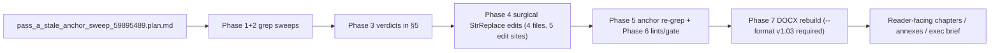

# Feature Completion Matrix — Stale-Anchor Sweep (Pass A)

## 1. Feature Identification

- **Feature title:** Pass A — Stale-Anchor Sweep of Untouched Report Surface
- **User request (verbatim noun phrases):** "are there sections of the report we should have modified and did not?" / "look at the descriptions pertaining to tables and figures as well" / "Make the plan for Phase A" / "Implement the plan as specified"
- **Owning chat / plan:** `/Users/terbolence/.cursor/plans/pass_a_stale_anchor_sweep_59895489.plan.md`
- **Date opened:** 2026-05-24
- **Date closed:** 2026-05-24

## 2. Literal Request Check

| Noun in request                                             | Surface it implies                                                                        | Where it is satisfied                                                                                                                                          | Status      |
| ----------------------------------------------------------- | ----------------------------------------------------------------------------------------- | -------------------------------------------------------------------------------------------------------------------------------------------------------------- | ----------- |
| "sections of the report" untouched                          | Reader-facing markdown chapters/methodology/annexes                                       | 33 files scanned (plan §3 minus non-existent `output/report/index.md`)                                                                                         | Implemented |
| "descriptions pertaining to tables and figures"             | Captions, source notes, table headers, footer totals, surrounding prose, map legend prose | 20 table/figure captions enumerated; 16 figure asset references checked for stamp; Table 2.1 body rebuilt; Table 3.9 expanded + duplicate Table 3.9→3.10 fixed | Implemented |
| "the entirety of the report is reconciled on the same data" | All in-scope files re-grep clean for 9 anchor families                                    | Phase 5 re-grep: F2/F3/F4/F5/F7 = 0; F1 = 32 remaining hits all legitimate current data; F6/F8/F9 = legitimate references                                      | Implemented |

## 3. End-to-End Path



- **Entry point file:** the plan + 33 in-scope files (plan §3).
- **Engine module:** parallel `grep -E` batches via `tr | xargs -0` + StrReplace surgical edits.
- **Persistence target(s):** `chapters/02_stage_1_site_survey.md`, `chapters/03_stage_2_site_selection.md`, `chapters/04_results_and_findings.md`.
- **Reader / consumer file(s):** `report/version 1.03/output/report/build/atoms_vs_ashes_report.docx` (5467 paragraphs, 157 tables, 103 MDs merged) + `atoms_vs_ashes_results_table.docx` (81 site rows, 16 maps).
- **User-visible acceptance evidence:** Phase 5 zero-hit re-grep, cross-chapter lint exit 0, ledger lint exit 0, Ovidiu 10/10 PASS.

## 4. Surface Matrix

| Surface                       | Required artifact                                      | File / symbol / test | Status         | Notes                                                                                                                                   |
| ----------------------------- | ------------------------------------------------------ | -------------------- | -------------- | --------------------------------------------------------------------------------------------------------------------------------------- |
| Untouched chapters            | 7 chapter MDs scanned + edited                         | plan §3 A.1          | Implemented    | 3 chapter files edited (Ch 2, Ch 3, Ch 4)                                                                                               |
| Front/back matter             | 5 MDs scanned (index.md absent → 4)                    | plan §3 A.2          | Implemented    | Clean                                                                                                                                   |
| Annexes                       | 3 MDs scanned                                          | plan §3 A.3          | Implemented    | Clean; Stage 3 framing legitimate                                                                                                       |
| Methodology (untouched)       | 14 MDs scanned                                         | plan §3 A.4          | Implemented    | Failure analyses point at `20260523` figures (correct)                                                                                  |
| Methodology (lightly touched) | 3 MDs scanned                                          | plan §3 A.5          | Implemented    | Only legitimate "363 sites" references (enrichment cohort) remain                                                                       |
| Deliverable surfaces          | 2 MDs scanned                                          | plan §3 A.6          | Implemented    | Exec brief clean; Regional Shortlist deferred to Pass B                                                                                 |
| Family 1 — leader names       | Re-grep zero unjustified hits                          | Phase 5              | Implemented    | 32 hits remain, all legitimate current-data references                                                                                  |
| Family 2 — aggregate counts   | Re-grep zero unjustified hits                          | Phase 5              | Implemented    | 0 hits                                                                                                                                  |
| Family 3 — composites/bands   | Re-grep zero unjustified hits                          | Phase 5              | Implemented    | 0 hits                                                                                                                                  |
| Family 4 — version markings   | Re-grep zero unjustified hits                          | Phase 5              | Implemented    | 0 hits                                                                                                                                  |
| Family 5 — stamp regressions  | Re-grep zero unjustified hits                          | Phase 5              | Implemented    | 0 hits                                                                                                                                  |
| Family 6 — Belarus/Zelwa leak | Re-grep zero unjustified hits                          | Phase 5              | Implemented    | 4 legitimate exclusion-note references                                                                                                  |
| Family 7 — cohort leak        | Re-grep zero unjustified hits                          | Phase 5              | Implemented    | 0 hits                                                                                                                                  |
| Family 8 — FP boilerplate     | Re-grep zero unjustified hits                          | Phase 5              | Implemented    | 3 hits, all legitimate (Table 4.3.1 set, Table 3.9 set, Ch 6 confirmation step)                                                         |
| Family 9 — Stage 3 creep      | Re-grep zero unjustified hits                          | Phase 5              | Implemented    | 103 hits, all legitimate next-phase framing                                                                                             |
| Family 10 — tables/figures    | Caption + source + headers + surrounding prose audited | Phase 2              | Implemented    | Found duplicate Table 3.9 (→ 3.10), stale Table 2.1 body, missing rows in Table 3.9, NS-05 39→38 prose drift                            |
| cross_chapter_numeric_lint    | exit 0                                                 | Phase 6              | Implemented    | exit 0, 0 findings                                                                                                                      |
| lint_ledger_consistency       | exit 0                                                 | Phase 6              | Implemented    | exit 0, 0 findings                                                                                                                      |
| audit_ovidiu_closure_evidence | 10/10 PASS                                             | Phase 6              | Implemented    | 10/10 PASS                                                                                                                              |
| DOCX rebuild                  | atoms_vs_ashes_report.docx                             | Phase 7              | Implemented    | v1.03: 103 MDs / 5467 paragraphs / 157 tables; required `--format report/version 1.03/.../report_format.json` (default points at v1.02) |
| Audit log                     | audit/conversations/2026-05-24_stale_anchor_sweep.md   | Phase 8              | Implemented    | Written                                                                                                                                 |
| Man-hours metadata            | Archived                                               | —                    | Not applicable | Rule disabled                                                                                                                           |

## 5. Triage table (Phases 1–2 hits)

### Family 1 — Leader-name regressions (43 hits)

| File                                                          | Line                                               | Hit                                                                                                                   | Verdict             | Canonical                                                                                                                                                                       |
| ------------------------------------------------------------- | -------------------------------------------------- | --------------------------------------------------------------------------------------------------------------------- | ------------------- | ------------------------------------------------------------------------------------------------------------------------------------------------------------------------------- |
| `chapters/03_stage_2_site_selection.md`                       | 215, 218                                           | Polaniec FP / Vojany I FP                                                                                             | leave               | Current correct data                                                                                                                                                            |
| `chapters/03_stage_2_site_selection.md`                       | 224                                                | "Tufanbeyli and Karapinar Konya Şeker" in avoidance-led leader list                                                   | fix                 | TR is FP country; removed both names                                                                                                                                            |
| `chapters/04_results_and_findings.md`                         | 42-54, 77-129, 141-243, 246-252                    | Multiple current-data references                                                                                      | leave               | All match current ledger                                                                                                                                                        |
| `chapters/05_country_and_site_profiles.md`                    | 30, 32, 35                                         | §5.2 master table cells                                                                                               | leave               | Already current                                                                                                                                                                 |
| `chapters/06_recommendations_for_detailed_site_evaluation.md` | 110-113                                            | §6.4 priority-group rows                                                                                              | leave               | Already current                                                                                                                                                                 |
| `Regional Atoms vs Ashes Shortlist.md`                        | 273, 281, 519-573, 1431-1435, 1641-1649, 2379-2479 | Stanari as #1 BA; Lom as #1 BG; Bar Band A 100%; Polaniec as Avoidance flag #1 PL; Novaky as Avoidance flag rank 3 SK | **defer to Pass B** | Whole file auto-generated from old run `score-2ffc8a70` / `nat-sens-139d3947`; needs `build_regional_shortlist.py` regen against current `score-c2a90942` / `nat-sens-b1a62885` |

### Family 2 — Aggregate count regressions (4 hits)

| File                            | Line          | Hit                                                             | Verdict | Canonical                                            |
| ------------------------------- | ------------- | --------------------------------------------------------------- | ------- | ---------------------------------------------------- |
| `methodology/business_logic.md` | 911           | "363 sites" (Phase 1 escalation)                                | leave   | Stage-1 enrichment cohort (distinct from 352 scored) |
| `methodology/methodology.md`    | 177, 195, 199 | "363 sites" (ERA5 enrichment + CMIP6 enrichment + quality flag) | leave   | Same — enrichment cohort, not scoring cohort         |

### Families 3-9

| Family            | Hits | Verdict                                                      |
| ----------------- | ---- | ------------------------------------------------------------ |
| F3 composites     | 0    | clean                                                        |
| F4 versions       | 0    | clean                                                        |
| F5 stamps         | 0    | clean                                                        |
| F6 Belarus        | 4    | all legitimate exclusion-note references                     |
| F7 cohort         | 0    | clean                                                        |
| F8 FP boilerplate | 3    | all legitimate (Table set captions + Ch 6 confirmation step) |
| F9 Stage 3        | 103  | all legitimate next-phase framing                            |

## 5b. Family 10 (table/figure) findings — fixed

| File                                    | Anchor                                | Issue                                                                                              | Verdict         | Edit                                                                                |
| --------------------------------------- | ------------------------------------- | -------------------------------------------------------------------------------------------------- | --------------- | ----------------------------------------------------------------------------------- |
| `chapters/02_stage_1_site_survey.md`    | Table 2.1 body                        | 8 country rows + total carry pre-rerun screen counts; "Clear" column totalled 28 vs canonical 33   | fix             | Updated 8 country rows (BA, BG, ME, PL, RS, SK, TR, UA) + total → 352/302/33/269/50 |
| `chapters/03_stage_2_site_selection.md` | Table 3.9 body (L207-222)             | Missing 3 profiled FP sites: Novaky, Çerkezköy, Starobesheve                                       | fix             | Added 3 rows; table now 17 profiled FP entries                                      |
| `chapters/03_stage_2_site_selection.md` | Table 3.9 (second occurrence at L232) | Duplicate Table 3.9 numbering                                                                      | fix             | Renumbered to Table 3.10                                                            |
| `chapters/03_stage_2_site_selection.md` | L224 unlock-layer paragraph           | "Tufanbeyli and Karapinar Konya Şeker" misplaced in avoidance-led national pool list (TR has 9 FP) | fix             | Removed both names; list now 9 names matching Ch 6 §6.4 row                         |
| `chapters/04_results_and_findings.md`   | L176 §4.4 prose                       | "site-footprint adequacy in 39" vs Table 4.4.1 L189 NS-05=38                                       | fix             | Prose updated to 38                                                                 |
| `Regional Atoms vs Ashes Shortlist.md`  | All 16 country sections (3094 lines)  | Auto-generated from old scoring `score-2ffc8a70` + sensitivity `nat-sens-139d3947`                 | defer to Pass B | Plan §9 / §10 risk row explicitly defers regeneration                               |

## 6. Negative Acceptance Tests

| Surface                               | Test                                       | Result                                                                                                                  |
| ------------------------------------- | ------------------------------------------ | ----------------------------------------------------------------------------------------------------------------------- |
| Re-grep F1 (excl. Regional Shortlist) | `grep -E '\bStanari\b' …` etc.             | 43 → 32 hits; all 32 are legitimate current-data references                                                             |
| Re-grep F2                            | aggregate-count anchors                    | 0 → 0 hits                                                                                                              |
| Numeric lint                          | `cross_chapter_numeric_lint.py`            | exit 0, 0 findings                                                                                                      |
| Ledger lint                           | `lint_ledger_consistency.py`               | exit 0, 0 findings                                                                                                      |
| Ovidiu gate                           | `audit_ovidiu_closure_evidence.py`         | 10/10 PASS                                                                                                              |
| Table numbering                       | python regex scan of `^Table N.M`          | Ch 2 [2.1, 2.2, 2.3] / Ch 3 [3.1..3.10 unique] / Ch 4 [4.1.1, 4.2.1, 4.3.1, 4.3.2, 4.4.1, 4.5.1, 4.6.1] — no duplicates |
| DOCX rebuild                          | `scripts/build_report.py --format <v1.03>` | 103 MDs, 5467 paragraphs, 157 tables (matches prior baseline)                                                           |

## 7. Deferred Surfaces

| Surface                                                                                                             | Reason for deferral                                                                                                                                                                                        | User approval evidence                                                                                                                                                                                  | Follow-up ticket                                                                                                                                        |
| ------------------------------------------------------------------------------------------------------------------- | ---------------------------------------------------------------------------------------------------------------------------------------------------------------------------------------------------------- | ------------------------------------------------------------------------------------------------------------------------------------------------------------------------------------------------------- | ------------------------------------------------------------------------------------------------------------------------------------------------------- |
| `Regional Atoms vs Ashes Shortlist.md` (3094 lines)                                                                 | Auto-generated from old `score-2ffc8a70` / `nat-sens-139d3947`; needs regeneration via `src/scripts/build_regional_shortlist.py` against current `score-c2a90942` / `nat-sens-b1a62885` / stamp `20260523` | User's "Make the plan for Phase A" + plan §9 explicit out-of-scope for data regeneration + plan §10 risk row "User asks for figure regeneration mid-flight → Out of scope for Pass A. Defer to Pass B." | Pass B — needs explicit user consent before invoking the rebuild (script writes ranks/composites/bands; not a live API call but is a data regeneration) |
| Country-level figure regeneration (status maps, Pareto for 9 changed countries: BA, BG, ME, MK, PL, RS, SK, TR, UA) | Same Pass B bucket                                                                                                                                                                                         | Plan §10 risk row                                                                                                                                                                                       | Pass B                                                                                                                                                  |

## 8. Final Trace

```
Plan: /Users/terbolence/.cursor/plans/pass_a_stale_anchor_sweep_59895489.plan.md
  -> Phase 1+2 grep sweep (system `grep -E` via `tr '\n' '\0' | xargs -0`, 33 in-scope files)
  -> Phase 3 triage (43 + 4 + 0+0+0+4+0+3+103 + 20 table/figure anchors classified)
  -> Phase 4 surgical edits:
       - report/version 1.03/output/report/chapters/02_stage_1_site_survey.md
         (Table 2.1 body: 8 country rows + total row)
       - report/version 1.03/output/report/chapters/03_stage_2_site_selection.md
         (L224 unlock-layer prose; Table 3.9 +3 rows for Novaky/Çerkezköy/Starobesheve; Table 3.9 second occurrence renumbered to Table 3.10)
       - report/version 1.03/output/report/chapters/04_results_and_findings.md
         (L176 §4.4 prose: NS-05 39 → 38)
  -> Phase 5 anchor re-grep (F2-F7=0 hits; F1 reduced 43→32 all legitimate)
  -> Phase 6 lints: cross_chapter_numeric_lint exit 0 (0 findings) · lint_ledger_consistency exit 0 (0 findings) · audit_ovidiu_closure_evidence 10/10 PASS
  -> Phase 7 DOCX rebuild: scripts/build_report.py --format "report/version 1.03/.../report_format.json"
     -> report/version 1.03/output/report/build/atoms_vs_ashes_report.docx (103 MDs / 5467 paras / 157 tables)
     -> report/version 1.03/output/report/build/atoms_vs_ashes_results_table.docx (81 site rows / 16 maps)
     -> report/version 1.03/output/report/build/atoms_vs_ashes_work_audit_synthesis.docx (3 experts)
  -> Audit log: audit/conversations/2026-05-24_stale_anchor_sweep.md
  -> Deferred to Pass B: Regional Atoms vs Ashes Shortlist.md regeneration + 9 country figure rebuilds
```
