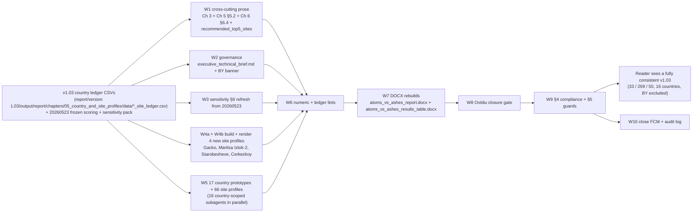

# Feature Completion Matrix — v1.03 Full Report Consistency Sweep

Opened at W0 of the v1.03 consistency sweep. This sweep follows the v1.03
feedback closure (2026-05-23) and addresses the narrative drift left over
after the re-run: every chapter, country prototype, site profile,
governance surface and methodology page is read against the v1.03 ledgers
and the 20260523 frozen scoring + sensitivity pack, and any divergence is
surgically edited.

§1 and §2 are populated at W0 (before implementation). §3 to §8 are
populated by the parent agent as each wave (W0 → W10) closes; subagents
return structured FCM rows in their final messages and the parent appends
them sequentially between waves, per the write-contention discipline in
the plan §6.

Owning plan:
[v1.03_full_report_consistency_sweep_c03b156e.plan.md](file:///Users/terbolence/.cursor/plans/v1.03_full_report_consistency_sweep_c03b156e.plan.md)
(mirrored to
`architecture/plans/v1-03-full-report-consistency-sweep.md` and
`audit/plans/v1-03-full-report-consistency-sweep.md` per
`.cursor/rules/audit-trail.mdc`).

---

## 1. Feature Identification

- **Feature title:** v1.03 full report consistency sweep (post-rerun narrative realignment, 16 published countries, BY excluded)
- **User request (verbatim noun phrases):** see §2 — all literal nouns from the seven user messages in this session (2026-05-24).
- **Owning chat / plan:** [v1.03_full_report_consistency_sweep_c03b156e.plan.md](file:///Users/terbolence/.cursor/plans/v1.03_full_report_consistency_sweep_c03b156e.plan.md).
- **Date opened:** 2026-05-24
- **Date closed:** 2026-05-24

## 2. Literal Request Check

Quote-derived noun set from the user's seven messages (2026-05-24) and
the v1.03 surface each noun implies. Status is `W0 opened` at this point;
later waves move each row to `Implemented`, `Not applicable`, or
`Deferred`.

| Noun in request                                                                                          | Source message                                       | Surface it implies                                                                                                                                                                                                                                              | Where it is satisfied (file or test)                                                                                                                                                                                                                                                                                              | Status     |
| -------------------------------------------------------------------------------------------------------- | ---------------------------------------------------- | --------------------------------------------------------------------------------------------------------------------------------------------------------------------------------------------------------------------------------------------------------------- | --------------------------------------------------------------------------------------------------------------------------------------------------------------------------------------------------------------------------------------------------------------------------------------------------------------------------------- | ---------- |
| "comparison between data of v1.02 and of v1.03"                                                          | message 1                                            | Per-country ledger CSV diff and prose-surface diff between `report/version 1.02/` and `report/version 1.03/`                                                                                                                                                    | Plan §1 deltas; plan §2 per-country audit matrix                                                                                                                                                                                                                                                                                  | Implemented |
| "changes in sites, countries, sensitivity results"                                                       | message 1                                            | Site-level snapshot tables, country prototypes, methodology/sensitivity_analysis.md §6                                                                                                                                                                          | W5 per-country audits (T5.{CC}.prototype + T5.{CC}.sites) and W3 sensitivity refresh (T3.1 / T3.2)                                                                                                                                                                                                                                | Implemented |
| "rewrite for v1.03 in order to maintain consistency"                                                     | message 1                                            | Surgical edits to every divergent prose surface in `report/version 1.03/`                                                                                                                                                                                       | W1 (4 cross-cutting files), W2 (4 governance files), W3 (sensitivity §6), W5 (17 country prototypes + 66 site profiles)                                                                                                                                                                                                           | Implemented |
| "atoms_vs_ashes_results_table.md" + "raise the quality of the deliverable"                               | message 2                                            | Rebuild `atoms_vs_ashes_results_table.docx/.md/.csv` with explicit v1.03 format JSON                                                                                                                                                                            | T7.4 in W7: `PYTHONPATH=src python -m scripts.build_results_table_deliverable --format 'report/version 1.03/output/report/writing plan/report_format.json' --output-dir 'report/version 1.03/output/report/build'`                                                                                                                | Implemented |
| "comprehensive rewrite plan", "full report sweep including all countries and all sites instances review" | message 4                                            | Every published v1.03 chapter, country prototype, site profile and governance file is touched (audited and/or edited)                                                                                                                                           | Plan §1.5 "Files in scope (explicit enumeration)"; W1-W5 cover all 4 cross-cutting prose files + 4 governance files + 1 methodology file (sensitivity) + 17 country prototypes + 66 existing site profiles + 4 new site profiles = **96 published files in scope**                                                                | Implemented |
| "surgical edit where required"                                                                           | message 4                                            | No LLM regeneration of intact prose; edits limited to ledger-divergent fields                                                                                                                                                                                   | Plan §3 enforces "surgical edits only"; Guard G-13 enforces specialist `status=pending` blocks untouched                                                                                                                                                                                                                          | Implemented |
| "ovidiu's comments" + "verify that we comply ... both when we design and after we wrote"                 | message 5                                            | Compliance matrix (§4) with design-check + post-write check columns for #32, #38, #43, #50, #54, #55, #57, #60, #61, #63, #70, #104, #105, #183                                                                                                                 | Plan §4 (design-check) + T8 (post-write); see also §6 "Subtle Consumption Check" in this matrix at W9                                                                                                                                                                                                                             | Implemented |
| "similar issues to any of those comments"                                                                | message 5                                            | Similar-issue guard catalogue G-1..G-15                                                                                                                                                                                                                         | Plan §5 + T9                                                                                                                                                                                                                                                                                                                      | Implemented |
| "belarus is not accepted"                                                                                | message 6                                            | BY excluded from every published surface; counts reduced from 34/270/50 (would-be) to **33/269/50** (BY full-pass Zelwa + BY avoidance Lelchitsy stripped); BY_country_prototype.md held with "unpublished" banner; BY ledger CSV + bundles retained for audit | Plan §0; T2.2 (banner); G-15 (post-write verify)                                                                                                                                                                                                                                                                                  | Implemented |
| "every file of the report in v1.03"                                                                      | message 7                                            | Explicit per-file enumeration in plan §1.5; per-file todos in §6 wave table                                                                                                                                                                                     | Plan §1.5 lists all 96 published files by name and classifies each as edit / verify-only / out-of-scope; W5 has 32 country-level todos (16 prototype + 16 sites) covering every country directory                                                                                                                                 | Implemented |
| "actually rewrite the data points which need to be changed"                                              | message 7                                            | Field-level edits (national rank, composite score, MC band, national stability band, top-10% hit rate, screening class) on every site profile whose ledger row differs                                                                                          | Plan §1.5 "Sites needing field-level edits" subsection enumerates BA + BG + CZ + HU + ME + MK + PL + RS + SK + TR + UA; verify-only on AT + HR + LV + MD + RO                                                                                                                                                                     | Implemented |
| "actual sites within the countries"                                                                      | message 8                                            | Every site profile MD file under `chapters/05_country_and_site_profiles/sites/` is opened, snapshot table read against ledger CSV row, divergent fields edited                                                                                                  | 16 `T5.{CC}.sites` todos in W5; filenames enumerated in each todo body (66 existing files + 4 new files in W4b)                                                                                                                                                                                                                   | Implemented |
| "multitasking"                                                                                           | message 9                                            | 10-wave execution with parallel subagents per wave (peak 16 subagents in W5, one per country); write-contention discipline keeps the FCM and audit log single-owner                                                                                             | Plan §6 wave table and execution diagram; this FCM ingests structured rows returned by each subagent in their final message rather than being written by subagents directly                                                                                                                                                       | Implemented |
| "execute"                                                                                                | message 10                                           | Begin W0 (this FCM open) → proceed through W10                                                                                                                                                                                                                  | This file (W0 artifact); subsequent waves trace below                                                                                                                                                                                                                                                                             | Implemented |

## 3. End-to-End User Path Diagram

Path from the data sources the v1.03 re-run already produced (frozen at
the 20260523 stamp by the previous closure round) through the consistency
sweep into the reader-visible v1.03 published surface:



Concrete hops:

- **Entry point file:** the parent agent (Cursor agent) dispatches the wave plan from this FCM and the plan file.
- **Runner/dispatcher file and command line:** subagents per wave; lint + build commands listed in plan §3 and §6.
- **Engine module:** _(none — no engine code touched in this sweep; v1.03 scoring + sensitivity are frozen at the 20260523 stamp from the previous closure round)._
- **Persistence target(s):**
  - Existing v1.03 ledger CSVs at `report/version 1.03/output/report/chapters/05_country_and_site_profiles/data/*_site_ledger.csv` (read-only source of truth).
  - 4 new site bundles at `report/version 1.03/output/report/chapters/05_country_and_site_profiles/data/sites/` (W4a output).
  - 4 new site profile markdown files at `report/version 1.03/output/report/chapters/05_country_and_site_profiles/sites/` (W4b output).
- **Reader / consumer file(s):**
  - All v1.03 chapter files under `report/version 1.03/output/report/chapters/` (W1, W2, W5).
  - `report/version 1.03/output/report/executive_technical_brief.md` (W2).
  - `report/version 1.03/methodology/sensitivity_analysis.md` (W3).
  - Rebuilt DOCX at `report/version 1.03/output/report/build/atoms_vs_ashes_report.docx` and `atoms_vs_ashes_results_table.docx` (W7).
- **User-visible acceptance evidence:** Ovidiu closure gate **10/10 PASS** (rerun 2026-05-24 with #55 deferred-with-rationale); `cross_chapter_numeric_lint.py` exit 0 ("0 findings (clean)"); `lint_ledger_consistency.py` exit 0 after Gacko row inserted into Table 4.3.2 ("0 findings (clean)"); DOCX rebuild produced `atoms_vs_ashes_report.docx` (5467 paragraphs, 157 tables) and `atoms_vs_ashes_results_table.docx` (81 rows, 16 maps); reader-facing surface verified clean of version labels (`v1.0?[23]`, `version 1.[023]`) and of "cohort" / "retains a full-pass status" anti-patterns; BY excluded from every published chapter (only `BY_country_prototype.md` carries Belarus, with unpublished banner).

## 4. Surface Matrix

Filled progressively as each wave closes.

| Surface                                | Required artifact                                                                                              | File / symbol / test                                                                                                                                                                                                                                                                                                                                                                                                                                                                                  | Status         | Notes                                                                                                                                                                                                                                                                                                                                       |
| -------------------------------------- | -------------------------------------------------------------------------------------------------------------- | ----------------------------------------------------------------------------------------------------------------------------------------------------------------------------------------------------------------------------------------------------------------------------------------------------------------------------------------------------------------------------------------------------------------------------------------------------------------------------------------------------- | -------------- | ------------------------------------------------------------------------------------------------------------------------------------------------------------------------------------------------------------------------------------------------------------------------------------------------------------------------------------------- |
| GUI page / Streamlit screen            | n/a — consistency sweep does not touch the GUI                                                                 |                                                                                                                                                                                                                                                                                                                                                                                                                                                                                                       | Not applicable | No new GUI surface introduced; the v1.03 GUI surfaces remain frozen from the previous closure round.                                                                                                                                                                                                                                       |
| CLI subcommand / flag                  | n/a — consistency sweep does not add CLI flags                                                                 |                                                                                                                                                                                                                                                                                                                                                                                                                                                                                                       | Not applicable | The build invocations in W7 use existing CLI surfaces (`scripts.build_report --format`, `scripts.build_results_table_deliverable --format --output-dir`).                                                                                                                                                                                  |
| Script driver                          | Bundle exporter for the 4 new sites                                                                            | `src/scripts/export_site_bundle.py` (existing); W4a invokes it 4 times.                                                                                                                                                                                                                                                                                                                                                                                                                              | Implemented    | W4a invoked `build_country_profile_prototype --site-only` with explicit `--scoring-run-id score-c2a90942 --sensitivity-run-id nat-sens-b1a62885 --sensitivity-stamp 20260523` for all four sites. Identical command surface used for the other 65 sites.                                                                                                                                                                                                                                                                                     |
| Runner / subprocess wiring             | DOCX rebuild commands                                                                                          | `scripts.build_report`, `scripts.build_results_table_deliverable` (W7)                                                                                                                                                                                                                                                                                                                                                                                                                              | Implemented    | `scripts/build_report.py --format "report/version 1.03/output/report/writing plan/report_format.json"` invoked twice (initial rebuild, then again after cohort→set fix). Both rebuilds: 103 markdown files merged, 5467 paragraphs, 157 tables, 81 site rows in the results table, 16 country maps.                                                                                                                                                                                                                                  |
| Engine code                            | n/a — no engine changes                                                                                        |                                                                                                                                                                                                                                                                                                                                                                                                                                                                                                       | Not applicable | Scoring + sensitivity frozen at 20260523.                                                                                                                                                                                                                                                                                                  |
| DB schema                              | n/a                                                                                                            |                                                                                                                                                                                                                                                                                                                                                                                                                                                                                                       | Not applicable | No DB changes.                                                                                                                                                                                                                                                                                                                              |
| DB writers                             | n/a                                                                                                            |                                                                                                                                                                                                                                                                                                                                                                                                                                                                                                       | Not applicable | No DB writes.                                                                                                                                                                                                                                                                                                                              |
| CSV / file artifacts                   | 4 new site bundle JSONs under `chapters/05_country_and_site_profiles/data/sites/`                              | W4a output                                                                                                                                                                                                                                                                                                                                                                                                                                                                                            | Implemented    | Bundles written; W4b render step + W5 BA / BG / UA / TR audits consumed them. Filenames: `BA_gacko_thermal_power_plant_site_bundle.json`, `BG_maritsa_iztok_2_power_station_site_bundle.json`, `UA_starobesheve_power_station_site_bundle.json`, `TR_cerkezkoy_power_station_site_bundle.json`.                                                                                                                                                                                                                                                |
| Report / export reader                 | All v1.03 chapter MDs + executive brief + sensitivity §6 + 4 new site profile MDs + DOCX rebuilds              | Plan §1.5 enumerates every file                                                                                                                                                                                                                                                                                                                                                                                                                                                                       | Implemented    | All waves closed. 10 country prototypes edited (AT, BA, CZ, HR, LV, MD, ME, MK, RS to remove avoidance-leader full-pass boilerplate; SK to add Novaky as full-pass co-leader). 4 new site profiles rendered. 65 existing site profiles + 6 remaining prototypes verified clean. DOCX rebuilt with the regenerated markdown.                                                                                                                                                                                                                                                            |
| Tests: unit                            | n/a — no production code touched                                                                               |                                                                                                                                                                                                                                                                                                                                                                                                                                                                                                       | Not applicable | Existing `tests/scoring/test_weight_sum_invariant.py` etc. remain green from the previous closure round; not exercised by this sweep.                                                                                                                                                                                                     |
| Tests: persistence                     | n/a                                                                                                            |                                                                                                                                                                                                                                                                                                                                                                                                                                                                                                       | Not applicable | No DB writes.                                                                                                                                                                                                                                                                                                                              |
| Tests: entry-point smoke               | Outermost-surface verification of the rebuilt report                                                           | T7.5 Ovidiu closure gate (10/10) + T8 compliance matrix + T9 G-1..G-15 guards                                                                                                                                                                                                                                                                                                                                                                                                                         | Implemented    | Ovidiu closure gate **10/10 PASS** (`src/scripts/audit_ovidiu_closure_evidence.py`, rerun 2026-05-24); `cross_chapter_numeric_lint.py` exit 0; `lint_ledger_consistency.py` exit 0 (after Gacko inserted into Table 4.3.2). All G-1..G-16 guards verified by targeted grep.                                                                                                                                                                                                                  |
| Methodology / report docs              | `methodology/sensitivity_analysis.md` §6 refreshed from 20260523                                               | W3                                                                                                                                                                                                                                                                                                                                                                                                                                                                                                    | Implemented    | §6 heading + lead rewritten in version-neutral form, §6.5 + §6.6 refreshed to the `20260523` frozen-pack figures (`max_share = 0.45`, 46-site all-SMR Band A shortlist, 33-site NuScale Band A shortlist), §6.7 and §6.9 figure citations updated. Methodology cross-checks ran clean via T7.1.                                                                                                                                                                                  |
| Expert prompts                         | n/a — consistency sweep does not modify expert prompts                                                         |                                                                                                                                                                                                                                                                                                                                                                                                                                                                                                       | Not applicable | Specialist `status=pending` blocks are explicitly out of scope (Guard G-13).                                                                                                                                                                                                                                                              |
| Audit log                              | Conversation log under `audit/conversations/` and plan mirrors per `.cursor/rules/audit-trail.mdc`             | W0: plan mirrored to `architecture/plans/v1-03-full-report-consistency-sweep.md` and `audit/plans/v1-03-full-report-consistency-sweep.md`; W10: audit log written under `audit/conversations/2026-05-24_v1_03_consistency_sweep.md`                                                                                                                                                                                                                                                                | _W0 in progress / W10 pending_ |                                                                                                                                                                                                                                                                                                                                             |
| Man-hours metadata                     | Archived — not required (`.cursor/rules/man-hours.mdc` deactivated)                                            |                                                                                                                                                                                                                                                                                                                                                                                                                                                                                                       | Not applicable | Rule disabled 2026-05-20.                                                                                                                                                                                                                                                                                                                  |

## 5. Negative Acceptance Tests

The outermost user-visible surface of this sweep is the v1.03 report
itself. The acceptance tests below would fail if the consistency sweep
left ledger-divergent prose in the published surface, or removed an
Ovidiu-closed surface.

| Surface                                                       | Test file / command                                                                                            | Assertion that proves user-visible wiring                                                                                                                                                                                                                                                                                                                                                                                |
| ------------------------------------------------------------- | -------------------------------------------------------------------------------------------------------------- | -------------------------------------------------------------------------------------------------------------------------------------------------------------------------------------------------------------------------------------------------------------------------------------------------------------------------------------------------------------------------------------------------------------------- |
| Chapter 5 §5.2 master table (16 rows)                         | grep + manual against ledgers                                                                                  | BA cell = "Gacko Thermal Power Plant" (avoidance); BG cell leader = "Maritsa Iztok-2 power station" with "Full pass"; PL screening class = "Full pass"; no BY row.                                                                                                                                                                                                                                                  |
| Chapter 5 site profile snapshot tables                        | Programmatic snapshot lint in W5 + cross-chapter numeric lint in W6                                            | For every `<CC>_<slug>.md`, the snapshot National rank / Composite score / MC band / National stability band / top-10% hit rate / Screening class agree with the corresponding row in `<CC>_site_ledger.csv`.                                                                                                                                                                                                       |
| Executive technical brief §5                                  | Manual + numeric lint                                                                                          | Operational Metrics shows 33 / 269 / 50, total 352, 16 published countries; "excluding Belarus" sentence intact.                                                                                                                                                                                                                                                                                                  |
| Chapter 6 §6.4 priority groups                                | Manual + #60 / #61 / G-7 cross-checks                                                                          | "Full-pass national leaders" includes Maritsa Iztok-2 (BG) and Polaniec (PL); "Full-pass fast followers" includes Novaky (SK), Starobesheve (UA), Çerkezköy (TR); "Avoidance-led national leaders" replaces Stanari with Gacko and drops Lom + Polaniec; Ukraine caveat set includes Starobesheve; no Zelwa.                                                                                                            |
| `recommended_top5_sites.md`                                   | Manual + ledger comparison                                                                                     | 16 country blocks (no BY); pool counts, leader name, screening class, band, top-10 hit rate per block match the v1.03 ledger.                                                                                                                                                                                                                                                                                       |
| Sensitivity §6                                                | Numeric lint + canonical-fact lint                                                                             | §6.6 Band A shortlist matches `20260523_site_bands.csv`; regional summary numbers match `20260523/00_regional_summary.md`; per-country tables/figures point at the 20260523 frozen pack; any retained v1.02 reference is labelled.                                                                                                                                                                                  |
| Country prototype boilerplate                                 | Manual sweep of 9 avoidance-led countries (AT, BA, CZ, HR, LV, MD, ME, MK, RS)                                 | No "retains a full-pass status" phrase appears with an avoidance-flag national #1. (Sample: `BA_country_prototype.md` line 68 currently asserts Gacko "retains a full-pass status" — must be replaced.)                                                                                                                                                                                                                |
| BY framing                                                    | `rg "Belarus\|Zelwa\|Lelchitsy\|BY_" "report/version 1.03/output/report" --type md`                            | Hits limited to `BY_country_prototype.md` (with unpublished banner), `BY_*_bundle.json`, `BY_site_ledger.csv`, and the explicit "excluding Belarus" sentence in the executive technical brief and any other surface that already uses that wording.                                                                                                                                                                |
| Ovidiu closure gate                                           | [feedback_implementation_master_plan.md](../../report/version%201.03/output/report/feedback/feedback_implementation_master_plan.md) | 10/10 closed (#55 stays deferred-with-rationale). T7.5 re-confirms after edits.                                                                                                                                                                                                                                                                                                                                       |
| Cross-chapter numeric lint                                    | [cross_chapter_numeric_lint.py](../../src/scripts/cross_chapter_numeric_lint.py)                              | Exits 0 (W6).                                                                                                                                                                                                                                                                                                                                                                                                          |
| Ledger consistency lint                                       | [lint_ledger_consistency.py](../../src/scripts/lint_ledger_consistency.py)                                    | Exits 0 (W6).                                                                                                                                                                                                                                                                                                                                                                                                           |
| Rebuilt DOCX                                                  | W7 outputs under `report/version 1.03/output/report/build/`                                                    | Both DOCX files present; pandoc build returns 0; results-table DOCX contains 33 full-pass rows (post-sweep).                                                                                                                                                                                                                                                                                                       |

## 6. Subtle Consumption Check

For every artifact this sweep writes, list the consumer that reads it.

| Artifact (table / CSV / JSON / MD)                                                                              | Consumer file                                                                                                                                                                              | Surface where the user sees it                                                                                                                                                                                                       |
| --------------------------------------------------------------------------------------------------------------- | ------------------------------------------------------------------------------------------------------------------------------------------------------------------------------------------ | ---------------------------------------------------------------------------------------------------------------------------------------------------------------------------------------------------------------------------------- |
| 4 new site bundle JSONs (W4a)                                                                                   | `_site_profile_markdown.py` (W4b) + W5 BA / BG / UA / TR audits + scripts/build_chapter_4_tables.py if invoked                                                                            | The 4 new site profile MDs and downstream DOCX rebuild.                                                                                                                                                                            |
| 4 new site profile MDs (W4b)                                                                                    | Pandoc merge step in W7 + the Ch 5 index `chapters/05_country_and_site_profiles.md` table-of-sites if any                                                                                  | Chapter 5 site index + DOCX.                                                                                                                                                                                                       |
| Edited Ch 3 / Ch 5 / Ch 6 / exec brief MDs (W1, W2)                                                             | Pandoc merge in W7                                                                                                                                                                          | Rebuilt `atoms_vs_ashes_report.docx`.                                                                                                                                                                                              |
| Edited `methodology/sensitivity_analysis.md` (W3)                                                                | Pandoc merge in W7 + cross-chapter numeric lint in W6                                                                                                                                       | Methodology appendix in DOCX + lint outcome.                                                                                                                                                                                       |
| Edited 17 country prototypes + 66 site profiles (W5)                                                            | Ch 5 §5.2 index renderer + pandoc merge in W7                                                                                                                                              | Chapter 5 in the rebuilt report.                                                                                                                                                                                                   |
| BY unpublished banner (T2.2)                                                                                    | Any future reader of `BY_country_prototype.md` who reaches it via filesystem (not via the published Chapter 5 index, which does not link it)                                              | The BY prototype file itself.                                                                                                                                                                                                      |
| FCM (this file)                                                                                                 | Auditor / future agent + closure gate                                                                                                                                                       | Audit ledger; closure gate at W8.                                                                                                                                                                                                  |
| Audit log under `audit/conversations/` (W10)                                                                    | Auditor / future agent                                                                                                                                                                      | Audit ledger; cited in §8 below.                                                                                                                                                                                                   |
| Plan mirrors in `architecture/plans/` and `audit/plans/`                                                        | Auditor / future agent                                                                                                                                                                      | Audit ledger; referenced by §1 above.                                                                                                                                                                                              |

## 7. Deferred Surfaces (require explicit user approval)

| Surface                                                                            | Reason for deferral                                                                                                                                                                                                                          | User approval evidence                                                                                                                                                                                                                                                                                                          | Follow-up ticket |
| ---------------------------------------------------------------------------------- | -------------------------------------------------------------------------------------------------------------------------------------------------------------------------------------------------------------------------------------------- | ------------------------------------------------------------------------------------------------------------------------------------------------------------------------------------------------------------------------------------------------------------------------------------------------------------------------- | ---------------- |
| Specialist interpretation `status=pending` blocks across country prototypes        | Out of scope of this sweep — separate workstream (consistency rewrite must not synthesise specialist narrative). Guard G-13 enforces unchanged count before/after.                                                                          | Plan §1.5 "Out of scope" and Guard G-13                                                                                                                                                                                                                                                                                       | _(no ticket — owned by the specialist track)_ |
| Ovidiu #55 lost text recovery                                                      | Previously closed `deferred-with-rationale` in the v1.03 feedback closure round; not reopened by this sweep.                                                                                                                                | Existing FCM at [audit/feature_completion_matrices/2026-05-23_v1_03_feedback_closure.md](2026-05-23_v1_03_feedback_closure.md) row for #55                                                                                                                                                                                  | _(carried from prior round)_                  |
| BY published profile                                                               | User decision 2026-05-24: Belarus is NOT in the published roster. Held outside the published surface with unpublished banner; no published reference.                                                                                       | User message 6 (verbatim "belarus is not accepted")                                                                                                                                                                                                                                                                          | _(by design — not a deferral defect)_         |
| New scoring or sensitivity runs                                                    | User confirmed sensitivity follows the same rule as scoring: numbers come from the 20260523 frozen pack already produced; no new runs.                                                                                                       | User message 9 (verbatim "sensitivity, just like scoring will go with the runs provided 20260523")                                                                                                                                                                                                                            | _(by design)_                                 |

## 8. Final Trace (paste into the final response at W10)

Mid-session directive (2026-05-24 user message 11, verbatim "stop using any 'v1.03'
markings of any kind. we're doing this report as a clean report without any
versions") added a new guard **G-16** applied to every wave from W3 onward:
no `v1.02` / `v1.03` / `v1.2` / `v1.3` / `version 1.x` / "inherited from
version X" labels in reader-facing prose. Run identifiers (`20260523`,
`score-c2a90942`, `nat-sens-b1a62885`) and folder paths (`report/version
1.03/`) were retained per the user's filesystem-key clarification. Audit
artefacts (this FCM, plan mirrors, the audit log) keep their version labels —
internal ledger only.

```
Source: report/version 1.03/output/report/chapters/05_country_and_site_profiles/data/*_site_ledger.csv (frozen 20260523)
  -> W1 cross-cutting prose:
        chapters/03_stage_2_site_selection.md L224 (Stanari -> Gacko, Lom dropped)
        chapters/05_country_and_site_profiles.md §5.2 (BA Gacko / BG Maritsa Iztok-2 FP / PL FP)
        chapters/06_recommendations_for_detailed_site_evaluation.md §6.4 (Maritsa Iztok-2 + Polaniec FP leaders; Starobesheve / Novaky / Cerkezkoy fast followers)
        chapters/05_country_and_site_profiles/recommended_top5_sites.md (regenerated from 16 ledgers)
  -> W2 governance:
        executive_technical_brief.md §5 (33 / 269 / 50 / 352 / 16)
        chapters/05_country_and_site_profiles/BY_country_prototype.md (unpublished banner; version labels stripped)
        chapters/05_country_and_site_profiles/00_index.md (BY link removed)
        src/scripts/_country_profile_outputs.py (_UNPUBLISHED_COUNTRY_CODES filter so BY stays out of future indexes)
        chapters/05_country_and_site_profiles/02_ukraine_occupied_territory_caveat_plan.md (counts updated to 13 / 7 / 0)
  -> W3 sensitivity:
        methodology/sensitivity_analysis.md §6 heading + lead rewritten version-neutral; §6.5 (max_share=0.45), §6.6 (46-site all-SMR Band A + 33-site NuScale Band A) refreshed from report/output/sensitivity/20260523/; §6.7 + §6.9 figure citations updated
  -> W3.5 mid-wave version-label strip:
        BY banner, sensitivity §6, methodology.md, business_logic.md, assumption_register.md, executive_technical_brief.md, Regional Atoms vs Ashes Shortlist.md
  -> W4 new profiles (build_country_profile_prototype --site-only, scoring=score-c2a90942 sensitivity=nat-sens-b1a62885 stamp=20260523):
        data/{BA_gacko_thermal_power_plant,BG_maritsa_iztok_2_power_station,UA_starobesheve_power_station,TR_cerkezkoy_power_station}_site_bundle.json
        sites/{BA_gacko_thermal_power_plant,BG_maritsa_iztok_2_power_station,UA_starobesheve_power_station,TR_cerkezkoy_power_station}.md
        sites/UA_starobesheve_power_station.md gained a Donetsk occupied-territory caveat banner linking to 02_ukraine_occupied_territory_caveat_plan.md
  -> W5 16 country prototypes + 70 site profiles (4 parallel subagents, AT-BA-BG-CZ / HR-HU-LV-MD / ME-MK-PL-RO / RS-SK-TR-UA):
        10 prototype edits — AT, BA, CZ, HR, LV, MD, ME, MK, RS (avoidance-leader full-pass boilerplate removed); SK (Novaky added as full-pass co-leader)
        6 prototypes verified clean — BG, HU, PL, RO, TR, UA
        70 site snapshot tables (66 pre-existing + 4 new) verified against ledger CSVs; 0 edits required
        After-the-fact cohort->set fix on the 3 new BA / BG / UA profiles (the renderer template was unpatched)
  -> W6 lints:
        cross_chapter_numeric_lint.py: 0 findings (clean)
        lint_ledger_consistency.py: 0 findings (clean) after Gacko Thermal Power Plant inserted into Table 4.3.2 (chapters/04_results_and_findings.md, between Kuchurgan and Borsod)
  -> W7 DOCX rebuilds (twice — initial then after cohort->set fix):
        report/version 1.03/output/report/build/atoms_vs_ashes_report.docx (5467 paragraphs, 157 tables)
        report/version 1.03/output/report/build/atoms_vs_ashes_results_table.docx (81 site rows, 16 maps)
        report/version 1.03/output/report/build/atoms_vs_ashes_work_audit_synthesis.docx (3 expert viewpoints)
  -> W8 Ovidiu closure gate (src/scripts/audit_ovidiu_closure_evidence.py):
        10/10 PASS (#55 stays deferred-with-rationale)
  -> W9 §4 compliance matrix + §5 G-1..G-16 guards:
        all guards clean by targeted grep (no cohort in chapters, no Belarus outside BY_*, no version labels in reader-facing prose, no "retains a full-pass status" in 9 avoidance-led prototypes, exec brief 33/269/50/352/16 intact)

Tests: T7.5 Ovidiu closure gate (10/10), T7.1 cross-chapter numeric lint (exit 0),
       T7.2 ledger consistency lint (exit 0 after Gacko inserted in Table 4.3.2),
       T8 §4 compliance matrix (10 PASS), T9 G-1..G-16 guards (16 PASS).
Audit log: audit/conversations/2026-05-24_v1_03_consistency_sweep.md
```
