# Feature Completion Matrix - Results-Table DOCX Polish (v1.03)

Opened **before** implementation per
[`.cursor/rules/feature-completion-checklist.mdc`](../../.cursor/rules/feature-completion-checklist.mdc)
and the AGENTS.md Definition of Done.

---

## 1. Feature Identification

- **Feature title:** v1.03 results-table DOCX polish - larger maps,
  heading pinned, centered numerics.
- **User request (verbatim noun phrases):**
  - "the formatting is very poor"
  - "pictures are of small size. I need them to be large, high
    resolution"
  - "edit the scripts which generate the maps"
  - "zoom out 25% in order to catch a little more of the region"
  - "keep the name of the country on the same page as the map"
  - "All tables should align their numeric values center both
    vertically and horizontally"
- **Owning chat / plan:**
  `/Users/terbolence/.cursor/plans/results-table_docx_polish_(v1.03)_larger_maps,_heading_pinned,_centered_numerics_72b86c07.plan.md`.
- **Date opened:** 2026-05-25
- **Date closed:** 2026-05-25

## 2. Literal Request Check

| Noun in request                                                                        | Surface it implies                                                                              | Where it is satisfied (file or test)                                                                                                                                                                                                                                                                                                                                                                                                                                  | Status      |
| -------------------------------------------------------------------------------------- | ----------------------------------------------------------------------------------------------- | --------------------------------------------------------------------------------------------------------------------------------------------------------------------------------------------------------------------------------------------------------------------------------------------------------------------------------------------------------------------------------------------------------------------------------------------------------------------- | ----------- |
| "pictures are of small size... large, high resolution"                                 | Country status map PNGs at print-grade resolution                                               | [src/scripts/\_country_profile_map.py](../../src/scripts/_country_profile_map.py) `_build_png` figsize/dpi bumps; regenerated `chapters/05_country_and_site_profiles/figures/<CC>_site_status_map.png`; embedded `wp:extent` size assertion in [tests/scripts/test_v1_2_build_deliverables.py](../../tests/scripts/test_v1_2_build_deliverables.py)                                                                                                                   | Implemented |
| "zoom out 25% in order to catch a little more of the region"                           | Wider geographic extent on every country PNG                                                    | [src/scripts/\_country_profile_map.py](../../src/scripts/_country_profile_map.py) `_map_extent` padding_frac/floor-pad change; unit test in [tests/scripts/test_country_profile_map_callouts.py](../../tests/scripts/test_country_profile_map_callouts.py)                                                                                                                                                                                                            | Implemented |
| "keep the name of the country on the same page as the map"                             | H2 + map paragraph share the same DOCX page                                                     | [scripts/build_results_table_deliverable.py](../../scripts/build_results_table_deliverable.py) `_postprocess_map_pages` (drop `page_break_before` on map; set `keep_with_next` on preceding H2 via `_preceding_heading`); DOCX co-location assertion in [tests/scripts/test_v1_2_build_deliverables.py](../../tests/scripts/test_v1_2_build_deliverables.py)                                                                                                          | Implemented |
| "All tables should align their numeric values center both vertically and horizontally" | Every numeric column rendered with `WD_ALIGN_PARAGRAPH.CENTER`; vertical center already applied | [report/version 1.03/output/report/writing plan/report_format.json](../../report/version%201.03/output/report/writing%20plan/report_format.json) `tables.cell_alignment.numeric` -> center; [scripts/results_table_data.py](../../scripts/results_table_data.py) `_markdown_table` alignment row uses `:---:` for numeric columns; [scripts/report_docx_postprocess.py](../../scripts/report_docx_postprocess.py) reads centered alignment from format and applies it | Implemented |
| "edit the scripts which generate the maps"                                             | Source map renderer changed (not just consumer)                                                 | [src/scripts/\_country_profile_map.py](../../src/scripts/_country_profile_map.py)                                                                                                                                                                                                                                                                                                                                                                                     | Implemented |

## 3. End-to-End User Path Diagram

```mermaid
flowchart LR
    DB["DB: Site / CompositeRanking / ScreeningVerdict (run_id=score-c2a90942)"] --> Bundle["country_bundle.json"]
    Bundle --> MapBuilder["src/scripts/_country_profile_map.py::_build_png<br/>figsize=(16,10.5), dpi=300, padding_frac=0.5"]
    MapBuilder --> PNG["chapters/05_country_and_site_profiles/figures/<CC>_site_status_map.png"]
    PNG --> Copy["scripts/results_table_data._copy_map -> build/atoms_vs_ashes_results_table_assets/"]
    Format["report_format.json (numeric -> center)"] --> Postproc["scripts/report_docx_postprocess.postprocess_docx"]
    Copy --> Pandoc["pandoc -> .docx"]
    Pandoc --> Postproc
    Postproc --> Landscape["_set_landscape_a3"]
    Landscape --> MapPages["_postprocess_map_pages<br/>(no page_break_before, keep_with_next on H2)"]
    MapPages --> Docx["build/atoms_vs_ashes_results_table.docx<br/>A3 landscape, full-bleed maps, centered numerics"]
```

- **Entry point file:** [scripts/build_results_table_deliverable.py](../../scripts/build_results_table_deliverable.py); upstream PNG refresh via [src/scripts/build_country_profile_prototype.py](../../src/scripts/build_country_profile_prototype.py) `--figures-only`.
- **Runner/dispatcher file and command line:**
  - `PYTHONPATH=src python -m scripts.build_country_profile_prototype --country-code <CC> --figures-only --scoring-run-id score-c2a90942 --sensitivity-run-id nat-sens-b1a62885 --sensitivity-stamp 20260523 --output-dir "report/version 1.03/output/report/chapters/05_country_and_site_profiles"`
  - `PYTHONPATH=src:scripts python -m scripts.build_results_table_deliverable --format "report/version 1.03/output/report/writing plan/report_format.json" --output-dir "report/version 1.03/output/report/build"`
- **Engine module:** [src/scripts/\_country_profile_map.py](../../src/scripts/_country_profile_map.py) (renderer), [scripts/build_results_table_deliverable.py](../../scripts/build_results_table_deliverable.py) `_postprocess_map_pages` (DOCX page geometry).
- **Persistence target(s):** 16 refreshed `<CC>_site_status_map.{png,html}` figures and the rebuilt `atoms_vs_ashes_results_table.{md,csv,docx}` deliverable.
- **Reader / consumer file(s):** [scripts/results_table_data.py](../../scripts/results_table_data.py) (Markdown assembly), [scripts/report_docx_postprocess.py](../../scripts/report_docx_postprocess.py) (DOCX styling).
- **User-visible acceptance evidence:** opening the rebuilt `.docx` shows each country H2 + high-resolution map on the same A3 landscape page with centered numeric columns in every table.

## 4. Surface Matrix

| Surface                     | Required artifact                                                                       | File / symbol / test                                                                                                                                                                                                                                    | Status         | Notes                                                                    |
| --------------------------- | --------------------------------------------------------------------------------------- | ------------------------------------------------------------------------------------------------------------------------------------------------------------------------------------------------------------------------------------------------------- | -------------- | ------------------------------------------------------------------------ |
| GUI page / Streamlit screen | Not applicable                                                                          | -                                                                                                                                                                                                                                                       | Not applicable | Reader-facing deliverable is the DOCX/MD; GUI consumes upstream bundles. |
| CLI subcommand / flag       | Existing CLI flags consumed by the rebuild commands                                     | `build_country_profile_prototype --figures-only`, `build_results_table_deliverable --format`                                                                                                                                                            | Implemented    | No new flags.                                                            |
| Script driver               | Map renderer + DOCX postprocess                                                         | [src/scripts/\_country_profile_map.py](../../src/scripts/_country_profile_map.py), [scripts/build_results_table_deliverable.py](../../scripts/build_results_table_deliverable.py), [scripts/results_table_data.py](../../scripts/results_table_data.py) | Implemented    |                                                                          |
| Runner / subprocess wiring  | Pandoc DOCX rebuild                                                                     | `_run_pandoc` -> `postprocess_docx` -> `_set_landscape_a3` -> `_postprocess_map_pages`                                                                                                                                                                  | Implemented    | Existing pipeline.                                                       |
| Engine code                 | `_build_png`, `_map_extent`, `_postprocess_map_pages`                                   | [src/scripts/\_country_profile_map.py](../../src/scripts/_country_profile_map.py), [scripts/build_results_table_deliverable.py](../../scripts/build_results_table_deliverable.py)                                                                       | Implemented    |                                                                          |
| DB schema                   | None                                                                                    | -                                                                                                                                                                                                                                                       | Not applicable | Reads pre-existing tables only.                                          |
| DB writers                  | None                                                                                    | -                                                                                                                                                                                                                                                       | Not applicable |                                                                          |
| CSV / file artifacts        | 16 refreshed status-map PNGs/HTMLs + 17 country bundles untouched                       | `report/version 1.03/output/report/chapters/05_country_and_site_profiles/figures/<CC>_site_status_map.{png,html}`, `report/version 1.03/output/report/build/atoms_vs_ashes_results_table_assets/<CC>_site_status_map.png`                               | Implemented    |                                                                          |
| Report / export reader      | DOCX postprocess + Markdown assembly                                                    | [scripts/report_docx_postprocess.py](../../scripts/report_docx_postprocess.py), [scripts/results_table_data.py](../../scripts/results_table_data.py)                                                                                                    | Implemented    |                                                                          |
| Tests: unit                 | `_map_extent` zoom-out, `_postprocess_map_pages` heading pin, `wp:extent` size          | [tests/scripts/test_country_profile_map_callouts.py](../../tests/scripts/test_country_profile_map_callouts.py), [tests/scripts/test_v1_2_build_deliverables.py](../../tests/scripts/test_v1_2_build_deliverables.py)                                    | Implemented    |                                                                          |
| Tests: persistence          | None                                                                                    | -                                                                                                                                                                                                                                                       | Not applicable | Bundle JSON unchanged.                                                   |
| Tests: entry-point smoke    | DOCX co-location of H2 + map; `_set_landscape_a3` + `_postprocess_map_pages` call order | [tests/scripts/test_v1_2_build_deliverables.py](../../tests/scripts/test_v1_2_build_deliverables.py)                                                                                                                                                    | Implemented    |                                                                          |
| Methodology / report docs   | Not applicable                                                                          | -                                                                                                                                                                                                                                                       | Not applicable | Numeric facts unchanged.                                                 |
| Expert prompts              | Not applicable                                                                          | -                                                                                                                                                                                                                                                       | Not applicable |                                                                          |
| Audit log                   | New conversation log + plan mirror                                                      | [audit/conversations/2026-05-25_results_table_layout_polish.md](../conversations/2026-05-25_results_table_layout_polish.md)                                                                                                                             | Implemented    |                                                                          |
| Man-hours metadata          | Archived rule                                                                           | -                                                                                                                                                                                                                                                       | Not applicable | Rule disabled 2026-05-20                                                 |

## 5. Negative Acceptance Tests

| Surface                  | Test file                                            | Assertion that proves user-visible wiring                                                                                                                                                                                                                                          |
| ------------------------ | ---------------------------------------------------- | ---------------------------------------------------------------------------------------------------------------------------------------------------------------------------------------------------------------------------------------------------------------------------------- |
| Map renderer zoom-out    | `tests/scripts/test_country_profile_map_callouts.py` | `_map_extent(rows, padding_frac=0.5)` returns a span ~25% wider than `padding_frac=0.30` for the same input (would fail if `_build_png` still passes the old fraction).                                                                                                            |
| H2 stays with map        | `tests/scripts/test_v1_2_build_deliverables.py`      | The rebuilt DOCX places every country H2 paragraph immediately before its map paragraph with no `w:lastRenderedPageBreak` element between them and `keep_with_next` set on the H2 (would fail if `_postprocess_map_pages` re-introduces `page_break_before` on the map paragraph). |
| Image fills the A3 page  | `tests/scripts/test_v1_2_build_deliverables.py`      | The first embedded `wp:extent` corresponds to a width >= 9.5 inches at >= 4500 px source resolution (would fail if PNG dpi/figsize regress or postprocess never resizes).                                                                                                          |
| Numeric columns centered | `tests/scripts/test_v1_2_build_deliverables.py`      | `report_format.json::tables.cell_alignment.numeric == "center"` and the rebuilt DOCX shows numeric-column cells with `WD_ALIGN_PARAGRAPH.CENTER` (would fail if a refactor reverts to right-align).                                                                                |

## 6. Subtle Consumption Check

| Artifact (table / CSV / JSON)                       | Consumer file                                                                                       | Surface where the user sees it                                                                                         |
| --------------------------------------------------- | --------------------------------------------------------------------------------------------------- | ---------------------------------------------------------------------------------------------------------------------- |
| `<CC>_site_status_map.png` (refreshed)              | [scripts/results_table_data.py](../../scripts/results_table_data.py) `_copy_map` -> Pandoc embed    | Map page in the DOCX (high-resolution, +25% zoom).                                                                     |
| `report_format.json::tables.cell_alignment.numeric` | [scripts/report_docx_postprocess.py](../../scripts/report_docx_postprocess.py) `_column_alignments` | Every numeric column in every DOCX table styled by `postprocess_docx` (results-table deliverable + main v1.03 report). |
| `paragraph_format.keep_with_next` on country H2     | Word renderer                                                                                       | H2 stays with map on same A3 page.                                                                                     |

## 7. Deferred Surfaces (require explicit user approval)

_None._

## 8. Final Trace (paste into the final response)

End-to-end trace (one line per hop):

`build_country_profile_prototype.py --figures-only` (frozen
`score-c2a90942` / `nat-sens-b1a62885` / stamp `20260523`) ->
[src/scripts/\_country_profile_map.py](../../src/scripts/_country_profile_map.py)
`_build_png` (figsize `(16,10.5)`, dpi `300`, `_map_extent
padding_frac=0.50` floor pads `1.875/1.25` deg) ->
`report/version 1.03/output/report/chapters/05_country_and_site_profiles/figures/<CC>_site_status_map.png`
(4800x3150 px) ->
[scripts/results_table_data.py](../../scripts/results_table_data.py)
`_copy_map` ->
`report/version 1.03/output/report/build/atoms_vs_ashes_results_table_assets/<CC>_site_status_map.png` ->
`pandoc --reference-doc reference.docx` ->
[scripts/report_docx_postprocess.py](../../scripts/report_docx_postprocess.py)
`postprocess_docx` (numeric `WD_ALIGN_PARAGRAPH.CENTER` driven by
[report/version 1.03/output/report/writing plan/report_format.json](../../report/version%201.03/output/report/writing%20plan/report_format.json)
`tables.cell_alignment.numeric == "center"`) ->
[scripts/build_results_table_deliverable.py](../../scripts/build_results_table_deliverable.py)
`_set_landscape_a3` -> `_postprocess_map_pages` (H2 `keep_with_next =
True` via `_preceding_heading`; map paragraph
`page_break_before = None`; `_resize_inline_images` fills 364.2 x
239.0 mm in 375.0 x 239.0 mm A3 landscape printable area) ->
`report/version 1.03/output/report/build/atoms_vs_ashes_results_table.docx`.

Verification gates: 18/18 pytest in scoped suite; `cross_chapter_numeric_lint --strict` -> 0; `lint_ledger_consistency` -> 0; `audit_ovidiu_closure_evidence` -> 10/10 PASS; DOCX walk confirms 16/16 country H2 paragraphs marked `keep_with_next` with no map-paragraph page break and inline image cx = 13,110,857 EMU.
