# Feature Completion Matrix - Results-Table DOCX Polish Round 2

Opened **before** implementation per
[`.cursor/rules/feature-completion-checklist.mdc`](../../.cursor/rules/feature-completion-checklist.mdc)
and the AGENTS.md Definition of Done.

---

## 1. Feature Identification

- **Feature title:** v1.03 results-table DOCX polish round 2 - drop
  redundant country H2 to remove empty pages, and enrich PNG map
  callouts with Site Snapshot-style fields.
- **User request (verbatim noun phrases):**
  - "We still have random pages which are empty"
  - "you can remove all text names of the countries. the pictures are
    already labeled so that is good enough"
  - "in the dialog boxes for each site, I think we can make that much
    better"
  - "add the plant description, which exists in the report as 'Site
    Snapshot'"
  - "Add all those fields, as a list"
  - clarifying answer: PNG callouts only; subset = "Rank, Name, status,
    capacity, surface area, flags"
- **Owning chat / plan:**
  `/Users/terbolence/.cursor/plans/layout_polish_round_2_c88d0f8a.plan.md`.
- **Date opened:** 2026-05-26
- **Date closed:** 2026-05-26

## 2. Literal Request Check

| Noun in request                                                                                                         | Surface it implies                                                                                                    | Where it is satisfied (file or test)                                                                                                                                                                                                                                                                                                                                                | Status                 |
| ----------------------------------------------------------------------------------------------------------------------- | --------------------------------------------------------------------------------------------------------------------- | ----------------------------------------------------------------------------------------------------------------------------------------------------------------------------------------------------------------------------------------------------------------------------------------------------------------------------------------------------------------------------------- | ---------------------- |
| "random pages which are empty" / "remove all text names of the countries"                                               | Drop the country H2 from the results-table markdown so Word stops orphaning a heading + 239 mm map onto a single page | [scripts/results_table_data.py](../../scripts/results_table_data.py) `build_results_markdown` (no more `## {country} ({CC})` per loop iteration); negative test in [tests/scripts/test_v1_2_build_deliverables.py](../../tests/scripts/test_v1_2_build_deliverables.py) `test_results_table_has_no_country_h2`                                                                      | Implemented            |
| "the pictures are already labeled so that is good enough"                                                               | The PNG title still says "Austria site-screening status for SMR-300"                                                  | [src/scripts/\_country_profile_map.py](../../src/scripts/_country_profile_map.py) `_build_png` `ax.set_title` (unchanged)                                                                                                                                                                                                                                                           | Implemented (existing) |
| "dialog boxes for each site... add all those fields, as a list" (PNG callouts; rank/name/status/capacity/surface/flags) | PNG callout boxes show a multi-line labeled list including capacity and surface area on top of rank/name/status/flags | [src/scripts/\_country_profile_outputs.py](../../src/scripts/_country_profile_outputs.py) `_ledger_row` propagates capacity + surface; [src/scripts/\_country_profile_map.py](../../src/scripts/_country_profile_map.py) `_callout_text` renders them; unit tests in [tests/scripts/test_country_profile_map_callouts.py](../../tests/scripts/test_country_profile_map_callouts.py) | Implemented            |

## 3. End-to-End User Path Diagram

```mermaid
flowchart LR
    BundleSites["country_bundle.sites[]<br/>installed_capacity_mw, site_area_ha"] --> Ledger["_ledger_row<br/>(adds capacity, surface)"]
    Ledger --> MapWriter["_country_profile_map._callout_text<br/>(rank/name/status/cap/surface/flags)"]
    MapWriter --> PNG["<CC>_site_status_map.png<br/>4800x3150 px, enriched callouts"]
    PNG --> Copy["scripts/results_table_data._copy_map"]
    Copy --> MD["atoms_vs_ashes_results_table.md<br/>(no H2; PB | Map | PB | Table)"]
    MD --> Pandoc["pandoc -> docx"]
    Pandoc --> Postproc["_postprocess_map_pages<br/>(image-fit only; no heading pin)"]
    Postproc --> DOCX["atoms_vs_ashes_results_table.docx<br/>1 page per map, 1 page per table, 0 empty"]
```

- **Entry point file:** [scripts/build_results_table_deliverable.py](../../scripts/build_results_table_deliverable.py); upstream PNG refresh via [src/scripts/build_country_profile_prototype.py](../../src/scripts/build_country_profile_prototype.py) `--figures-only`.
- **Runner / dispatcher commands:**
  - `PYTHONPATH=src python -m scripts.build_country_profile_prototype --country-code <CC> --figures-only ...`
  - `PYTHONPATH=src:scripts python -m scripts.build_results_table_deliverable --format ... --output-dir ...`
- **Engine modules:** [src/scripts/\_country_profile_map.py](../../src/scripts/_country_profile_map.py) `_callout_text` (callout); [src/scripts/\_country_profile_outputs.py](../../src/scripts/_country_profile_outputs.py) `_ledger_row` (data plumbing); [scripts/build_results_table_deliverable.py](../../scripts/build_results_table_deliverable.py) `_postprocess_map_pages` (DOCX layout).
- **Persistence target(s):** 16 refreshed `<CC>_site_status_map.{png,html}` figures and the rebuilt `atoms_vs_ashes_results_table.{md,csv,docx}` deliverable.
- **Reader / consumer:** the user opens the rebuilt DOCX; each country occupies exactly two pages (map page + table page) with no empty pages and no redundant H2.

## 4. Surface Matrix

| Surface                     | Required artifact                                                   | File / symbol / test                                                                                                                                                                                                                                                                                                                               | Status         | Notes                                 |
| --------------------------- | ------------------------------------------------------------------- | -------------------------------------------------------------------------------------------------------------------------------------------------------------------------------------------------------------------------------------------------------------------------------------------------------------------------------------------------- | -------------- | ------------------------------------- |
| GUI page / Streamlit screen | Not applicable                                                      | -                                                                                                                                                                                                                                                                                                                                                  | Not applicable | Reader-facing deliverable is DOCX/MD. |
| CLI subcommand / flag       | Existing flags only                                                 | `build_country_profile_prototype --figures-only`, `build_results_table_deliverable --format`                                                                                                                                                                                                                                                       | Implemented    | No new flags.                         |
| Script driver               | Markdown emitter, ledger-row plumbing, map writer, DOCX postprocess | [scripts/results_table_data.py](../../scripts/results_table_data.py), [src/scripts/\_country_profile_outputs.py](../../src/scripts/_country_profile_outputs.py), [src/scripts/\_country_profile_map.py](../../src/scripts/_country_profile_map.py), [scripts/build_results_table_deliverable.py](../../scripts/build_results_table_deliverable.py) | Implemented    |                                       |
| Runner / subprocess wiring  | Pandoc DOCX rebuild                                                 | `_run_pandoc` -> `postprocess_docx` -> `_set_landscape_a3` -> `_postprocess_map_pages`                                                                                                                                                                                                                                                             | Implemented    | Existing pipeline.                    |
| Engine code                 | `_callout_text`, `_ledger_row`, `_postprocess_map_pages`            | as above                                                                                                                                                                                                                                                                                                                                           | Implemented    |                                       |
| DB schema                   | None                                                                | -                                                                                                                                                                                                                                                                                                                                                  | Not applicable |                                       |
| DB writers                  | None                                                                | -                                                                                                                                                                                                                                                                                                                                                  | Not applicable |                                       |
| CSV / file artifacts        | 16 refreshed status-map PNGs/HTMLs + rebuilt asset copies           | `report/version 1.03/output/report/chapters/05_country_and_site_profiles/figures/<CC>_site_status_map.{png,html}`, `report/version 1.03/output/report/build/atoms_vs_ashes_results_table_assets/<CC>_site_status_map.png`                                                                                                                          | Implemented    |                                       |
| Report / export reader      | DOCX postprocess + Markdown assembly                                | [scripts/report_docx_postprocess.py](../../scripts/report_docx_postprocess.py), [scripts/results_table_data.py](../../scripts/results_table_data.py)                                                                                                                                                                                               | Implemented    |                                       |
| Tests: unit                 | `_callout_text` line shape; ledger row plumbing                     | [tests/scripts/test_country_profile_map_callouts.py](../../tests/scripts/test_country_profile_map_callouts.py)                                                                                                                                                                                                                                     | Implemented    |                                       |
| Tests: persistence          | None                                                                | -                                                                                                                                                                                                                                                                                                                                                  | Not applicable |                                       |
| Tests: entry-point smoke    | DOCX has no country H2; image still fills page; numeric centered    | [tests/scripts/test_v1_2_build_deliverables.py](../../tests/scripts/test_v1_2_build_deliverables.py)                                                                                                                                                                                                                                               | Implemented    |                                       |
| Methodology / report docs   | Not applicable                                                      | -                                                                                                                                                                                                                                                                                                                                                  | Not applicable | Numeric facts unchanged.              |
| Expert prompts              | Not applicable                                                      | -                                                                                                                                                                                                                                                                                                                                                  | Not applicable |                                       |
| Audit log                   | New conversation log                                                | [audit/conversations/2026-05-26_results_table_layout_polish_round2.md](../conversations/2026-05-26_results_table_layout_polish_round2.md)                                                                                                                                                                                                          | Implemented    |                                       |
| Man-hours metadata          | Archived rule                                                       | -                                                                                                                                                                                                                                                                                                                                                  | Not applicable | Rule disabled 2026-05-20              |

## 5. Negative Acceptance Tests

| Surface                             | Test                                                                                             | Assertion that proves user-visible wiring                                                                                                                                                                                                 |
| ----------------------------------- | ------------------------------------------------------------------------------------------------ | ----------------------------------------------------------------------------------------------------------------------------------------------------------------------------------------------------------------------------------------- |
| No country H2 in DOCX               | `tests/scripts/test_v1_2_build_deliverables.py::test_results_table_has_no_country_h2`            | The rebuilt DOCX contains 0 `Heading 2` paragraphs whose text matches the `Country (CC)` shape (would fail if anyone re-introduces the H2 for any country).                                                                               |
| Callout shows capacity + surface    | `tests/scripts/test_country_profile_map_callouts.py::test_callout_includes_capacity_and_surface` | `_callout_text` for a row with `installed_capacity_mw` and `site_area_ha` includes lines `Capacity: ... MW` and `Surface: ... ha` (would fail if `_ledger_row` stops propagating these fields or `_callout_text` regresses to one-liner). |
| Callout omits Capacity when missing | `tests/scripts/test_country_profile_map_callouts.py::test_callout_omits_missing_capacity`        | A row without capacity drops the Capacity line cleanly (would fail if the formatter crashes on `None` or emits `Capacity: None MW`).                                                                                                      |

## 6. Subtle Consumption Check

| Artifact                                                        | Consumer                                                                                                                       | Surface where the user sees it                           |
| --------------------------------------------------------------- | ------------------------------------------------------------------------------------------------------------------------------ | -------------------------------------------------------- |
| `country_bundle.sites[].installed_capacity_mw` / `site_area_ha` | [`_ledger_row`](../../src/scripts/_country_profile_outputs.py) -> [`_callout_text`](../../src/scripts/_country_profile_map.py) | PNG callout line "Capacity: ... MW" / "Surface: ... ha". |
| Removal of country H2                                           | Pandoc -> DOCX                                                                                                                 | One A3 landscape page per map (no preceding text page).  |

## 7. Deferred Surfaces (require explicit user approval)

_None._

## 8. Final Trace (paste into the final response)

End-to-end trace (one line per hop):

`build_country_profile_prototype.py --figures-only` (frozen
`score-c2a90942` / `nat-sens-b1a62885` / stamp `20260523`) ->
[src/scripts/\_country_profile_outputs.py](../../src/scripts/_country_profile_outputs.py)
`_ledger_row` (now propagates `installed_capacity_mw` and
`site_area_ha` from `country_bundle.sites[]`) ->
[src/scripts/\_country_profile_map.py](../../src/scripts/_country_profile_map.py)
`_callout_text` (multi-line labeled list: rank/name + Status +
Capacity + Surface + Flags; fontsize 6.5) ->
`report/version 1.03/output/report/chapters/05_country_and_site_profiles/figures/<CC>_site_status_map.png`
(4800x3150 px) ->
[scripts/results_table_data.py](../../scripts/results_table_data.py)
`_copy_map` ->
`build/atoms_vs_ashes_results_table_assets/<CC>_site_status_map.png` ->
[scripts/results_table_data.py](../../scripts/results_table_data.py)
`build_results_markdown` (no `## Country (CC)` H2; sequence
`[PB] | ![Map] | [PB] | <table>`) -> `pandoc` ->
[scripts/report_docx_postprocess.py](../../scripts/report_docx_postprocess.py)
`postprocess_docx` ->
[scripts/build_results_table_deliverable.py](../../scripts/build_results_table_deliverable.py)
`_set_landscape_a3` -> `_postprocess_map_pages` (image-fit only; no
heading pin; returns `{"map_pages": 16}`) ->
`report/version 1.03/output/report/build/atoms_vs_ashes_results_table.docx`.

Verification gates: 19/19 pytest in scoped suite;
`cross_chapter_numeric_lint --strict` -> 0; `lint_ledger_consistency`
-> 0; `audit_ovidiu_closure_evidence` -> 10/10 PASS; DOCX walk
confirms 16 map paragraphs and 0 country-shape `Heading 2`
paragraphs.

Rebuilt artefact paths:

- `report/version 1.03/output/report/chapters/05_country_and_site_profiles/figures/<CC>_site_status_map.{png,html}` (x16)
- `report/version 1.03/output/report/build/atoms_vs_ashes_results_table_assets/<CC>_site_status_map.png` (x16)
- `report/version 1.03/output/report/build/atoms_vs_ashes_results_table.{md,csv,docx}`
