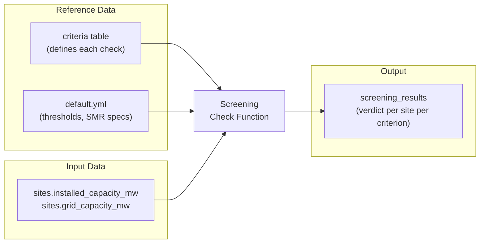

<!-- man_hours: 3.0 -->
---
name: Grid Capacity Screening Check
overview: "Implement the first screening check (BF-01: Grid Capacity) using the existing `screening_results` table, establishing the reusable screening framework that all subsequent criteria will follow."
todos:
  - id: config-smr
    content: Add SMR type specs and screening thresholds to config/default.yml
    status: completed
  - id: seed-criteria
    content: Create Alembic migration 002 to seed BF-01 criterion into the criteria table
    status: completed
  - id: screening-base
    content: Create screening/ package with base ScreeningCheck class (protocol, common logic, registry)
    status: completed
  - id: grid-capacity
    content: Implement GridCapacityCheck in screening/grid_capacity.py
    status: completed
  - id: pipeline-cli
    content: Wire screening into pipeline/runner.py and update the CLI screen command
    status: completed
  - id: tests
    content: Write unit and integration tests for the grid capacity check
    status: completed
  - id: audit-log
    content: Write audit trail log for this session
    status: in_progress
isProject: false
---

# Grid Capacity Screening Check (BF-01)

## Design Approach: Why No New Tables

The existing schema already provides a scalable pattern for all screening checks:



Every future criterion (land area, seismic, cooling, etc.) reuses this exact flow: register in `criteria`, read inputs, write to `screening_results`. The `run_id` column provides full versioning.

## SMR Designs Included (7 designs, 8 capacity thresholds)

Per updated `requirements/01_overview.md`, the screening covers all deployable SMR designs. Kairos Power / KP-FHR (Hermes) is **excluded from all screening** (0 MWe test reactor, not a deployable power plant). TerraPower Natrium is checked at **both** nominal and peak capacity since its molten-salt energy storage means the grid must potentially handle either level.

Sorted by ascending MWe for the capacity check:

- **Oklo Aurora** — 75 MWe, 22 ha
- **X-energy Xe-100** — 80 MWe, 31 ha
- **GE Hitachi BWRX-300** — 300 MWe, 25.3 ha
- **Holtec SMR-300** — 300 MWe, 38 ha
- **TerraPower Natrium (nominal)** — 345 MWe, 51 ha
- **NuScale VOYGR-6** — 462 MWe, 72.8 ha _(reference)_
- **Rolls-Royce SMR** — 470 MWe, 44.5 ha
- **TerraPower Natrium (peak)** — 500 MWe, 51 ha

## SMR Compatibility Detail

For BF-01, the `screening_results` row per site will contain:

- **verdict**: `pass` if site can host at least the smallest deployable SMR (Oklo Aurora, 75 MWe); `fail` otherwise
- **value**: JSON string with per-SMR compatibility detail, e.g.:

```json
{
  "site_capacity_mw": 350,
  "compatible": [
    "oklo_aurora",
    "xe_100",
    "bwrx_300",
    "holtec_smr300",
    "natrium_nominal"
  ],
  "incompatible": ["nuscale_voygr6", "rolls_royce_smr", "natrium_peak"]
}
```

- **threshold**: `"75 MWe (min: Oklo Aurora) / 462 MWe (ref: NuScale VOYGR-6) / 500 MWe (max: Natrium peak)"`
- **justification**: Human-readable sentence, e.g. "Site grid capacity 350 MW supports 5 of 8 SMR configurations (Oklo Aurora through Natrium nominal) but not NuScale VOYGR-6 (462 MWe), Rolls-Royce SMR (470 MWe), or Natrium peak (500 MWe)"

## Implementation

### 1. Add SMR reference data to config

In `[config/default.yml](config/default.yml)`, populate the `screening` section:

```yaml
screening:
  smr_types:
    oklo_aurora:
      name: "Oklo Aurora"
      capacity_mwe: 75
      land_ha: 22
    xe_100:
      name: "X-energy Xe-100"
      capacity_mwe: 80
      land_ha: 31
    bwrx_300:
      name: "GE Hitachi BWRX-300"
      capacity_mwe: 300
      land_ha: 25.3
    holtec_smr300:
      name: "Holtec SMR-300"
      capacity_mwe: 300
      land_ha: 38
    natrium_nominal:
      name: "TerraPower Natrium (nominal)"
      capacity_mwe: 345
      land_ha: 51
    nuscale_voygr6:
      name: "NuScale VOYGR-6"
      capacity_mwe: 462
      land_ha: 72.8
      reference: true
    rolls_royce_smr:
      name: "Rolls-Royce SMR"
      capacity_mwe: 470
      land_ha: 44.5
    natrium_peak:
      name: "TerraPower Natrium (peak)"
      capacity_mwe: 500
      land_ha: 51
  basic_filters:
    bf_01_grid_capacity:
      criterion_id: "BF-01"
      reference_smr: "nuscale_voygr6"
      pass_if: "any" # pass if ANY deployable SMR type fits
  exclusionary: {}
  avoidance: {}
```

### 2. Seed criteria table via Alembic data migration

New migration file: `alembic/versions/002_seed_screening_criteria.py`

Inserts the initial set of criterion rows into the `criteria` table. For now, just BF-01:

- `criterion_id`: `BF-01`
- `name`: Grid Capacity Basic Filter
- `category`: basic_filter
- `phase`: screening
- `description`: Checks whether site grid capacity can accommodate reference SMR types

(Future criteria E1-E9, A1-A15 will be added in subsequent migrations as they are implemented.)

### 3. Create screening framework module

New package: `src/atoms_vs_ashes/screening/`

- `**__init__.py**` — re-exports
- `**base.py**` — defines `ScreeningCheck` protocol/base class:
  - `criterion_id: str`
  - `run(session, settings, run_id) -> list[ScreeningResult]`
  - Handles common logic: loading sites, writing results, audit logging
- `**grid_capacity.py**` — implements `GridCapacityCheck(ScreeningCheck)`:
  - Reads all sites from DB
  - For each site, determines capacity from `grid_capacity_mw` (preferred) or `installed_capacity_mw` (fallback)
  - Compares against each SMR type's `capacity_mwe` from config
  - Builds `ScreeningResult` with verdict, value JSON, threshold, and justification
  - Flags sites with no capacity data as `inconclusive` + writes a `DataQualityFlag`

### 4. Wire into CLI and pipeline

- Update `screen` command in `[src/atoms_vs_ashes/cli.py](src/atoms_vs_ashes/cli.py)` to accept `--criteria` filter (e.g. `--criteria BF-01`) or run all registered checks
- Add `run_screening()` function in `[src/atoms_vs_ashes/pipeline/runner.py](src/atoms_vs_ashes/pipeline/runner.py)`
- Register `GridCapacityCheck` in a check registry so the runner can discover and execute it

### 5. Summary output

After screening, print a summary:

```
BF-01 Grid Capacity: 142 sites screened
  Pass (all 8 configs):          72 sites  (≥500 MWe)
  Pass (reference NuScale+):     15 sites  (≥462 MWe)
  Pass (mid-range 300–461 MWe):  23 sites
  Pass (small SMRs only):        14 sites  (75–299 MWe)
  Fail (< 75 MWe):                4 sites
  Inconclusive:                  14 sites  (no capacity data)
```

### 6. Tests

- **Unit test** for `GridCapacityCheck` logic with mock sites at various capacities (0, 74, 75, 80, 299, 300, 344, 345, 461, 462, 470, 499, 500, 1000 MWe, NULL) — covering every boundary
- **Integration test** verifying results are written to `screening_results` correctly
- Verify Kairos/Hermes is never referenced in any screening output

### Files to create/modify

- `config/default.yml` — add SMR specs and screening config
- `alembic/versions/002_seed_screening_criteria.py` — new migration
- `src/atoms_vs_ashes/screening/__init__.py` — new module
- `src/atoms_vs_ashes/screening/base.py` — new: base check class
- `src/atoms_vs_ashes/screening/grid_capacity.py` — new: BF-01 implementation
- `src/atoms_vs_ashes/pipeline/runner.py` — add `run_screening()`
- `src/atoms_vs_ashes/cli.py` — wire up `screen` command
- `tests/test_screening_grid_capacity.py` — new tests
