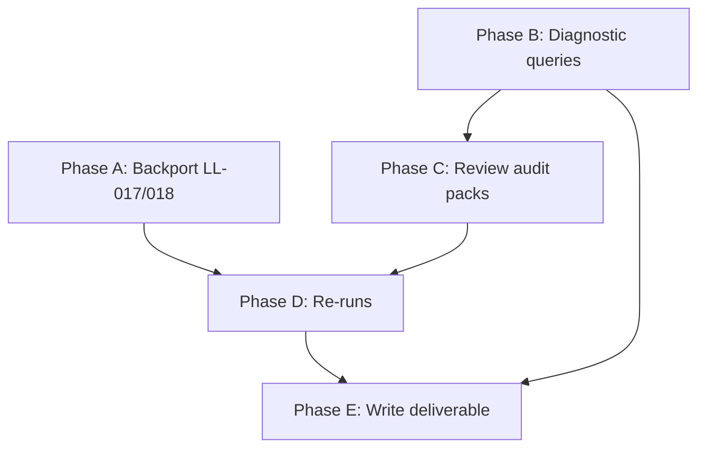

# Step 2.3 — Engineer Audit: "Do we have all the required data, and is it sensible?"

## Scope

Per `requirements/13_data_post_processing.md` section 2.3: for every connector, identify low fill rates (and reasons), suspected false positives, and outliers. Apply LL-017/LL-018 before any re-run. Output: `audit/post_processing/02_data_verification/20260418_engineer_audit.md`.

## Inputs

- 30 machine-generated audit packs in `audit/siting_expert_audits/<slug>__20260417__ACTION_OPTIONAL/` (each has `SAMPLES.json` + `FINDINGS.md`)
- 9 suspect data issues from section 2.1.1 of `requirements/13_data_post_processing.md`
- Coverage gap root causes from section 2.1.2
- LL-017/LL-018 exposure table from section 2.1.3
- `prompts/lessons_learned.md` (18 lessons, LL-001 through LL-018)
- API DB fill rates from `scripts/report_enrichment_coverage.py` output (already run in Step 2.1)

---

## Phase A: Backport LL-017/LL-018 into core Overpass client

**Why first:** No Overpass re-run is safe until the core client stops swallowing disconnects as empty results.

Currently, the LL-017/LL-018 fixes exist **only** in `scripts/run_fix04_osm_avoidance_batch.py`:

- `_RETRYABLE_STATUSES = {429, 504, 408, 0}` (line 442)
- `_wait_for_overpass_slot()` (line 450)
- `_query_with_retry()` (line 481)

The core client at [src/atoms_vs_ashes/connectors/osm/client.py](src/atoms_vs_ashes/connectors/osm/client.py) has none of this. Its `query()` method returns `[]` on every error, and `was_rate_limited` only checks `{429, 504}`.

**Changes:**

1. Add `_RETRYABLE_STATUSES = {429, 504, 408, 0}` to `OverpassClient`
2. Move `_wait_for_overpass_slot()` into the client class
3. Add a `query_with_retry(overpass_ql, max_retries=6)` method that wraps `query()` with exponential backoff + slot polling
4. Update `was_rate_limited` to include 408 and 0
5. Add a `was_error` property that returns True for any non-200 status (distinct from "successfully returned empty")
6. Update `src/ava_client/phases/fetch_overpass.py` to use `query_with_retry` instead of raw `query()`

**Verification:** Run `python -c "from atoms_vs_ashes.connectors.osm.client import OverpassClient; print(OverpassClient._RETRYABLE_STATUSES)"` to confirm the constant is present.

---

## Phase B: Diagnostic queries (read-only, no API calls)

Run SQL against the API DB to quantify each of the 9 issues from section 2.1.1 **across all 363 sites**. These are DB-only queries, no external calls.

**B.1 — NS-02 zone-level NTC:** Count sites where `grid_export_capacity_mw > 5000`. Expected: most or all sites have the same zone-level value per bidding zone.

**B.2 — EP-02 suspect zeros:** Count sites where `road_density_km_per_km2 = 0.0` or `total_road_km = 0.0`. Cross-check with `has_motorway_access` — a site with `has_motorway_access = true` and `road_density = 0` is a confirmed false negative.

**B.3 — NS-01 low flow:** Distribution of `cooling_flow_m3s` values; how many sites have flow < 1 m3/s near a large river?

**B.4 — NH-04 extreme slopes:** Count sites with `slope_angle_deg > 45` — these are likely buffer-max artefacts, not representative site slopes.

**B.5 — NH-02 null faults:** Already known (71.4%). Break down by country to see if it's geographic vs failure.

**B.6 — RI-06 implausible projections:** Count sites where `projected_pop_25km_60yr > 5_000_000`. Check if it correlates with a specific country or NUTS3 region.

**B.7 — NS-05 patch_count:** Confirm 100% NULL. This is a confirmed code bug (column never written).

**B.8 — NH-13 wildfire:** Confirm 100% NULL in both DBs. Accepted (GEE disabled per LL-016).

**B.9 — EP-04 special populations:** Break down `hospital_count_epz` / `prison_count_epz` / `care_home_count_epz` NULL rates. Are there sites where all three are non-NULL vs all NULL? (Suggests tile-by-tile coverage.)

Also run a **cross-connector low-fill sweep**: for each of the 30 connector slugs, query `connector_errors` for error counts and error types, and correlate with fill rates.

---

## Phase C: Review 30 audit packs

For each of the 30 connector audit packs in `audit/siting_expert_audits/`, review the machine-generated `FINDINGS.md` (sections 3-5) and extract:

- Connector error count and types (from section 5)
- Countries with worst coverage
- Auto-selected column fill patterns (from section 4 tables)
- Any anomalies flagged by the machine

Group connectors into tiers for the deliverable:

| Tier                              | Definition                                                                                | Expected connectors                                                                                                            |
| --------------------------------- | ----------------------------------------------------------------------------------------- | ------------------------------------------------------------------------------------------------------------------------------ |
| **Tier 1: Fix required**          | Code bug, LL-017 silent null, or connector logic error confirmed by diagnostic queries    | `entso_e`, `osm` (road density), `hydrorivers`/`glofas_discharge` (tributary matching), CORINE/WorldCover (`patch_count`)      |
| **Tier 2: Re-run needed**         | Transient WFS/REST failures or bulk download incomplete; data would be available on retry | `efsm20_faults`, `smithsonian_gvp`, `egdi_geology` (partial), `eu_flood_risk`, `ghsl_pop`, `worldcover`                        |
| **Tier 3: Accept structural gap** | Source data is EU-only or genuinely sparse; no amount of re-running will help             | `natura2000` (non-EU), `eea_industrial`/`seveso` (non-EU), `eurostat_projections` (non-EU), `egdi_geology` (karst: CZ+IE only) |
| **Tier 4: No issues**             | Fill >= 95%, no anomalies                                                                 | `seismic_hazard`, `copernicus_era5`, `noaa_ncei`, `ourairports`, `geonames_dump`, `eurostat_gisco`, etc.                       |

---

## Phase D: Re-runs (requires explicit user consent per live-api-safety rule)

After Phase A (code fixes) and Phases B-C (diagnosis), propose a re-run plan for Tier 1 and Tier 2 connectors. Each re-run requires:

- API name, endpoint, estimated call count, estimated cost
- User consent before execution

**Overpass re-runs (after LL-017/LL-018 backport):**

- EP-02 road density: `--requery-nulls` for sites with `road_density = 0.0` (estimate: 20-50 sites, ~50 Overpass queries)
- HI-06 military names: `--requery-nulls` for sites with `nearest_military_name IS NULL` (estimate: ~160 sites)
- NS-03 transport: `--requery-nulls` for sites with null highway/rail (estimate: ~96 sites)
- NS-05 land use: `--requery-nulls` for sites with null `buildable_area_ha` (estimate: ~96 sites)

**WFS re-runs:**

- NH-07 GVP: re-run `SmithsonianGvpConnector` for ~120 NULL sites (1 bulk WFS download + local compute)
- NH-02 EFSM20: re-attempt download + re-run for ~260 NULL sites (1 WFS download)

**Bulk download + re-enrich:**

- NH-08/09 GloFAS tiles: download missing tiles (user consent for download), then local re-enrich
- EP-04 GHS-POP tiles: download missing tiles, then local re-enrich

**Code fixes (no API call needed):**

- NS-05 `patch_count`: fix the CORINE/WorldCover connector to write this column, then re-enrich locally from cached data

**Not re-running (Tier 3 — structural):**

- Natura 2000 for non-EU sites — accept, document as "EU-only source"
- E-PRTR/SEVESO for non-EU sites — accept
- Eurostat for non-EU sites — accept, NSO supplement files would need manual procurement
- EGDI karst (CZ+IE only) — accept

---

## Phase E: Deliverable

Write `audit/post_processing/02_data_verification/20260418_engineer_audit.md` with YAML front-matter and these sections:

1. **Executive summary** — total connectors reviewed, tier distribution, LL fixes applied, re-runs completed
2. **Per-connector findings table** — 30 rows: slug, tier, fill %, error count, issues found, action taken, post-fix fill %
3. **Suspect data resolution** — the 9 issues from section 2.1.1, each with: diagnostic query result, root cause confirmed, fix applied (or deferred), before/after values
4. **Coverage gap disposition** — the 7 root-cause categories from section 2.1.2, each with: decision (re-run / accept / supplement), rationale
5. **LL-017/LL-018 backport summary** — what changed in `OverpassClient`, diff summary, verification results
6. **Re-run log** — per connector: API calls made, success/error counts, cost, sites improved (S-4 cost tracking)
7. **Remaining gaps** — issues deferred to later steps (NH-13 GEE, ENTSO-E fix in section 2.5.2, etc.)

---

## Dependency diagram

Phases A and B can run in parallel. Phase C depends on B (needs diagnostic numbers). Phase D depends on both A (code fixes) and C (knowing what to re-run). Phase E is last.

## Estimated effort

- Phase A: 0.5 h (code changes, mechanical refactor from FIX-04)
- Phase B: 0.5 h (SQL queries)
- Phase C: 0.5 h (reading 30 FINDINGS.md, classifying)
- Phase D: 1.0 h (re-runs, waiting for Overpass, verifying)
- Phase E: 0.5 h (writing the deliverable)
- **Total: ~3.0 h** (man_hours: 3.0)
