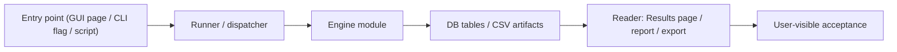

<!-- man_hours: 1.5 -->
# Feature Completion Matrix Template

Use this template **before** writing implementation code for any non-trivial
change. Copy it to `audit/feature_completion_matrices/<YYYY-MM-DD>_<slug>.md`,
fill every surface row, and keep it updated through the change. Reference it
in the final response so the user can verify the user-visible path was wired.

A feature is "complete" only when every applicable surface is marked
`Implemented` (with file/test reference) or `Not applicable` (with one-line
justification). `Deferred` is allowed **only** when the user has explicitly
approved the deferral in the same conversation.

The matrix is the answer to a single question: **does the user-visible path
the user actually relies on reach the new code?** See
`experts/quality/auditor.md` §S and `.cursor/rules/feature-completion-checklist.mdc`.

---

## 1. Feature Identification

- **Feature title:**
- **User request (verbatim noun phrases):**
- **Owning chat / plan:**
- **Date opened:**
- **Date closed:**

## 2. Literal Request Check

Quote the user's request and list every noun/surface that appears literally.
Each named surface must appear as `Implemented` in §4 or `Deferred` with
explicit user approval. Examples of literal nouns to look for: `Scoring
Engine page`, `Results page`, `country profile`, `CLI`, `report`, `export`,
`sensitivity engine`, `national rank`, `Run Profile`, `audit CSV`, `bundle`.

| Noun in request | Surface it implies | Where it is satisfied (file or test) | Status |
| --- | --- | --- | --- |

## 3. End-to-End User Path Diagram

Draw the path from the user-visible entry point to the consumption surface,
explicitly naming every hop. Example template (replace placeholders):



For each hop, list the concrete file path and the new symbol or invocation
that proves the hop is wired:

- **Entry point file:**
- **Runner/dispatcher file and command line:**
- **Engine module:**
- **Persistence target(s):**
- **Reader / consumer file(s):**
- **User-visible acceptance evidence:**

## 4. Surface Matrix

Fill every row. `N/A` is allowed only with a justification.

| Surface | Required artifact | File / symbol / test | Status | Notes |
| --- | --- | --- | --- | --- |
| GUI page / Streamlit screen | Visible control or section that triggers the feature | | | |
| CLI subcommand / flag | New flag wired through `argparse` / `click` | | | |
| Script driver | Updated orchestrator under `src/scripts/` if applicable | | | |
| Runner / subprocess wiring | Command string built and forwarded | | | |
| Engine code | Pure module under `src/atoms_vs_ashes/` | | | |
| DB schema | Alembic revision + ORM model | | | |
| DB writers | Idempotent writer helpers | | | |
| CSV / file artifacts | Stamped output under `audit/post_processing/` or `report/output/` | | | |
| Report / export reader | Results tab, country/site bundle, PDF/MD assembler that surfaces the output | | | |
| Tests: unit | Pure logic tests | | | |
| Tests: persistence | DB writer tests | | | |
| Tests: entry-point smoke | GUI / CLI / runner test proving the new control reaches the new code | | | |
| Methodology / report docs | Updates under `report/version */methodology/` or chapter prompts | | | |
| Expert prompts | Updated or new prompt under `experts/` | | | |
| Audit log | Conversation log under `audit/conversations/` and plan mirror per `.cursor/rules/audit-trail.mdc` | | | |
| Man-hours metadata | Archived — not required (`.cursor/rules/man-hours.mdc` deactivated) | | Not applicable | Rule disabled 2026-05-20 |

## 5. Negative Acceptance Tests

List at least one test per user-visible surface that would **fail** if the
feature were only implemented in the backend. Examples:

- GUI: Streamlit page test asserting the new control is rendered and the
  runner is called with the new flag.
- CLI: argparse / click test asserting the new option is exposed and the
  dispatcher reaches the new code path.
- Report / export: snapshot or assertion test that reads the new artifact
  via the consumer (not the writer) and verifies the value is rendered.

| Surface | Test file | Assertion that proves user-visible wiring |
| --- | --- | --- |

## 6. Subtle Consumption Check

A subtler version of the same failure happens when the engine writes the
right table but no consumer reads it. List, for every new persisted
artifact, the downstream consumer that loads it.

| Artifact (table / CSV / JSON) | Consumer file | Surface where the user sees it |
| --- | --- | --- |

## 7. Deferred Surfaces (require explicit user approval)

| Surface | Reason for deferral | User approval evidence | Follow-up ticket |
| --- | --- | --- | --- |

## 8. Final Trace (paste into the final response)

State the path in one line, e.g.:

```
GUI: src/atoms_vs_ashes/gui/screen_pages/04_run_dashboard.py
  -> src/atoms_vs_ashes/gui/_runner.py (start_sensitivity_run --include national)
  -> src/atoms_vs_ashes/scoring/_national_sensitivity.py
  -> national_rank_sensitivity (DB) + audit/.../national_rank_sensitivity.csv
  -> Results page src/atoms_vs_ashes/gui/_results_render_sens.py (national tab)
  -> Country reports report/output/sensitivity/<stamp>/national/<CC>.md
Tests: tests/gui/test_run_dashboard_national.py, tests/scripts/test_phase_1_6_national_sensitivity.py
```

If any segment of the trace is empty, the feature is not complete.
