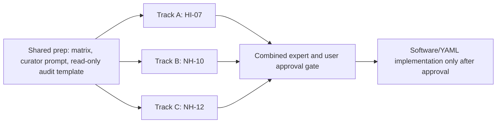

<!-- man_hours: 1.0 -->
# Tier 1 Data OK Parallel Band Workflows

Status: planning artifact only. No software, YAML, scoring run, migration, or DB write is approved by this file.

Source plan: `/Users/terbolence/.cursor/plans/tier1_data_ok_5b567a39.plan.md`

Scope: implement Tier 1 / Bucket B from `audit/post_processing/06_scoring/20260517_logic_only_criteria_todo.md`: `HI-07`, `NH-10`, and `NH-12`.

Baseline: run `20260517T104618_459ae424`, `nuscale_voygr6`, 361 sites.

Global target per criterion:

- `quality_flag != unscored` for at least 95% of the cohort.
- Scored-row stdev at least 0.5, unless the data-science and siting expert review explicitly justify that the current metric cannot defensibly support spread.
- GUI/report consumers must distinguish `quality_flag=unscored` from measured scores.
- Any DB write requires explicit user consent before execution.

## Parallel Execution Model

These three tracks are independent and can run in parallel under Cursor multitasking. Each worker must stop before implementing software or YAML changes and return its read-only audit plus recommended band proposal for approval.

## Shared Prep For All Workers

1. Read `experts/quality/lessons_learned.md`, especially `LL-027`, `LL-029`, `LL-030`, `LL-031`, `LL-036`, `LL-037`, and `LL-038`.
2. Use `experts/connectors/software_architect.md` to confirm the software path and no-new-connector boundary.
3. Use `experts/quality/siting_expert.md` for scoring band defensibility and evidence-grade wording.
4. Use the planned `experts/quality/data_science_siting_curator.md` to verify distribution, null policy, field vocabulary, outliers, and whether the proposed bands create real spread without inventing evidence.
5. Use `experts/connectors/senior_software_engineer.md` only for implementation planning until user approval is granted.
6. Use `experts/quality/auditor.md` to check UI/UX, backend, DB, reporting, and test coverage before closing.

Deliverable from each worker:

- A read-only data audit.
- Current-state band table.
- Proposed future-state band table.
- Explicit accepted columns and rejected/deferred fields.
- Test plan.
- Approval question: “Approve implementation for this criterion?”

## Track A: HI-07 Electromagnetic Interference

### Current State

Runtime symptom: `98.6%` unscored in the baseline status summary. Existing criterion doc records a local resolver recompute with 5 rows in band `5-6` and 356 unscored.

Data columns to use:

- `site_human_hazards.transmitter_count`
- `site_human_hazards.nearest_transmitter_km`
- `site_human_hazards.transmitter_type`
- `site_human_hazards.hi07_quality`
- `site_human_hazards.hi07_comment`
- `site_human_hazards.run_id`
- `site_human_hazards.fetched_at`

Derived/context names:

- `transmitter_count_10km` from `transmitter_count`
- `nearest_transmitter_km`
- `transmitter_type`

Rejected/deferred field:

- `transmitter_power_class` is unsupported. It has no ORM column and no verified derivation. Do not use it as measured evidence in Tier 1.

Current runtime bands:

| Score | Current condition | Current issue |
| ---: | --- | --- |
| 9-10 | `transmitter_count_10km == 0` | Legitimate, but no baseline rows hit it. |
| 7-8 | `transmitter_count_10km <= 2 and nearest_transmitter_km > 5` | `nearest_transmitter_km` is not exposed by current `db_fields.api`, so this is effectively unreachable. |
| 5-6 | `transmitter_count_10km <= 5` | Only 5 rows in local recompute. |
| 3-4 | `nearest_transmitter_km < 2` | Unreachable unless distance is exposed. |
| 1-2 | `nearest_transmitter_km < 0.5 and transmitter_power_class == 'very_high'` | Unsupported because `transmitter_power_class` is absent. |
| Unscored | No band matched | Dense transmitter environments with count > 5 often fall through. |

### Future State Proposal For Expert Review

Goal: make HI-07 scoreable using existing count and distance evidence while explicitly deferring transmitter power class.

Candidate future bands to test read-only before implementation:

| Score | Proposed condition | Rationale to validate |
| ---: | --- | --- |
| 9-10 | `transmitter_count_10km == 0` | Completed search found no transmitter-like features. Must confirm zero is not a silent Overpass failure. |
| 7-8 | `transmitter_count_10km <= 2 and (nearest_transmitter_km is null or nearest_transmitter_km > 5)` | Sparse RF environment; null distance acceptable only when count is zero or the curation memo confirms consistency. |
| 5-6 | `transmitter_count_10km <= 10 or nearest_transmitter_km >= 5` | Ordinary built-up/industrial RF environment. Threshold may be changed after histogram review. |
| 3-4 | `transmitter_count_10km <= 100 or nearest_transmitter_km >= 2` | Dense RF environment or nearby features; review for controls/communications. Threshold must be distribution-checked. |
| 1-2 | `transmitter_count_10km > 100 or nearest_transmitter_km < 2` | Very dense/nearby transmitter proxy. Does not claim power class. |
| Deferred | power-class-specific severe band | Requires future schema/connector derivation of `transmitter_power_class`. |

Implementation steps after approval:

1. Update `db_fields.api` in both HI spec and rubric so `nearest_transmitter_km` and, if used, `transmitter_type` are available to the evaluator.
2. Remove or neutralize active `transmitter_power_class` dependency until a real field exists.
3. Add context-resolution tests for `transmitter_count_10km`, `nearest_transmitter_km`, and rejected `transmitter_power_class`.
4. Add band tests for zero-count, sparse, ordinary, dense, and very-dense examples.
5. Update `criteria/ranking/HI-07 — Electromagnetic interference.md` with before/after counts and deferred power-class note.
6. Stop before any `score run`; request DB-write consent with expected tables and row counts.

Approval gate: software/YAML implementation of Track A requires explicit user approval.

## Track B: NH-10 Extreme Winds

### Current State

Runtime symptom: `0%` unscored but stdev `0.00`; all sites land in `9-10`.

Data columns to use:

- `site_natural_hazards.max_wind_speed_ms`
- `site_natural_hazards.nh10_quality`
- `site_natural_hazards.nh10_comment`
- `site_natural_hazards.run_id`
- `site_natural_hazards.fetched_at`

Metric caveat:

- `max_wind_speed_ms` is currently persisted from ERA5 monthly-means gust logic, not hourly gust maxima.
- `IMP-0008` remains the correct future connector/API task for hourly ERA5 i10fg.
- Tier 1 may only tune relative ranking bands for the current screening metric; it must not imply that the 49 m/s design-basis envelope is validated.

Current runtime bands:

| Score | Current condition | Baseline result |
| ---: | --- | --- |
| 9-10 | `max_wind_speed_ms < 25` | 361 rows |
| 7-8 | `max_wind_speed_ms < 30` | 0 rows |
| 5-6 | `max_wind_speed_ms < 36` | 0 rows |
| 3-4 | `max_wind_speed_ms < 42` | 0 rows |
| 1-2 | `max_wind_speed_ms <= 49` | 0 rows |
| 0 | `max_wind_speed_ms > 49` | 0 rows; review flag only |

Known metric range from existing criterion doc: min `5.41`, max `14.44`, mean `9.0706`.

### Future State Proposal For Expert Review

Goal: produce relative spread from current smoothed `max_wind_speed_ms` while preserving a clear caveat that this is not design-basis gust confirmation.

Candidate future bands to test read-only before implementation:

| Score | Proposed condition | Rationale to validate |
| ---: | --- | --- |
| 9-10 | `max_wind_speed_ms < 7.5` | Lowest relative wind exposure in current cohort. |
| 7-8 | `max_wind_speed_ms < 9.0` | Lower-middle exposure. |
| 5-6 | `max_wind_speed_ms < 10.5` | Middle exposure around current mean. |
| 3-4 | `max_wind_speed_ms < 12.5` | Higher relative exposure in current cohort. |
| 1-2 | `max_wind_speed_ms <= 15.0` | Highest current relative exposure. |
| 0 / review | `max_wind_speed_ms > 49` | Keep as review flag only; should not be reached by current metric. |

Implementation steps after approval:

1. Produce read-only histogram and quantile table for `max_wind_speed_ms`.
2. Have the data-science curator confirm whether fixed thresholds above or a quantile-derived variant is more defensible.
3. Have the siting expert approve the language: relative screening metric now, hourly ERA5 later.
4. Update NH spec/rubric bands only after approval.
5. Add band tests at threshold boundaries: `7.4`, `8.9`, `10.4`, `12.4`, `14.9`, and `49.1`.
6. Confirm `project_wind_envelope` remains `review_flag`, not `exclude`.
7. Update `criteria/ranking/NH-10 — Extreme winds.md` with current/future evidence and residual `IMP-0008`.
8. Stop before any `score run`; request DB-write consent with expected tables and row counts.

Approval gate: software/YAML implementation of Track B requires explicit user approval.

## Track C: NH-12 Extreme Temperatures

### Current State

Runtime symptom: `0%` unscored but stdev `0.15`; current compiled evidence gives 359 rows in `9-10` and 2 rows in `7-8`.

Data columns to use:

- `site_natural_hazards.extreme_temp_max_c`
- `site_natural_hazards.extreme_temp_min_c`
- `site_natural_hazards.nh12_quality`
- `site_natural_hazards.nh12_comment`
- `site_natural_hazards.run_id`
- `site_natural_hazards.fetched_at`

Known metric ranges from existing criterion doc:

- `extreme_temp_max_c`: present 361/361, min `19.54`, max `33.32`, mean `25.3094`.
- `extreme_temp_min_c`: present 361/361, min `-12.29`, max `7.93`, mean `-3.3942`.

Current sub-score bands:

| Sub-score | Score | Current condition | Current issue |
| --- | ---: | --- | --- |
| `tmax` | 9-10 | `extreme_temp_max_c < 33` | Nearly all sites match. |
| `tmax` | 7-8 | `extreme_temp_max_c < 36` | Only hottest two sites appear to leave 9-10. |
| `tmax` | 5-6 | `extreme_temp_max_c < 39` | No baseline spread. |
| `tmax` | 3-4 | `extreme_temp_max_c <= 42` | No baseline spread. |
| `tmax` | 1-2 | `extreme_temp_max_c > 42` | No baseline spread. |
| `tmin` | 9-10 | `extreme_temp_min_c > -15` | All sites match. |
| `tmin` | 7-8 | `extreme_temp_min_c > -20` | No baseline spread. |
| `tmin` | 5-6 | `extreme_temp_min_c > -25` | No baseline spread. |
| `tmin` | 3-4 | `extreme_temp_min_c >= -30` | No baseline spread. |
| `tmin` | 1-2 | `extreme_temp_min_c < -30` | No baseline spread. |

Current aggregation: `min_of_sub_scores`.

### Future State Proposal For Expert Review

Goal: make the temperature criterion discriminate both hot and cold stress from existing typed temperature fields while avoiding claims beyond the ERA5-derived screening metric.

Candidate future `tmax` bands to test read-only:

| Score | Proposed `tmax` condition | Rationale to validate |
| ---: | --- | --- |
| 9-10 | `extreme_temp_max_c < 23` | Coolest high-temperature exposure in current cohort. |
| 7-8 | `extreme_temp_max_c < 26` | Lower-middle heat exposure. |
| 5-6 | `extreme_temp_max_c < 29` | Middle heat exposure. |
| 3-4 | `extreme_temp_max_c < 32` | Higher heat exposure. |
| 1-2 | `extreme_temp_max_c >= 32` | Highest observed heat exposure; check southern/Turkish examples. |

Candidate future `tmin` bands to test read-only:

| Score | Proposed `tmin` condition | Rationale to validate |
| ---: | --- | --- |
| 9-10 | `extreme_temp_min_c > 2` | Mild winter tail. |
| 7-8 | `extreme_temp_min_c > -4` | Lower cold-stress exposure. |
| 5-6 | `extreme_temp_min_c > -8` | Middle cold-stress exposure. |
| 3-4 | `extreme_temp_min_c > -12` | Higher cold-stress exposure. |
| 1-2 | `extreme_temp_min_c <= -12` | Coldest observed tail. |

Candidate aggregation options:

| Option | Proposed method | Review decision needed |
| --- | --- | --- |
| A | Keep `min_of_sub_scores` | Conservative worst-tail logic; may over-penalize one mild tail if thresholds are tight. |
| B | Switch to `mean_of_sub_scores` | Better spread across hot/cold stress; less conservative. |
| C | Weighted mean, e.g. `tmax=0.6`, `tmin=0.4` | Use only if siting expert agrees heat is more limiting for current SMR screening. |

Implementation steps after approval:

1. Produce separate read-only histograms for `extreme_temp_max_c` and `extreme_temp_min_c`.
2. Score the candidate `tmax` and `tmin` ladders without writing DB rows.
3. Compare aggregation options A/B/C for stdev, outliers, and site plausibility.
4. Have the data-science curator reject any thresholds that are merely cosmetic or overfit.
5. Have the siting expert approve the final aggregation and temperature-stress language.
6. Update NH spec/rubric bands and aggregation only after approval.
7. Add sub-score and aggregate tests for hot-only, cold-only, both-moderate, and both-favorable examples.
8. Update `criteria/ranking/NH-12 — Extreme temperatures.md` with current/future evidence and units.
9. Stop before any `score run`; request DB-write consent with expected tables and row counts.

Approval gate: software/YAML implementation of Track C requires explicit user approval.

## Combined Approval And Close-Out

After all three workers return proposals:

1. Consolidate data-science and siting-expert comments into one approval memo.
2. Ask the user to approve or reject implementation per criterion; approval can be independent for `HI-07`, `NH-10`, and `NH-12`.
3. Only approved tracks proceed to software/YAML edits.
4. After implementation, run tests first.
5. Before writing scoring outputs to the DB, ask for explicit consent for the exact `score run` command and row-writing scope.
6. After any consented rescore, produce a before/after audit showing unscored %, stdev, band counts, and GUI/report consumption checks.
