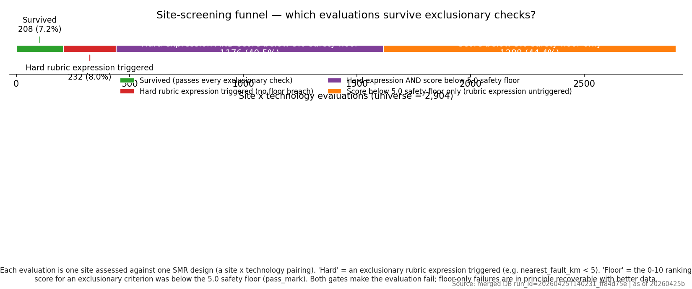
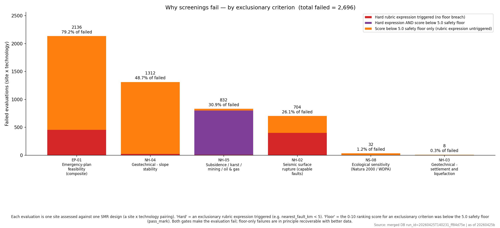
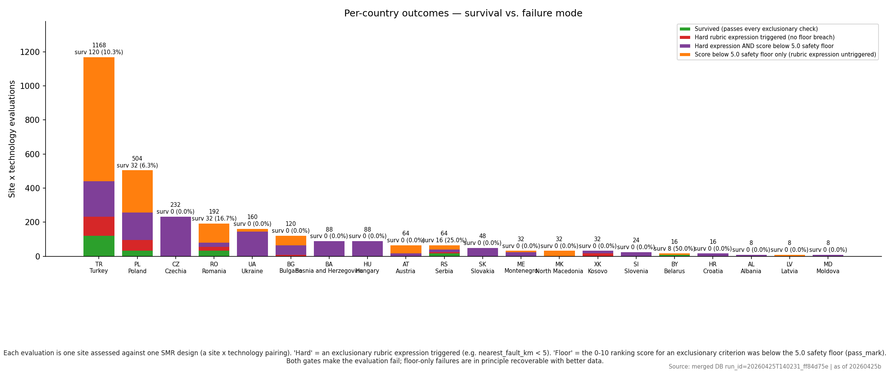
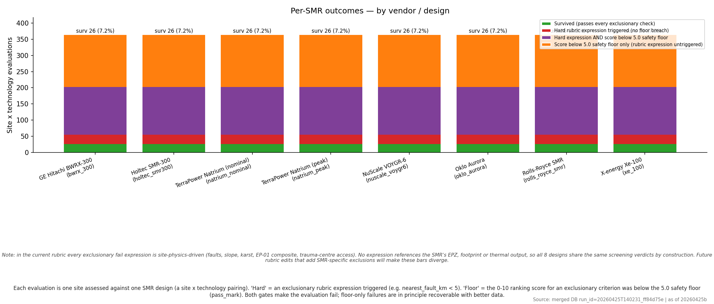
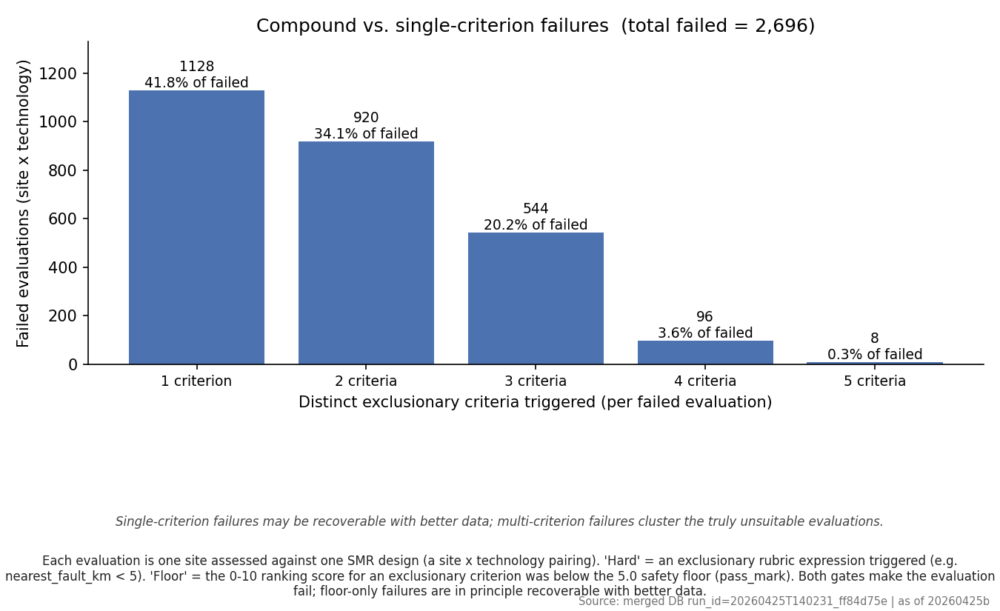

# Phase 1.6 failure-mode analysis — 20260425b

- Run ID: `20260425T140231_ff84d75e`
- Stamp: **20260425b**
- Universe: **2904** site × technology evaluations.

> **TL;DR**
> - **Universe**: **2904** site × technology evaluations across **363** sites × **8** SMR design(s).
> - **Survivors**: **208** (7.2%); **failed any check**: **2696** (92.8%).
> - **Dominant filter**: `EP-01` — Emergency-plan feasibility (composite); rejects **2136** pairings (79.2% of failed).
> - **Floor share**: **91.4%** of failed pairings are caught by the safety floor (alone or together with a hard E-code).

Source artefacts:
- `audit/post_processing/06_scoring/20260425b_failure_summary.csv` — top-level counts.
- `audit/post_processing/06_scoring/20260425b_failure_per_criterion.csv` — per-criterion fails.
- `audit/post_processing/06_scoring/20260425b_failure_per_country.csv` — per-country fails.
- `audit/post_processing/06_scoring/20260425b_failure_per_smr.csv` — per-SMR fails.
- `audit/post_processing/06_scoring/20260425b_failure_per_pair.csv` — one row per (site, SMR).

Two failure mechanisms are tracked side by side: a **hard E-code** rubric expression triggering, and a **safety floor** breach where the 0–10 ranking score for an exclusionary criterion is below its `pass_mark` (5.0). See [`exclusionary_floors.md`](./exclusionary_floors.md). Both produce `passed_exclusionary = False` and `composite_score = NULL`. Per-criterion ranking rows are kept on disk for transparency, so the audit can show *why* a site failed without contaminating the suitable-site ranking.

## Glossary

| Term | Definition |
| --- | --- |
| **Site** | One candidate parcel identified by `site_id`, associated with a country code. |
| **SMR design** | One vendor / model identified by `smr_key` (e.g. `nuscale_voygr6`). 8 designs are evaluated. |
| **Site × technology evaluation (pair)** | One row per `(site_id, smr_key)` pairing. The universe is sites × designs. |
| **Exclusionary phase** | Pre-scoring screening: a pair is rejected before any composite score is computed. |
| **Hard E-code** (`prompt_key = E1, E2, …`) | A rubric `condition_expr` evaluated to true (e.g. `nearest_fault_km < 5`). |
| **Safety floor** (`prompt_key = E<k>:floor`) | The 0–10 ranking score for an exclusionary criterion is strictly below its `pass_mark` (5.0 by default). |
| **Survived** | Pair passed every hard E-code and every floor. |
| **Hard only** | Hard expression triggered; floor not breached. |
| **Floor only** | Score below 5.0 floor; rubric expression did not trigger. |
| **Hard ∧ floor** | Both gates failed for the same pair. |

## 1. Funnel — universe → survivors

## 2. Failures by exclusionary criterion

Counts are unique pairs (a pair that triggers both `EP-01` hard and `EP-01:floor` is counted once in `Hard ∧ floor`, **not** twice). The *Share of all failures* column expresses each criterion's contribution against the total of **2696** failed pairings.

| Criterion | Name | Hard fails | Floor fails | Hard ∧ floor | Total pairs failed | Share of all failures |
| --- | --- | ---: | ---: | ---: | ---: | ---: |
| `EP-01` | Emergency-plan feasibility (composite) | 456 | 1680 | 0 | 2136 | 79.2% |
| `NH-04` | Geotechnical - slope stability | 24 | 1288 | 0 | 1312 | 48.7% |
| `NH-05` | Subsidence / karst / mining / oil & gas | 800 | 824 | 792 | 832 | 30.9% |
| `NH-02` | Seismic surface rupture (capable faults) | 400 | 304 | 0 | 704 | 26.1% |
| `NS-08` | Ecological sensitivity (Natura 2000 / WDPA) | 0 | 32 | 0 | 32 | 1.2% |
| `NH-03` | Geotechnical - settlement and liquefaction | 0 | 8 | 0 | 8 | 0.3% |

**Criterion glossary**   
`EP-01` Emergency-plan feasibility (composite)  
`NH-04` Geotechnical - slope stability  
`NH-05` Subsidence / karst / mining / oil & gas  
`NH-02` Seismic surface rupture (capable faults)  
`NS-08` Ecological sensitivity (Natura 2000 / WDPA)  
`NH-03` Geotechnical - settlement and liquefaction

## 3. Failures by country

ISO codes follow ISO 3166-1 alpha-2. *Survival rate* is the share of evaluations within the country that pass every exclusionary check.

| ISO | Country | n sites | n pairs | Survived | Survival rate | Hard only | Hard ∧ floor | Floor only | Sites w/ survivor |
| --- | --- | ---: | ---: | ---: | ---: | ---: | ---: | ---: | ---: |
| TR | Turkey | 146 | 1168 | 120 | 10.3% | 112 | 208 | 728 | 15 |
| PL | Poland | 63 | 504 | 32 | 6.3% | 64 | 160 | 248 | 4 |
| CZ | Czechia | 29 | 232 | 0 | 0.0% | 0 | 232 | 0 | 0 |
| RO | Romania | 24 | 192 | 32 | 16.7% | 24 | 24 | 112 | 4 |
| UA | Ukraine | 20 | 160 | 0 | 0.0% | 0 | 144 | 16 | 0 |
| BG | Bulgaria | 15 | 120 | 0 | 0.0% | 8 | 56 | 56 | 0 |
| BA | Bosnia and Herzegovina | 11 | 88 | 0 | 0.0% | 0 | 88 | 0 | 0 |
| HU | Hungary | 11 | 88 | 0 | 0.0% | 0 | 88 | 0 | 0 |
| AT | Austria | 8 | 64 | 0 | 0.0% | 0 | 16 | 48 | 0 |
| RS | Serbia | 8 | 64 | 16 | 25.0% | 8 | 16 | 24 | 2 |
| SK | Slovakia | 6 | 48 | 0 | 0.0% | 0 | 48 | 0 | 0 |
| ME | Montenegro | 4 | 32 | 0 | 0.0% | 0 | 24 | 8 | 0 |
| MK | North Macedonia | 4 | 32 | 0 | 0.0% | 0 | 0 | 32 | 0 |
| XK | Kosovo | 4 | 32 | 0 | 0.0% | 16 | 16 | 0 | 0 |
| SI | Slovenia | 3 | 24 | 0 | 0.0% | 0 | 24 | 0 | 0 |
| BY | Belarus | 2 | 16 | 8 | 50.0% | 0 | 0 | 8 | 1 |
| HR | Croatia | 2 | 16 | 0 | 0.0% | 0 | 16 | 0 | 0 |
| AL | Albania | 1 | 8 | 0 | 0.0% | 0 | 8 | 0 | 0 |
| LV | Latvia | 1 | 8 | 0 | 0.0% | 0 | 0 | 8 | 0 |
| MD | Moldova | 1 | 8 | 0 | 0.0% | 0 | 8 | 0 | 0 |

## 4. Failures by SMR design

All exclusionary fail expressions in the current rubric are site-physics-driven (faults, slope, karst, EP-01 composite score, trauma-centre access). None reference the SMR's EPZ radius, footprint, or thermal output, so the screening verdicts are SMR-invariant by construction. SMR design only matters in the `ranking` phase (different `weight_factor` × score combinations). If future rubric iterations add SMR-specific exclusions (e.g. EPZ radius vs. nearest population centre), the rows below will diverge.

| Vendor / Design | smr_key | n pairs | Survived | Survival rate | Hard only | Hard ∧ floor | Floor only |
| --- | --- | ---: | ---: | ---: | ---: | ---: | ---: |
| GE Hitachi BWRX-300 | `bwrx_300` | 363 | 26 | 7.2% | 29 | 147 | 161 |
| Holtec SMR-300 | `holtec_smr300` | 363 | 26 | 7.2% | 29 | 147 | 161 |
| TerraPower Natrium (nominal) | `natrium_nominal` | 363 | 26 | 7.2% | 29 | 147 | 161 |
| TerraPower Natrium (peak) | `natrium_peak` | 363 | 26 | 7.2% | 29 | 147 | 161 |
| NuScale VOYGR-6 | `nuscale_voygr6` | 363 | 26 | 7.2% | 29 | 147 | 161 |
| Oklo Aurora | `oklo_aurora` | 363 | 26 | 7.2% | 29 | 147 | 161 |
| Rolls-Royce SMR | `rolls_royce_smr` | 363 | 26 | 7.2% | 29 | 147 | 161 |
| X-energy Xe-100 | `xe_100` | 363 | 26 | 7.2% | 29 | 147 | 161 |

## 5. Compound vs. single-criterion failures

| Distinct criteria failed | Pairs | Share of failed |
| ---: | ---: | ---: |
| 1 | 1128 | 41.8% |
| 2 | 920 | 34.1% |
| 3 | 544 | 20.2% |
| 4 | 96 | 3.6% |
| 5 | 8 | 0.3% |

## 6. How to read this

- **Floor-only pairs are recoverable in principle**: the underlying rubric expression did not trigger; tightening the rubric or improving the data behind the criterion can move the score above `pass_mark`.
- **Hard-only and `Hard ∧ floor` pairs are not recoverable**: the rubric's hard expression triggered, so the site is geophysically or logistically incompatible with the SMR design.
- **Compound failures** (≥ 2 distinct criteria) cluster the truly unsuitable sites; single-criterion failures are the candidates for re-examination once data quality improves.

## 7. Per-technology packs

Each row links to the same five-section analysis restricted to a single SMR design (CSVs and figures live alongside under `audit/.../per_smr/<smr_key>/` and `figures/failure/per_smr/<smr_key>/`). The featured row (★) is the primary vendor for executive review.

| Featured | Vendor / Design | smr_key | Methodology MD |
| :---: | --- | --- | --- |
| ★ | NuScale VOYGR-6 | `nuscale_voygr6` | [failure_analysis_nuscale_voygr6.md](failure_analysis_nuscale_voygr6.md) |
|  | GE Hitachi BWRX-300 | `bwrx_300` | [failure_analysis_bwrx_300.md](failure_analysis_bwrx_300.md) |
|  | Holtec SMR-300 | `holtec_smr300` | [failure_analysis_holtec_smr300.md](failure_analysis_holtec_smr300.md) |
|  | Oklo Aurora | `oklo_aurora` | [failure_analysis_oklo_aurora.md](failure_analysis_oklo_aurora.md) |
|  | Rolls-Royce SMR | `rolls_royce_smr` | [failure_analysis_rolls_royce_smr.md](failure_analysis_rolls_royce_smr.md) |
|  | X-energy Xe-100 | `xe_100` | [failure_analysis_xe_100.md](failure_analysis_xe_100.md) |
|  | TerraPower Natrium (nominal) | `natrium_nominal` | [failure_analysis_natrium_nominal.md](failure_analysis_natrium_nominal.md) |
|  | TerraPower Natrium (peak) | `natrium_peak` | [failure_analysis_natrium_peak.md](failure_analysis_natrium_peak.md) |
