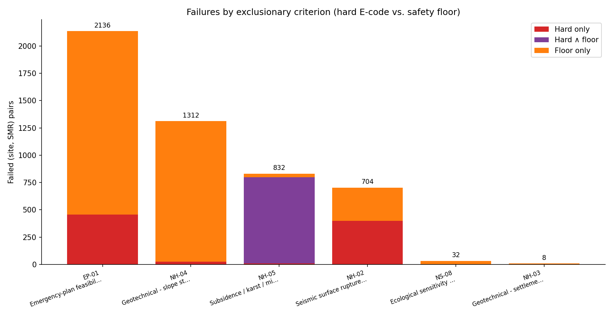
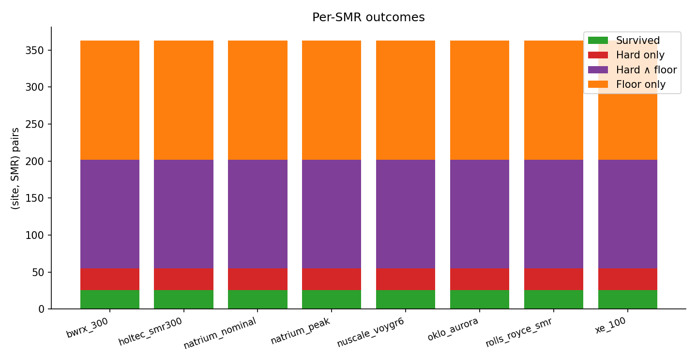
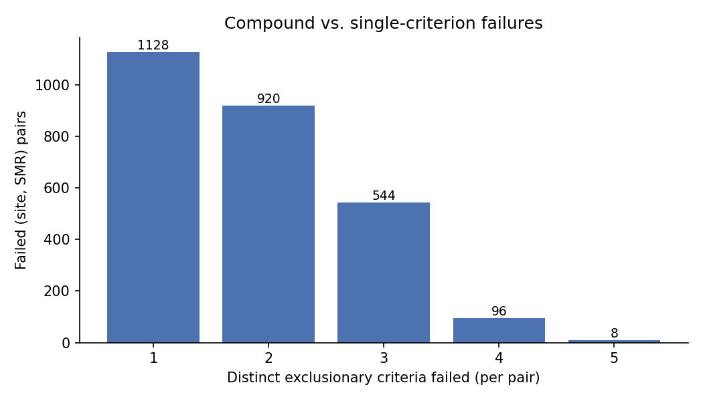

# Phase 1.6 failure-mode analysis — 20260425

- Run ID: `20260425T073743_20d0478d`
- Universe: **2904** (site, SMR) pairs across 363 sites × 8 SMR designs.
- Survivors: **208** (7.2 % of the universe).
- Failed any exclusionary check: **2696** (hard only **232**, floor only **1288**, hard ∧ floor **1176**).
- Of failed pairs, **91.4 %** are caught by the safety floor at some criterion (alone or together with a hard E-code).

Source artefacts:
- `audit/post_processing/06_scoring/20260425_failure_summary.csv` — top-level counts.
- `audit/post_processing/06_scoring/20260425_failure_per_criterion.csv` — per-criterion fails.
- `audit/post_processing/06_scoring/20260425_failure_per_country.csv` — per-country fails.
- `audit/post_processing/06_scoring/20260425_failure_per_smr.csv` — per-SMR fails.
- `audit/post_processing/06_scoring/20260425_failure_per_pair.csv` — one row per (site, SMR).

Two failure mechanisms are tracked side by side:

1. **Hard E-code** (`prompt_key = E1, E2, …`) — a rubric `condition_expr` evaluated to true (e.g. `nearest_fault_km < 5`).
2. **Safety floor** (`prompt_key = E<k>:floor`) — the 0–10 ranking score for an exclusionary criterion is strictly below its declared `pass_mark`. See [`exclusionary_floors.md`](./exclusionary_floors.md).

Both produce `passed_exclusionary = False` and `composite_score = NULL`. Per-criterion ranking rows are kept on disk for transparency, so the audit can show *why* a site failed without contaminating the suitable-site ranking.

## 1. Funnel — universe → survivors

## 2. Failures by exclusionary criterion

Counts are unique pairs (a pair that triggers both `EP-01` hard and `EP-01:floor` is counted once in `Hard ∧ floor`, **not** twice).

| Criterion | Name | Hard fails | Floor fails | Hard ∧ floor | Total pairs failed |
| --- | --- | ---: | ---: | ---: | ---: |
| `EP-01` | Emergency-plan feasibility (composite) | 456 | 1680 | 0 | 2136 |
| `NH-04` | Geotechnical - slope stability | 24 | 1288 | 0 | 1312 |
| `NH-05` | Subsidence / karst / mining / oil & gas | 800 | 824 | 792 | 832 |
| `NH-02` | Seismic surface rupture (capable faults) | 400 | 304 | 0 | 704 |
| `NS-08` | Ecological sensitivity (Natura 2000 / WDPA) | 0 | 32 | 0 | 32 |
| `NH-03` | Geotechnical - settlement and liquefaction | 0 | 8 | 0 | 8 |

## 3. Failures by country

| Country | n sites | n pairs | Survived | Hard only | Hard ∧ floor | Floor only | Sites w/ survivor |
| --- | ---: | ---: | ---: | ---: | ---: | ---: | ---: |
| TR | 146 | 1168 | 120 | 112 | 208 | 728 | 15 |
| PL | 63 | 504 | 32 | 64 | 160 | 248 | 4 |
| CZ | 29 | 232 | 0 | 0 | 232 | 0 | 0 |
| RO | 24 | 192 | 32 | 24 | 24 | 112 | 4 |
| UA | 20 | 160 | 0 | 0 | 144 | 16 | 0 |
| BG | 15 | 120 | 0 | 8 | 56 | 56 | 0 |
| BA | 11 | 88 | 0 | 0 | 88 | 0 | 0 |
| HU | 11 | 88 | 0 | 0 | 88 | 0 | 0 |
| AT | 8 | 64 | 0 | 0 | 16 | 48 | 0 |
| RS | 8 | 64 | 16 | 8 | 16 | 24 | 2 |
| SK | 6 | 48 | 0 | 0 | 48 | 0 | 0 |
| ME | 4 | 32 | 0 | 0 | 24 | 8 | 0 |
| MK | 4 | 32 | 0 | 0 | 0 | 32 | 0 |
| XK | 4 | 32 | 0 | 16 | 16 | 0 | 0 |
| SI | 3 | 24 | 0 | 0 | 24 | 0 | 0 |
| BY | 2 | 16 | 8 | 0 | 0 | 8 | 1 |
| HR | 2 | 16 | 0 | 0 | 16 | 0 | 0 |
| AL | 1 | 8 | 0 | 0 | 8 | 0 | 0 |
| LV | 1 | 8 | 0 | 0 | 0 | 8 | 0 |
| MD | 1 | 8 | 0 | 0 | 8 | 0 | 0 |

## 4. Failures by SMR design

All exclusionary fail expressions in the current rubric are site-physics-driven (faults, slope, karst, EP-01 composite score, trauma-centre access). None reference the SMR's EPZ radius, footprint, or thermal output, so the screening verdicts are SMR-invariant by construction. SMR design only matters in the `ranking` phase (different `weight_factor` × score combinations). If future rubric iterations need SMR-specific exclusions (e.g. EPZ radius vs. nearest population centre), the rows below will diverge.

| SMR design | n pairs | Survived | Hard only | Hard ∧ floor | Floor only |
| --- | ---: | ---: | ---: | ---: | ---: |
| `bwrx_300` | 363 | 26 | 29 | 147 | 161 |
| `holtec_smr300` | 363 | 26 | 29 | 147 | 161 |
| `natrium_nominal` | 363 | 26 | 29 | 147 | 161 |
| `natrium_peak` | 363 | 26 | 29 | 147 | 161 |
| `nuscale_voygr6` | 363 | 26 | 29 | 147 | 161 |
| `oklo_aurora` | 363 | 26 | 29 | 147 | 161 |
| `rolls_royce_smr` | 363 | 26 | 29 | 147 | 161 |
| `xe_100` | 363 | 26 | 29 | 147 | 161 |

## 5. Compound vs. single-criterion failures

| Distinct criteria failed | Pairs |
| ---: | ---: |
| 1 | 1128 |
| 2 | 920 |
| 3 | 544 |
| 4 | 96 |
| 5 | 8 |

## 6. How to read this

- **Floor-only pairs are recoverable in principle**: the underlying rubric expression did not trigger; tightening the rubric or improving the data behind the criterion can move the score above `pass_mark`.
- **Hard-only and `Hard ∧ floor` pairs are not recoverable**: the rubric's hard expression triggered, so the site is geophysically or logistically incompatible with the SMR design.
- **Compound failures** (≥ 2 distinct criteria) cluster the truly unsuitable sites; single-criterion failures are the candidates for re-examination once data quality improves.
