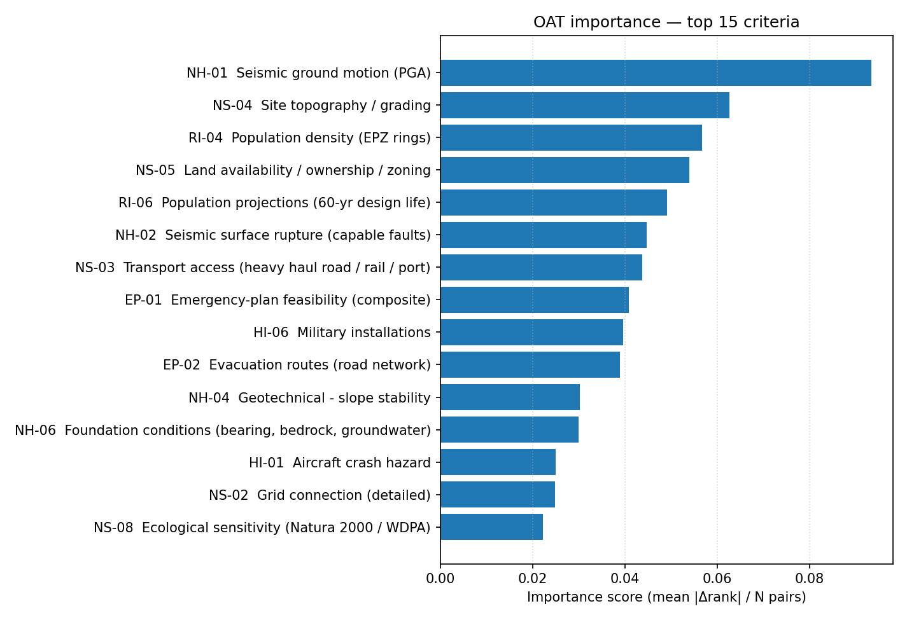
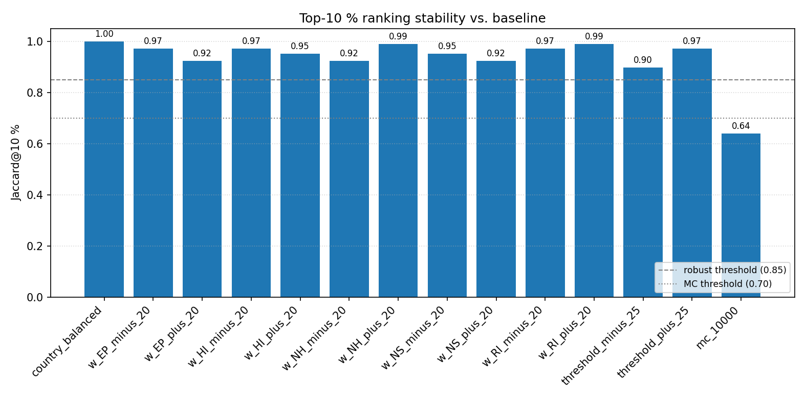
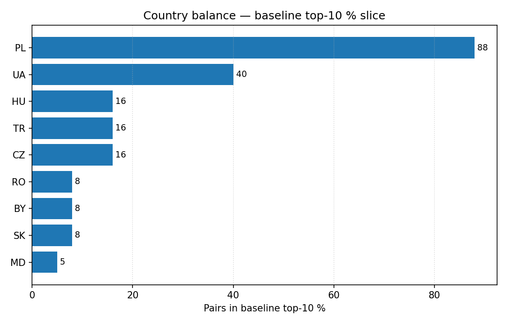
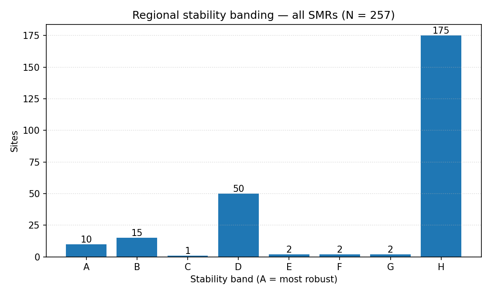
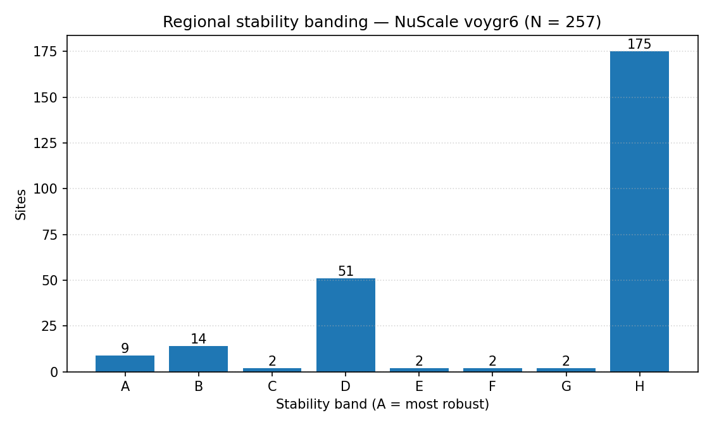
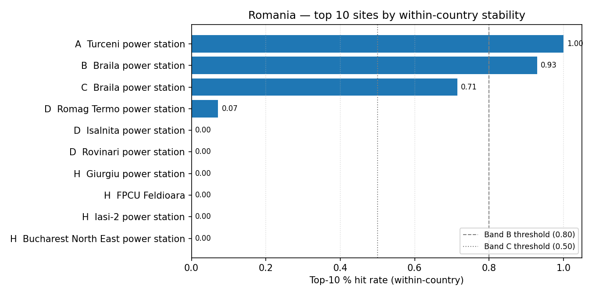

# Phase 1.6 Sensitivity Analysis — Method

**Purpose:** assess robustness of the Phase 1.5 composite ranking to reasonable variation in weights, score uncertainty, and discretionary thresholds, and to flag artefactual concentration of the top shortlist.
**Standards alignment:** IAEA SSG-35 §3.3 / NS-R-3 §2.27; EPRI Siting Guide 3002023910, Step 4; project requirements `report/requirements/06_scoring_matrix.md` §8.4.
**Reproducibility handle:** every perturbed composite row is tagged `run_id = p16_<stamp>_<hash>` in `composite_rankings`; the orchestration entry point is [`src/scripts/run_phase_1_6_sensitivity.py`](../../src/scripts/run_phase_1_6_sensitivity.py).

---

## 1. Population

Analysis runs only over **scored passing pairs**:

```sql
FROM composite_rankings
WHERE weight_profile = 'baseline'
  AND passed_exclusionary = true
  AND composite_score IS NOT NULL
```

In the reference 2026-04-23 run this resolves to **2 056 pairs** across **257 distinct sites × 8 SMR designs** (from a universe of 2 904 pairs; 848 are screened out by E-codes). Pairs failing any exclusionary criterion (E1–E9) are never considered for any sensitivity scenario — this is enforced by the baseline filter, not re-applied in the perturbation code.

## 2. Techniques

The suite is a **regulatory-style matrix** of four perturbation families plus one diagnostic. Each family produces rows in `composite_rankings` under a distinct `weight_profile` label so the suite is reproducible and auditable. One-at-a-time (OAT) importance and banding are pure analytics (no new database (DB) rows; comma-separated value (CSV) artefacts).

### 2.1 OAT (one-at-a-time) importance — Phase A

- For each criterion `c_k` with `"ranking" in phases`: set `w_k = 0`, renormalise the remaining weights to sum 1, recompute every composite **in-memory** (no DB writes), and re-rank.
- Record the **mean absolute rank change** vs baseline across the 2 056 pairs scored in both rankings.
- `importance_score = mean_abs_rank_change / N_pairs` ∈ [0, 1]; 0 = no effect, 1 = full reversal.
- Criteria sorted descending; the top-15 populate the narrative's "influential set".
- Implementation: `run_oat_importance()` in [`src/atoms_vs_ashes/scoring/sensitivity.py`](../../src/atoms_vs_ashes/scoring/sensitivity.py).
- **Rationale:** OAT is the simplest screening method recommended by EPA/Saltelli (2004) for identifying first-order drivers before a full variance-based study; it is cheap (48 in-memory runs, ≈ 7 s) and interpretable.

### 2.2 Weight perturbation — Phase B.1

- Per-category ±20 % scaling for each family `NH, HI, RI, EP, NS` → **10 profiles** (`w_<CAT>_plus_20`, `w_<CAT>_minus_20`).
- Only the target family is scaled; all 48 weights are then renormalised so `Σw = 1` (prevents the trivial "uniform scaling is a no-op" degeneracy).
- Implementation: [`_weight_perturbation.py`](../../src/atoms_vs_ashes/scoring/_weight_perturbation.py).
- **Rationale:** ±20 % is the sensitivity band mandated by `06_scoring_matrix.md` §8.4 and is the standard EPRI regulatory envelope for category weights.

### 2.3 Monte Carlo score-band sampling — Phase B.2

- `N = 10 000` iterations (single production run; the presets `test=1000`, `medium=3000` exist but are not used for the regulatory report).
- Per-criterion sampling: uniform draw in `[score_low, score_high]`. These bands are populated at scoring time (`score_low = score − 1`, `score_high = score + 1` for `quality = low`; width 0 otherwise), so MC propagates declared data uncertainty into the composite.
- Deterministic RNG seeded per pair: `seed = f"{site_id}:{smr_key}:42"` → identical runs reproduce bit-for-bit.
- Returns mean / p05 / p95 / stdev per pair and a **stability flag** (`p95 − p05 ≤ 1.0` point).
- Implementation: `run_monte_carlo` / `run_mc_suite` in `sensitivity.py`. Persisted under `weight_profile = "mc_10000"`.

### 2.4 Threshold perturbation — Phase B.3

- Numeric measured context (distances, densities, areas …) scaled by `factor ∈ {0.75, 1.25}` while the rubric's band edges stay fixed — i.e. the bands run at a **shifted operating point**, which is analytically equivalent to shifting the thresholds by ∓25 %.
- Two profiles: `threshold_minus_25`, `threshold_plus_25`.
- Implementation: `scale_numeric_context()` in `sensitivity.py`.
- **Rationale:** direct band-edge perturbation would require 48 rubric edits per direction; scaling the input preserves the YAML contract and keeps the code auditable.

### 2.5 Country-balance diagnostic — Phase B.4

- Baseline composite is re-persisted under `weight_profile = "country_balanced"` (identical scores) solely to make the country-share check visible to the banding stage.
- Reports top-20 country counts and `max_share`; flags if any single country holds > 40 % of the shortlist (`LL-022` risk).

### 2.6 Site stability banding — Phase C (A–H, scope-parameterised)

Across the **14 non-baseline profiles** (10 weight + 1 MC + 2 threshold + 1 country-balanced), each scored site receives a single band:

| Band | Rule                                         | Intent                                         |
| ---- | -------------------------------------------- | ---------------------------------------------- |
| A    | top-5 % hit rate ≥ 0.80                      | Robust short-list (unchanged)                  |
| B    | top-10 % hit rate ≥ 0.80 (not A)             | Defensible top-10 % (unchanged)                |
| C    | top-10 % hit rate 0.50–0.79 (not A/B)        | Bench (unchanged)                              |
| D    | top-30 % hit rate ≥ 9 / 14 (≈ 0.64)          | Frequently in broader top tier                 |
| E    | top-30 % hit rate ≥ 7 / 14 (0.50)            | Majority of scenarios                          |
| F    | top-30 % hit rate ≥ 5 / 14 (≈ 0.36)          | Roughly a third of scenarios                   |
| G    | top-30 % hit rate ≥ 3 / 14 (≈ 0.21)          | Occasional appearance                          |
| H    | below all of the above                       | Rarely / never in the top-30 % slice           |

Bands **A–G** together cover ≈ 25–35 % of the scored sites, turning the previously opaque "D" into a ranked five-tier long-list usable for sensitivity-aware screening, while A/B/C keep their regulatory meaning. The assignment rule is the same at every **scope**: the same function runs on the global pool, the per-SMR pool (8 SMR keys), the per-country pool (all-SMR), and the per-country × NuScale pool. Within-country percentiles are computed on the local pool, so **national bands reflect local competitiveness**, not global rank. A site enters "top-N %" of a scenario when _any_ of its (site, SMR) pairs lies in the top-N % slice of that scope's scored pairs. Implementation: [`_band_rules.py`](../../src/atoms_vs_ashes/scoring/_band_rules.py), [`_suite_banding.py`](../../src/atoms_vs_ashes/scoring/_suite_banding.py).

## 3. Metrics

| Metric                 | Definition                                                                 | Role                                  |
| ---------------------- | -------------------------------------------------------------------------- | ------------------------------------- |
| `top5pct_overlap`      | size of intersection between profile and baseline top-5 % sets             | Size-independent short-list stability |
| `top10pct_overlap`     | same at top-10 %                                                           | Broader long-list stability           |
| `jaccard@5 %` / `@10 %`| intersection divided by union of the two top-N sets                        | Scale-free set similarity             |
| `mean abs Δscore`      | mean absolute change in composite score across pairs                       | Magnitude of perturbation             |
| `max abs Δscore`       | worst-case absolute change in composite score                              | Tail sensitivity                      |
| `mean_abs_rank_change` | mean absolute difference between perturbed and baseline rank (OAT only)    | Criterion influence                   |
| `importance_score`     | `mean_abs_rank_change / N_pairs` ∈ [0, 1]                                  | Normalised OAT importance             |
| `top5/10pct_hit_rate`  | fraction of scenarios in which the site sits in the top-N %                | Input to banding                      |

Top-N is expressed as **percentages** rather than fixed counts (5 % / 10 %) so the metric is robust to changes in the scored-pair population between runs.

## 4. Data flow and persistence

```
composite_rankings (baseline) ─┬─▶ load_pairs ─▶ OAT (Phase A) ─▶ oat_importance.csv
                               │
                               ├─▶ weight_perturbation (10) ─┐
                               ├─▶ MC @ 10 000            (1)├─▶ composite_rankings (14 profiles) ─▶ banding (Phase C) ─▶ site_bands.csv
                               ├─▶ threshold ±25 %         (2)│                                 │
                               └─▶ country_balanced        (1)┘                                 └─▶ analytics ─▶ consolidated audit .md
```

- Perturbed composites are persisted so every number in the audit is traceable to a DB row.
- **Audit artefacts** (traceability) land under `audit/post_processing/06_scoring/<YYYYMMDD>_*`: per-stage `.md`, `oat_importance.csv`, `site_bands.csv` (+ `_nuscale_voygr6`, `_{smr}`, `_{CC}`, `_{CC}_{smr}` variants), `country_rankings_summary(.csv|_nuscale.csv)`, and the consolidated `phase1_6_sensitivity.md`.
- **Human-readable reports** are emitted under `report/output/sensitivity/<YYYYMMDD>/` — one `00_regional_summary.md` plus `national/{CC_name}.md` per country, with `figures/` siblings (global A–H counts + per-country top-sites bar charts). These MDs are pure derivatives of the audit CSVs; re-running [`run_phase_1_6_extended_analysis.py`](../../src/scripts/run_phase_1_6_extended_analysis.py) regenerates them without touching the database.
- Run tagging: `run_id` identifies the suite instance; `weight_profile` identifies the scenario within the suite. Together they uniquely identify any row.

## 5. Reproducibility and governance

- RNG seeds are fixed (42); MC is bit-reproducible given the same input data.
- Rubric and weights are read from `config/scoring_rubrics/*.yaml` at load time; any config change invalidates comparability and should bump the baseline run first.
- The entire suite runs under a single Python process with structured JSON logging; no step mutates baseline rows.
- Wall time on the reference hardware (2026-04-23): **12 min 11 s** (OAT ≈ 7 s, weight ≈ 2 s, MC@10k ≈ 11.5 min, threshold ≈ 20 s, banding ≈ 0.4 s).

## 6. Reference production run outcomes (2026-04-23)

> Numbers below are **run-specific** (`run_id = p16_20260423T163739_074314b6`, DB profile `merged`). Authoritative tables live in [`20260423_phase1_6_sensitivity.md`](../../audit/post_processing/06_scoring/20260423_phase1_6_sensitivity.md), [`20260423_oat_importance.csv`](../../audit/post_processing/06_scoring/20260423_oat_importance.csv), [`20260423_site_bands.csv`](../../audit/post_processing/06_scoring/20260423_site_bands.csv); figures are regenerated by [`src/scripts/plot_phase_1_6_sensitivity.py`](../../src/scripts/plot_phase_1_6_sensitivity.py). Future runs replace this section.

**Run envelope:** 2 056 scored passing pairs / 2 904 universe, 257 distinct sites × 8 SMRs; top-5 % slice = 102 pairs, top-10 % slice = 205 pairs; 14 non-baseline scenarios; wall time 12 min 11 s.

### 6.1 Phase A outcome — top-15 influential criteria

| Rank | Criterion | Family | Name                                              | `importance_score` | Mean abs Δrank |
| ---: | --------- | ------ | ------------------------------------------------- | -----------------: | -------------: |
|    1 | `NH-01`   | NH     | Seismic ground motion (PGA)                       |             0.0934 |        192.062 |
|    2 | `NS-04`   | NS     | Site topography / grading                         |             0.0627 |        128.996 |
|    3 | `RI-04`   | RI     | Population density (EPZ rings)                    |             0.0568 |        116.732 |
|    4 | `NS-05`   | NS     | Land availability / ownership / zoning            |             0.0540 |        111.072 |
|    5 | `RI-06`   | RI     | Population projections (60-yr design life)        |             0.0491 |        100.981 |
|    6 | `NH-02`   | NH     | Seismic surface rupture (capable faults)          |             0.0448 |         92.196 |
|    7 | `NS-03`   | NS     | Transport access (heavy haul road / rail / port)  |             0.0438 |         90.089 |
|    8 | `EP-01`   | EP     | Emergency-plan feasibility (composite)            |             0.0409 |         84.038 |
|    9 | `HI-06`   | HI     | Military installations                            |             0.0396 |         81.429 |
|   10 | `EP-02`   | EP     | Evacuation routes (road network)                  |             0.0390 |         80.125 |
|   11 | `NH-04`   | NH     | Geotechnical — slope stability                    |             0.0302 |         62.006 |
|   12 | `NH-06`   | NH     | Foundation conditions                             |             0.0300 |         61.701 |
|   13 | `HI-01`   | HI     | Aircraft crash hazard                             |             0.0250 |         51.362 |
|   14 | `NS-02`   | NS     | Grid connection (detailed)                        |             0.0249 |         51.246 |
|   15 | `NS-08`   | NS     | Ecological sensitivity (Natura 2000 / WDPA)       |             0.0223 |         45.883 |

**Takeaway:** seismic PGA (`NH-01`) is the single dominant driver; the next tier mixes site-topography / land-availability (NS) with population-exposure criteria (RI). 23 of the 48 criteria score `0` — either the population carries no effective weight signal for them (unchanged ranks when zeroed) or the criterion is confined to earlier phases.



*Figure 1 — Top-15 criteria by OAT importance score (`mean_abs_rank_change / N_pairs`). Source: `20260423_oat_importance.csv`.*

### 6.2 Phase B.1 outcome — weight perturbation (±20 %)

Lowest Jaccard@10 % across the ten profiles is **0.925** (`w_NH_minus_20`, `w_NS_plus_20`, `w_EP_plus_20`); highest is **0.990** (`w_NH_plus_20`, `w_RI_plus_20`). Category roll-up (avg over `plus`/`minus`):

| Category | Avg mean abs Δscore | Avg top-10 % overlap (of 205) |
| -------- | ------------------: | ----------------------------: |
| `EP`     |              0.0291 |                           200 |
| `HI`     |              0.0267 |                           201 |
| `NH`     |              0.0300 |                           200 |
| `NS`     |              0.0609 |                           198 |
| `RI`     |              0.0234 |                           203 |

**Takeaway:** ranking is robust to weight perturbation — every weight profile clears the §7 threshold (Jaccard@10 % ≥ 0.85). `NS` is the family that moves scores most in absolute terms (consistent with its Phase A top-tier importance).

### 6.3 Phase B.2 outcome — Monte Carlo @ N = 10 000

- Jaccard@5 % = **0.457**; Jaccard@10 % = **0.640**; top-10 % overlap 160 / 205.
- Mean abs Δscore = **0.2296**; max = **0.706**.
- **Largest single perturbation** in the suite — roughly 4× the weight-family effect.

**Takeaway:** within the declared data uncertainty bands, the **rank order of borderline pairs is not robust**; the Band A / B identification (§6.6) is the correct way to read MC into the narrative rather than the raw top-5 % list.



*Figure 2 — Jaccard@10 % for every non-baseline profile vs. the 0.85 "robust" threshold (dashed) and the 0.70 MC threshold (dotted). `mc_10000` is the only bar below both lines. Source: consolidated audit `20260423_phase1_6_sensitivity.md`.*

### 6.4 Phase B.3 outcome — threshold ±25 %

- `threshold_minus_25` — Jaccard@10 % = 0.898; mean abs Δscore = 0.0572.
- `threshold_plus_25` — Jaccard@10 % = 0.971; mean abs Δscore = 0.0083.

**Takeaway:** tightening thresholds (`minus_25`, operating point shifted so more pairs fall into tighter bands) perturbs the ranking ~7× more than loosening — the baseline is closer to the "permissive" end of its thresholds.

### 6.5 Phase B.4 outcome — country balance

`top_n = 20`, `max_share_threshold = 0.40`. Observed `max_share = 0.40` (**not flagged**, right at the boundary); top-20 head country counts `PL : 8`, `HU : 8`, `UA : 4`. The wider baseline top-10 % slice (205 pairs) is dominated by `PL` (88) and `UA` (40) — not artefactually concentrated, but PL's share warrants a narrative callout.



*Figure 3 — Country distribution across the 205-pair baseline top-10 % slice. Source: consolidated audit `20260423_phase1_6_sensitivity.md`.*

### 6.6 Phase C outcome — site stability banding (A–H)

The extended A–H assignment (see §2.6) expands the previously opaque "D" into a ranked five-tier long-list (D–H) while preserving the regulatory meaning of **A / B / C**. The 10-site Band A from the legacy run is unchanged by construction — Band A sites still clear `top-5 % hit rate ≥ 0.80`. The `top30pct_hit_rate` column, added to `<stamp>_site_bands.csv`, is what drives the D/E/F/G/H split.

Two regional scopes are reported:

- **All-SMR pool** (A site's best-of-8 SMR score enters the percentile slice) — the default comparator.
- **NuScale `nuscale_voygr6`** — restricts the pool to the SMR family most relevant to the primary regulatory audience. Produced from `{stamp}_site_bands_nuscale_voygr6.csv`.

Counts are plotted side-by-side from the consolidated audit; see Figures 4a / 4b below. **Band A shortlist (2026-04-23, all-SMR pool):** Opole (PL), Połaniec (PL), Starobesheve (UA), Opalenie (PL), Mohács (HU), Chvaletice (CZ), Puchaczów (PL), Turceni (RO), Çoban Yıldız (TR), Počerady (CZ). These 10 sites carry into Phase 1.7 as the robust regional shortlist; Band B (15 sites) is the resilience bench. The NuScale-specific Band A / B shortlists (primary decision input for utilities building NuScale SmMRs) live in `report/output/sensitivity/<stamp>/00_regional_summary.md`.



*Figure 4a — All-SMR A–H band counts across 14 non-baseline scenarios. Source: `20260423_site_bands.csv`.*



*Figure 4b — NuScale-only pool. Smaller population (one SMR) means a thinner A/B head and a longer H tail compared with the all-SMR scope. Source: `20260423_site_bands_nuscale_voygr6.csv`.*

### 6.7 Synthesis

- **Weights robust, MC stresses the ranking** — use Band A+B (25 sites) as the "structurally top-tier" pool, not the raw baseline top-N.
- **NS family is the lever to tighten** — highest category drift + three of the top-15 OAT drivers (NS-04, NS-05, NS-03). Additional data-quality work on those criteria would yield the largest reduction in Phase B.2 spread.
- **Seismic (NH-01, NH-02) + population (RI-04, RI-06)** are non-negotiable drivers; their rubric bands must stay defensible against any future expert challenge.
- **Country-balance boundary** — PL at 40 % of top-20 meets but does not exceed the artefact threshold; the consolidated audit should document the explicit data-coverage rationale.
- **No rubric change recommended** on the strength of this run; Phase 1.7 can proceed with the existing weight profile.

### 6.8 Figure regeneration

Figures 1–4 are embedded above. Regenerate from the same audit artefacts via [`src/scripts/plot_phase_1_6_sensitivity.py`](../../src/scripts/plot_phase_1_6_sensitivity.py); the new A–H regional figures and all per-country figures are regenerated by [`run_phase_1_6_extended_analysis.py`](../../src/scripts/run_phase_1_6_extended_analysis.py). Scoring, sensitivity re-runs, connector batches and the exact invocations are documented in the repository [`README.md`](../../README.md). Raw PNGs live under [`audit/post_processing/06_scoring/figures/20260423/`](../../audit/post_processing/06_scoring/figures/20260423/) and under `report/output/sensitivity/20260423/figures/`.

## 7. National analysis (per-country shortlists)

SMRs are procured by **national governments**, so the regional regulatory view (§6) has to be supplemented by a per-country view with the same rigor. The extended analytics stage runs the **same** A–H engine inside each country's pool and emits one Markdown file per country under `report/output/sensitivity/<stamp>/national/`.

**Scope-parameterised engine.** `compute_bands(session, *, baseline_label, smr_filter, country_filter)` is a single function whose two optional filters fully determine the analysis scope:

| Scope                           | `smr_filter`      | `country_filter` | Output                                               |
| ------------------------------- | ----------------- | ---------------- | ---------------------------------------------------- |
| Regional, all SMRs pooled       | `None`            | `None`           | `{stamp}_site_bands.csv` (primary regulatory input)  |
| Regional, NuScale only          | `nuscale_voygr6`  | `None`           | `{stamp}_site_bands_nuscale_voygr6.csv`              |
| Regional, other 6 SMR keys      | `{smr_key}`       | `None`           | `{stamp}_site_bands_{smr}.csv` ×7 (retrieval-ready)  |
| National, all SMRs pooled       | `None`            | `{CC}`           | `{stamp}_site_bands_{CC}.csv`                        |
| National, NuScale               | `nuscale_voygr6`  | `{CC}`           | `{stamp}_site_bands_{CC}_nuscale_voygr6.csv`         |

Within each scope the top-5 / 10 / 30 % percentiles are recomputed **on the local pool**, so within-country Band A identifies the sites that remain in the **local** top-5 % in ≥ 80 % of the 14 scenarios — irrespective of whether they would appear in the regional head.

**Country shortlist rule.** Each country's MD ranks at least the top 10 sites (fewer only if the country has fewer sites): `K = n` if `n < 10`, else `K = min(n, max(10, ⌈0.30·n⌉))`. Example `K`: `n = 5 → 5`, `n = 15 → 10`, `n = 50 → 15`, `n = 100 → 30`.

**Robustness vs baseline top-K.** For every country and every non-baseline scenario, we record the Jaccard between the baseline country top-K and that scenario's country top-K. The per-country `mean_jaccard_vs_baseline_topk` and `min_jaccard_vs_baseline_topk` populate `{stamp}_country_rankings_summary(.csv|_nuscale.csv)` — and are surfaced in the "Country roll-up" section of the consolidated audit.

**Example figure (Romania).** One horizontal bar per shortlisted site (up to 10), X-axis = within-country top-10 % hit rate, with dashed/dotted lines at the Band B (0.80) and Band C (0.50) thresholds. One such figure is emitted per country.



*Figure 5 — Example per-country figure (Romania). The same template is emitted for every country with ≥ 1 scored site. Source: `20260423_site_bands_RO.csv`.*

## 8. Interpretation rules

- **Ranking is robust** if Jaccard@10 % ≥ 0.85 for every weight profile and ≥ 0.70 under MC.
- **Band A + B sites** are the "structurally top-tier" set — these are the ones carried into Phase 1.7 narrative.
- **Category with the highest avg mean |Δscore|** points to the scoring family most deserving of tighter rubric definitions or additional data collection.
- **Country-balance flagged** (`max_share > 0.40`) means the top-N is driven by data-coverage asymmetry and the suite narrative must discuss it explicitly.

## 9. Known limitations

- OAT captures only first-order effects — interactions between criteria (two simultaneously perturbed) are not explored. A variance-based Sobol extension is deferred to Phase 1.7 if reviewers require it.
- Threshold perturbation acts on measured numeric values, not on every rubric edge; non-numeric bands (e.g. categorical quality tiers) are insensitive to the ±25 % operator by construction.
- Banding is population-relative, not absolute — a site ranked 30th in a 2 056-pair universe is "top-5 %" only because the universe is large; the bands are always reported with the `scenarios_total` and `scenarios_scored` columns so reviewers can sanity-check coverage.
- The uniform ±1-band MC distribution is conservative for `low`-quality data and may over-estimate uncertainty for `high`-quality rows where `score_low = score_high`. This is deliberate (defensive propagation) and documented in `report/methodology/methodology.md` §2.
