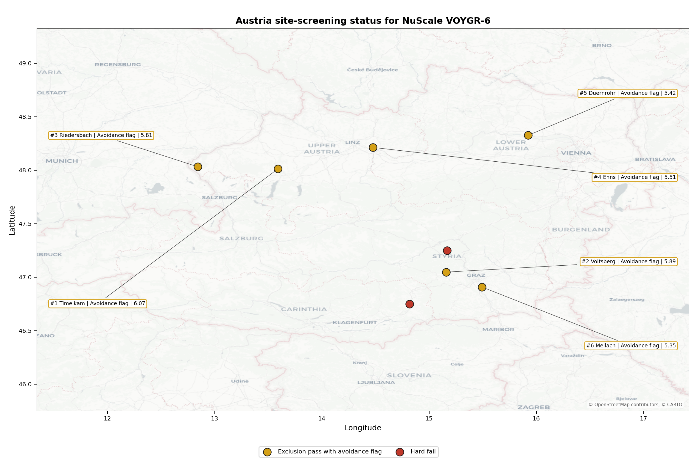
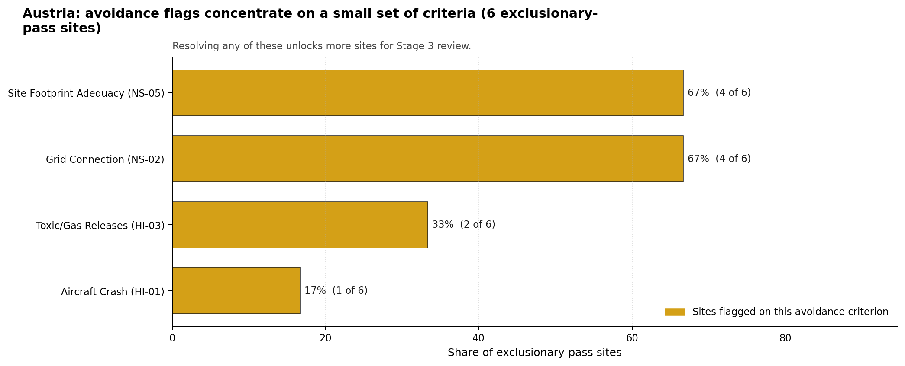
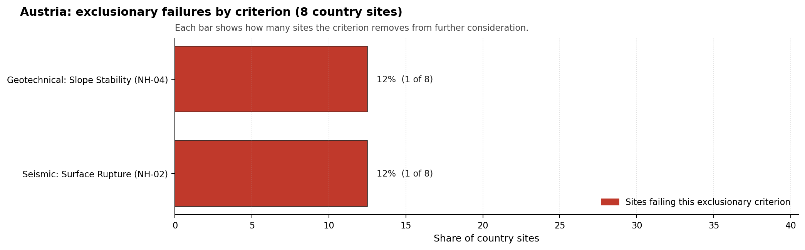

# Austria Country Profile

Analytical basis: scoring `score-214bab4e` and sensitivity `sens-7b609bd0`.

Austria has 8 thermal and coal-site records that have been tested against the NuScale VOYGR-6 reference deployment envelope. 0 sites pass both the exclusionary and avoidance screens, 6 pass the exclusionary screen but retain avoidance flags, and 2 fail one or more exclusionary checks. The country is therefore not a single-site case, but only a small subset of the national site population currently clears the full screening pathway without a remediation step.

The leading site is **Timelkam power station**, with a composite score of 6.069 and a Monte Carlo interval of 4.366-6.455. Its national stability band is `A` with a national top-10% hit rate of 100%. The leader is therefore not only the current point-estimate front-runner; it is also a stable national candidate under the sensitivity treatment used for the report.

<!-- specialist key=country_exec scope=country country_code=AT bundle=AT_country_bundle.json status=filled by=cursor-agent filled_at=2026-05-03T11:20:20Z -->
Of 8 Austrian thermal sites tested against the NuScale VOYGR-6 envelope, none clear both the exclusionary and avoidance screens, 6 pass exclusionary but carry avoidance flags, and 2 are removed at the exclusionary stage on Seismic: Surface Rupture (NH-02) and Geotechnical: Slope Stability (NH-04). Timelkam power station leads in band A with a 100 % top-10 % hit rate and a composite score of 6.069, so the leadership pool is one stable candidate that is currently held back by avoidance work, not a fleet pool.

Two avoidance criteria dominate the unlock pool, each carrying 4 of the 6 exclusionary-pass sites (67 %): **Grid Connection (NS-02)** reflects sub-220 kV interconnection at most Austrian thermal-station corridors, and **Site Footprint Adequacy (NS-05)** reflects the constrained alpine and valley-floor land envelopes that limit the buildable hectares for a NuScale VOYGR-6 nuclear-island. Resolving NS-02 is a transmission-system-operator question (corridor upgrade study with APG); resolving NS-05 is a parcel-by-parcel land-acquisition question that may require co-locating with an adjacent industrial use. **Toxic/Gas Releases (HI-03)** carries a third of the avoidance flags and is closed by a refresh of the local industrial inventory.

The greenfield lever is available in principle but has limited population-density runway in Austria, and the brownfield candidate pool is small enough that any meaningful programme must succeed on Timelkam first. A credible Stage 3 sequence begins with Timelkam power station as the lead site, contingent on resolving NS-02 and NS-05 in parallel; Voitsberg power station and Riedersbach power station are the only realistic fast followers in the band-D pool and remain dependent on the same two avoidance flags being cleared.
<!-- /specialist key=country_exec -->

Interactive review map with marker tooltips: [AT_site_status_map.html](figures/AT_site_status_map.html).

## Austria Site Ledger

| Rank | Site | Status | Composite | MC Low | MC High | Band | Top-10 Hit | Coverage |
|---:|---|---|---:|---:|---:|---|---:|---:|
| 1 | Timelkam power station | Exclusion pass with avoidance flag | 6.069 | 4.366 | 6.455 | A | 100% | 42% |
| 2 | Voitsberg power station | Exclusion pass with avoidance flag | 5.894 | 4.377 | 6.315 | D | 6% | 45% |
| 3 | Riedersbach power station | Exclusion pass with avoidance flag | 5.807 | 4.311 | 6.226 | D | 19% | 42% |
| 4 | Enns Power Station | Exclusion pass with avoidance flag | 5.514 | 4.174 | 5.981 | H | 6% | 42% |
| 5 | Duernrohr power station | Exclusion pass with avoidance flag | 5.425 | 4.132 | 5.887 | G | 6% | 42% |
| 6 | Mellach power station | Exclusion pass with avoidance flag | 5.354 | 4.099 | 5.774 | D | 12% | 42% |
| - | St Andrae power station | Hard fail | - | - | - | - | - | 0% |
| - | Zeltweg power station | Hard fail | - | - | - | - | - | 0% |

## Avoidance Flag Pareto

Of the 6 sites that pass the exclusionary screen, the avoidance-phase flags concentrate on a small set of criteria. Resolving them is what would move the country from a small leading group to a broader candidate pool.

- **Grid Connection (NS-02)** - 4 of 6 exclusionary-pass sites (67%).
- **Site Footprint Adequacy (NS-05)** - 4 of 6 exclusionary-pass sites (67%).
- **Toxic/Gas Releases (HI-03)** - 2 of 6 exclusionary-pass sites (33%).
- **Aircraft Crash (HI-01)** - 1 of 6 exclusionary-pass sites (17%).

## Exclusionary Failure Pareto

The exclusionary failures across the country trace back to a small number of criteria. They identify which screening checks are responsible for removing sites from further consideration.

- **Seismic: Surface Rupture (NH-02)** - 1 of 8 country sites (12%).
- **Geotechnical: Slope Stability (NH-04)** - 1 of 8 country sites (12%).

## Family Strength and Weakness

Across the country the strongest criterion family is **Natural Hazards** at a mean normalised score of 6.66/10. The weakest family is **Human-Induced Hazards** at 4.21/10. The bottom three individual criteria across the country are:

- **Military Installations (HI-06)** - mean 1.62/10 across 8 scored sites (min 0.0, max 3.5).
- **Grid Capacity Basic Filter (BF-01)** - mean 3.00/10 across 8 scored sites (min 1.5, max 5.5).
- **Extreme Precipitation (NH-11)** - mean 4.00/10 across 8 scored sites (min 4.0, max 4.0).

## Interpretation for Site Selection

The Austria result shows a clear separation between sites that can support further Stage 3 consideration and sites that should remain in the evidence base only as comparators. The full-pass group is the relevant pool for progression. Avoidance-flag sites are not discarded, but they identify locations where a specific constraint must be resolved before the site can be treated as equivalent to the leading group.

The chart shows where focused remediation effort would broaden the candidate pool. The criteria at the top of the Pareto are the policy and engineering levers that, if resolved, move avoidance-flag sites into the leading group.

An IAEA-style reading of the table focuses less on the exact rank number and more on screening class, score stability, and the nature of remaining uncertainty. **Timelkam power station** is important because it leads nationally, sits inside the strongest stability band, and retains a full-pass status. That does not establish final site suitability. It is a defensible reason to spend Stage 3 effort on field confirmation, national data review, and stakeholder engagement before lower-ranked or avoidance-flag locations.

The Monte Carlo interval is a caution against false precision: several sites have overlapping score bands, so small score differences should not be overinterpreted. The decisive distinction is whether a site combines acceptable exclusionary performance with a stable ranking position and no unresolved avoidance flag.

The main Stage 3 questions are therefore targeted rather than generic: confirm local natural-hazard inputs, verify emergency-planning assumptions, test land and ownership constraints, assess cooling and grid interface conditions, and reconcile environmental constraints with national permitting requirements.

## Status Counts

- Full pass: 0
- Exclusion pass with avoidance flag: 6
- Hard fail: 2
