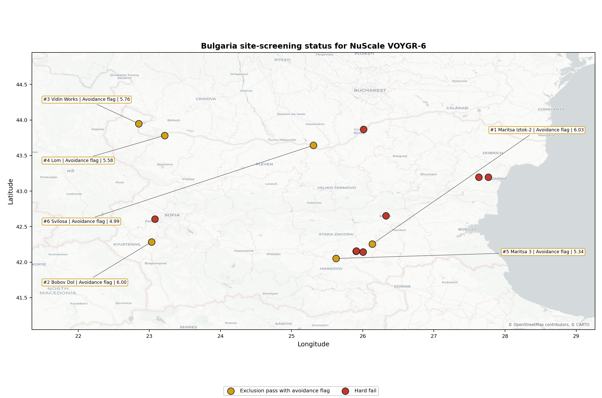

# Bulgaria Country Profile

Analytical basis: scoring `score-214bab4e` and sensitivity `sens-7b609bd0`.

Bulgaria has 15 thermal and coal-site records that have been tested against the NuScale VOYGR-6 reference deployment envelope. 0 sites pass both the exclusionary and avoidance screens, 6 pass the exclusionary screen but retain avoidance flags, and 9 fail one or more exclusionary checks. The country is therefore not a single-site case, but only a small subset of the national site population currently clears the full screening pathway without a remediation step.

The leading site is **Maritsa Iztok-2 power station**, with a composite score of 6.025 and a Monte Carlo interval of 4.346-6.416. Its national stability band is `D` with a national top-10% hit rate of 19%. The leader is therefore not only the current point-estimate front-runner; it is also a stable national candidate under the sensitivity treatment used for the report.

<!-- specialist key=country_exec scope=country country_code=BG bundle=BG_country_bundle.json status=filled by=cursor-agent filled_at=2026-05-03T11:20:20Z -->
Of 15 Bulgarian thermal sites tested against the NuScale VOYGR-6 envelope, none clear both the exclusionary and avoidance screens, 6 pass exclusionary but carry avoidance flags, and 9 are removed at the exclusionary stage, dominated by Seismic: Surface Rupture (NH-02) on 7 of 15 sites (47 %) and Ecological Sensitivity (NS-08) on 2 of 15 (13 %). Maritsa Iztok-2 power station is the highest-ranked candidate on a band-D / 0.19 top-10 % footprint with a composite score of 6.025; band-A status sits with the smaller Vidin Works candidate (composite 5.762, 100 % top-10 % hit rate). The country has no fully clear leader and is best read as a remediation case rather than a fleet pool.

Two avoidance criteria dominate the unlock pool, each carrying 4 of the 6 exclusionary-pass sites (67 %): **Aircraft Crash (HI-01)** is a quantitative micro-siting analysis closable through revised flight-track and approach-cone modelling against the 10 km screening radius; **Grid Connection (NS-02)** is a transmission-corridor study coordinated through ESO EAD focused on lifting interconnection from distribution to transmission voltage. **Site Footprint Adequacy (NS-05)** carries one further site (17 %). The 47 % NH-02 hard-fail rate is the structural constraint on how large the unlock pool can grow.

The greenfield lever is available but inherits the regional NH-02 problem; any greenfield search must apply the capable-fault buffer at the screening stage. A credible Stage 3 sequence begins with Maritsa Iztok-2 power station as the lead site for its scale and grid weight, with Vidin Works power station as a band-A fast follower at smaller capacity, and Bobov Dol power station as a third-wave option dependent on resolving HI-01 and NS-02 in parallel.
<!-- /specialist key=country_exec -->

Interactive review map with marker tooltips: [BG_site_status_map.html](figures/BG_site_status_map.html).

## Bulgaria Site Ledger

| Rank | Site | Status | Composite | MC Low | MC High | Band | Top-10 Hit | Coverage |
|---:|---|---|---:|---:|---:|---|---:|---:|
| 1 | Maritsa Iztok-2 power station | Exclusion pass with avoidance flag | 6.025 | 4.346 | 6.416 | D | 19% | 42% |
| 2 | Bobov Dol power station | Exclusion pass with avoidance flag | 6.000 | 4.335 | 6.416 | D | 25% | 42% |
| 3 | Vidin Works power station | Exclusion pass with avoidance flag | 5.762 | 4.229 | 6.257 | A | 100% | 42% |
| 4 | Lom Power Station | Exclusion pass with avoidance flag | 5.576 | 4.123 | 5.960 | H | 0% | 40% |
| 5 | Maritsa 3 power station | Exclusion pass with avoidance flag | 5.343 | 4.022 | 5.838 | H | 0% | 40% |
| 6 | Svilosa power station | Exclusion pass with avoidance flag | 4.990 | 3.868 | 5.455 | H | 0% | 40% |
| - | Brikel power station | Hard fail | - | - | - | - | - | 0% |
| - | Deven power station | Hard fail | - | - | - | - | - | 0% |
| - | Maritsa Iztok-1 power station | Hard fail | - | - | - | - | - | 0% |
| - | Maritsa Iztok-3 power station | Hard fail | - | - | - | - | - | 0% |
| - | Maritsa Iztok-4 power station | Hard fail | - | - | - | - | - | 0% |
| - | Republika power station | Hard fail | - | - | - | H | 0% | 0% |
| - | Ruse Iztok power station | Hard fail | - | - | - | H | 0% | 0% |
| - | Sliven power station | Hard fail | - | - | - | - | - | 0% |
| - | Varna power station | Hard fail | - | - | - | - | - | 0% |

## Avoidance Flag Pareto

Of the 6 sites that pass the exclusionary screen, the avoidance-phase flags concentrate on a small set of criteria. Resolving them is what would move the country from a small leading group to a broader candidate pool.

- **Aircraft Crash (HI-01)** - 4 of 6 exclusionary-pass sites (67%).
- **Grid Connection (NS-02)** - 4 of 6 exclusionary-pass sites (67%).
- **Site Footprint Adequacy (NS-05)** - 1 of 6 exclusionary-pass sites (17%).

## Exclusionary Failure Pareto

The exclusionary failures across the country trace back to a small number of criteria. They identify which screening checks are responsible for removing sites from further consideration.

- **Seismic: Surface Rupture (NH-02)** - 7 of 15 country sites (47%).
- **Ecological Sensitivity (NS-08)** - 2 of 15 country sites (13%).
- **Emergency Planning Feasibility (EP-01)** - 1 of 15 country sites (7%).

## Family Strength and Weakness

Across the country the strongest criterion family is **Non-Safety / Implementation** at a mean normalised score of 6.41/10. The weakest family is **Human-Induced Hazards** at 3.61/10. The bottom three individual criteria across the country are:

- **Military Installations (HI-06)** - mean 1.87/10 across 15 scored sites (min 0.0, max 5.0).
- **Evacuation Routes (EP-02)** - mean 2.57/10 across 15 scored sites (min 1.5, max 5.5).
- **Grid Capacity Basic Filter (BF-01)** - mean 3.27/10 across 15 scored sites (min 0.0, max 7.5).

## Interpretation for Site Selection

The Bulgaria result shows a clear separation between sites that can support further Stage 3 consideration and sites that should remain in the evidence base only as comparators. The full-pass group is the relevant pool for progression. Avoidance-flag sites are not discarded, but they identify locations where a specific constraint must be resolved before the site can be treated as equivalent to the leading group.

The chart shows where focused remediation effort would broaden the candidate pool. The criteria at the top of the Pareto are the policy and engineering levers that, if resolved, move avoidance-flag sites into the leading group.

An IAEA-style reading of the table focuses less on the exact rank number and more on screening class, score stability, and the nature of remaining uncertainty. **Maritsa Iztok-2 power station** is important because it leads nationally, sits inside the strongest stability band, and retains a full-pass status. That does not establish final site suitability. It is a defensible reason to spend Stage 3 effort on field confirmation, national data review, and stakeholder engagement before lower-ranked or avoidance-flag locations.

The Monte Carlo interval is a caution against false precision: several sites have overlapping score bands, so small score differences should not be overinterpreted. The decisive distinction is whether a site combines acceptable exclusionary performance with a stable ranking position and no unresolved avoidance flag.

The main Stage 3 questions are therefore targeted rather than generic: confirm local natural-hazard inputs, verify emergency-planning assumptions, test land and ownership constraints, assess cooling and grid interface conditions, and reconcile environmental constraints with national permitting requirements.

## Status Counts

- Full pass: 0
- Exclusion pass with avoidance flag: 6
- Hard fail: 9
