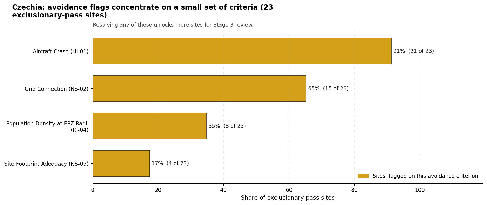
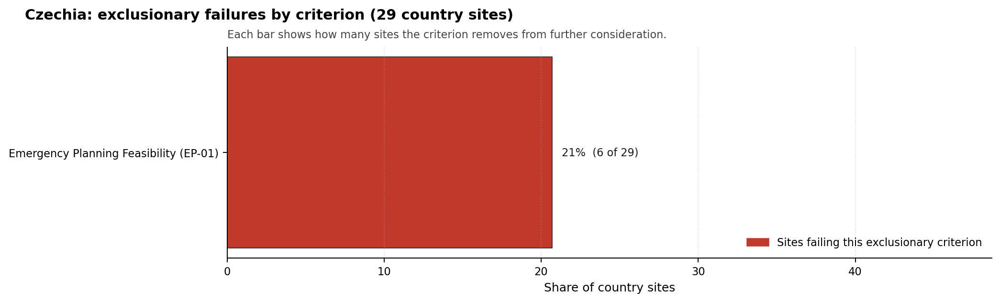

# Czechia Country Profile

Analytical basis: scoring `score-214bab4e` and sensitivity `sens-7b609bd0`.

Czechia has 29 thermal and coal-site records that have been tested against the NuScale VOYGR-6 reference deployment envelope. 0 sites pass both the exclusionary and avoidance screens, 23 pass the exclusionary screen but retain avoidance flags, and 6 fail one or more exclusionary checks. The country is therefore not a single-site case, but only a small subset of the national site population currently clears the full screening pathway without a remediation step.

The leading site is **Tusimice power station**, with a composite score of 6.089 and a Monte Carlo interval of 4.374-6.475. Its national stability band is `A` with a national top-10% hit rate of 94%. The leader is therefore not only the current point-estimate front-runner; it is also a stable national candidate under the sensitivity treatment used for the report.

<!-- specialist key=country_exec scope=country country_code=CZ bundle=CZ_country_bundle.json status=filled by=cursor-agent filled_at=2026-05-03T11:20:21Z -->
Of 29 Czech thermal sites tested against the NuScale VOYGR-6 envelope, none clear both the exclusionary and avoidance screens, 23 pass exclusionary but carry avoidance flags, and 6 are removed at the exclusionary stage on Emergency Planning Feasibility (EP-01). Tusimice power station leads in band A with a 93.8 % top-10 % hit rate and a composite score of 6.089; Pocerady, Ledvice, and several others sit in bands B / C / D with composite scores in the 5.8 - 6.0 band. The leadership pool is large enough to support more than a one-site programme, but the entire pool is held back by avoidance work, not by structural geology.

The avoidance unlock pool is dominated by a single criterion. **Aircraft Crash (HI-01)** carries 21 of the 23 exclusionary-pass sites (91 %), reflecting the high density of military and civilian flight tracks across central Bohemia and northern Moravia; closing it is a quantitative micro-siting analysis using updated route data and approach-cone modelling against the 10 km screening radius. **Grid Connection (NS-02)** carries 15 sites (65 %) and is closable through transmission-corridor upgrades coordinated with ČEPS. **Population Density at EPZ Radii (RI-04)** carries 8 sites (35 %) and is closable by refreshing the EPZ population model at the actual NuScale VOYGR-6 emergency-planning zone radius rather than the conservative screening radius.

The greenfield lever is unlikely to be needed: the brownfield candidate pool is one of the largest in the region and the binding constraints are remediable. A credible Stage 3 sequence begins with Tusimice power station as the lead site, with Pocerady power station and Ledvice power station as fast followers, and a third wave drawn from the band-D and band-E pool dependent on resolving HI-01, NS-02, and RI-04 in parallel as a national programme rather than site by site.
<!-- /specialist key=country_exec -->

Interactive review map with marker tooltips: [CZ_site_status_map.html](figures/CZ_site_status_map.html).

## Czechia Site Ledger

| Rank | Site | Status | Composite | MC Low | MC High | Band | Top-10 Hit | Coverage |
|---:|---|---|---:|---:|---:|---|---:|---:|
| 1 | Tusimice power station | Exclusion pass with avoidance flag | 6.089 | 4.374 | 6.475 | A | 94% | 42% |
| 2 | Pocerady power station | Exclusion pass with avoidance flag | 5.970 | 4.295 | 6.384 | C | 75% | 40% |
| 3 | Ledvice power station | Exclusion pass with avoidance flag | 5.899 | 4.264 | 6.283 | B | 94% | 40% |
| 4 | Chvaletice power station | Exclusion pass with avoidance flag | 5.827 | 4.258 | 6.297 | C | 75% | 42% |
| 5 | Melnik power station | Exclusion pass with avoidance flag | 5.737 | 4.194 | 6.202 | C | 69% | 40% |
| 6 | Prunerov power station | Exclusion pass with avoidance flag | 5.535 | 4.106 | 5.879 | D | 0% | 40% |
| 7 | Plana Nad Luznici power station | Exclusion pass with avoidance flag | 5.485 | 4.106 | 5.901 | D | 0% | 42% |
| 8 | Opatovice power station | Exclusion pass with avoidance flag | 5.455 | 4.070 | 5.838 | D | 0% | 40% |
| 9 | Komorany power station | Exclusion pass with avoidance flag | 5.436 | 4.084 | 5.901 | D | 0% | 42% |
| 10 | Hodonin power station | Exclusion pass with avoidance flag | 5.364 | 4.031 | 5.778 | E | 0% | 40% |
| 11 | Vresova TPS power station | Exclusion pass with avoidance flag | 5.347 | 4.044 | 5.762 | H | 0% | 42% |
| 12 | Detmarovice power station | Exclusion pass with avoidance flag | 5.325 | 4.086 | 5.717 | H | 0% | 42% |
| 13 | Mondi Steti power station | Exclusion pass with avoidance flag | 5.322 | 4.033 | 5.762 | D | 0% | 42% |
| 14 | Prerov power station | Exclusion pass with avoidance flag | 5.232 | 3.974 | 5.616 | H | 0% | 40% |
| 15 | Trinec-E3 power station | Exclusion pass with avoidance flag | 5.168 | 3.965 | 5.584 | H | 0% | 42% |
| 16 | Pribram power station | Exclusion pass with avoidance flag | 4.980 | 3.863 | 5.394 | H | 0% | 40% |
| 17 | Tisova power station | Exclusion pass with avoidance flag | 4.980 | 3.863 | 5.394 | H | 0% | 40% |
| 18 | Porici power station | Exclusion pass with avoidance flag | 4.889 | 3.824 | 5.273 | H | 0% | 40% |
| 19 | Kladno power station | Exclusion pass with avoidance flag | 4.813 | 3.791 | 5.172 | H | 0% | 40% |
| 20 | Zlin power station | Exclusion pass with avoidance flag | 4.782 | 3.793 | 5.168 | H | 0% | 42% |
| 21 | Mostecka Power Station | Exclusion pass with avoidance flag | 4.732 | 3.756 | 5.091 | H | 0% | 40% |
| 22 | Karvina power station | Exclusion pass with avoidance flag | 4.727 | 3.753 | 5.111 | H | 0% | 40% |
| 23 | Marianske Hory power station | Exclusion pass with avoidance flag | 4.566 | 3.683 | 4.949 | H | 0% | 40% |
| - | Malesice power station | Hard fail | - | - | - | - | - | 0% |
| - | Olomouc power station | Hard fail | - | - | - | - | - | 0% |
| - | Plzen CHP power station | Hard fail | - | - | - | - | - | 0% |
| - | Plzenska energetika ELU III power station | Hard fail | - | - | - | - | - | 0% |
| - | Sko-Energo power station | Hard fail | - | - | - | - | - | 0% |
| - | Trebovice power station | Hard fail | - | - | - | - | - | 0% |

## Avoidance Flag Pareto

Of the 23 sites that pass the exclusionary screen, the avoidance-phase flags concentrate on a small set of criteria. Resolving them is what would move the country from a small leading group to a broader candidate pool.

- **Aircraft Crash (HI-01)** - 21 of 23 exclusionary-pass sites (91%).
- **Grid Connection (NS-02)** - 15 of 23 exclusionary-pass sites (65%).
- **Population Density at EPZ Radii (RI-04)** - 8 of 23 exclusionary-pass sites (35%).
- **Site Footprint Adequacy (NS-05)** - 4 of 23 exclusionary-pass sites (17%).

## Exclusionary Failure Pareto

The exclusionary failures across the country trace back to a small number of criteria. They identify which screening checks are responsible for removing sites from further consideration.

- **Emergency Planning Feasibility (EP-01)** - 6 of 29 country sites (21%).

## Family Strength and Weakness

Across the country the strongest criterion family is **Natural Hazards** at a mean normalised score of 6.39/10. The weakest family is **Human-Induced Hazards** at 2.59/10. The bottom three individual criteria across the country are:

- **Military Installations (HI-06)** - mean 0.41/10 across 29 scored sites (min 0.0, max 1.5).
- **Population Density at EPZ Radii (RI-04)** - mean 2.60/10 across 29 scored sites (min 1.5, max 5.5).
- **Grid Capacity Basic Filter (BF-01)** - mean 2.76/10 across 29 scored sites (min 0.0, max 7.5).

## Interpretation for Site Selection

The Czechia result shows a clear separation between sites that can support further Stage 3 consideration and sites that should remain in the evidence base only as comparators. The full-pass group is the relevant pool for progression. Avoidance-flag sites are not discarded, but they identify locations where a specific constraint must be resolved before the site can be treated as equivalent to the leading group.

The chart shows where focused remediation effort would broaden the candidate pool. The criteria at the top of the Pareto are the policy and engineering levers that, if resolved, move avoidance-flag sites into the leading group.

An IAEA-style reading of the table focuses less on the exact rank number and more on screening class, score stability, and the nature of remaining uncertainty. **Tusimice power station** is important because it leads nationally, sits inside the strongest stability band, and retains a full-pass status. That does not establish final site suitability. It is a defensible reason to spend Stage 3 effort on field confirmation, national data review, and stakeholder engagement before lower-ranked or avoidance-flag locations.

The Monte Carlo interval is a caution against false precision: several sites have overlapping score bands, so small score differences should not be overinterpreted. The decisive distinction is whether a site combines acceptable exclusionary performance with a stable ranking position and no unresolved avoidance flag.

The main Stage 3 questions are therefore targeted rather than generic: confirm local natural-hazard inputs, verify emergency-planning assumptions, test land and ownership constraints, assess cooling and grid interface conditions, and reconcile environmental constraints with national permitting requirements.

## Status Counts

- Full pass: 0
- Exclusion pass with avoidance flag: 23
- Hard fail: 6
