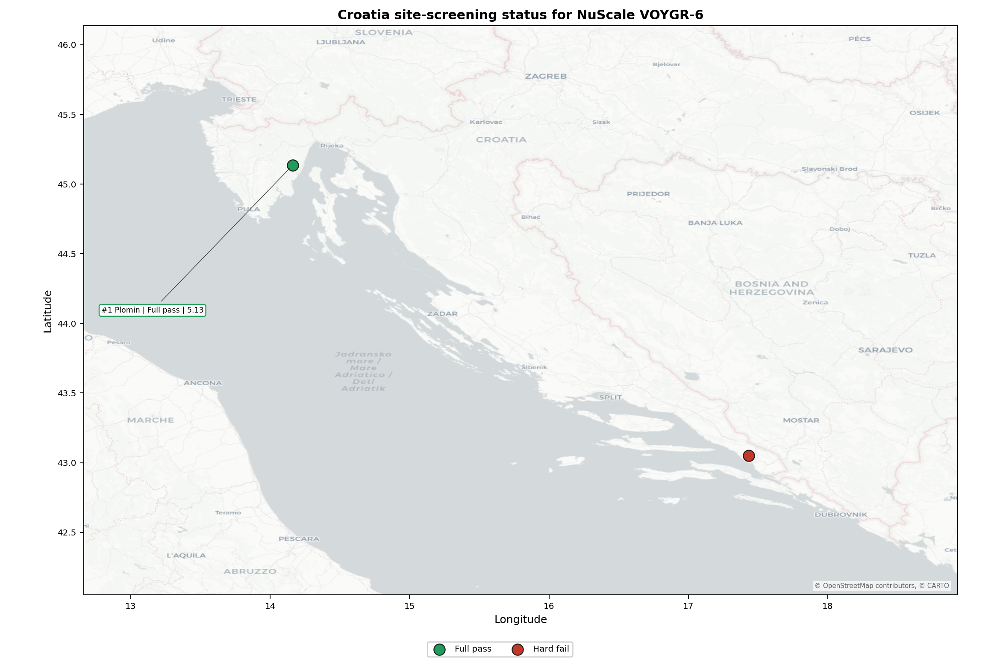

# Croatia Country Profile

Analytical basis: scoring `score-214bab4e` and sensitivity `sens-7b609bd0`.

Croatia has 2 thermal and coal-site records that have been tested against the NuScale VOYGR-6 reference deployment envelope. 1 sites pass both the exclusionary and avoidance screens, 0 pass the exclusionary screen but retain avoidance flags, and 1 fail one or more exclusionary checks. The country is therefore not a single-site case, but only a small subset of the national site population currently clears the full screening pathway without a remediation step.

The leading site is **Plomin power station**, with a composite score of 5.131 and a Monte Carlo interval of 3.930-5.636. Its national stability band is `A` with a national top-10% hit rate of 100%. The leader is therefore not only the current point-estimate front-runner; it is also a stable national candidate under the sensitivity treatment used for the report.

<!-- specialist key=country_exec scope=country country_code=HR bundle=HR_country_bundle.json status=filled by=cursor-agent filled_at=2026-05-03T11:20:21Z -->
Of 2 Croatian thermal sites tested against the NuScale VOYGR-6 envelope, 1 clears both the exclusionary and avoidance screens, and 1 is removed at the exclusionary stage on Seismic: Surface Rupture (NH-02). Plomin power station is the single fully clear candidate and sits in band A with a 100 % top-10 % hit rate, a composite score of 5.131, and a 842 MW coal-fleet inheritance footprint. The Croatian leadership pool is therefore one stable site supported by an avoidance-clean profile, not a fleet pool.

There is no avoidance unlock pool to discuss for this country: Plomin already passes both screens, so there is no list of avoidance criteria that would unlock additional sites. The 50 % country-wide NH-02 hard-fail rate is the structural reason no second brownfield candidate is on the table; this is a regional Dinaride seismic constraint, not a remediation route.

The greenfield lever is the only path to expanding the Croatian programme beyond a single site, and any greenfield search must apply the EFSM20 capable-fault buffer at the screening stage. A credible Stage 3 sequence begins and ends with Plomin power station as the lead site; expansion beyond the lead requires a greenfield prospecting effort outside the scope of this screening pass.
<!-- /specialist key=country_exec -->

Interactive review map with marker tooltips: [HR_site_status_map.html](figures/HR_site_status_map.html).

## Croatia Site Ledger

| Rank | Site | Status | Composite | MC Low | MC High | Band | Top-10 Hit | Coverage |
|---:|---|---|---:|---:|---:|---|---:|---:|
| 1 | Plomin power station | Full pass | 5.131 | 3.930 | 5.636 | A | 100% | 40% |
| - | Ploče power station | Hard fail | - | - | - | - | - | 0% |

## Avoidance Flag Pareto

No exclusionary-pass sites carry avoidance-phase flags in this run.

## Exclusionary Failure Pareto

The exclusionary failures across the country trace back to a small number of criteria. They identify which screening checks are responsible for removing sites from further consideration.

- **Seismic: Surface Rupture (NH-02)** - 1 of 2 country sites (50%).

## Family Strength and Weakness

Across the country the strongest criterion family is **Radiological Impact** at a mean normalised score of 6.72/10. The weakest family is **Human-Induced Hazards** at 2.96/10. The bottom three individual criteria across the country are:

- **Military Installations (HI-06)** - mean 0.00/10 across 2 scored sites (min 0.0, max 0.0).
- **Site Topography (NS-04)** - mean 2.50/10 across 2 scored sites (min 1.5, max 3.5).
- **Evacuation Routes (EP-02)** - mean 3.50/10 across 2 scored sites (min 3.5, max 3.5).

## Interpretation for Site Selection

The Croatia result shows a clear separation between sites that can support further Stage 3 consideration and sites that should remain in the evidence base only as comparators. The full-pass group is the relevant pool for progression. Avoidance-flag sites are not discarded, but they identify locations where a specific constraint must be resolved before the site can be treated as equivalent to the leading group.

An IAEA-style reading of the table focuses less on the exact rank number and more on screening class, score stability, and the nature of remaining uncertainty. **Plomin power station** is important because it leads nationally, sits inside the strongest stability band, and retains a full-pass status. That does not establish final site suitability. It is a defensible reason to spend Stage 3 effort on field confirmation, national data review, and stakeholder engagement before lower-ranked or avoidance-flag locations.

The Monte Carlo interval is a caution against false precision: several sites have overlapping score bands, so small score differences should not be overinterpreted. The decisive distinction is whether a site combines acceptable exclusionary performance with a stable ranking position and no unresolved avoidance flag.

The main Stage 3 questions are therefore targeted rather than generic: confirm local natural-hazard inputs, verify emergency-planning assumptions, test land and ownership constraints, assess cooling and grid interface conditions, and reconcile environmental constraints with national permitting requirements.

## Status Counts

- Full pass: 1
- Exclusion pass with avoidance flag: 0
- Hard fail: 1
