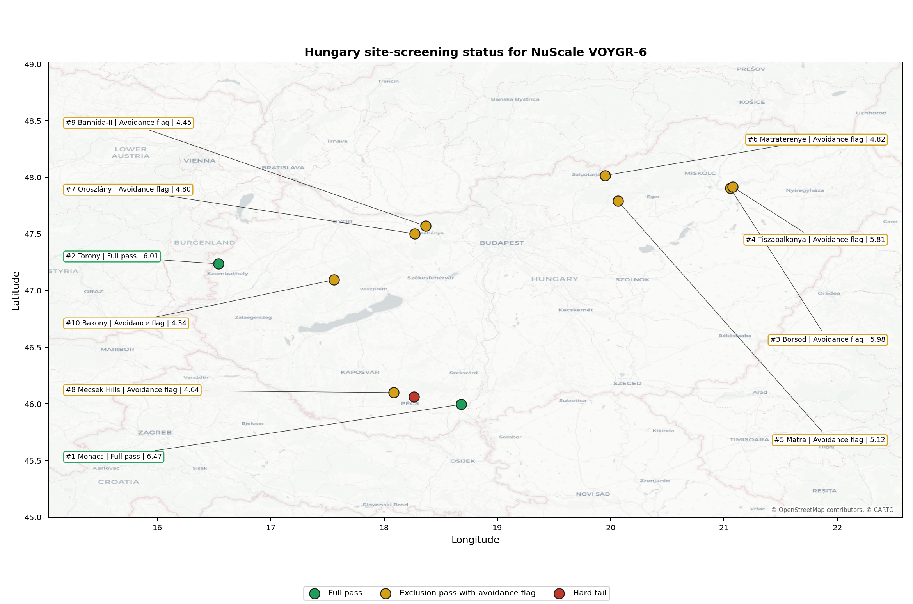
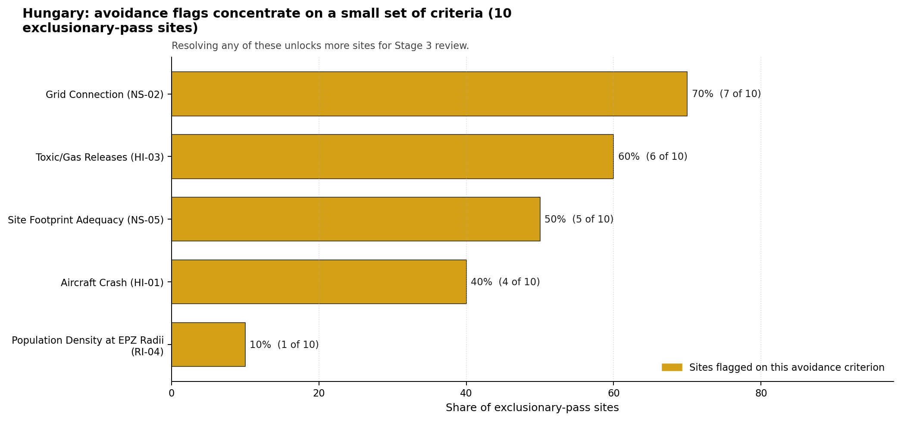
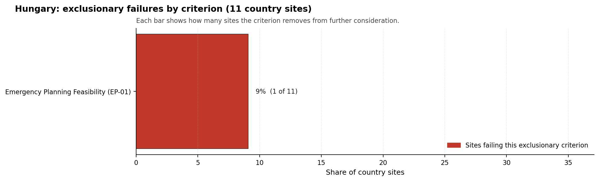

# Hungary Country Profile

Analytical basis: scoring `score-214bab4e` and sensitivity `sens-7b609bd0`.

Hungary has 11 thermal and coal-site records that have been tested against the NuScale VOYGR-6 reference deployment envelope. 2 sites pass both the exclusionary and avoidance screens, 8 pass the exclusionary screen but retain avoidance flags, and 1 fail one or more exclusionary checks. The country is therefore not a single-site case, but only a small subset of the national site population currently clears the full screening pathway without a remediation step.

The leading site is **Mohacs power station**, with a composite score of 6.467 and a Monte Carlo interval of 4.619-6.887. Its national stability band is `A` with a national top-10% hit rate of 100%. The leader is therefore not only the current point-estimate front-runner; it is also a stable national candidate under the sensitivity treatment used for the report.

<!-- specialist key=country_exec scope=country country_code=HU bundle=HU_country_bundle.json status=filled by=cursor-agent filled_at=2026-05-03T11:20:21Z -->
Of 11 Hungarian thermal sites tested against the NuScale VOYGR-6 envelope, 2 clear both the exclusionary and avoidance screens, 8 pass exclusionary but carry avoidance flags, and 1 is removed at the exclusionary stage on Emergency Planning Feasibility (EP-01). Mohacs power station leads in band A with a 100 % top-10 % hit rate, a composite score of 6.467, and a 1 200 MW coal-fleet inheritance footprint; Torony power station is the second fully clear candidate at composite 6.010 in band D. The leadership pool is small but real, sufficient for a two-site initial programme rather than a one-site exercise.

The avoidance unlock pool is large and remediable. **Grid Connection (NS-02)** carries 7 of the 10 exclusionary-pass sites with composite scores (70 %); closing it is a transmission-corridor study coordinated with MAVIR. **Toxic/Gas Releases (HI-03)** carries 6 sites (60 %) and is closable by refreshing the local industrial inventory and updating the Major Accident Hazards register. **Site Footprint Adequacy (NS-05)** carries 5 sites (50 %) and is closable through a parcel-by-parcel land-acquisition assessment against the buildable hectares the NuScale VOYGR-6 nuclear-island envelope requires. Closing all three would lift several band-D sites into a clear-pass status.

The greenfield lever is available but unlikely to be needed before the brownfield pool is exhausted; the inherited grid, water, and workforce assets at the existing thermal stations remain the strongest reason to lead with the brownfield list. A credible Stage 3 sequence begins with Mohacs power station as the lead site, with Torony power station as the fast follower, and a third wave drawn from the band-C and band-D candidates dependent on resolving NS-02, HI-03, and NS-05 in parallel as a national programme.
<!-- /specialist key=country_exec -->

Interactive review map with marker tooltips: [HU_site_status_map.html](figures/HU_site_status_map.html).

## Hungary Site Ledger

| Rank | Site | Status | Composite | MC Low | MC High | Band | Top-10 Hit | Coverage |
|---:|---|---|---:|---:|---:|---|---:|---:|
| 1 | Mohacs power station | Full pass | 6.467 | 4.619 | 6.887 | A | 100% | 42% |
| 2 | Torony power station | Full pass | 6.010 | 4.339 | 6.396 | D | 6% | 42% |
| 3 | Borsod power station | Exclusion pass with avoidance flag | 5.976 | 4.390 | 6.396 | C | 56% | 42% |
| 4 | Tiszapalkonya power station | Exclusion pass with avoidance flag | 5.807 | 4.311 | 6.302 | D | 0% | 42% |
| 5 | Matra power station | Exclusion pass with avoidance flag | 5.123 | 3.991 | 5.509 | H | 0% | 42% |
| 6 | Matraterenye power station | Exclusion pass with avoidance flag | 4.817 | 3.808 | 5.307 | H | 0% | 42% |
| 7 | Oroszlány power station | Exclusion pass with avoidance flag | 4.802 | 3.841 | 5.189 | H | 0% | 42% |
| 8 | Mecsek Hills power station | Exclusion pass with avoidance flag | 4.637 | 3.764 | 5.090 | H | 0% | 42% |
| 9 | Banhida-II power station | Exclusion pass with avoidance flag | 4.448 | 3.676 | 4.868 | H | 0% | 42% |
| 10 | Bakony power station | Exclusion pass with avoidance flag | 4.338 | 3.637 | 4.704 | H | 0% | 45% |
| - | Pecs power station | Hard fail | - | - | - | - | - | 0% |

## Avoidance Flag Pareto

Of the 10 sites that pass the exclusionary screen, the avoidance-phase flags concentrate on a small set of criteria. Resolving them is what would move the country from a small leading group to a broader candidate pool.

- **Grid Connection (NS-02)** - 7 of 10 exclusionary-pass sites (70%).
- **Toxic/Gas Releases (HI-03)** - 6 of 10 exclusionary-pass sites (60%).
- **Site Footprint Adequacy (NS-05)** - 5 of 10 exclusionary-pass sites (50%).
- **Aircraft Crash (HI-01)** - 4 of 10 exclusionary-pass sites (40%).
- **Population Density at EPZ Radii (RI-04)** - 1 of 10 exclusionary-pass sites (10%).

## Exclusionary Failure Pareto

The exclusionary failures across the country trace back to a small number of criteria. They identify which screening checks are responsible for removing sites from further consideration.

- **Emergency Planning Feasibility (EP-01)** - 1 of 11 country sites (9%).

## Family Strength and Weakness

Across the country the strongest criterion family is **Natural Hazards** at a mean normalised score of 6.43/10. The weakest family is **Human-Induced Hazards** at 3.36/10. The bottom three individual criteria across the country are:

- **Military Installations (HI-06)** - mean 1.91/10 across 11 scored sites (min 0.0, max 3.5).
- **Toxic/Gas Releases (HI-03)** - mean 3.36/10 across 11 scored sites (min 0.0, max 7.5).
- **Grid Capacity Basic Filter (BF-01)** - mean 3.55/10 across 11 scored sites (min 0.0, max 7.5).

## Interpretation for Site Selection

The Hungary result shows a clear separation between sites that can support further Stage 3 consideration and sites that should remain in the evidence base only as comparators. The full-pass group is the relevant pool for progression. Avoidance-flag sites are not discarded, but they identify locations where a specific constraint must be resolved before the site can be treated as equivalent to the leading group.

The chart shows where focused remediation effort would broaden the candidate pool. The criteria at the top of the Pareto are the policy and engineering levers that, if resolved, move avoidance-flag sites into the leading group.

An IAEA-style reading of the table focuses less on the exact rank number and more on screening class, score stability, and the nature of remaining uncertainty. **Mohacs power station** is important because it leads nationally, sits inside the strongest stability band, and retains a full-pass status. That does not establish final site suitability. It is a defensible reason to spend Stage 3 effort on field confirmation, national data review, and stakeholder engagement before lower-ranked or avoidance-flag locations.

The Monte Carlo interval is a caution against false precision: several sites have overlapping score bands, so small score differences should not be overinterpreted. The decisive distinction is whether a site combines acceptable exclusionary performance with a stable ranking position and no unresolved avoidance flag.

The main Stage 3 questions are therefore targeted rather than generic: confirm local natural-hazard inputs, verify emergency-planning assumptions, test land and ownership constraints, assess cooling and grid interface conditions, and reconcile environmental constraints with national permitting requirements.

## Status Counts

- Full pass: 2
- Exclusion pass with avoidance flag: 8
- Hard fail: 1
