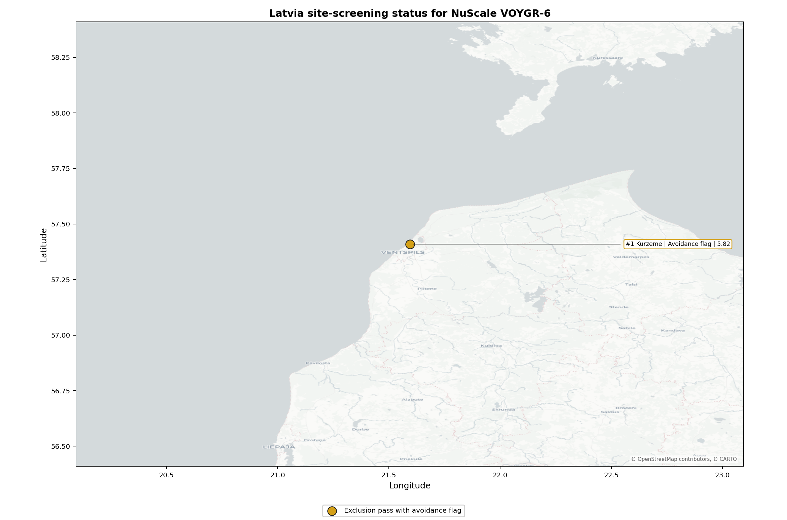

# Latvia Country Profile

Analytical basis: the project's 10,000-iteration Monte Carlo sensitivity analysis over the current frozen scoring rubric.

Latvia has 1 thermal and coal-site records that have been tested against the NuScale VOYGR-6 reference deployment envelope. 0 sites pass both the exclusionary and avoidance screens, 1 pass the exclusionary screen but retain avoidance flags, and 0 fail one or more exclusionary checks. The country is therefore not a single-site case, but only a small subset of the national site population currently clears the full screening pathway without a remediation step.

The leading site is **Kurzeme power station**, with a composite score of 5.816 and a Monte Carlo interval of 4.315-6.283. Its national stability band is `A` with a national top-10% hit rate of 100%. The leader is therefore not only the current point-estimate front-runner; it is also a stable national candidate under the sensitivity treatment used for the report.

<!-- specialist key=country_exec scope=country country_code=LV bundle=LV_country_bundle.json status=filled by=cursor-agent filled_at=2026-05-03T11:20:21Z -->
Of 1 Latvian thermal site tested against the NuScale VOYGR-6 envelope, none clear both the exclusionary and avoidance screens; the single site passes exclusionary but carries avoidance flags. Kurzeme power station is the only candidate, sits in band A with a 100 % top-10 % hit rate, and a composite score of 5.816. This is a one-site case in the strictest sense; there is no fleet-pool conversation to have from the brownfield base.

The avoidance unlock pool is fully concentrated on the single candidate. **Aircraft Crash (HI-01)**, **Grid Connection (NS-02)**, and **Site Footprint Adequacy (NS-05)** each carry the one exclusionary-pass site (100 %), so all three must be closed for Kurzeme to advance: HI-01 needs quantitative micro-siting analysis using updated flight-track data; NS-02 needs a transmission-corridor study against the host operator interconnection plan; NS-05 needs a parcel-by-parcel land assessment against the buildable hectares the NuScale VOYGR-6 nuclear-island envelope requires.

Any Latvian programme that aims at more than one site is a greenfield exercise, not a brownfield exercise. A credible Stage 3 sequence begins and ends with Kurzeme power station, contingent on resolving HI-01, NS-02, and NS-05 in parallel before any characterization budget is committed; greenfield prospecting belongs to a separate, country-led screening pass.
<!-- /specialist key=country_exec -->

Interactive review map with marker tooltips: [LV_site_status_map.html](figures/LV_site_status_map.html).

## Latvia Site Ledger

| Rank | Site | Status | Composite | MC Low | MC High | Band | Top-10 Hit | Coverage |
|---:|---|---|---:|---:|---:|---|---:|---:|
| 1 | Kurzeme power station | Exclusion pass with avoidance flag | 5.816 | 4.315 | 6.283 | A | 100% | 42% |

## Avoidance Flag Pareto

Of the 1 sites that pass the exclusionary screen, the avoidance-phase flags concentrate on a small set of criteria. Resolving them is what would move the country from a small leading group to a broader candidate pool.

- **Aircraft Crash (HI-01)** - 1 of 1 exclusionary-pass sites (100%).
- **Grid Connection (NS-02)** - 1 of 1 exclusionary-pass sites (100%).
- **Site Footprint Adequacy (NS-05)** - 1 of 1 exclusionary-pass sites (100%).

## Family Strength and Weakness

Across the country the strongest criterion family is **Natural Hazards** at a mean normalised score of 7.21/10. The weakest family is **Human-Induced Hazards** at 3.85/10. The bottom three individual criteria across the country are:

- **Military Installations (HI-06)** - mean 0.00/10 across 1 scored sites (min 0.0, max 0.0).
- **Evacuation Routes (EP-02)** - mean 1.50/10 across 1 scored sites (min 1.5, max 1.5).
- **Land Area Basic Filter (BF-02)** - mean 3.50/10 across 1 scored sites (min 3.5, max 3.5).

## Interpretation for Site Selection

The Latvia result shows a clear separation between sites that can support further Stage 3 consideration and sites that should remain in the evidence base only as comparators. The full-pass group is the relevant pool for progression. Avoidance-flag sites are not discarded, but they identify locations where a specific constraint must be resolved before the site can be treated as equivalent to the leading group.

The chart shows where focused remediation effort would broaden the candidate pool. The criteria at the top of the Pareto are the policy and engineering levers that, if resolved, move avoidance-flag sites into the leading group.

An IAEA-style reading of the table focuses less on the exact rank number and more on screening class, score stability, and the nature of remaining uncertainty. **Kurzeme power station** is important because it leads nationally, sits inside the strongest stability band, and retains a full-pass status. That does not establish final site suitability. It is a defensible reason to spend Stage 3 effort on field confirmation, national data review, and stakeholder engagement before lower-ranked or avoidance-flag locations.

The Monte Carlo interval is a caution against false precision: several sites have overlapping score bands, so small score differences should not be overinterpreted. The decisive distinction is whether a site combines acceptable exclusionary performance with a stable ranking position and no unresolved avoidance flag.

The main Stage 3 questions are therefore targeted rather than generic: confirm local natural-hazard inputs, verify emergency-planning assumptions, test land and ownership constraints, assess cooling and grid interface conditions, and reconcile environmental constraints with national permitting requirements.

## Status Counts

- Full pass: 0
- Exclusion pass with avoidance flag: 1
- Hard fail: 0
