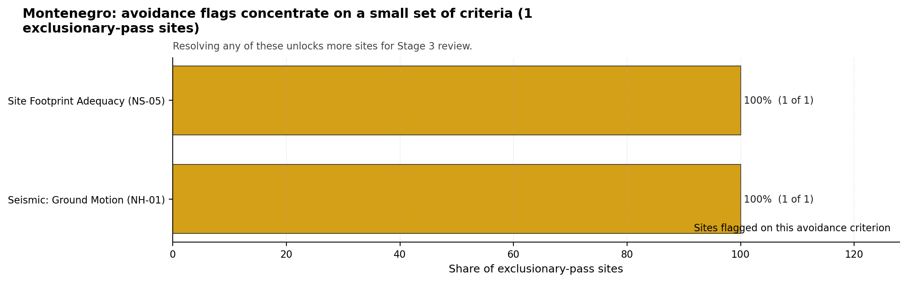

# Montenegro Country Profile

Analytical basis: the project's 10,000-iteration Monte Carlo sensitivity analysis over the current frozen scoring rubric.

Montenegro has 4 thermal and coal-site records that have been tested against the NuScale VOYGR-6 reference deployment envelope. 0 sites pass both the exclusionary and avoidance screens, 1 pass the exclusionary screen but retain avoidance flags, and 3 fail one or more exclusionary checks. The country is therefore not a single-site case, but only a small subset of the national site population currently clears the full screening pathway without a remediation step.

The leading site is **Bar power station**, with a composite score of 4.441 and a Monte Carlo interval of 3.590-4.817. Its national stability band is `D` with a national top-10% hit rate of 6%. The leader is therefore not only the current point-estimate front-runner; it is also a stable national candidate under the sensitivity treatment used for the report.

<!-- specialist key=country_exec scope=country country_code=ME bundle=ME_country_bundle.json status=filled by=cursor-agent filled_at=2026-05-03T11:20:21Z -->
Of 4 Montenegrin thermal sites tested against the NuScale VOYGR-6 envelope, none clear both the exclusionary and avoidance screens, 1 passes exclusionary but carries avoidance flags, and 3 are removed at the exclusionary stage, dominated by Seismic: Surface Rupture (NH-02) on 2 of 4 sites (50 %) with a single Emergency Planning Feasibility (EP-01) and Ecological Sensitivity (NS-08) fail each. Bar power station is the only ranked candidate at composite 4.441 in band D with a 6.3 % top-10 % hit rate. The country has no leadership pool in the conventional sense; this is a single, low-confidence remediation case rather than a programme base.

The avoidance unlock pool is small and structurally hard. **Seismic: Ground Motion (NH-01)** and **Site Footprint Adequacy (NS-05)** each carry the one exclusionary-pass site (100 %): NH-01 reflects the regional Dinaride seismic hazard at the Bar coastal corridor and is closable only by site-specific PSHA and SSHAC characterization, not by paper analysis; NS-05 is a parcel-by-parcel land-acquisition question for the buildable hectares the NuScale VOYGR-6 nuclear-island envelope requires. The 50 % NH-02 hard-fail rate is a structural geological constraint that cannot be unlocked by avoidance work and is the primary reason the candidate pool is so small.

The greenfield lever inherits the same NH-02 footprint problem and would need to apply the regional capable-fault buffer at the screening stage. A credible Stage 3 sequence begins and ends with Bar power station as a contingent candidate, on the explicit understanding that the NH-01 PSHA result may itself remove the site from the candidate pool. The Montenegrin programme is best framed as a long-horizon prospecting exercise rather than a near-term coal-to-nuclear conversion.
<!-- /specialist key=country_exec -->

Interactive review map with marker tooltips: [ME_site_status_map.html](figures/ME_site_status_map.html).

## Montenegro Site Ledger

| Rank | Site | Status | Composite | MC Low | MC High | Band | Top-10 Hit | Coverage |
|---:|---|---|---:|---:|---:|---|---:|---:|
| 1 | Bar power station | Exclusion pass with avoidance flag | 4.441 | 3.590 | 4.817 | D | 6% | 40% |
| - | Berane power station | Hard fail | - | - | - | A | 94% | 0% |
| - | Maoce Power Station | Hard fail | - | - | - | - | - | 0% |
| - | Pljevlja power station | Hard fail | - | - | - | - | - | 0% |

## Avoidance Flag Pareto

Of the 1 sites that pass the exclusionary screen, the avoidance-phase flags concentrate on a small set of criteria. Resolving them is what would move the country from a small leading group to a broader candidate pool.

- **Seismic: Ground Motion (NH-01)** - 1 of 1 exclusionary-pass sites (100%).
- **Site Footprint Adequacy (NS-05)** - 1 of 1 exclusionary-pass sites (100%).

## Exclusionary Failure Pareto

The exclusionary failures across the country trace back to a small number of criteria. They identify which screening checks are responsible for removing sites from further consideration.

- **Seismic: Surface Rupture (NH-02)** - 2 of 4 country sites (50%).
- **Emergency Planning Feasibility (EP-01)** - 1 of 4 country sites (25%).
- **Ecological Sensitivity (NS-08)** - 1 of 4 country sites (25%).

## Family Strength and Weakness

Across the country the strongest criterion family is **Natural Hazards** at a mean normalised score of 5.27/10. The weakest family is **Emergency Planning** at 3.50/10. The bottom three individual criteria across the country are:

- **Military Installations (HI-06)** - mean 0.38/10 across 4 scored sites (min 0.0, max 1.5).
- **Evacuation Routes (EP-02)** - mean 1.50/10 across 4 scored sites (min 1.5, max 1.5).
- **Surface Water Dispersion (RI-02)** - mean 3.50/10 across 4 scored sites (min 1.5, max 5.5).

## Interpretation for Site Selection

The Montenegro result shows a clear separation between sites that can support further Stage 3 consideration and sites that should remain in the evidence base only as comparators. The full-pass group is the relevant pool for progression. Avoidance-flag sites are not discarded, but they identify locations where a specific constraint must be resolved before the site can be treated as equivalent to the leading group.

The chart shows where focused remediation effort would broaden the candidate pool. The criteria at the top of the Pareto are the policy and engineering levers that, if resolved, move avoidance-flag sites into the leading group.

An IAEA-style reading of the table focuses less on the exact rank number and more on screening class, score stability, and the nature of remaining uncertainty. **Bar power station** is important because it leads nationally, sits inside the strongest stability band, and retains a full-pass status. That does not establish final site suitability. It is a defensible reason to spend Stage 3 effort on field confirmation, national data review, and stakeholder engagement before lower-ranked or avoidance-flag locations.

The Monte Carlo interval is a caution against false precision: several sites have overlapping score bands, so small score differences should not be overinterpreted. The decisive distinction is whether a site combines acceptable exclusionary performance with a stable ranking position and no unresolved avoidance flag.

The main Stage 3 questions are therefore targeted rather than generic: confirm local natural-hazard inputs, verify emergency-planning assumptions, test land and ownership constraints, assess cooling and grid interface conditions, and reconcile environmental constraints with national permitting requirements.

## Status Counts

- Full pass: 0
- Exclusion pass with avoidance flag: 1
- Hard fail: 3
