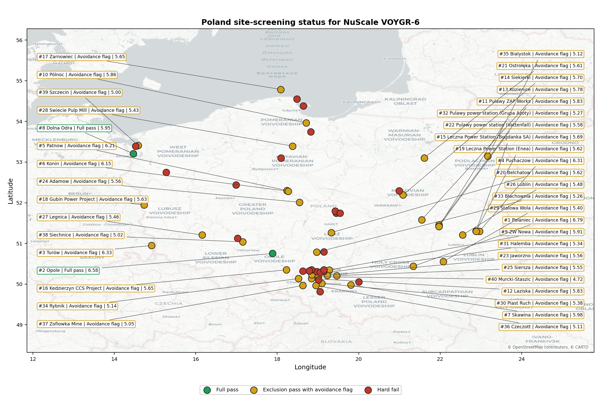
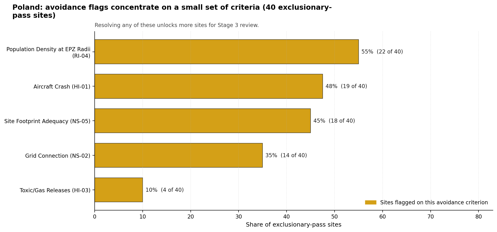

# Poland Country Profile

Analytical basis: scoring `score-214bab4e` and sensitivity `sens-7b609bd0`.

Poland has 63 thermal and coal-site records that have been tested against the NuScale VOYGR-6 reference deployment envelope. 2 sites pass both the exclusionary and avoidance screens, 38 pass the exclusionary screen but retain avoidance flags, and 23 fail one or more exclusionary checks. The country is therefore not a single-site case, but only a small subset of the national site population currently clears the full screening pathway without a remediation step.

The leading site is **Polaniec power station**, with a composite score of 6.788 and a Monte Carlo interval of 4.769-7.208. Its national stability band is `A` with a national top-10% hit rate of 100%. The leader is therefore not only the current point-estimate front-runner; it is also a stable national candidate under the sensitivity treatment used for the report.

<!-- specialist key=country_exec scope=country country_code=PL bundle=PL_country_bundle.json status=filled by=cursor-agent filled_at=2026-05-03T11:20:21Z -->
Of 63 Polish thermal sites tested against the NuScale VOYGR-6 envelope, 2 clear both the exclusionary and avoidance screens, 38 pass exclusionary but carry avoidance flags, and 23 are removed at the exclusionary stage, dominated by Emergency Planning Feasibility (EP-01) on 22 of 63 sites (35 %) with a single Ecological Sensitivity (NS-08) fail. Opole power station leads in band A with a 100 % top-10 % hit rate, a composite score of 6.580, and a 3 332 MW coal-fleet inheritance footprint; Dolna Odra power station is the second fully clear candidate at composite 5.948 in band B with a 1 792 MW footprint. Poland has the largest brownfield candidate pool in the region and is the only country where a multi-site fleet plan is supported directly by the screening evidence.

The avoidance unlock pool is broad and remediable. **Population Density at EPZ Radii (RI-04)** carries 22 of the 40 exclusionary-pass scored sites (55 %); closing it is a refresh of the EPZ population model at the actual NuScale VOYGR-6 emergency-planning zone radius rather than the conservative screening radius, which is a desk-based exercise. **Aircraft Crash (HI-01)** carries 19 sites (48 %) and is closable through quantitative micro-siting analysis using updated flight-track data. **Site Footprint Adequacy (NS-05)** carries 18 sites (45 %) and is closable through parcel-by-parcel land assessments. The 35 % EP-01 hard-fail rate is the structural constraint that limits how far the unlock pool can grow.

The greenfield lever is unlikely to be needed for an initial fleet plan; the brownfield candidate pool is large enough to support a four-to-six-site programme on its own, and the inherited grid, water, and workforce assets at the existing thermal stations remain the strongest reason to lead with the brownfield list. A credible Stage 3 sequence begins with Opole power station as the lead site, with Dolna Odra power station as the fast follower, and a third wave drawn from the band-B and band-D pool dependent on resolving RI-04 and HI-01 in parallel as a national programme.
<!-- /specialist key=country_exec -->

Interactive review map with marker tooltips: [PL_site_status_map.html](figures/PL_site_status_map.html).

## Poland Site Ledger

| Rank | Site | Status | Composite | MC Low | MC High | Band | Top-10 Hit | Coverage |
|---:|---|---|---:|---:|---:|---|---:|---:|
| 1 | Polaniec power station | Exclusion pass with avoidance flag | 6.788 | 4.769 | 7.208 | A | 100% | 42% |
| 2 | Opole power station | Full pass | 6.580 | 4.672 | 7.075 | A | 100% | 42% |
| 3 | Turów power station | Exclusion pass with avoidance flag | 6.333 | 4.454 | 6.828 | B | 94% | 40% |
| 4 | Puchaczow power station | Exclusion pass with avoidance flag | 6.307 | 4.544 | 6.698 | B | 100% | 42% |
| 5 | Patnow power station | Exclusion pass with avoidance flag | 6.212 | 4.401 | 6.707 | D | 6% | 40% |
| 6 | Konin power station | Exclusion pass with avoidance flag | 6.152 | 4.374 | 6.646 | B | 88% | 40% |
| 7 | Skawina power station | Exclusion pass with avoidance flag | 5.976 | 4.390 | 6.396 | C | 75% | 42% |
| 8 | Dolna Odra power station | Full pass | 5.948 | 4.377 | 6.415 | B | 88% | 42% |
| 9 | ZW Nowa power station | Exclusion pass with avoidance flag | 5.913 | 4.553 | 6.298 | D | 0% | 50% |
| 10 | Pólnoc power station | Exclusion pass with avoidance flag | 5.863 | 4.337 | 6.358 | D | 0% | 42% |
| 11 | Pulawy ZAP Works power station | Exclusion pass with avoidance flag | 5.835 | 4.324 | 6.302 | C | 69% | 42% |
| 12 | Laziska power station | Exclusion pass with avoidance flag | 5.829 | 4.346 | 6.222 | H | 0% | 45% |
| 13 | Kozienice power station | Exclusion pass with avoidance flag | 5.782 | 4.324 | 6.204 | D | 12% | 45% |
| 14 | Siekierki power station | Exclusion pass with avoidance flag | 5.697 | 4.176 | 6.162 | D | 6% | 40% |
| 15 | Leczna Power Station (Bogdanka SA) | Exclusion pass with avoidance flag | 5.694 | 4.282 | 6.259 | H | 0% | 45% |
| 16 | Kedzierzyn CCS Project | Exclusion pass with avoidance flag | 5.653 | 4.181 | 6.040 | H | 0% | 42% |
| 17 | Zarnowiec power station | Exclusion pass with avoidance flag | 5.652 | 4.308 | 6.143 | D | 0% | 45% |
| 18 | Gubin Power Project | Exclusion pass with avoidance flag | 5.631 | 4.148 | 6.081 | D | 0% | 40% |
| 19 | Leczna Power Station (Enea) | Exclusion pass with avoidance flag | 5.623 | 4.225 | 6.189 | H | 0% | 42% |
| 20 | Belchatow power station | Exclusion pass with avoidance flag | 5.621 | 4.143 | 5.980 | H | 0% | 40% |
| 21 | Ostrołęka power station | Exclusion pass with avoidance flag | 5.606 | 4.240 | 6.074 | D | 0% | 45% |
| 22 | Pulawy power station (Vattenfall) | Exclusion pass with avoidance flag | 5.575 | 4.203 | 6.038 | H | 0% | 42% |
| 23 | Jaworzno power station | Exclusion pass with avoidance flag | 5.562 | 4.366 | 5.967 | H | 0% | 50% |
| 24 | Adamow power station | Exclusion pass with avoidance flag | 5.556 | 4.115 | 5.939 | H | 0% | 40% |
| 25 | Siersza power station | Exclusion pass with avoidance flag | 5.546 | 4.335 | 5.950 | H | 0% | 48% |
| 26 | Lublin Power Station | Exclusion pass with avoidance flag | 5.481 | 4.181 | 5.852 | H | 0% | 45% |
| 27 | Legnica Power Station | Exclusion pass with avoidance flag | 5.462 | 4.150 | 5.830 | H | 0% | 42% |
| 28 | Swiecie Pulp Mill power station | Exclusion pass with avoidance flag | 5.434 | 4.062 | 5.899 | G | 0% | 40% |
| 29 | Stalowa Wola power station | Exclusion pass with avoidance flag | 5.396 | 4.119 | 5.830 | H | 0% | 42% |
| 30 | Piast Ruch Power Station | Exclusion pass with avoidance flag | 5.384 | 4.040 | 5.798 | H | 0% | 40% |
| 31 | Halemba power station | Exclusion pass with avoidance flag | 5.344 | 4.095 | 5.736 | H | 0% | 42% |
| 32 | Pulawy power station (Grupa Azoty) | Exclusion pass with avoidance flag | 5.274 | 4.062 | 5.736 | H | 0% | 42% |
| 33 | Blachownia power station | Exclusion pass with avoidance flag | 5.259 | 4.055 | 5.679 | H | 0% | 42% |
| 34 | Rybnik power station | Exclusion pass with avoidance flag | 5.142 | 4.000 | 5.509 | H | 0% | 42% |
| 35 | Bialystok power station | Exclusion pass with avoidance flag | 5.118 | 3.989 | 5.509 | H | 0% | 42% |
| 36 | Czeczott power station | Exclusion pass with avoidance flag | 5.106 | 4.002 | 5.500 | H | 0% | 45% |
| 37 | Zofiowka Mine power station | Exclusion pass with avoidance flag | 5.047 | 3.956 | 5.415 | H | 0% | 42% |
| 38 | Siechnice power station | Exclusion pass with avoidance flag | 5.020 | 3.881 | 5.434 | H | 0% | 40% |
| 39 | Szczecin power station | Exclusion pass with avoidance flag | 5.005 | 3.936 | 5.396 | H | 0% | 42% |
| 40 | Murcki-Staszic power station | Exclusion pass with avoidance flag | 4.722 | 3.804 | 5.113 | H | 0% | 42% |
| - | Bedzin power station | Hard fail | - | - | - | - | - | 0% |
| - | Bielsko-Biala power station | Hard fail | - | - | - | - | - | 0% |
| - | Bydgoszcz power station | Hard fail | - | - | - | - | - | 0% |
| - | Chorzow Elcho power station | Hard fail | - | - | - | - | - | 0% |
| - | Czestochowa CHP power station | Hard fail | - | - | - | H | 0% | 0% |
| - | Gdansk-2 power station | Hard fail | - | - | - | - | - | 0% |
| - | Gdynia-3 power station | Hard fail | - | - | - | H | 0% | 0% |
| - | Gliwice Works power station | Hard fail | - | - | - | - | - | 0% |
| - | Gorzow power station | Hard fail | - | - | - | G | 0% | 0% |
| - | Katowice PKE power station | Hard fail | - | - | - | - | - | 0% |
| - | Krakow-Leg power station | Hard fail | - | - | - | H | 0% | 0% |
| - | Lagisza power station | Hard fail | - | - | - | - | - | 0% |
| - | Lodz-2 power station | Hard fail | - | - | - | H | 0% | 0% |
| - | Lodz-3 power station | Hard fail | - | - | - | H | 0% | 0% |
| - | Lodz-4 power station | Hard fail | - | - | - | D | 0% | 0% |
| - | Miechowice power station | Hard fail | - | - | - | - | - | 0% |
| - | Opalenie power station | Hard fail | - | - | - | B | 88% | 0% |
| - | Pomorzany power station | Hard fail | - | - | - | - | - | 0% |
| - | Poznan Karolin power station | Hard fail | - | - | - | H | 0% | 0% |
| - | Tychy power station | Hard fail | - | - | - | - | - | 0% |
| - | Wroclaw power station | Hard fail | - | - | - | H | 0% | 0% |
| - | Zabrze power station | Hard fail | - | - | - | - | - | 0% |
| - | Zeran power station | Hard fail | - | - | - | - | - | 0% |

## Avoidance Flag Pareto

Of the 40 sites that pass the exclusionary screen, the avoidance-phase flags concentrate on a small set of criteria. Resolving them is what would move the country from a small leading group to a broader candidate pool.

- **Population Density at EPZ Radii (RI-04)** - 22 of 40 exclusionary-pass sites (55%).
- **Aircraft Crash (HI-01)** - 19 of 40 exclusionary-pass sites (48%).
- **Site Footprint Adequacy (NS-05)** - 18 of 40 exclusionary-pass sites (45%).
- **Grid Connection (NS-02)** - 14 of 40 exclusionary-pass sites (35%).
- **Toxic/Gas Releases (HI-03)** - 4 of 40 exclusionary-pass sites (10%).

## Exclusionary Failure Pareto

The exclusionary failures across the country trace back to a small number of criteria. They identify which screening checks are responsible for removing sites from further consideration.

- **Emergency Planning Feasibility (EP-01)** - 22 of 63 country sites (35%).
- **Ecological Sensitivity (NS-08)** - 1 of 63 country sites (2%).

## Family Strength and Weakness

Across the country the strongest criterion family is **Natural Hazards** at a mean normalised score of 6.99/10. The weakest family is **Human-Induced Hazards** at 3.92/10. The bottom three individual criteria across the country are:

- **Military Installations (HI-06)** - mean 0.53/10 across 63 scored sites (min 0.0, max 3.5).
- **Population Density at EPZ Radii (RI-04)** - mean 2.45/10 across 63 scored sites (min 1.5, max 5.5).
- **Special Populations (EP-04)** - mean 3.15/10 across 63 scored sites (min 1.5, max 7.5).

## Interpretation for Site Selection

The Poland result shows a clear separation between sites that can support further Stage 3 consideration and sites that should remain in the evidence base only as comparators. The full-pass group is the relevant pool for progression. Avoidance-flag sites are not discarded, but they identify locations where a specific constraint must be resolved before the site can be treated as equivalent to the leading group.

The chart shows where focused remediation effort would broaden the candidate pool. The criteria at the top of the Pareto are the policy and engineering levers that, if resolved, move avoidance-flag sites into the leading group.

An IAEA-style reading of the table focuses less on the exact rank number and more on screening class, score stability, and the nature of remaining uncertainty. **Polaniec power station** is important because it leads nationally, sits inside the strongest stability band, and retains a full-pass status. That does not establish final site suitability. It is a defensible reason to spend Stage 3 effort on field confirmation, national data review, and stakeholder engagement before lower-ranked or avoidance-flag locations.

The Monte Carlo interval is a caution against false precision: several sites have overlapping score bands, so small score differences should not be overinterpreted. The decisive distinction is whether a site combines acceptable exclusionary performance with a stable ranking position and no unresolved avoidance flag.

The main Stage 3 questions are therefore targeted rather than generic: confirm local natural-hazard inputs, verify emergency-planning assumptions, test land and ownership constraints, assess cooling and grid interface conditions, and reconcile environmental constraints with national permitting requirements.

## Status Counts

- Full pass: 2
- Exclusion pass with avoidance flag: 38
- Hard fail: 23
