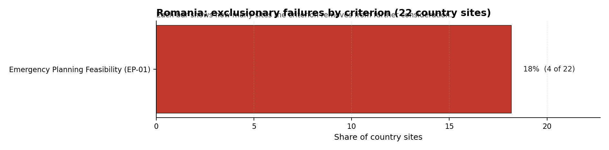

# Romania Country Profile

Analytical basis: the project's 10,000-iteration Monte Carlo sensitivity analysis over the current frozen scoring rubric.

Romania has 22 thermal and coal-site records that have been tested against the NuScale VOYGR-6 reference deployment envelope. 3 sites pass both the exclusionary and avoidance screens, 15 pass the exclusionary screen but retain avoidance flags, and 4 fail one or more exclusionary checks. The country is therefore not a single-site case, but only a small subset of the national site population currently clears the full screening pathway without a remediation step.

The leading site is **Turceni power station**, with a composite score of 6.347 and a Monte Carlo interval of 4.489-6.733. Its national stability band is `A` with a national top-10% hit rate of 100%. The leader is therefore not only the current point-estimate front-runner; it is also a stable national candidate under the sensitivity treatment used for the report.

<!-- specialist key=country_exec scope=country country_code=RO bundle=RO_country_bundle.json status=filled by=cursor-agent filled_at=2026-05-03T10:46:23Z -->
Of 22 Romanian coal and thermal sites tested against the NuScale VOYGR-6 envelope, 3 are full-pass leaders (Turceni, Rovinari and Brăila), 15 retain avoidance flags that are work items rather than exclusions, and 4 are removed at the exclusionary stage on Emergency Planning Feasibility. Turceni leads in band A with a 100 % top-10 % hit rate across the Monte Carlo sensitivity audit; Brăila follows in band B at 94 % and Rovinari in band D at 38 %. That distribution is enough to support an initial multi-site coal-to-nuclear programme rather than a single-site pilot, but it does not yet justify a full-fleet plan: only one site (Turceni) is unconditionally robust to weight choice, and the second-tier leaders both depend on family weights remaining close to baseline.

The avoidance-flag pool is dominated by three criteria that, if resolved through targeted policy and engineering work, materially expand the leadership pool. **Grid Connection (NS-02)** carries 61 % of the avoidance flags (11 of 18 exclusionary-pass sites): the underlying issue is that most Romanian coal sites are interconnected at 110 kV rather than the 220-400 kV typically preferred for new nuclear, so a Transelectrica corridor-by-corridor upgrade study is the single highest-leverage piece of unlock work. **Aircraft Crash (HI-01)** carries 44 % of the flags and **Population Density at EPZ Radii (RI-04)** carries 39 %; both are addressed through quantitative micro-siting analysis (precise flight-path conflict modelling and EPZ population-pressure modelling against national demographic trajectories) rather than fresh engineering. Resolving NS-02 and HI-01 together would convert most of the avoidance-flagged middle tier (the band D / H sites) into Stage 3-eligible candidates.

The greenfield lever is available but not necessary for an initial Romanian programme. The current brownfield leadership pool already covers the early VOYGR-6 build cadence the Coal-to-Nuclear strategy implies, and the inherited grid, water and workforce assets at Turceni, Brăila and Rovinari materially shorten Stage 3 site preparation. A credible Stage 3 sequence begins with Turceni as the lead site, with Brăila as a fast follower (band B, 94 % hit rate, water access on the Danube), and a third wave of two-to-three sites contingent on resolving the Grid Connection (NS-02) avoidance flag through the Transelectrica upgrade pathway. Greenfield options would only need to be added if the build-out plan exceeds five operating sites within the 2040s.
<!-- /specialist key=country_exec -->

Interactive review map with marker tooltips: [RO_site_status_map.html](figures/RO_site_status_map.html).

## Romania Site Ledger

| Rank | Site | Status | Composite | MC Low | MC High | Band | Top-10 Hit | Coverage |
|---:|---|---|---:|---:|---:|---|---:|---:|
| 1 | Turceni power station | Full pass | 6.347 | 4.489 | 6.733 | A | 100% | 42% |
| 2 | Rovinari power station | Full pass | 5.828 | 4.233 | 6.242 | D | 38% | 40% |
| 3 | Braila power station | Full pass | 5.819 | 4.341 | 6.241 | B | 94% | 45% |
| 4 | Romag Termo power station | Exclusion pass with avoidance flag | 5.440 | 4.161 | 5.833 | D | 12% | 45% |
| 5 | Giurgiu power station | Exclusion pass with avoidance flag | 5.388 | 4.178 | 5.786 | D | 0% | 45% |
| 6 | Mintia-Deva power station | Exclusion pass with avoidance flag | 5.330 | 4.088 | 5.698 | H | 0% | 42% |
| 7 | FPCU Feldioara | Exclusion pass with avoidance flag | 5.323 | 4.013 | 5.737 | H | 0% | 40% |
| 8 | Govora power station | Exclusion pass with avoidance flag | 5.317 | 4.031 | 5.782 | G | 0% | 42% |
| 9 | Suceava power station | Exclusion pass with avoidance flag | 5.307 | 4.077 | 5.698 | D | 6% | 42% |
| 10 | Isalnita power station | Exclusion pass with avoidance flag | 5.293 | 4.000 | 5.677 | D | 0% | 40% |
| 11 | Slatina power station | Exclusion pass with avoidance flag | 5.263 | 4.117 | 5.661 | D | 12% | 45% |
| 12 | Bacau CHP power station | Exclusion pass with avoidance flag | 5.091 | 3.912 | 5.475 | H | 0% | 40% |
| 13 | Arad power station | Exclusion pass with avoidance flag | 5.069 | 3.985 | 5.463 | H | 0% | 45% |
| 14 | Paroseni power station | Exclusion pass with avoidance flag | 4.822 | 3.811 | 5.287 | H | 0% | 42% |
| 15 | Doicesti power station | Exclusion pass with avoidance flag | 4.759 | 3.837 | 5.130 | H | 0% | 45% |
| 16 | Bucharest North East power station | Exclusion pass with avoidance flag | 4.708 | 3.813 | 5.056 | H | 0% | 45% |
| 17 | Târgu Jiu Thermal Plant | Exclusion pass with avoidance flag | 4.515 | 3.674 | 4.851 | H | 0% | 42% |
| 18 | Iasi-2 power station | Exclusion pass with avoidance flag | 4.344 | 3.628 | 4.736 | H | 0% | 42% |
| - | Brasov power station | Hard fail | - | - | - | - | - | 0% |
| - | Craiova II power station | Hard fail | - | - | - | H | 0% | 0% |
| - | Galati Power Station | Hard fail | - | - | - | H | 0% | 0% |
| - | Oradea power station | Hard fail | - | - | - | - | - | 0% |

## Avoidance Flag Pareto

Of the 18 sites that pass the exclusionary screen, the avoidance-phase flags concentrate on a small set of criteria. Resolving them is what would move the country from a small leading group to a broader candidate pool.

- **Grid Connection (NS-02)** - 11 of 18 exclusionary-pass sites (61%).
- **Aircraft Crash (HI-01)** - 8 of 18 exclusionary-pass sites (44%).
- **Population Density at EPZ Radii (RI-04)** - 7 of 18 exclusionary-pass sites (39%).
- **Site Footprint Adequacy (NS-05)** - 5 of 18 exclusionary-pass sites (28%).
- **Toxic/Gas Releases (HI-03)** - 4 of 18 exclusionary-pass sites (22%).

## Exclusionary Failure Pareto

The exclusionary failures across the country trace back to a small number of criteria. They identify which screening checks are responsible for removing sites from further consideration.

- **Emergency Planning Feasibility (EP-01)** - 4 of 22 country sites (18%).

## Family Strength and Weakness

Across the country the strongest criterion family is **Non-Safety / Implementation** at a mean normalised score of 6.34/10. The weakest family is **Human-Induced Hazards** at 3.40/10. The bottom three individual criteria across the country are:

- **Military Installations (HI-06)** - mean 0.20/10 across 22 scored sites (min 0.0, max 1.5).
- **Population Density at EPZ Radii (RI-04)** - mean 3.14/10 across 22 scored sites (min 1.5, max 7.5).
- **Grid Capacity Basic Filter (BF-01)** - mean 3.43/10 across 22 scored sites (min 0.0, max 7.5).

## Interpretation for Site Selection

The Romania result shows a clear separation between sites that can support further Stage 3 consideration and sites that should remain in the evidence base only as comparators. The full-pass group is the relevant pool for progression. Avoidance-flag sites are not discarded, but they identify locations where a specific constraint must be resolved before the site can be treated as equivalent to the leading group.

The chart shows where focused remediation effort would broaden the candidate pool. The criteria at the top of the Pareto are the policy and engineering levers that, if resolved, move avoidance-flag sites into the leading group.

An IAEA-style reading of the table focuses less on the exact rank number and more on screening class, score stability, and the nature of remaining uncertainty. **Turceni power station** is important because it leads nationally, sits inside the strongest stability band, and retains a full-pass status. That does not establish final site suitability. It is a defensible reason to spend Stage 3 effort on field confirmation, national data review, and stakeholder engagement before lower-ranked or avoidance-flag locations.

The Monte Carlo interval is a caution against false precision: several sites have overlapping score bands, so small score differences should not be overinterpreted. The decisive distinction is whether a site combines acceptable exclusionary performance with a stable ranking position and no unresolved avoidance flag.

The main Stage 3 questions are therefore targeted rather than generic: confirm local natural-hazard inputs, verify emergency-planning assumptions, test land and ownership constraints, assess cooling and grid interface conditions, and reconcile environmental constraints with national permitting requirements.

## Status Counts

These are the **country-level totals** across all 22 Romanian coal/thermal sites screened in this study (not the count appearing in the regional top-20 set in §4.1 Table 4.1.1, which is a different metric — Romania contributes 1 site to the regional top-20 because only Turceni clears the top-20 cut by composite score across the entire 23-country region; the 3 below are all Romanian sites that pass exclusionary screening, regardless of whether they enter the regional top-20).

- Full pass: 3 (Turceni, Rovinari, Brăila)
- Exclusion pass with avoidance flag: 15
- Hard fail: 4
