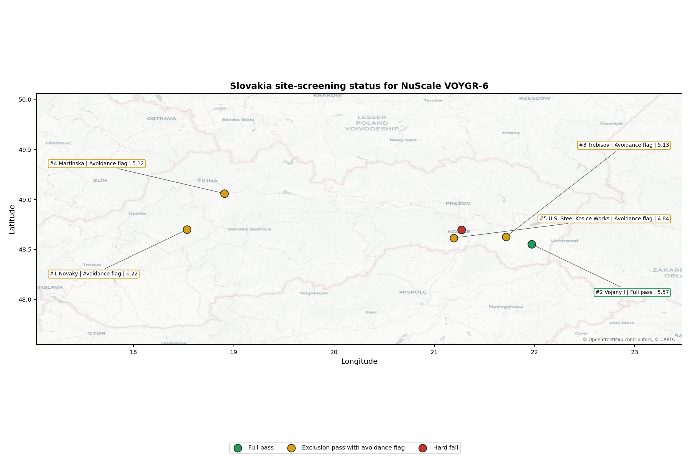
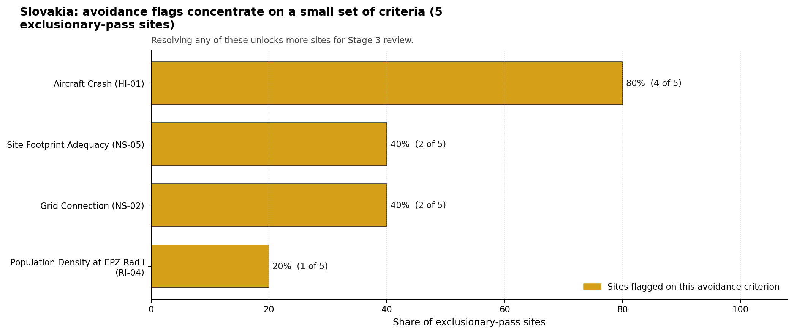
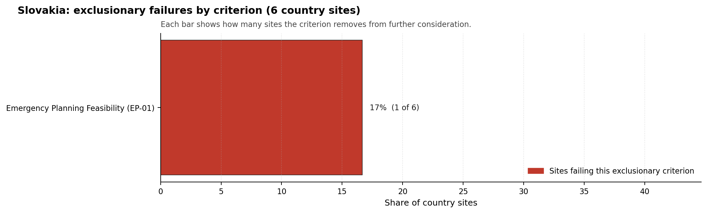

# Slovakia Country Profile

Analytical basis: scoring `score-214bab4e` and sensitivity `sens-7b609bd0`.

Slovakia has 6 thermal and coal-site records that have been tested against the NuScale VOYGR-6 reference deployment envelope. 1 sites pass both the exclusionary and avoidance screens, 4 pass the exclusionary screen but retain avoidance flags, and 1 fail one or more exclusionary checks. The country is therefore not a single-site case, but only a small subset of the national site population currently clears the full screening pathway without a remediation step.

The leading site is **Novaky power station**, with a composite score of 6.220 and a Monte Carlo interval of 4.291-6.593. Its national stability band is `A` with a national top-10% hit rate of 100%. The leader is therefore not only the current point-estimate front-runner; it is also a stable national candidate under the sensitivity treatment used for the report.

<!-- specialist key=country_exec scope=country country_code=SK bundle=SK_country_bundle.json status=filled by=cursor-agent filled_at=2026-05-03T11:20:21Z -->
Of 6 Slovak thermal sites tested against the NuScale VOYGR-6 envelope, 1 clears both the exclusionary and avoidance screens, 4 pass exclusionary but carry avoidance flags, and 1 is removed at the exclusionary stage on Emergency Planning Feasibility (EP-01). Vojany I power station is the single fully clear candidate at composite 5.571 in band D with a 660 MW coal-fleet inheritance footprint. The leadership pool is one stable site supported by an avoidance-clean profile but with a moderate rank-stability risk; this is best read as a one-site lead with a fast-follower watch list.

The avoidance unlock pool is concentrated. **Aircraft Crash (HI-01)** carries 4 of the 5 exclusionary-pass scored sites (80 %); closing it is a quantitative micro-siting analysis using updated flight-track data and approach-cone modelling against the 10 km screening radius. **Grid Connection (NS-02)** and **Site Footprint Adequacy (NS-05)** each carry 2 sites (40 %): NS-02 is closable through transmission-corridor upgrades coordinated with SEPS; NS-05 is closable through parcel-by-parcel land assessments. The 17 % EP-01 hard-fail rate accounts for the single exclusionary loss and is not amenable to avoidance remediation.

The greenfield lever is available but unlikely to be needed for an initial programme; the brownfield pool is small but workable. A credible Stage 3 sequence begins with Vojany I power station as the lead site, with the avoidance-flagged candidates as fast followers contingent on resolving HI-01 across the country in a single national programme rather than site by site.
<!-- /specialist key=country_exec -->

Interactive review map with marker tooltips: [SK_site_status_map.html](figures/SK_site_status_map.html).

## Slovakia Site Ledger

| Rank | Site | Status | Composite | MC Low | MC High | Band | Top-10 Hit | Coverage |
|---:|---|---|---:|---:|---:|---|---:|---:|
| 1 | Novaky power station | Exclusion pass with avoidance flag | 6.220 | 4.291 | 6.593 | A | 100% | 38% |
| 2 | Vojany I power station | Full pass | 5.571 | 4.031 | 5.978 | D | 0% | 38% |
| 3 | Trebisov power station | Exclusion pass with avoidance flag | 5.126 | 3.852 | 5.473 | H | 0% | 38% |
| 4 | Martinska power station | Exclusion pass with avoidance flag | 5.121 | 3.850 | 5.495 | H | 0% | 38% |
| 5 | U.S. Steel Kosice Works power station | Exclusion pass with avoidance flag | 4.841 | 3.738 | 5.187 | H | 0% | 38% |
| - | Kosice power station | Hard fail | - | - | - | - | - | 0% |

## Avoidance Flag Pareto

Of the 5 sites that pass the exclusionary screen, the avoidance-phase flags concentrate on a small set of criteria. Resolving them is what would move the country from a small leading group to a broader candidate pool.

- **Aircraft Crash (HI-01)** - 4 of 5 exclusionary-pass sites (80%).
- **Grid Connection (NS-02)** - 2 of 5 exclusionary-pass sites (40%).
- **Site Footprint Adequacy (NS-05)** - 2 of 5 exclusionary-pass sites (40%).
- **Population Density at EPZ Radii (RI-04)** - 1 of 5 exclusionary-pass sites (20%).

## Exclusionary Failure Pareto

The exclusionary failures across the country trace back to a small number of criteria. They identify which screening checks are responsible for removing sites from further consideration.

- **Emergency Planning Feasibility (EP-01)** - 1 of 6 country sites (17%).

## Family Strength and Weakness

Across the country the strongest criterion family is **Non-Safety / Implementation** at a mean normalised score of 8.06/10. The weakest family is **Human-Induced Hazards** at 2.46/10. The bottom three individual criteria across the country are:

- **Military Installations (HI-06)** - mean 0.25/10 across 6 scored sites (min 0.0, max 1.5).
- **Geotechnical: Foundation (NH-06)** - mean 2.42/10 across 6 scored sites (min 0.0, max 5.5).
- **Surface Water Dispersion (RI-02)** - mean 2.83/10 across 6 scored sites (min 1.5, max 5.5).

## Interpretation for Site Selection

The Slovakia result shows a clear separation between sites that can support further Stage 3 consideration and sites that should remain in the evidence base only as comparators. The full-pass group is the relevant pool for progression. Avoidance-flag sites are not discarded, but they identify locations where a specific constraint must be resolved before the site can be treated as equivalent to the leading group.

The chart shows where focused remediation effort would broaden the candidate pool. The criteria at the top of the Pareto are the policy and engineering levers that, if resolved, move avoidance-flag sites into the leading group.

An IAEA-style reading of the table focuses less on the exact rank number and more on screening class, score stability, and the nature of remaining uncertainty. **Novaky power station** is important because it leads nationally, sits inside the strongest stability band, and retains a full-pass status. That does not establish final site suitability. It is a defensible reason to spend Stage 3 effort on field confirmation, national data review, and stakeholder engagement before lower-ranked or avoidance-flag locations.

The Monte Carlo interval is a caution against false precision: several sites have overlapping score bands, so small score differences should not be overinterpreted. The decisive distinction is whether a site combines acceptable exclusionary performance with a stable ranking position and no unresolved avoidance flag.

The main Stage 3 questions are therefore targeted rather than generic: confirm local natural-hazard inputs, verify emergency-planning assumptions, test land and ownership constraints, assess cooling and grid interface conditions, and reconcile environmental constraints with national permitting requirements.

## Status Counts

- Full pass: 1
- Exclusion pass with avoidance flag: 4
- Hard fail: 1
