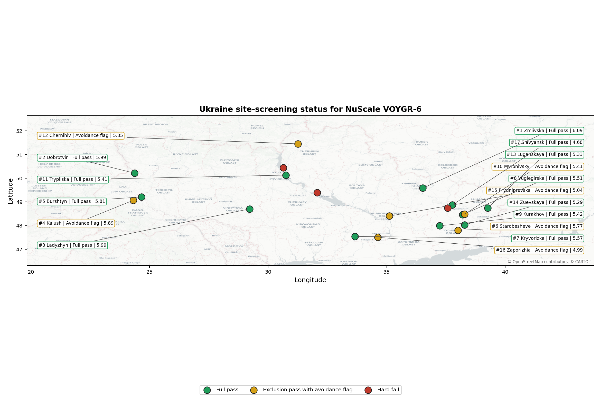
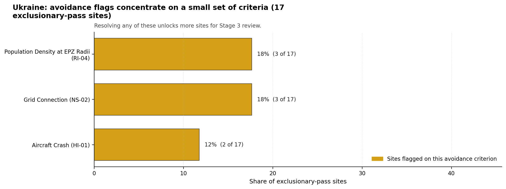
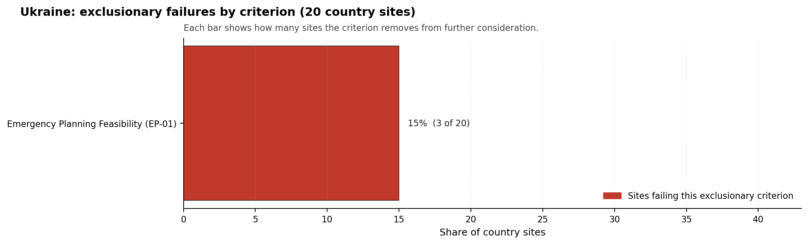

# Ukraine Country Profile

Analytical basis: the project's 10,000-iteration Monte Carlo sensitivity analysis over the current frozen scoring rubric.

Ukraine has 20 thermal and coal-site records that have been tested against the NuScale VOYGR-6 reference deployment envelope. 11 sites pass both the exclusionary and avoidance screens, 6 pass the exclusionary screen but retain avoidance flags, and 3 fail one or more exclusionary checks. The country is therefore not a single-site case, but only a small subset of the national site population currently clears the full screening pathway without a remediation step.

The leading site is **Zmiivska power station**, with a composite score of 6.086 and a Monte Carlo interval of 4.033-6.474. Its national stability band is `B` with a national top-10% hit rate of 94%. The leader is therefore not only the current point-estimate front-runner; it is also a stable national candidate under the sensitivity treatment used for the report.

<!-- specialist key=country_exec scope=country country_code=UA bundle=UA_country_bundle.json status=filled by=cursor-agent filled_at=2026-05-03T11:20:21Z -->
Of 20 Ukrainian thermal sites tested against the NuScale VOYGR-6 envelope, 11 clear both the exclusionary and avoidance screens, 6 pass exclusionary but carry avoidance flags, and 3 are removed at the exclusionary stage on Emergency Planning Feasibility (EP-01). Zmiivska power station leads in band B with a 93.8 % top-10 % hit rate, a composite score of 6.086, and a 2 270 MW coal-fleet inheritance footprint; Dobrotvir and Ladyzhyn follow at composites 5.989 (band D, 1 110 MW) and 5.989 (band B, 1 800 MW). Ukraine has the second-deepest leadership pool in the region after Türkiye and supports a multi-site fleet plan from the brownfield base, subject to the war-context caveat handled in the dedicated Ukraine occupied-territory subsection.

The avoidance unlock pool is small in absolute terms because the country has so many already-passing sites. **Grid Connection (NS-02)** and **Population Density at EPZ Radii (RI-04)** each carry 3 of the 17 exclusionary-pass scored sites (18 %): NS-02 is a transmission-corridor study coordinated with Ukrenergo and is complicated by the wartime grid damage; RI-04 is closable through a refresh of the EPZ population model at the actual NuScale VOYGR-6 emergency-planning zone radius. **Aircraft Crash (HI-01)** carries 2 sites (12 %) and is closable through quantitative micro-siting analysis. The 15 % EP-01 hard-fail rate accounts for the three exclusionary losses and is partially a function of wartime population displacement, which would need to be re-evaluated post-war.

The greenfield lever is not required for the initial fleet plan; the brownfield pool is large and high-quality. A credible Stage 3 sequence begins with Zmiivska power station as the lead site, with Ladyzhyn power station and Dobrotvir power station as fast followers, and a third wave drawn from the remaining band-A and band-B pool subject to the post-war reconstruction context. The occupied-territory subset is treated separately and is marked improbable for now pending war end.
<!-- /specialist key=country_exec -->

Interactive review map with marker tooltips: [UA_site_status_map.html](figures/UA_site_status_map.html).

## Ukraine Site Ledger

| Rank | Site | Status | Composite | MC Low | MC High | Band | Top-10 Hit | Coverage |
|---:|---|---|---:|---:|---:|---|---:|---:|
| 1 | Zmiivska power station | Full pass | 6.086 | 4.033 | 6.474 | B | 94% | 32% |
| 2 | Dobrotvir power station | Full pass | 5.989 | 4.198 | 6.396 | D | 31% | 38% |
| 3 | Ladyzhyn power station | Full pass | 5.989 | 4.198 | 6.484 | B | 100% | 38% |
| 4 | Kalush power station | Exclusion pass with avoidance flag | 5.890 | 4.159 | 6.264 | D | 0% | 38% |
| 5 | Burshtyn power station | Full pass | 5.812 | 4.053 | 6.306 | D | 6% | 35% |
| 6 | Starobesheve power station | Exclusion pass with avoidance flag | 5.774 | 4.002 | 6.171 | A | 88% | 35% |
| 7 | Kryvorizka power station | Full pass | 5.566 | 3.859 | 5.921 | D | 0% | 32% |
| 8 | Vuglegirska power station | Full pass | 5.506 | 3.905 | 5.902 | H | 0% | 35% |
| 9 | Kurakhov power station | Full pass | 5.415 | 3.872 | 5.780 | D | 6% | 35% |
| 10 | Myronivskyi power station | Exclusion pass with avoidance flag | 5.409 | 3.870 | 5.902 | E | 0% | 35% |
| 11 | Trypilska power station | Full pass | 5.409 | 3.870 | 5.805 | H | 0% | 35% |
| 12 | Chernihiv power station | Exclusion pass with avoidance flag | 5.349 | 3.786 | 5.842 | H | 0% | 32% |
| 13 | Luganskaya power station | Full pass | 5.335 | 3.844 | 5.732 | H | 0% | 35% |
| 14 | Zuevskaya power station | Full pass | 5.287 | 3.826 | 5.683 | H | 0% | 35% |
| 15 | Prydniprovska power station | Exclusion pass with avoidance flag | 5.043 | 3.738 | 5.439 | H | 0% | 35% |
| 16 | Zaporizhia power station | Exclusion pass with avoidance flag | 4.987 | 3.665 | 5.447 | F | 6% | 32% |
| 17 | Slavyansk power station | Full pass | 4.677 | 3.606 | 5.073 | H | 0% | 35% |
| - | Cherkasy power station | Hard fail | - | - | - | - | - | 0% |
| - | Darnytska power station | Hard fail | - | - | - | - | - | 0% |
| - | Kramatorskaya power station | Hard fail | - | - | - | - | - | 0% |

## Avoidance Flag Pareto

Of the 17 sites that pass the exclusionary screen, the avoidance-phase flags concentrate on a small set of criteria. Resolving them is what would move the country from a small leading group to a broader candidate pool.

- **Grid Connection (NS-02)** - 3 of 17 exclusionary-pass sites (18%).
- **Population Density at EPZ Radii (RI-04)** - 3 of 17 exclusionary-pass sites (18%).
- **Aircraft Crash (HI-01)** - 2 of 17 exclusionary-pass sites (12%).

## Exclusionary Failure Pareto

The exclusionary failures across the country trace back to a small number of criteria. They identify which screening checks are responsible for removing sites from further consideration.

- **Emergency Planning Feasibility (EP-01)** - 3 of 20 country sites (15%).

## Family Strength and Weakness

Across the country the strongest criterion family is **Non-Safety / Implementation** at a mean normalised score of 6.87/10. The weakest family is **Emergency Planning** at 3.21/10. The bottom three individual criteria across the country are:

- **Military Installations (HI-06)** - mean 2.65/10 across 20 scored sites (min 0.0, max 5.0).
- **Special Populations (EP-04)** - mean 3.10/10 across 20 scored sites (min 1.5, max 5.5).
- **Evacuation Routes (EP-02)** - mean 3.20/10 across 20 scored sites (min 1.5, max 7.5).

## Interpretation for Site Selection

The Ukraine result shows a clear separation between sites that can support further Stage 3 consideration and sites that should remain in the evidence base only as comparators. The full-pass group is the relevant pool for progression. Avoidance-flag sites are not discarded, but they identify locations where a specific constraint must be resolved before the site can be treated as equivalent to the leading group.

The chart shows where focused remediation effort would broaden the candidate pool. The criteria at the top of the Pareto are the policy and engineering levers that, if resolved, move avoidance-flag sites into the leading group.

An IAEA-style reading of the table focuses less on the exact rank number and more on screening class, score stability, and the nature of remaining uncertainty. **Zmiivska power station** is important because it leads nationally, sits inside the strongest stability band, and retains a full-pass status. That does not establish final site suitability. It is a defensible reason to spend Stage 3 effort on field confirmation, national data review, and stakeholder engagement before lower-ranked or avoidance-flag locations.

The Monte Carlo interval is a caution against false precision: several sites have overlapping score bands, so small score differences should not be overinterpreted. The decisive distinction is whether a site combines acceptable exclusionary performance with a stable ranking position and no unresolved avoidance flag.

The main Stage 3 questions are therefore targeted rather than generic: confirm local natural-hazard inputs, verify emergency-planning assumptions, test land and ownership constraints, assess cooling and grid interface conditions, and reconcile environmental constraints with national permitting requirements.

## Status Counts

- Full pass: 11
- Exclusion pass with avoidance flag: 6
- Hard fail: 3
